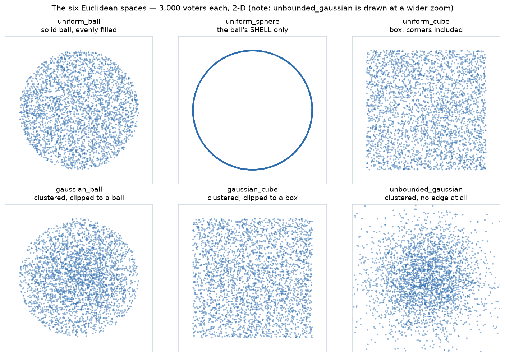

---
tags:
  - foundations
  - simulation
---

# The six Euclidean spaces — where a simulated electorate's voters come from

*Every [spatial simulation](spatial_voting_model.md) starts by scattering voters and candidates as points and letting each voter prefer whoever is nearest. **Where those points come from** is a named parameter — `uniform_ball`, `gaussian_cube`, `unbounded_gaussian` and three more — and the names turn up in this repo's own results without anyone ever saying what they mean. This page says what they mean. They are simpler than they sound: all six fit in about forty lines of arithmetic, and the differences between them are visible in a single picture.*

**Level: 201 · deep dive** Companion: [The spatial model](spatial_voting_model.md) (the concept) · [Election simulation models](election_simulation_models.md) (the full menu, of which this is model **B** in close-up) · [Simulate utilities, not ballots](simulate_utilities_not_ballots.md) (why you sample positions at all) · [Statistical cultures](statistical_cultures.md) (the non-spatial samplers, and what their parameters do).

## The picture first



Drawn by [`euclidean_spaces.py`](../../06_Other/simulations/euclidean_spaces.py), 3,000 voters each:

```bash
python 06_Other/simulations/euclidean_spaces.py --gallery
```

## Two questions, and every space is an answer to both

Each space answers exactly two questions, and once you see them as a shape × density grid the names stop being jargon:

| | **evenly spread** (uniform) | **piled up in the middle** (Gaussian) |
|---|---|---|
| **inside a round region** | `uniform_ball` | `gaussian_ball` |
| **inside a box** | `uniform_cube` | `gaussian_cube` |
| **no boundary at all** | — *(impossible: you can't spread evenly over infinity)* | `unbounded_gaussian` |
| **only the outer edge** | `uniform_sphere` | — *(a shell has no middle to pile into)* |

**Shape** decides whether extreme voters can exist and what "extreme" even looks like. A cube has corners — a voter can be far-left *and* far-authoritarian at once. A ball has no corners, so being extreme on two axes at once is impossible by construction. An unbounded Gaussian has no edge at all, so run it long enough and it will hand you a voter a thousand units from every candidate.

**Density** decides how crowded the middle is, which is what makes or breaks the centrist. Uniform means a moderate is just another point with no special standing. Gaussian piles voters into the middle, which is what gives a compromise candidate a real constituency — and therefore what makes [center squeeze](../../06_Other/RCV_IRV/concepts/RCV_IRV_center_squeeze.md) something a simulation can actually observe.

## The six, one at a time

Radii and widths below are the library defaults: width 1, so a ball of radius 0.5 and a cube of side 1, both centred on the origin.

**`uniform_cube`** — the easy one. Draw each coordinate independently and uniformly from −0.5 to +0.5. That is it. Corners included, which in 2-D means the far corner sits at distance 0.707 — 41% further out than any point on the inscribed circle.

**`uniform_ball`** — uniform over the *solid* disc/ball. Two steps, and the second is the one people get wrong. Pick a random **direction**: draw a Gaussian vector and normalise it, because a Gaussian is spherically symmetric and normalising it gives a direction with no preferred axis. Then pick a **radius** — and it must be `R × U^(1/d)`, not `R × U`. Volume grows like `r^d`, so a uniformly-drawn radius would crowd far too many points into the centre. In 2-D that means `√U`.

**`uniform_sphere`** — the same directions, but the radius fixed at `R`. Only the *shell*, which is why it draws as a bare ring. Every voter is exactly as extreme as every other and nobody is in the middle: a model of pure factions with no moderates. Note the name — in this library a **sphere is the surface, a ball is the solid**, and the two are different models, not two words for one thing.

**`unbounded_gaussian`** — each coordinate independent `Normal(0, 1)`, and no clipping. The bell curve everyone pictures when they say "spatial model". Voters cluster in the middle and thin out with distance, and the tails run forever.

**`gaussian_cube`** — `Normal(0, 1)` per coordinate, redrawn until every coordinate lands inside the box. A truncated normal: bell-shaped in the middle, hard walls at the edge.

**`gaussian_ball`** — `Normal(0, 0.33)` per coordinate, redrawn until the *point* lands inside the ball of radius 0.5. The narrower sigma is deliberate: it means most draws already land inside, so the rejection step is cheap.

That redraw-until-it-fits step is **[rejection sampling](https://en.wikipedia.org/wiki/Rejection_sampling)**, the standard way to sample a distribution restricted to a region — draw from the easy unrestricted one, throw away what falls outside, repeat. It is exact, not an approximation, and its only cost is the discarded draws. Which turns out to matter here.

## Measured, not asserted — and one surprise

Running each space and measuring what comes out:

```text title="python 06_Other/simulations/euclidean_spaces.py — 20,000 points, 2-D, seed 42"
space                what it is                      mean r  in ball  inner   kept  cross-check
-------------------------------------------------------------------------------------------------------
uniform_ball         solid ball, evenly filled        0.333    100%   25%   100%  agrees (max diff 0.001)
uniform_sphere       the ball's SHELL only            0.500    100%    0%   100%  agrees (max diff 0.000)
uniform_cube         box, corners included            0.382     79%   20%   100%  agrees (max diff 0.001)
gaussian_ball        clustered, clipped to a ball     0.295    100%   36%    68%  agrees (max diff 0.000)
gaussian_cube        clustered, clipped to a box      0.375     80%   21%    15%  agrees (max diff 0.001)
unbounded_gaussian   clustered, no edge at all        1.254     11%    3%   100%  agrees (max diff 0.006)
```

**`inner`** is the honest test of clustering: the share of voters inside *half* the radius. A uniform 2-D ball scores exactly **25%**, because area grows as `r²` — and it does, which is the arithmetic checking itself. Anything meaningfully above 25% is real central clustering.

And now the surprise. **`gaussian_cube` is barely clustered at all** — 21% against `uniform_cube`'s 20%, a mean radius of 0.375 against 0.382. At the library's default parameters a `Normal(0, 1)` truncated to ±0.5 is nearly flat over that interval, because you are keeping only the middle of a bell that is twice as wide as the box: the centre of that box is only **1.28×** denser than its corners, where `gaussian_ball`'s centre is **3.2×** denser than its rim. So the name promises a clustered electorate and the numbers deliver a uniform one — while discarding **85% of its draws** to do it. If you want clustering inside a box, either narrow the sigma or use `gaussian_ball`, whose 36% is the real thing.

The **`cross-check`** column re-draws the same space with `prefsampling`'s own implementation and compares the distributions. All six agree, which is what makes the forty lines trustworthy as an explanation of what the library actually does. (That column's max-diff decimals wobble between runs — the `prefsampling` side deliberately runs *unseeded*, because seeding it is [the trap below](#the-trap-seeding-these-breaks-them) — but the verdicts and every other column reproduce exactly from seed 42.)

## Which one should a simulation use?

There is no neutral choice, so the rule this repo follows is simply to **name the model beside every number** ([the standing caveat](election_simulation_models.md#the-standing-caveat-results-are-conditional-on-the-model)).

- **`gaussian_ball`** is the closest of the six to a plausible electorate: a dense centre, a real edge, no corner artifacts.
- **`unbounded_gaussian`** is the textbook bell curve, and fine unless unbounded outliers would distort your statistic.
- **`uniform_cube`** is the common default in the literature and the easiest to reason about, but its corners are an artifact of the box, not a fact about voters.
- **`uniform_sphere`** is a deliberate stress test — an electorate of pure factions — not a prediction.
- **`gaussian_cube`** buys you almost nothing over `uniform_cube` at the default parameters, at seven times the sampling cost in 2-D — and the rejection bill only grows with dimension.

The deeper caution belongs to the model as a whole rather than to any of the six: a low-dimensional spatial electorate makes a [Condorcet winner](condorcet/README.md) nearly certain and [cycles](../../05_Ranked_Robin/01_Learn/cycle_resolution.md) nearly impossible, so a purely spatial sweep never stress-tests the thing cycle-resolution exists for. [The spatial model's honest limits](spatial_voting_model.md#the-honest-limits) has the rest.

## The trap: seeding these breaks them

Setting a seed is the recommended practice — it is what makes a run reproducible. On these six samplers, in `prefsampling` 0.1.24, it is also what breaks them:

- **`gaussian_ball` collapses to a single point, repeated.** Not "sometimes", not "approximately" — every voter lands on the same coordinates, for every seed.
- **Candidate *j* lands exactly on voter *j*.** On four of the six spaces at unequal voter/candidate counts, and on **all six** when the counts are equal — voters and candidates drawn from the same space, which is the only way `pref_voting` draws them.

Both reach this repo through `pref_voting`'s `generate_profile(probmodel="euclidean", seed=…)`, and both are invisible: nothing errors, nothing warns, and the output is a perfectly well-formed profile. They were caught because a sweep of 20,000 seeded spatial elections reported a suspiciously clean **0.00% Condorcet cycles** in every single cell — the tell being not a wrong number but an *impossibly tidy* one. Correct rates are 0.15–1.25%: [how often do Condorcet methods tie?](ties/how_often_condorcet_methods_tie.md).

Filed upstream as **[COMSOC-Community/prefsampling#6](https://github.com/COMSOC-Community/prefsampling/issues/6)** and **[voting-tools/pref_voting#186](https://github.com/voting-tools/pref_voting/issues/186)**; tracked in [upstream bug reports](../about_this_repo/upstream_bug_reports.md).

**The full mechanical account — why each defect happens, why the two Gaussian spaces behave differently, and the measured reproduction of every claim — is in the companion repo:** [prefsampling's seeded Euclidean samplers](https://masiarek.github.io/bettervoting-qa/analysis/prefsampling-seeding/index.html) (source: [`analysis/prefsampling-seeding/`](https://github.com/masiarek/bettervoting-qa/tree/master/analysis/prefsampling-seeding)). It lives there rather than here because it is a defect analysis rather than a voting lesson — the same genre as that repo's other upstream probes.

The one-sentence version, which generalises well past this bug: **a seed is not a random number generator.** A seed is an integer you can copy for free; a generator is a stateful object that advances as you draw from it. Every one of these defects is the same mistake — handing the same *seed* to two places that each build their own generator from it, and getting two identical streams where two independent ones were intended. The fix, in any language, is to pass the **generator**, not the seed.

## Related

- [The spatial model](spatial_voting_model.md) — the concept these six spaces implement
- [Election simulation models](election_simulation_models.md) — the full menu; the non-geometric models (impartial culture, Mallows, urn) are family **A**
- [Simulate utilities, not ballots](simulate_utilities_not_ballots.md) — the methodology rule that makes positions the right primitive
- [Continuous model, discrete ballot](continuous_model_discrete_ballot.md) — what happens *after* a space hands you a distance: the two lossy steps between a real number and a 0–5 mark
- [The statistics you actually need](statistics_for_voting.md) — mean vs median, variance, and why correlated electorates matter
- [How often do Condorcet methods tie?](ties/how_often_condorcet_methods_tie.md) — the sweep that found the seeding bug
- [Simulations in this repo](../../06_Other/simulations/README.md) — every script, and what each measures
- External: [prefsampling docs](https://comsoc-community.github.io/prefsampling/) · [pref_voting docs](https://pref-voting.readthedocs.io/) · [rejection sampling](https://en.wikipedia.org/wiki/Rejection_sampling)
