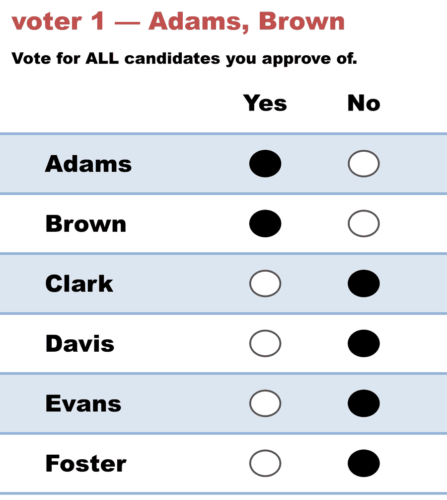
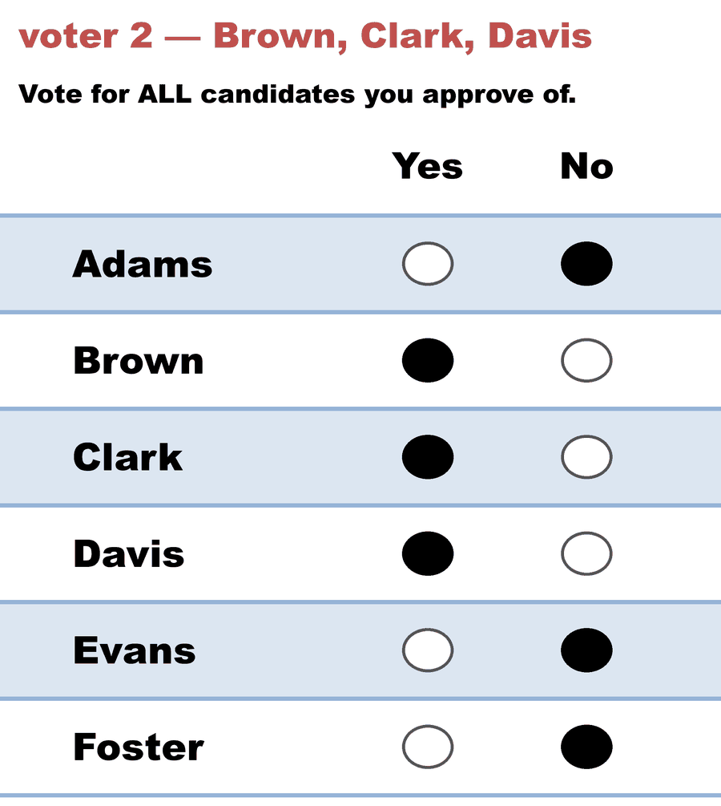
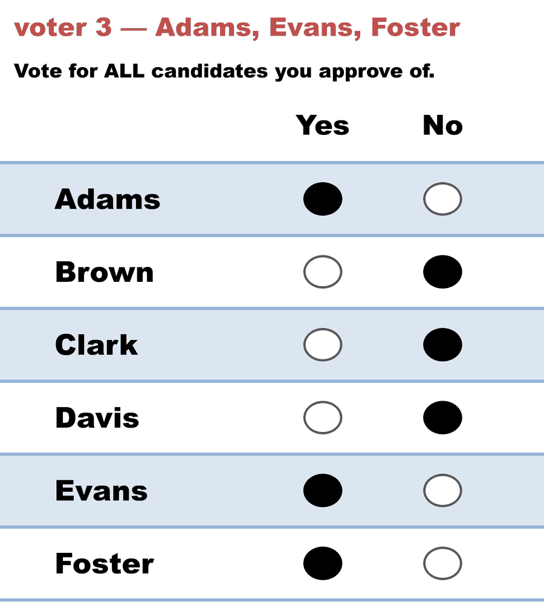
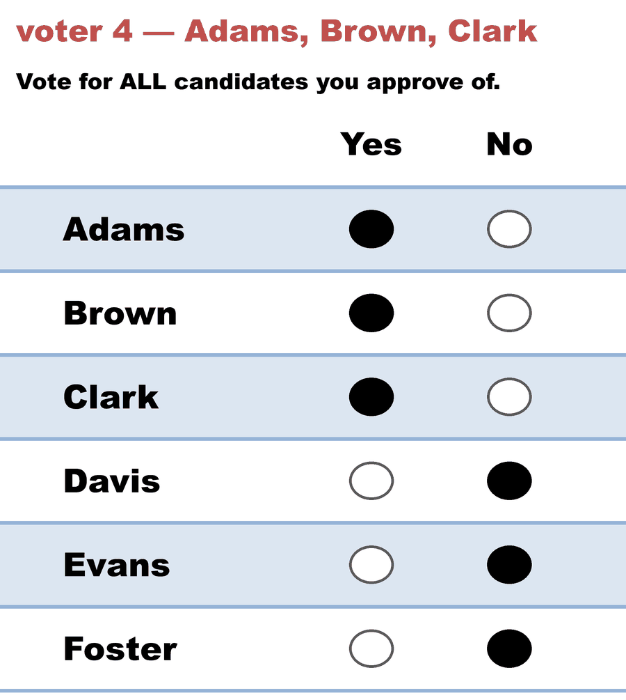
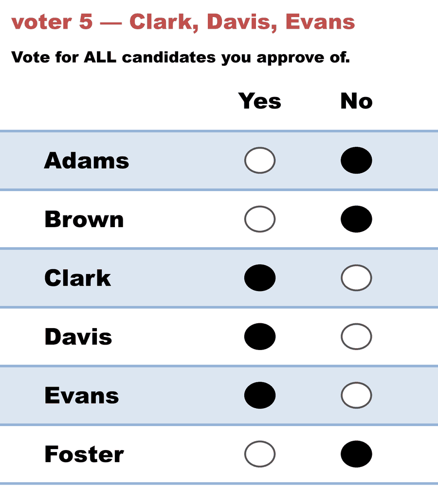

# The silent tiebreak — when one committee is really three

**Level: 301 · deep dive**

**One line:** every other page in this hub is about a tie you can *see* — this one is about a tie that never reached the page, where the count was genuinely undecided, a library broke it by ballot-column order, and the report printed one winning committee with no marker, no note, and nothing in the output that could have told you.

The case: [`approval_bloc_3seats_c6_b5`](../../../04_Approval/02_Examples/multiwinner/cases/cases_pages/approval_bloc_3seats_c6_b5.md) ([yaml](../../../04_Approval/02_Examples/multiwinner/cases/approval_bloc_3seats_c6_b5.yaml)), run through [`abc_tabulation.py`](../../../06_Other/abcvoting_tabulation_engine/abc_tabulation.py) against `abcvoting` 2.19.2. Found and fixed 2026-08-20.

---

## The election

A 3-seat at-large council race — six candidates, five voters, approval ballots.

<!-- ballots:approval_bloc_3seats_c6_b5 -->
The ballots as marked — a filled **Yes** is a `1` in that candidate's column, a filled **No** a `0`:

| # | Ballot as marked | Adams | Brown | Clark | Davis | Evans | Foster |
|:--:|:--|:--:|:--:|:--:|:--:|:--:|:--:|
| 1 |  | 1 | 1 | 0 | 0 | 0 | 0 |
| 2 |  | 0 | 1 | 1 | 1 | 0 | 0 |
| 3 |  | 1 | 0 | 0 | 0 | 1 | 1 |
| 4 |  | 1 | 1 | 1 | 0 | 0 | 0 |
| 5 |  | 0 | 0 | 1 | 1 | 1 | 0 |
<!-- /ballots -->

Sum the columns and the count is not close:

| | Adams | Brown | Clark | Davis | Evans | Foster |
|---|---|---|---|---|---|---|
| **approvals** | 3 | 3 | 3 | 2 | 2 | 1 |

Three candidates on 3, everyone else below. Under **bloc Approval** — the method the file actually declares, and the one the LH engine counts — Adams, Brown and Clark take the seats and there is nothing to argue about. The file's own `scenario_description` says as much: *"no tie, no drama."* That sentence is true, and it is worth keeping in mind, because it is not what went wrong.

## Two questions, one report line

The [abcvoting wrapper](../../../06_Other/abcvoting_tabulation_engine/README.md) exists to run the **proportional** committee rules on the same ballots — the rules bloc Approval doesn't have. So the same five voters get counted five ways, and until 2026-08-20 the report came back like this:

```text
   av           Approval Voting (AV)                       ->  Adams, Brown, Clark
   sav          Satisfaction Approval Voting (SAV)         ->  Adams, Brown, Clark
   seqpav       Sequential Proportional Approval Voting (seq-PAV) ->  Adams, Brown, Clark
   pav          Proportional Approval Voting (PAV)         ->  Adams, Brown, Clark
   seqphragmen  Phragmén's Sequential Rule (seq-Phragmén)  ->  Adams, Brown, Clark
```

Five rules, one answer, unanimous. It is exactly the result a teaching case wants, and it is exactly the result you would quote without a second thought. (Still reproducible today by leaving `resolute` unset on a direct `abcvoting` call — the wrapper is what stopped doing it.)

Here is the same file today:

```text
   av           Approval Voting (AV)                       ->  Adams, Brown, Clark
   sav          Satisfaction Approval Voting (SAV)         ->  Adams, Brown, Clark
   seqpav       Sequential Proportional Approval Voting (seq-PAV) ->  Adams, Brown, Clark  |  Adams, Brown, Evans  |  Brown, Clark, Evans  [3 tied committees]
   pav          Proportional Approval Voting (PAV)         ->  Adams, Brown, Clark
   seqphragmen  Phragmén's Sequential Rule (seq-Phragmén)  ->  Adams, Brown, Clark  |  Adams, Brown, Evans  |  Brown, Clark, Evans  [3 tied committees]
```

Nothing about the election changed. `av`, `sav` and `pav` are decisive here and always were. But **seq-PAV and seq-Phragmén never named a single committee** — the ballots leave three of them exactly level, one of which seats Evans, who under the old output never appeared at all.

## Where seq-PAV forks

Sequential PAV fills one seat at a time. Every ballot starts worth a full vote; once a voter has *j* of their approved candidates seated, each remaining approval on that ballot is worth `1/(j+1)`. Take the highest total, seat that candidate, reweight, repeat.

Round 1 is just the approval totals — and the top of that column is a **three-way tie at 3**. Follow all three branches and the fork structure is this:

```text
round 1 []                Adams 3   Brown 3   Clark 3   Davis 2   Evans 2   Foster 1
                          tied: Adams, Brown, Clark
  ├─ seat Adams  → round 2  Clark 5/2 alone       → round 3  Brown 4/3 alone   ⇒ Adams, Brown, Clark
  ├─ seat Clark  → round 2  Adams 5/2 alone       → round 3  Brown 4/3 alone   ⇒ Adams, Brown, Clark
  └─ seat Brown  → round 2  Adams 2, Clark 2, Evans 2  — tied again
                     ├─ seat Adams  → Clark 11/6 alone                          ⇒ Adams, Brown, Clark
                     ├─ seat Clark  → Adams 11/6 alone                          ⇒ Adams, Brown, Clark
                     └─ seat Evans  → Adams 3/2, Clark 3/2 — tied
                                        ├─ seat Adams                           ⇒ Adams, Brown, Evans
                                        └─ seat Clark                           ⇒ Brown, Clark, Evans
```

Three distinct committees survive: `Adams, Brown, Clark`, `Adams, Brown, Evans`, `Brown, Clark, Evans`. Brown is in all three; the last two seats are genuinely undecided between Adams, Clark and Evans, and seq-PAV — the rule, not the software — says nothing further about which pair should get them.

## Why the wrong answer looked so right

This is the part worth sitting with, because it is what made the bug survive a review.

A resolute run walks the **leftmost branch at every fork** — and look where that lands. It seats Adams (column 0), then Clark, then Brown, and reports `Adams, Brown, Clark`. That committee is also what **two of the three** top-level branches reconverge on. It is also the honest, decisive answer of `av`, `sav` and `pav` on the same ballots. And it is also the file's `expected_winners` key.

So the silent tiebreak did not produce a suspicious answer. It produced the *most* corroborated answer on the page — agreeing with three other rules, with the answer key, and with itself along two paths out of three. Nothing in the output was anomalous, because a silent tiebreak has no output. **The tell was never in the numbers; it could only ever have been in the shape of the API.**

## Ruling out the alphabet

The obvious first guess is that the library broke the tie alphabetically — Adams before Brown before Clark, and Evans losing on the letter E. Two runs settle it. Both re-count the *same* election; only the header changes.

**Rename Adams to Zed, leaving the column where it is.** If the tiebreak were alphabetical, Zed would now lose it:

```text
   header      : Zed,Brown,Clark,Davis,Evans,Foster
   resolute    : Brown, Clark, Zed
   irresolute  : Brown, Clark, Zed | Brown, Evans, Zed | Brown, Clark, Evans   (3 tied)
```

Zed keeps the seat. Names are irrelevant — `abcvoting` never sees them; the wrapper hands it integers and translates back afterwards.

**Now move Evans to the first column instead**, touching no ballot and no approval:

```text
   header      : Evans,Brown,Clark,Davis,Adams,Foster
   resolute    : Brown, Clark, Evans
   irresolute  : Brown, Clark, Evans | Adams, Brown, Evans | Adams, Brown, Clark   (3 tied)
```

The tied set is the same three committees, as it must be. The reported winner is not. **Rearranging the columns of the ballot elected a different councillor** — Evans in, Adams out — and neither run said a word about it.

The rule is *smallest candidate index*, and the way this repo loads an election, the index is the position of the name in the `ballots:` header. Column order is the tiebreak.

## It is a neutrality failure, and the theorem saw it coming

Renaming a candidate should permute the result the same way; that is [neutrality](../../GLOSSARY.md), and resolute seq-PAV fails it — not because of the *names*, which it ignores, but because it treats the alternative in slot 0 differently from the one in slot 4. Permute the alternatives and the output is not the corresponding permutation of the old output. That is the failure, exactly.

Which is the point [Ties Are Forced](ties_are_forced.md) makes from the theory side: anonymity, neutrality and *always naming a single winner* cannot all hold at once. Something has to give, and a resolute rule buys its single answer by spending neutrality. So a library offering both `resolute=True` and `resolute=False` is not being indecisive — it is handing you the choice the impossibility theorem makes unavoidable, one call at a time.

The danger was never that the choice exists. It is that a **default** can make it for you.

## The shape of the bug: one API, two defaults

`abcvoting` is a careful, peer-reviewed library and it did nothing wrong. Ask it directly and it will tell you which mode each rule defaults to — the first value of `resolute_values` is the default:

```text
  av             resolute_values=(False, True)     → default irresolute
  sav            resolute_values=(False, True)     → default irresolute
  pav            resolute_values=(False, True)     → default irresolute
  seqpav         resolute_values=(True, False)     → default RESOLUTE
  seqphragmen    resolute_values=(True, False)     → default RESOLUTE
  equal-shares   resolute_values=(True, False)     → default RESOLUTE
  greedy-monroe  resolute_values=(True,)           → resolute only
```

The split is principled: the optimisation rules (`av`, `sav`, `pav`) are *defined* as "the committees maximising X", so the natural return value is a set; the sequential rules are defined as a procedure that seats one candidate at a time, so the natural return value is the committee that procedure produces. Each default matches its own rule's definition.

What it does not survive is a **wrapper that loops over rules**. The wrapper called `abcrules.compute(rule, profile, committeesize=k)` for every rule in one loop and printed whatever came back, so the mode it was running in was decided per-iteration by a library constant it never mentioned. Its docstring promised *"a rule may return SEVERAL tied committees; all are reported"* — a true statement about three of its five rules.

That is the generalisable shape, and it is not specific to voting software: **a per-function default in a uniform-looking API, consumed by a loop.** The loop reads as one operation. It isn't.

## Testing an engine for it

Two probes, and neither needs the library's source.

1. **Permute the input order.** Re-run the same election with the candidate columns shuffled (and, separately, the ballot rows). Anything that changes is order-dependence — and if the engine didn't announce a tie, it just broke one silently. This is a cheap, universal test: it needs no knowledge of the ladder, only two runs and a `diff`. It is also how [our own IRV engine's row-order sensitivity](batch_elimination.md) was pinned.
2. **Ask the API what it returns.** A function that can return a *set* of winners and a function that always returns one are answering different questions. If the same call can do both, find out which one it is doing by default — per function, not per library.

The second probe is the one that would have caught this case in a minute; the first is the one that catches the cases where there is no flag to inspect.

## What the wrapper does now

Every rule is asked for its **full** set of winning committees — `resolute=False`, passed explicitly on every call, so the wrapper breaks no tie at all and more than one committee prints `[N tied committees]`. That matches what the docstring always claimed, what the committee-list output shape always implied, and this repo's standing rule that a tie is *surfaced*, never quietly settled.

One rule can't comply. Greedy Monroe is **defined** by a tiebreaking order, so `abcvoting` raises `NotImplementedError` rather than invent an irresolute form for it. The wrapper falls back to resolute for exactly those rules and says so on the line:

```text
   greedy-monroe Greedy Monroe                              ->  Adams, Clark, Davis  [resolute — this rule has no irresolute form]
```

Which is the same principle as the engine's `UnsupportedMethod` in [the result contract](../../tabulation_engines/result_schema.md): *"I can't answer that"* has to stay distinguishable from *"here is the answer."* A blank line, a crash, or a quiet single committee would each have collapsed that distinction in a different direction.

Pinned by two tests in [`test_abcvoting_crosscheck.py`](../../../STARVote_LH_tabulation_engine/tests/test_abcvoting_crosscheck.py), so removing `resolute=False` fails the suite rather than quietly restoring the old behaviour.

## What it cost, and what to re-check

Nothing published had to be corrected. The only abcvoting output embedded anywhere in the repo is the 2-seat majority-sweep case, on the [engine README](../../../06_Other/abcvoting_tabulation_engine/README.md) and in [Approval — multi-winner](../../../04_Approval/01_Learn/Multiwinner_Approval/approval_multiwinner.md); re-run irresolute it still returns `Amy, Cora` from both sequential rules, decisively, so neither fence needed touching. The LH engine, which counts the bloc Approval this file declares, was never involved at all. The damage was confined to what the wrapper *could* have told a reader and didn't.

The standing caveat: **a `seqpav` or `seqphragmen` committee quoted from a run before 2026-08-20 may carry a silent column-order break.** So can any direct `abcvoting` call that leaves `resolute` unset. Re-run it before you quote it.

---

**Related:** [Tiebreak ladders — every method, every engine](../../tabulation_engines/tiebreak_ladders.md) is the per-engine reference this page's finding is recorded in (see *Approval — count, then the floor*, and the closing note on column order as a hidden floor). [The load-bearing tiebreak](load_bearing_tiebreak.md) is this page's mirror image: a tie everybody could see, doing enormous work. [Ties Are Forced](ties_are_forced.md) supplies the theorem. [Approval — multi-winner](../../../04_Approval/01_Learn/Multiwinner_Approval/approval_multiwinner.md) introduces the rules being counted here.

*Up: [Ties & Tie-Breaking](README.md) · [topics index](../README.md).*
