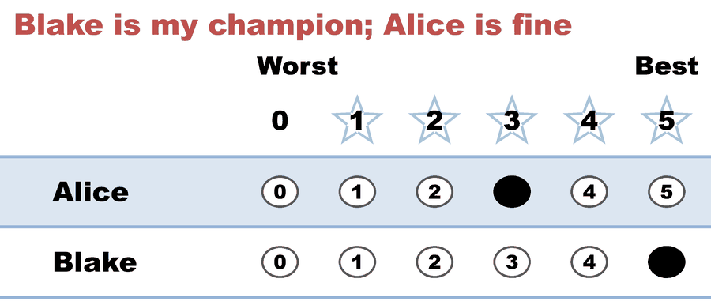
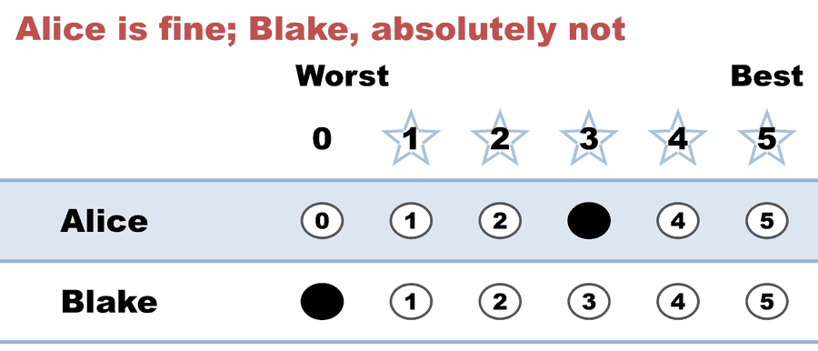

---
tags:
  - criteria
  - theory
---

# Variance — the statistical name for "divisive"

*Every argument about a "polarizing winner" is an argument about **spread**, and spread has a name and a formula. This page gives it both, runs the smallest election where spread is the **only** thing separating two candidates, and then points at the trap that makes raw variance a worse divisiveness score than it looks: on a bounded 0–5 ballot, **how much variance a candidate can even have depends on their average.** Expanded from [the statistics you actually need](statistics_for_voting.md#4-variance-the-statistical-name-for-divisive), which introduces the idea in a paragraph.*

**Level: 201 → 301 · deep dive** Companions: [distribution shape](statistics_for_voting.md#3-distribution-shape-consensus-polarization-and-why-the-average-hides-it) · [the majority criterion](majority_criterion/README.md) — where this argument is actually fought · [does a better ballot end polarization?](does_better_voting_end_polarization.md) — the *reform* claim built on top of it.

---

## The definition, and why a rated ballot is what makes it available

**Variance** is the average squared distance from the mean; **standard deviation** is its square root, back in the units of the ballot. Low variance means the scores bunch; high variance means they fly apart. That is the entire idea.

What matters for voting is not the formula but the **input**. Variance needs numbers on a shared scale, so it exists for a [score ballot](../scores_and_ranks/score_ballot.md) and does not exist for a ranked one. A ranking records that voters disagreed about the order; it cannot record *how far apart* they were, because "1st > 2nd" is the same mark whether the gap was a hair or a chasm ([scores vs. ranks](../scores_and_ranks/scores_vs_ranks.md)). So "this candidate is divisive" is a claim a rated ballot can make **arithmetically** and a ranked ballot can only make by inference.

## One election where spread is the only difference

Two candidates, five voters. Alice is a flat **3** on every ballot. Blake takes three **5**s and two **0**s. Both total 15; both average 3.0. The score distribution is the whole story:

<!-- ballots:same_mean_different_spread_c2_b5 -->
The ballots as marked — the filled bubble is the score given, and the score is the number in its column:

| Ballot as marked | Alice | Blake |
|:--|:--:|:--:|
|  | 3 | 5 |
|  | 3 | 5 |
|  | 3 | 5 |
|  | 3 | 0 |
|  | 3 | 0 |
<!-- /ballots -->

<!-- report:same_mean_different_spread_c2_b5 -->
```text
[Divergence from STAR]
  STAR     = Blake
  Approval = Alice   (differs from STAR)

--- STAR Voting Method (single winner) ---

[STAR Voting]
 Tabulating 5 ballots.
Count × Alice,Blake
    3 ×     3,    5
    2 ×     3,    0

[STAR Voting: Scoring Round]
 The two highest-scoring candidates advance to the next round.
   Alice         -- 15 -- First place
   Blake         -- 15 -- Second place
 Alice and Blake advance.

[STAR Voting: Automatic Runoff Round]
 The candidate preferred in the most head-to-head matchups wins.
   Blake         -- 3 -- First place
   Alice         -- 2
   Equal Support -- 0
 Blake wins.
   Runoff math:
     5  ballots cast
   − 0  Equal Support (no preference between the two finalists)
     ─
     5  voters with a preference  (majority = 3)
           Blake 3 (60%)  ·  Alice 2 (40%)

[STAR Voting: Winner — STAR Voting Method (single winner)]
 Blake
```
<!-- /report -->

Same mean, **variance 0.0 vs 6.0** (standard deviation 0.00 vs 2.45). And the methods do not agree about what to do with that:

| Method | Winner | Why |
|---|---|---|
| **Score / Range** | **tie, 15–15** | the total is all it reads, and the totals are identical — the seat falls to a tie-break, which is not the same thing as choosing |
| **Approval** (approve = 3+ stars, the reading the engine's divergence block uses) | **Alice** 5–3 | a flat 3 clears the bar on every ballot; Blake's 0s clear nothing |
| **STAR** | **Blake** 3–2 | the [automatic runoff](../../01_STAR/01_Learn/the_count/STAR_Automatic_Runoff.md) reads the *order* inside the scores, and 3 of 5 rank Blake above Alice |
| **RCV-IRV** · Ranked Robin · Choose-One | **Blake** | Blake holds 3 of 5 first choices — an outright majority in round one |

Full count, matrix and audit: [the generated case page](../../01_STAR/02_Examples/cases/cases_pages/same_mean_different_spread_c2_b5.md). Every method side by side: [its entry in the divergence ledger](../../method_comparisons/divergence_review/cases/APPROVAL_OR_MINOR/same_mean_different_spread_c2_b5.md), which reports the Score row as **Alice** because it settles the 15–15 tie by ballot-column order — worth knowing before the two pages look like they disagree.

Two honest notes on that table before it gets quoted. The engine flags Alice as the **Condorcet loser** — true, and much less dramatic than it sounds: with only two candidates there is exactly one head-to-head, so *whoever loses it* is simultaneously the Condorcet loser and the runner-up. And STAR "passing" here proves nothing general, because with two candidates STAR **is** majority rule; STAR genuinely does fail the majority criterion, and it takes a third candidate to show it.

## The arithmetic trap: you cannot tie a flat 3 with a half-and-half split

The stock illustration of this idea — *"one got 3s from everybody, the other got 5s from half the electorate and 0s from the other half, same mean"* — **does not tie.** Half 5s and half 0s averages **2.5**, not 3.0, and no flat integer score on a 0–5 ballot averages 2.5. The comparison only works if you move one side:

| Consensus candidate | Polarizing candidate | Mean | Ties? |
|---|---|:--:|:--:|
| flat 3 | 5s from **half**, 0s from half | 3.0 vs **2.5** | ✗ |
| flat 3 | 5s from **three voters in five**, 0s from the other two | 3.0 vs 3.0 | ✓ *(the case above)* |
| flat 3 | 5s from half, **1**s from half | 3.0 vs 3.0 | ✓ *(less vivid — nobody is at rock bottom)* |
| half 2s / half 3s | 5s from **half**, 0s from half | 2.5 vs 2.5 | ✓ *(no flat score, but it ties)* |

Widening the scale is not the escape hatch it looks like: pairing a flat 3 with "6s from half" ties the mean only on a ballot that *has* a 6, and a STAR ballot does not. Changing the scale is never free either — it can move the winner, not just the arithmetic ([scale granularity can flip the winner](../scores_and_ranks/scale_granularity_flips_the_winner.md)). Fix the split, not the scale.

## The trap that matters more: on a bounded ballot, variance depends on the mean

This is the part that is genuinely under-appreciated, and it undercuts the casual use of variance as a divisiveness score.

Scores live in `[0, 5]`. A bounded variable cannot have arbitrary spread — and the ceiling moves with the average. For a distribution on `[0, M]` with mean `m`, the **Bhatia–Davis inequality** caps the variance at `m(M − m)`, reached **only** by putting every voter at one of the two ends. On a 0–5 ballot:

| Average score | Max possible variance | Max possible SD |
|:--:|:--:|:--:|
| 0.5 | 2.25 | 1.50 |
| 1.0 | 4.00 | 2.00 |
| 2.0 | 6.00 | 2.45 |
| **2.5** | **6.25** | **2.50** |
| 3.0 | 6.00 | 2.45 |
| 4.0 | 4.00 | 2.00 |
| 4.5 | 2.25 | 1.50 |

Three consequences, and each one bites a real argument:

1. **Blake, above, is maxed out.** At a mean of 3.0 the ceiling is exactly 6.0, and Blake sits on it — he is precisely as divisive as a 0–5 ballot permits at that average. That is a sharper statement than "high variance," and it is checkable.
2. **A well-liked candidate cannot look divisive, however split the electorate is.** A candidate averaging 4.5 caps at variance 2.25, less than half Blake's — even if every single voter is at an extreme (here, 90% giving 5 and 10% giving 0). Rank candidates by raw variance and you have partly ranked them by *how mediocre their average is*.
3. **Peak measurable divisiveness sits at the middle of the scale**, mean 2.5. So the statistic is not neutral about where on the ballot the fight happens.

If you want a number that isn't confounded, divide by the ceiling — `variance / (m(5 − m))`, a 0-to-1 share of the maximum spread available at that average. Blake scores **1.00**; Alice **0.00**. *(That ratio is this page's shorthand for a fix, not a term of art in the literature — say what you computed when you quote it.)* The lower-tech option is usually better anyway: **report the distribution instead of a summary of it.** The engine's Score Distribution block — `show_score_counts: true` — prints the whole shape, and "3 fives, 2 zeros, nothing in between" argues better than any single statistic.

## What variance does *not* do

**No method in this library counts it.** Variance is a lens on the ballots, not a step in any tabulation here — STAR, Score, Approval and [Majority Judgment](../../06_Other/Majority_Judgment/concepts/majority_judgment.md) all respond to spread, but none of them *computes* it. What they differ on is which part of the distribution their rule happens to be sensitive to: a sum is dragged by the extremes, a median ignores how extreme they are, an approval threshold sees only which side of one line each score falls on. Sensitivity to spread is a **consequence** of the counting rule, never an input to it. Any claim that a method "penalizes divisive candidates" has to name the mechanism that does it.

**And high variance is not a defect.** A reformer with a real mandate and real opponents is high-variance; so is an incumbent in a genuinely split electorate. Variance measures how *concentrated* opinion is, not whether electing that person is a good idea — that judgment belongs to the [values question](what_makes_a_good_winner.md), not to the statistic. "Divisive" is what the number *is*; whether divisive should lose is what the argument is *about*.

## Where the argument actually lives

Strip the statistics away and the disagreement is one question: **should a majority's intensity outrank a minority's rejection?** Every camp answers by pointing at a distribution.

- **The consensus case** — a candidate 40% of voters score at rock bottom represents fewer people than one nobody objects to. Worked in full at [the majority criterion](majority_criterion/README.md) (STAR electing broadly-liked Bruno over majority-favorite Ada) and in the [Black Curtain](../../method_comparisons/black_curtain/README.md) set, whose [Election 3](../../method_comparisons/black_curtain/cases/cases_pages/Black_Curtain_03_c3_b5_polarized-on-cal.md) is this page's election with the means untied: the "landslide" winner is zeroed by 40% of voters while a rival is liked by all five.
- **The majority case** — a group that is more than half of the electorate and prefers a candidate should get that candidate, and calling their winner "divisive" is a way of not counting them. This is the objection [FairVote](advocacy_organizations.md) presses hardest, and it is the reason STAR has a second round at all.
- **The measurement case** — that neither side should be arguing from a mean in the first place, because the mean threw the shape away before the argument started. That one is this page.

Which candidate *wins* under a given method is then a question about that method's rule, not about the variance: see [majority & minority candidates](majority_criterion/majority_and_minority_candidates.md) for the five different things "majority candidate" can mean, and [STAR's honest limits](../../01_STAR/01_Learn/properties_and_limits/STAR_honest_limits.md) for where STAR pays for its answer.

## Related

- [The statistics you actually need](statistics_for_voting.md) — this idea in one paragraph, alongside mean-vs-median, sum-vs-mean, and correlation
- [Preference vs. support](../scores_and_ranks/preference_vs_support.md) — the ballot-level distinction that makes spread recordable at all
- [Cardinal utility](cardinal_utility.md) — what the number in the bubble is reaching for, and why summing it needs more than "it's a number"
- [Center squeeze](center_squeeze/README.md) — the low-variance candidate's characteristic way of losing under IRV
- [The spatial voting model](spatial_voting_model.md) · [election simulation models](election_simulation_models.md) — where these distributions come from in simulation
- [Range voting](../../06_Other/Range/concepts/range_voting.md) · [Approval](../../04_Approval/01_Learn/README.md) — the two methods this election separates most sharply
