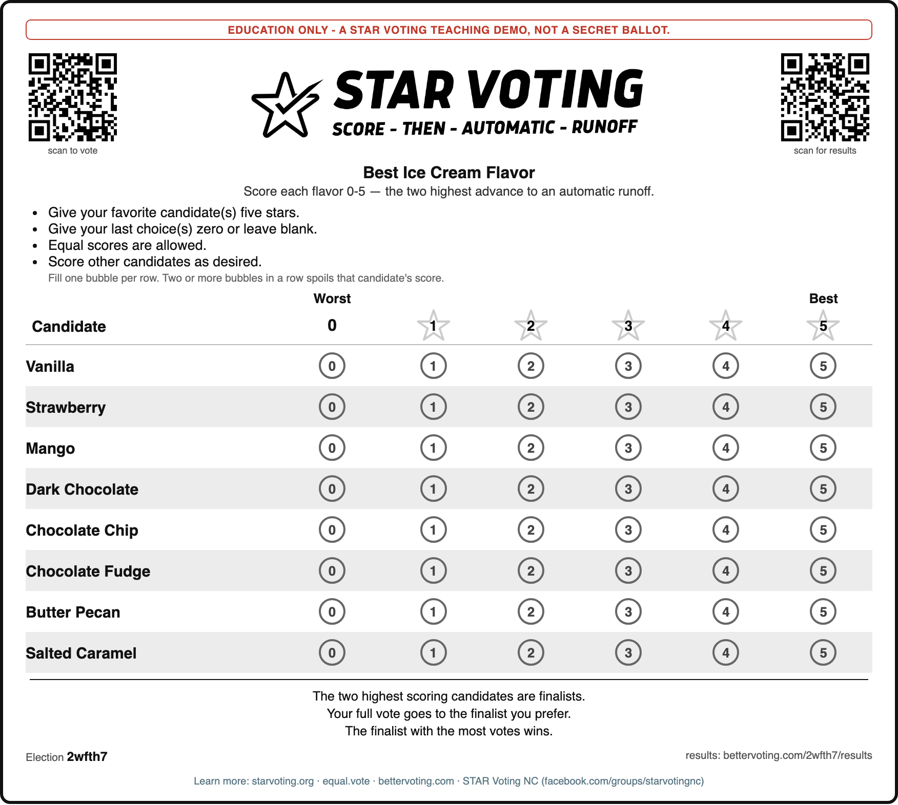

# FSD — Paper-Ballot Demo Toolkit (`bv_ballot_sheet.py`)

*Functional Specification (as-built). A dev/maintainer-facing spec for the printable-ballot tool and the paper-ballot demo workflow. The teacher-facing how-to is [`running_a_paper_ballot_demo.md`](../../00_start_here/STAR_Voting/hands_on/running_a_paper_ballot_demo.md); this doc records **what** it does, **why** the design choices were made, and — importantly — **what it deliberately does not do**.*

**Status:** front-end (ballot generation) built, self-tested, and **validated on real hardware** (printed → QR scanned → voted → hand-marked ballot read → cast back to BV; see §7). Return-path (OCR — automated image→scores) is a documented roadmap, not built; until then the return path is a human transcribing marks into a YAML/CSV.

---

## 1. Goal

Let a teacher / workshop leader / demo runner turn a STAR election into **printable paper ballots**, so a room can vote on paper, **hand-count**, and compare the result to BetterVoting's official tally. The teaching payoff: two independent counts (paper + platform) that agree — the repo's "don't believe it, check it" story, made tangible.

## 2. Scope

**In scope (built):** generate print-ready ballots from a STAR election; link them to a BetterVoting election (id, results URL, QR); optional serial "receipts", write-in rows, and a custom QR target for offline demos.

**Out of scope — deliberately (the guard):**
- **OCR / scan-to-YAML** (the *return* path). Needs a vision engine; specified in §6 as the roadmap, not built. Rationale: an unverified OCR pipeline that silently misreads a score is worse than none.
- **Threading serials through BetterVoting's vote API** for digital "confirm counted." BV doesn't carry them and it isn't needed — the serial demo is complete on paper (§5.3). A truly *digital* verifiable count is **end-to-end verifiability (E2E-V)**, a cryptography research area, flatly out of scope.
- **Extra ballot *options* — parked "someday, if asked":** other ballot *types* (Approval checkboxes, ranked-order grids), tear-off receipt stubs, localization (`--lang`), custom logos/branding, and multi-race-per-sheet ballots. Each is real polish or added capability but adds no *lesson* the single-race STAR paper ballot doesn't already teach; multi-race printing complicates both the sheet and the hand-count, and the "run 4 separate demos and compare" framing teaches the same thing with no code. (Revisit *only* if there's a concrete need — e.g. teaching the meta method-comparison **on paper**.)
- The compass for every call above: **"does this add education, or just engineering?"** Education → build; engineering-only → drop.

## 3. Workflow supported

**ONE route** (simplified 2026-07, at the user's request — see §5.1). The tool prints from a BetterVoting export, full stop:

```
1. Create the election on BetterVoting → export its JSON
2. Print ballots from the export        → bv_ballot_sheet.py --bv-export … → PDF
3. Vote                                 → fill 0–5 bubbles on paper, and/or scan the QR
4. Count via BetterVoting               → hand-count and/or enter/cast the paper into BV
5. Compare to BetterVoting              → bettervoting.com/<id>/results
6. (roadmap) OCR paper → scores → cast into BV  (today: human transcribes)
```
The tool owns step 2. **BetterVoting is the tabulation authority** — the paper ballots are hand-counted and/or entered into BV, and checked against the BV results page. (An earlier version documented a "transcribe → LH engine, no BV" counting route; that was dropped 2026-07 — every ballot corresponds to a real BV election, so counting goes through BV.) Step 1 uses [`create_bv_test_election.py`](create_bv_test_election.py) (creates the election **and** saves its JSON to `06_Other/_demo_dropbox/` — so the id is real and the QR/results resolve; cf. FR-12), or the BV UI.

**Why one route:** earlier the tool also accepted `--candidates` (offline, no BV) and `--yaml`. Those were dropped to make the workflow singular and unambiguous — *create → export → import → print*. The cost, accepted deliberately: **no offline printing** (you must create a BV election first). The upside: the id is always real (no fabricated-id dead links), descriptions/title/candidates come from one authoritative source, and there is exactly one thing to document and teach.

**Still hybrid.** Because the ballot carries a real QR, the same election runs on paper **and** online at once — paper voters fill bubbles, QR voters scan and vote on BetterVoting (online votes need no transcription). So you can push most of a room to the QR and keep a few paper ballots to demonstrate the hand-count.

## 4. Functional requirements — the tool

**FR-1 Input — one route:**
- `--bv-export FILE` (**required**) — a BetterVoting export JSON. Extracts the title, `election_id`, candidate names, and the election + first-race **descriptions**. This is the *only* input; there is no manual/candidate-list or YAML route (removed 2026-07, §5.1).
- `--title` / `--question` / `--blurb` — optional overrides (e.g. a cleaner ballot title than the verbose BV one; `--blurb ""` suppresses the description blurb, for exports whose description narrates the expected outcome and would spoil a live vote). Everything else is output styling (FR-2 … FR-12).

**FR-2 Output — a print-ready PDF (the only format).** The ballot is composed as self-contained HTML (embedded CSS, inline-SVG QRs) and rendered to PDF via headless Chromium (**`playwright`**, `playwright install chromium` once). `playwright` is therefore **required**; if it's missing the tool errors with the install command (no HTML/ASCII fallback). `--out` takes a `.pdf` path (a non-`.pdf` extension is swapped for `.pdf`). *(ASCII `.txt` and standalone `.html` outputs were removed 2026-07 at the user's request — PDF only.)*

**FR-2a Pagination:** `--per-page N` is *real* (a print `page-break-after` every N ballots, never a trailing blank page). **Default is 1** — one ballot per page, the right choice for ballots handed to voters individually (secret ballot). Set `--per-page 2+` to pack multiple per sheet to save paper.

**FR-3 Per-ballot content (styled after the official Equal Vote STAR ballot):** a **demonstration notice** (FR-9); a **STAR VOTING wordmark** header (star-with-check facsimile + "SCORE · THEN · AUTOMATIC · RUNOFF"); the election **title**, optional **description blurb** (italic), and **question**; the four **bulleted instructions** ("Give your favorite candidate(s) five stars", etc.) plus a fine-print overvote line; the **score grid** — **Worst/Best** labels, **star-outline column headers** 1–5 (0 plain), **digit-in-bubble** cells, **zebra-striped** candidate rows; the **finalist explanation** ("The two highest scoring candidates are finalists…"); a footer with serial + BV id + results URL; and an optional **promo line** (FR-10).

**FR-3a Descriptions:** the export's election `description` becomes the blurb and the first race's `description` becomes the question line, automatically. `--question` overrides the question line; `--blurb` overrides the blurb (`--blurb ""` prints none — the spoiler guard). Both print in all three formats.

**FR-10 Promo footer (optional, off by default):** `--promo` adds a small footer line — `Learn more: starvoting.org · equal.vote · bettervoting.com`; `--chapter "TEXT"` appends a local chapter (e.g. `STAR Voting NC (facebook.com/groups/starvotingnc)`) and implies `--promo`. **Off by default** so the base ballot matches the clean official design; **links are parameters, not the election description** (see §5.5).

**FR-11 Custom logo (optional):** `--logo FILE` embeds a local image (SVG/PNG/JPG) as a self-contained data URI in the header, **replacing** the drawn STAR-wordmark facsimile — so a user can drop in the real Equal Vote logo or a chapter logo. Missing/unreadable file → a warning and graceful fallback to the facsimile. Bounded on purpose: **one** header logo, not a general image-insertion system (that would be engineering past the lesson).

**FR-12 BV-id integrity — no dead links.** The single input route already makes the id real by construction (it comes from an actual BV export). As a belt-and-suspenders against a stale or hand-edited export, **`--verify-bv`** pings `GET /API/Election/{id}` before printing: a definitive 4xx → **drop the QR + results link and print a plain ballot** (with a warning); confirmed → keep; unreachable (offline) → keep with a warning. Stdlib `urllib`, no new dependency; recommended before a real print run. *(The dead-link risk originally surfaced via a synthetic `demo99` export with a fabricated id; the one-route simplification removed the class of bug at the source, and `--verify-bv` catches the rest.)*

**FR-9 Demonstration notice (on by default):** every ballot carries a standing notice — default `"EDUCATION ONLY - a STAR Voting teaching demo, not a secret ballot."` — because this tool *only* makes demo ballots. It also does real work: it makes the optional **serial number** read as a teaching device rather than surveillance (a numbered *real* ballot would break the secret ballot; the notice preempts the immediate — and correct — objection). `--notice "..."` overrides the text; `--no-notice` omits it (discouraged). Rendered as a bordered banner at the top of each ballot.

**FR-4 QR codes (required, not optional).** The header shows **two** QRs flanking the logo — **vote** (left, → `bettervoting.com/<bv-id>`, captioned "vote" in larger letters) and **results** (right, → `…/results`, captioned "results" in larger letters). The short vote URL prints in bold under the vote QR. Because every ballot links to a **live BV election**, it *must* be scannable: if `segno` (the QR library) is missing, the tool **errors** with the install command — it does not silently print a QR-less ballot. `--no-qr` is the only way to deliberately omit the QRs; and if `--verify-bv` finds the id doesn't resolve, both QRs are dropped (→ plain ballot, since there's nothing real to scan).
- Implemented via the pure-Python **`segno`** library (declared in `pyproject.toml`, required). Missing segno → error (see above), not a QR-less ballot; `--no-qr` to force off deliberately.
- **Size:** `--qr-size PX` (default 88) — bump it up for easier scanning across a room.
- **The election id is printed ONCE** (was three times): a **bold** `Election <id>` + the `…/results` link in the footer. The QRs carry captions only (no URL text), so the id isn't duplicated under them.

**FR-5 Serial receipts (optional, `--serials`):** number each ballot ("Ballot #N — keep this to verify it was counted"). See §5.3 for the verifiability design + secret-ballot caveat.

**FR-6 Write-in rows (optional, `--write-ins N`):** N blank "Write-in: ___" rows with a 0–5 grid. Front-end only — *tallying* write-ins (name matching across ballots) is an OCR-step concern (§6), not the printer's.

**FR-7 Layout:** `--copies N`, `--per-page N` (real page-breaks, default 1), `--out FILE` (a `.pdf` path). Print CSS avoids splitting a ballot across pages.

**FR-8 Self-test (`--selftest`, offline):** known-answer checks covering candidate presence, BV id + results URL, ballot count, bubble-grid arithmetic, HTML escaping, serials, write-in rows, **pagination** (per-page breaks, no trailing blank), the QR path (present/absent), the **`--bv-export` schema** (capitalized `Election`) + descriptions, the **demonstration notice** (+ `--no-notice`), the **official-style chrome** (wordmark, bullets, Worst/Best, stripes, star headers, explanation, digit bubbles), and the **`--logo`** embed. Operates on the composed HTML (no PDF render, no network — so `playwright` and `--verify-bv` are exercised manually, not in selftest). Exit non-zero on failure.

## 5. Key design decisions & rationale

**5.1 One input route: print from a BetterVoting export (simplified 2026-07).** The tool originally accepted three inputs — `--bv-export`, `--yaml`, and a manual `--candidates` list (which allowed *offline*, no-BV printing). At the user's request that was collapsed to **`--bv-export` only**: create the election on BV, export the JSON, print from it. The trade-off, chosen deliberately: **offline printing is gone** (you must create a BV election first). What it buys — a single unambiguous workflow, an id that's always real (no fabricated-id dead links, cf. FR-12), one authoritative source for title/candidates/descriptions, and far less to document. (An earlier version of this spec argued the offline/LH-only path was "the foundation"; the user reversed that in favor of simplicity — recorded here so the history is clear.)

**5.2 Flag mistakes by reusing the repo's existing markers — don't invent a scheme.** The marker vocabulary (see [CLAUDE.md](../../CLAUDE.md)) already maps ambiguous input to `0`-with-a-flag:

| On paper | Meaning | YAML |
|---|---|---|
| one bubble | valid 0–5 | that digit |
| **≥2 bubbles in a row** (e.g. 2, 4 *and* 5) | overvote / ambiguous | **`?`** (spoiled — counts 0, reported) |
| no bubble | no score | `0` (or `-` blank) |
| stray / illegible | unreadable | `?` + run-log note |

So "voter marked 2, 4 and 5 for one candidate" → `?` in that column; the engine already scores it 0 and surfaces it as spoiled. The ballot *warns the voter up front*.

**5.3 Serials teach verifiability — with the secret-ballot tension as the lesson.** Publishing the list of counted serials demonstrates **counted-as-cast**. But a serial linkable to a voter breaks ballot secrecy (coercion) — which is *why* real systems need E2E-V (crypto receipts that confirm your vote counted without revealing how you voted). The tool prints serials; the [demo page](../../00_start_here/STAR_Voting/hands_on/running_a_paper_ballot_demo.md) frames the tension. **Keep serials unlinked to identity in any real use; do not build BV/digital serial plumbing (§2).** The **default demonstration notice (FR-9)** is the on-ballot half of this safeguard: it states in print that the sheet is a teaching demo, not a secret ballot — so a numbered ballot can't be mistaken for (or objected to as) a real one.

**Why serials default OFF (a considered call, not an accident).** The pull is real in both directions:
- *For ON:* every demo would surface verifiability + the secret-ballot tension (the richest discussion the tool enables); numbered sheets aid hand-count reconciliation ("all 30 back, none duplicated"); and now that every ballot is stamped "EDUCATION ONLY," the main risk of ON is largely defused.
- *For OFF:* the core STAR lesson (score → runoff) stays the focus; no privacy footgun if a demo is reused casually; and in a classroom, ballots handed out in seating order **plus** numbers are deanonymizable.

The decider is a **default-design principle**: *a default is used by the person who isn't thinking about it.* A serial only pays off **paired with the discussion** ("what breaks if we post a name→number list?"); a teacher who wants that types `--serials`, and that deliberate act is the signal they'll frame it. An ON default instead hands numbered ballots to the teacher who *didn't* plan the lesson — propagating the double-edged artifact without the framing that makes it safe. So: **the safe, on-topic thing is the default; the richer-but-double-edged thing is a conscious opt-in.** Serials OFF, notice ON, and the teacher docs actively *invite* `--serials` when verifiability is the lesson. **Keep serials unlinked to identity in any real use; do not build BV/digital serial plumbing (§2).**

**5.4 QR is conditional, not decorative.** The QRs are dropped only when the id doesn't resolve (`--verify-bv`) or `--no-qr` is set — never printed pointing at nothing.

**5.6 Adopt the official ballot gray palette; skip the brand fonts.** From Equal Vote's brand sheet:
- **Grays applied** (match + save ink, both cheap wins): bubbles `#666666`, stars `#cccccc`, alternating-row highlight `#ececec` (was a black bubble border, blue-gray stars, blue stripe). These are the exact ballot-element grays the brand specifies, and the lighter tones use less toner across a 30-ballot print run — which the source images explicitly flag ("too much black, too much ink"). The `#999999` candidate-separator lines aren't added — we use the zebra stripe instead of lines (either is on-brand; stripe is cleaner).
- **Background stays white**, NOT the brand's off-white `#fffdf5` — off-white is for digital graphics; on paper, filling the sheet wastes ink and white *is* the paper.
- **Fonts: deliberately not changed.** The brand fonts are proprietary (logo = Anteb; Equal Vote = Avenir Next Pro) or a webfont (Montserrat / Verdana) that would have to be embedded to keep the file self-contained — bloat and complexity for a difference the source itself calls invisible ("hard to tell Verdana isn't Montserrat"). The system sans stack already reads as a clean geometric sans. The one branded-type moment is the **logo**, which `--logo` (FR-11) handles. Verdict: not worth tinkering — a good logo carries the brand.

**5.5 Match the official ballot; links are parameters, not description.** The layout deliberately mirrors Equal Vote's recognizable STAR ballot (wordmark, bulleted instructions, Worst/Best, star headers, stripes, finalist footer) — familiarity buys credibility for a teaching artifact. Two calls fall out of that goal:
- **The default logo is a facsimile, not the trademark.** A self-contained file can't embed Equal Vote's actual logo asset, and every ballot is stamped EDUCATION ONLY, so we draw a star-with-check lookalike in inline SVG rather than pass off their mark. A user who *has the right* to the real logo (or a chapter logo) supplies it with `--logo FILE` (FR-11) — the decision to use a real mark is theirs, made explicitly.
- **Promo links are `--promo` / `--chapter` parameters, kept OFF by default — not folded into the description.** Reasons: (1) the description is *election-specific* content (what the vote is about); links are *boilerplate promotion*, identical across elections — mixing them would pollute the BV description field and repeat on every export; (2) the official ballot carries **no** URLs, so links-off is what keeps ours faithful; (3) a teacher promoting locally flips them on deliberately (`--promo --chapter "…"`), which is exactly when the promotion is wanted. On paper the links are read-and-type text (short domains), not clickable — so a compact one-liner beats a wall of full URLs.

## 6. Return-path (OCR) — roadmap spec, NOT built

Restated in the repo's terms (the *goal*, not the letter of the original suggestion):
1. Read each ballot image; locate candidate rows and the 0–5 bubble grid.
2. Per row, count filled bubbles → **1** = that score · **0** = `0` · **≥2** = spoiled.
3. Below a confidence threshold, or unreadable → flag + log for human review.
4. Emit a scores table (one scored/marked row per ballot) **plus a run log** naming every flagged ballot.
5. **Cast the scores into the BV election** (`POST /API/Election/{id}/vote`) — BV tallies them alongside the online voters. Loop closed. (This replaces the old "→ YAML → LH engine" endpoint; BV is the tabulation authority.)

**Open design questions for whoever builds it:** OCR engine choice (local **tesseract** preferred over a cloud API — offline, no key); bubble detection vs. handwriting; write-in *name matching* ("Bob"="bob"="Bobby"); deskew/threshold robustness. **Build discipline:** a **synthetic-ballot round-trip self-test** (render ballots with known scores → OCR → assert match) *before* it's trusted on real scans. Until built, transcribe by hand using the §5.2 table.

**Prior art — Ocellus (found 2026-07).** [Ocellus](https://evanboyar.github.io/ocellus) (Evan Boyar / "NR8E"; [source](https://github.com/EvanBoyar/ocellus)) is an independent web app that both *designs* and *scans* STAR paper ballots — it has shipped the return path this section only specifies. Study it before building. It independently arrived at this spec's central discipline and adds two ideas worth taking:

- **Low-confidence marks are flagged, never guessed.** A row read as empty is surfaced to the operator (*"Read as blank; confirm"* / *"Confirm 1 mark to accept"*) and must be confirmed or corrected before the ballot is accepted — the same requirement §7's messy-ballot test produced (detect *intent*, flag low confidence). Independent convergence is good evidence the requirement is right.
- **Repeated-read consensus** — the scanner confirms the same read three times (*"confirming the read (2 of 3)"*) before accepting, which kills single-bad-frame errors for almost no cost. Cheap, and not in our spec.
- **An order-independent "election integrity code"** — a digest over the complete ballot-plus-spoil set that is identical for every official holding the same set, whatever order they scanned in, so several phone scanners can merge and detect missing data. **Know its limit before borrowing it:** it proves the *set of records* agrees, **not** that the records match the *paper*. A systematic misread reproduces identically on rescan and yields the same code. It is a completeness/merge check, not a fidelity check — only a hand count against the paper catches a consistent misreading, which is exactly why §1's two-independent-counts framing stays the teaching payoff.

**Licensing caution:** the repository carries **no LICENSE file**, which under default copyright means all rights reserved — it cannot be forked, vendored, or copied from, regardless of being publicly readable. If we intend to build our own return path, ask the author for an explicit licence (BetterVoting is AGPL-3.0) *before* studying the implementation closely.

## 7. Verification status

- **Verified (automated):** `--selftest` passes (structure, bubbles, serials, write-ins, **pagination** (per-page breaks, no trailing blank), QR present/absent, and the **`--bv-export` schema** — a frozen UI export nests everything under a capitalized `Election` key + descriptions). Reads real frozen exports (`mptvrm`, `2wfth7`: title + `election_id` + candidates + descriptions + results URL + QR all extracted). *(The capitalized-`Election` case is why the earlier best-effort guess missed title/id until a real export was tested — now covered.)*
- **Verified (manual):** `--bv-export … --out ballots.pdf` produces a multi-page PDF, one ballot per page (confirmed via `/Count`), rendered by headless Chromium — from the real exports (`mptvrm`, `2wfth7`).
- **Verified (real hardware, owner: user — 2026-07):** the full loop ran end to end on the `mptvrm` PDF — (a) the **QR scanned** on a phone and opened the live election; (b) the ballot **printed cleanly** (banner, bubble grid, QR, serial line all legible, one per page); (c) the voter **cast an online ballot via the QR** and it landed in the BV tally (re-exported as a fresh `_bv_export.json`). The earlier "pending, needs a human" items are now cleared.
- **Insight from that run (see §3, workflow #2):** the QR makes this a **hybrid** demo — some vote on paper, some scan-and-vote online. Online votes need **no transcription** (BV tabulates them instantly), so the more of the room that uses the QR, the *less* scanning/typing for the teacher; paper is then optional, kept only to demonstrate the hand-count.
- **Return path proven end-to-end (owner: user — 2026-07).** A hand-marked ballot photo (`mptvrm` #1, deliberately messy: a slash, an ✗, a check, one faint) was read correctly (ala 2, bob 4, tome 5) and **cast back into the live BV election** via `POST /API/Election/{id}/vote` (HTTP 200; BV `nTallyVotes` 1→2, BV STAR winner tome). So the supported return leg — **paper → BV** — and the scan→BV leg are demonstrated. The lesson the messy marks confirmed: a valid human mark is a **slash/✗/check, not a filled bubble**, so any future OCR must detect mark *intent* (not fill-darkness) and flag low-confidence marks for review. Note: the API cast is what the test tooling uses; a classroom normally enters paper ballots via the BV vote page/QR — a bulk paper→BV uploader is explicitly **not** built (engineering past the lesson).

## 8. Invocation

```bash
# The one route: recommended classroom print run — print from a BV export, with the
# official logo, chapter footer, ballot serials, a verified id, direct PDF.
python3 tools_adam/bv_ballot_sheet.py \
    --bv-export "06_Other/_demo_dropbox/<election>-<id>.json" \
    --title "A cleaner ballot title" \
    --copies 30 --serials --promo --chapter "STAR Voting NC (…)" \
    --logo tools_adam/assets/BW_long_form.jpg --verify-bv --out ballots.pdf

python3 tools_adam/bv_ballot_sheet.py --selftest        # known-answer checks
```

**Dependencies:** **`playwright`** (renders the PDF via headless Chromium — `playwright install chromium` once) and **`segno`** (the QR codes) are both **required** — every ballot is a PDF that links to a live BV election, so both the PDF render and the scannable QR are essential. Missing either → a clear error with the install command. (`segno` can be skipped only with `--no-qr`.) `--verify-bv` uses stdlib `urllib`. Both declared in `pyproject.toml`.

## 9. Test scenarios (QA matrix)

A rendered example ballot (BV-linked, two QRs, long-form logo):



`--selftest` covers the offline render logic (FR-8); the scenarios below are the end-to-end cases to spot-check by eye. Each named election is a live BV demo created via [`create_bv_test_election.py`](create_bv_test_election.py).

| # | Scenario | Key flags | Expected |
|---|---|---|---|
| 1 | PDF, **two QRs** | `--bv-export … --out b.pdf` | print-ready PDF; vote QR left + results QR right; election id once in footer |
| 2 | Non-`.pdf` --out | `--bv-export … --out b.txt` | extension swapped → writes `b.pdf` (PDF is the only format) |
| 3 | Missing input → clear error | (no `--bv-export`) | exits with "Provide --bv-export FILE …" |
| 4 | Descriptions from a real export | `--bv-export <real _bv_export.json>` | election description → blurb; race description → question |
| 5 | Custom logo | `--logo assets/BW_long_form.jpg` (or `NC_STAR_Logo1.jpg`) | image replaces the drawn wordmark; missing file → warning + facsimile |
| 6 | Serials (ballot numbers) | `--serials` | "Ballot #N — keep this…" line; off by default |
| 7 | Write-in rows | `--write-ins 2` | two blank "Write-in: ___" rows |
| 8 | Promo + chapter footer | `--promo --chapter "STAR Voting NC (…)"` | footer "Learn more:" line |
| 9 | Verify a **real** id | export of a live election `+ --verify-bv` | "confirmed"; QR + results kept |
| 10 | Verify a **stale** id | export whose id no longer resolves `+ --verify-bv` | "no election… printing plain"; QR + results dropped |
| 11 | QR size | `--qr-size 108` | larger QRs |
| 12 | Pagination | `--copies 30 --per-page 1` | 30 pages, one ballot each, no trailing blank |
| 13 | Missing deps | run without `segno` / without `playwright` | either missing → clear error with the install command (no silent QR-less or HTML fallback) |
| 14 | Deliberate no-QR | `--bv-export … --no-qr` | prints a plain ballot with no QRs, no error |
| 15 | Self-test | `--selftest` | all known-answer checks pass, offline, exit 0 |

**Live end-to-end demo elections** (created + cast via the BV API; each runs the full print → QR → vote → results loop):

| Election | id (Test ID) | Teaching angle |
|---|---|---|
| The team lunch | `fyy886` (BV2184) | beginner vote-splitting on-ramp |
| Bond Brothers Beer Picks | `yt3232` (BV2185) | crowded field, broad spectrum |
| Best Ice Cream Flavor | `2wfth7` (BV2186) | engineered vote-splitting (3-flavor chocolate cluster); write-ins on |
| What Makes the Best Pet? | `pet` | simple, kid-friendly crowd-pleaser |

## 10. Related

- Teacher how-to: [`running_a_paper_ballot_demo.md`](../../00_start_here/STAR_Voting/hands_on/running_a_paper_ballot_demo.md)
- Hand-count: [`count_star_by_hand.md`](../../00_start_here/STAR_Voting/hands_on/count_star_by_hand.md) · Teaching guide: [`teaching_star_voting.md`](../../00_start_here/STAR_Voting/hands_on/teaching_star_voting.md)
- BV election creation: [`create_bv_test_election.py`](create_bv_test_election.py) · Marker conventions & house rules: [`CLAUDE.md`](../../CLAUDE.md)
