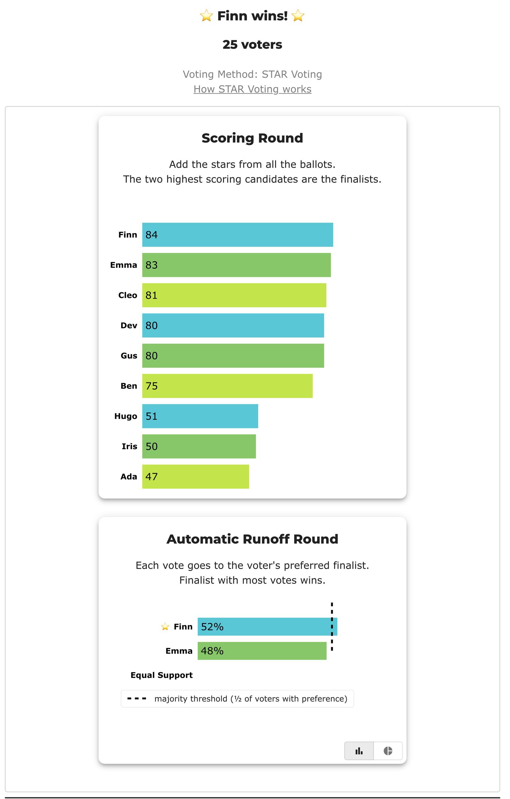

# Ballot expressiveness — one electorate, five papers

→ The topic page: [What the ballot can and cannot say](../../07_Concepts/scores_and_ranks/ballot_expressiveness_measured.md) · the rates: [Condorcet efficiency, measured](../../07_Concepts/topics/condorcet/condorcet_efficiency_measured.md) · the sibling worked election: [the crowded field](../crowded_field/README.md) · **Level: 301 · deep dive**

**▶ Live on BetterVoting:** [vote](https://bettervoting.com/37yf8x) · **[results ↗](https://bettervoting.com/37yf8x/results)** (election `37yf8x`, BV2280 — four of these five papers, one race each).

**One line:** twenty-five voters, nine candidates, and five different ballots — and the winner changes twice, once because the *paper* changed and once because the *count* did.

Every case in this folder is the **same electorate**. Voters and candidates sit at frozen positions on a single left–right spectrum, and every ballot is derived from those positions by a stated rule ([`build_cases.py`](build_cases.py)) — nothing hand-written, nothing tuned. **Finn beats all eight rivals head-to-head**, so Finn is the [Condorcet winner](../../07_Concepts/topics/condorcet/README.md) and the electorate's answer is fixed. The only thing that varies is what a voter is allowed to write down.

| Ballot | Count | Winner | | On BV |
|---|---|:--:|---|:--:|
| [0–5 scores](cases/cases_pages/bv2280_37yf8x_star.md) | STAR | **Finn** | ✅ the Condorcet winner | ✔ |
| [ranks all nine](cases/cases_pages/bv2280_37yf8x_rr_full.md) | Ranked Robin | **Finn** | ✅ the control | ✔ |
| [ranks only five](cases/cases_pages/bv2280_37yf8x_rr_top5.md) | Ranked Robin | **Gus** | ❌ the *cap* lost the answer | ✔ |
| [ranks all nine](cases/cases_pages/bv2280_37yf8x_irv_full.md) | RCV-IRV | **Ben** | ❌ the *count* lost the answer | ✔ |
| [ranks only five](cases/cases_pages/ballot_expressiveness_c9_irv_top5.md) | RCV-IRV | **Ben** | ❌ unchanged — already lost | — |

Read the table down the middle column and the whole lesson falls out.

**Three independent engines agree on every row.** The LH engine tabulates all five; [BetterVoting](https://bettervoting.com/37yf8x/results) independently tabulates the four it carries and reports `tieBreakType: none` throughout; and both Ranked Robin rows are additionally cross-checked against [`pref_voting`](../../STARVote_LH_tabulation_engine/tools_adam/pref_voting_tabulation_engine/ranked_robin_report.py)'s Copeland, a library nobody here wrote. The frozen export is [`bv2280_37yf8x_bv_export.json`](cases/bv2280_37yf8x_bv_export.json).

On BetterVoting the rank cap is not a description, it is **enforced** — race 3 sets `max_rankings: 5`, so a voter filling it in actually runs out of places to put Finn. That is the whole point of minting it rather than only simulating it. (The fifth paper stays LH-only: it is the control that changes nothing, and did not earn a permanent public race.)



BetterVoting's STAR numbers are the LH engine's, line for line — scoring round 84/83/81/80/80, runoff Finn 13–12 with nobody at Equal Support.

## The two things that are usually confused

**Rows 2 and 3 differ only in the paper.** Same voters, same Ranked Robin rule, same everything — except each voter may name five candidates instead of nine. That alone moves the winner from Finn to Gus. On the capped paper Finn's record falls from **8–0 (margin +38)** to **5–1–2t (margin +11)**, not because anyone changed their mind but because **only 16 of the 25 voters can fit Finn into five names at all**. For the other nine, Finn is simply not on the paper, and a candidate who is not on the paper wins no head-to-head.

**Rows 2 and 4 differ only in the count.** Same voters, same full nine-name rankings, same ink. Ranked Robin returns Finn; RCV-IRV returns Ben. The paper cannot be what decided that one — [center squeeze](../../06_Other/RCV_IRV/concepts/RCV_IRV_center_squeeze.md) is, sharpened by a crowded field: Finn stands in the middle of nine candidates, so the first-choice votes elimination reads are split among the neighbours and Finn is eliminated before the head-to-heads Finn wins are ever consulted.

So "the ballot was not expressive enough" and "the count threw the answer away" are **different failures**, they hit different methods, and this folder separates them.

## The part that surprises people

The ranked ballot is the one usually called *more expressive*, and at full resolution it is. But no large-field jurisdiction issues a full-resolution ranked ballot: **New York City and Maine cap ranked ballots at five names; San Francisco used three for years.** Against a realistic cap, the arithmetic reverses.

| On nine candidates | distinct opinions it can record |
|---|---:|
| a ranked ballot capped at five | 3,620 |
| a strict ranking of all nine | 362,880 |
| a 0–5 score ballot | 10,077,696 |

The coarse-looking score ballot says something about **every** candidate. The capped ranked ballot says nothing at all about four of them. That is why row 1 finds Finn and row 3 does not — and it is the half of the expressiveness story that the usual framing leaves out.

**The honest limit on that claim** is row 5, which is why it is in the folder. Capping the ballot changed *Ranked Robin's* winner and left *IRV's* alone — IRV had already lost Finn on the uncapped ballot for an unrelated reason. A rank cap bites a method that reads the whole ballot and glances off one that only ever reads the top of it. "The cap costs you the answer" is a claim about the count as much as the paper.

## What the score ballot actually loses

Nine candidates will not fit on six rungs, so **every** voter here must give at least two candidates the same score — a pigeonhole, not a tendency. But the forced minimum is only 3 of 36 pairs (8.3%), and these voters actually tie about **16%**. Most of the flattening is ordinary rounding, not the hard limit.

And in this election it costs nothing: the preference that decides the race — Finn over everyone — survives the rounding, and STAR returns the Condorcet winner from a ballot that cannot even rank the field. The runoff is Finn 13, Emma 12, with **zero** voters expressing no preference between them.

<!-- report:bv2280_37yf8x_star -->
```text
[Divergence from STAR]
  STAR                   = Finn
  Choose-One (Plurality) = Ada   (differs from STAR)
  Approval               = Emma   (differs from STAR)

--- STAR Voting Method (single winner) ---

[STAR Voting]
 Tabulating 25 ballots.
Count × Ada,Ben,Cleo,Dev,Emma,Finn,Gus,Hugo,Iris
    4 ×   0,  2,   2,  2,   3,   4,  5,   5,   5
    2 ×   4,  5,   4,  4,   4,   2,  2,   0,   0
    2 ×   0,  1,   2,  2,   2,   3,  4,   5,   5
    2 ×   0,  1,   2,  2,   2,   4,  4,   5,   5
    2 ×   0,  2,   3,  3,   3,   5,  4,   2,   2
    2 ×   5,  5,   4,  4,   4,   2,  2,   0,   0
    2 ×   5,  4,   3,  3,   3,   2,  1,   0,   0
    1 ×   5,  4,   4,  3,   3,   2,  1,   0,   0
    1 ×   0,  2,   3,  3,   4,   5,  4,   2,   1
    1 ×   2,  4,   5,  5,   5,   3,  2,   0,   0
    1 ×   0,  2,   3,  3,   3,   5,  5,   3,   3
    1 ×   3,  5,   5,  5,   4,   3,  2,   0,   0
    1 ×   1,  3,   5,  5,   5,   4,  3,   0,   0
    1 ×   0,  2,   3,  3,   3,   5,  5,   2,   2
    1 ×   5,  4,   4,  4,   3,   2,  2,   0,   0
    1 ×   3,  5,   5,  5,   5,   3,  2,   0,   0

[STAR Voting: Scoring Round]
 The two highest-scoring candidates advance to the next round.
   Finn          -- 84 -- First place
   Emma          -- 83 -- Second place
   Cleo          -- 81
   Dev           -- 80
   Gus           -- 80
   Ben           -- 75
   Hugo          -- 51
   Iris          -- 50
   Ada           -- 47
 Finn and Emma advance.

[STAR Voting: Automatic Runoff Round]
 The candidate preferred in the most head-to-head matchups wins.
   Finn          -- 13 -- First place
   Emma          -- 12
   Equal Support --  0
 Finn wins.
   Runoff math:
     25  ballots cast
   −  0  Equal Support (no preference between the two finalists)
     ──
     25  voters with a preference  (majority = 13)
           Finn 13 (52%)  ·  Emma 12 (48%)

[STAR Voting: Winner — STAR Voting Method (single winner)]
 Finn
```
<!-- /report -->

For an election where the same compression *does* cost STAR the answer, see [the crowded field](../crowded_field/README.md) at rung 7 — that folder is the other half of this one.

## Caveats

- **A truncated ballot's unstated pairs are a convention, not arithmetic.** Here a candidate you left unranked is counted as beaten by everyone you did rank, and tied with everyone else you left off. Other published treatments split that pair half-and-half, and the choice can move a result. It belongs in any quotation of the capped rows.
- **Nothing here is settled by a tie-break.** That was a search constraint, not luck — an earlier candidate electorate for this folder had an 8–8 IRV elimination tie whose winner flipped between lot rules, and was discarded for it. Every winner above survives any tie-break rule.
- **One election is one election.** The rates behind it — how *often* each of these things happens, across four electorate models and field sizes 3 to 11 — are on [the topic page](../../07_Concepts/scores_and_ranks/ballot_expressiveness_measured.md), measured rather than argued from this case.
- **Sincere ballots throughout.** No strategy, no truncation by choice; the cap is imposed by rule, as a real jurisdiction imposes it.

---

**See also:** [What the ballot can and cannot say](../../07_Concepts/scores_and_ranks/ballot_expressiveness_measured.md) · [the crowded field](../crowded_field/README.md) · [Why more candidates make every method miss](../../07_Concepts/topics/condorcet/why_more_candidates_miss.md) · [scores vs ranks](../../07_Concepts/scores_and_ranks/scores_vs_ranks.md) · [strict vs weak ranks](../../07_Concepts/scores_and_ranks/strict_vs_weak_ranks.md) · [exhausted ballots](../../06_Other/RCV_IRV/concepts/RCV_IRV_exhausted_ballots.md) · [method comparisons](../README.md)
