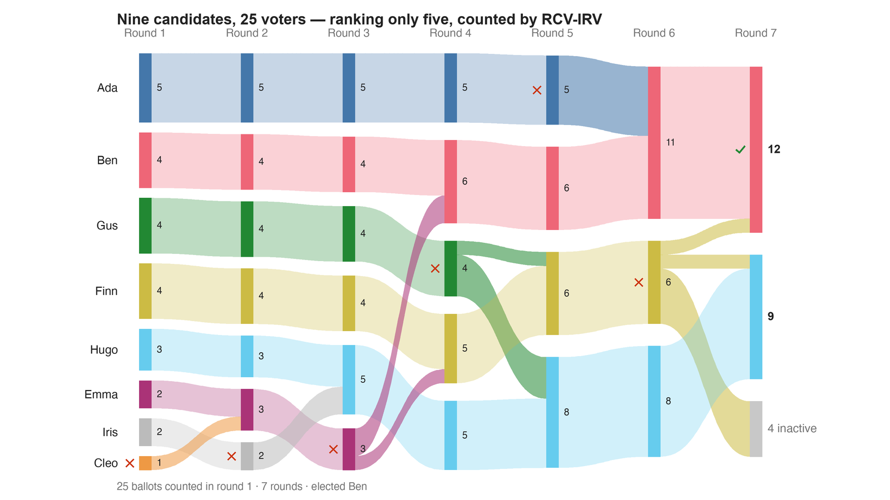

---
search:
  exclude: true
---

# Nine candidates, 25 voters — ranking only five, counted by RCV-IRV

*Generated from [`ballot_expressiveness_c9_irv_top5.yaml`](../ballot_expressiveness_c9_irv_top5.yaml) — do not edit by hand. Regenerate: `python STARVote_LH_tabulation_engine/tools_adam/scripts/build_yaml_pages.py`.*

**Method:** [rcv-irv](../../../../07_Concepts/README.md) · **1 seat** · **Expected winner:** Ben

**Official tie-break (lot) order:** Ada > Ben > Cleo > Dev > Emma > Finn > Gus > Hugo > Iris — consulted only if every deterministic tiebreaker stays tied ([how the ladder works](../../../../01_STAR/01_Learn/Tie_Breaking_STAR/tie_breaking.md)).

## Scenario

BOTH LIMITS AT ONCE, and the winner does not move again. Five ranks out of nine,
counted by instant runoff: Ben, exactly as in bv2280_37yf8x_irv_full.yaml.

This file is the honest control on the rest of the folder, and it is the one that stops
the lesson from overreaching. Ranked Robin's winner DID change when the ballot was
capped (Finn → Gus). IRV's did not — because IRV had already lost Finn on the uncapped
ballot, for a completely different reason: too few first choices. Truncation and
elimination are separate failures, and here stacking them changes nothing.

So "the cap costs you the answer" is a claim about the COUNT as much as the paper. It
bites a method that reads the whole ballot, and glances off one that only reads the
top of it.

Convention, stated: an unranked candidate is beaten by everyone the voter ranked. A
ballot whose five names have all been eliminated is EXHAUSTED — it leaves the count and
the majority denominator, which is what a rank cap really does to an instant runoff.

Construction: build_cases.py in this folder. 25 voters and 9 candidates at frozen
positions on one spectrum — Ada −0.73 · Ben −0.37 · Cleo −0.18 · Dev −0.17 ·
Emma −0.11 · Finn +0.24 · Gus +0.41 · Hugo +0.80 · Iris +0.84; utility = minus the
distance; scores = each voter's own min-max scaling onto 0–5; rankings = those same
utilities in order. Nothing is tuned to the result, and **no count in this folder is
settled by a tie-break** — that was a search constraint, so every winner here survives
any lot rule.

## Ballots

Each row is one voter's ranking, most-preferred first (`N:` prefix = N identical ballots).

```text
Ben>Cleo>Dev>Ada>Emma    # voter at -0.43
Gus>Hugo>Iris>Finn>Emma    # voter at +0.60
Ada>Ben>Cleo>Dev>Emma    # voter at -0.67
Iris>Hugo>Gus>Finn>Emma    # voter at +0.89
Finn>Gus>Emma>Dev>Cleo    # voter at +0.18
Emma>Dev>Cleo>Ben>Finn    # voter at -0.13
Gus>Hugo>Iris>Finn>Emma    # voter at +0.59
Hugo>Iris>Gus>Finn>Emma    # voter at +0.72
Gus>Finn>Emma>Hugo>Iris    # voter at +0.34
Hugo>Iris>Gus>Finn>Emma    # voter at +0.69
Finn>Gus>Emma>Dev>Cleo    # voter at +0.23
Ben>Cleo>Dev>Emma>Ada    # voter at -0.30
Ben>Ada>Cleo>Dev>Emma    # voter at -0.51
Iris>Hugo>Gus>Finn>Emma    # voter at +0.89
Emma>Dev>Cleo>Finn>Ben    # voter at -0.05
Gus>Hugo>Iris>Finn>Emma    # voter at +0.60
Finn>Gus>Emma>Dev>Cleo    # voter at +0.28
Ben>Cleo>Dev>Emma>Ada    # voter at -0.40
Hugo>Gus>Iris>Finn>Emma    # voter at +0.62
Ada>Ben>Cleo>Dev>Emma    # voter at -0.63
Finn>Gus>Emma>Dev>Cleo    # voter at +0.27
Ada>Ben>Cleo>Dev>Emma    # voter at -0.61
Ada>Ben>Cleo>Dev>Emma    # voter at -1.33
Cleo>Dev>Emma>Ben>Finn    # voter at -0.23
Ada>Ben>Cleo>Dev>Emma    # voter at -1.82
```

## What the engine says



*Where the votes went. Band thickness is votes; a band leaving an eliminated candidate lands on whoever that ballot ranked next, or on **inactive** if it ranked nobody who was left.*

The count, step by step — the rounds and how the winner is reached:

<!-- --8<-- [start:report] -->
```text
--- RCV / Instant-Runoff Voting (single winner) ---
  Nine candidates, 25 voters — ranking only five, counted by RCV-IRV
 Tabulating 25 ballots (ranked ballots).

ROUND 1
Candidate      Votes  Status
-----------  -------  --------
Ada                5  Hopeful
Gus                4  Hopeful
Ben                4  Hopeful
Finn               4  Hopeful
Hugo               3  Hopeful
Iris               2  Hopeful
Emma               2  Hopeful
Cleo               1  Rejected
Dev                0  Rejected

ROUND 2
Candidate      Votes  Status
-----------  -------  --------
Ada                5  Hopeful
Ben                4  Hopeful
Gus                4  Hopeful
Finn               4  Hopeful
Hugo               3  Hopeful
Emma               3  Hopeful
Iris               2  Rejected
Cleo               0  Rejected
Dev                0  Rejected

ROUND 3
Candidate      Votes  Status
-----------  -------  --------
Hugo               5  Hopeful
Ada                5  Hopeful
Gus                4  Hopeful
Ben                4  Hopeful
Finn               4  Hopeful
Emma               3  Rejected
Iris               0  Rejected
Cleo               0  Rejected
Dev                0  Rejected

ROUND 4
Candidate      Votes  Status
-----------  -------  --------
Ben                6  Hopeful
Ada                5  Hopeful
Finn               5  Hopeful
Hugo               5  Hopeful
Gus                4  Rejected
Emma               0  Rejected
Iris               0  Rejected
Cleo               0  Rejected
Dev                0  Rejected

ROUND 5
Candidate      Votes  Status
-----------  -------  --------
Hugo               8  Hopeful
Finn               6  Hopeful
Ben                6  Hopeful
Ada                5  Rejected
Gus                0  Rejected
Emma               0  Rejected
Iris               0  Rejected
Cleo               0  Rejected
Dev                0  Rejected

ROUND 6
Candidate      Votes  Status
-----------  -------  --------
Ben               11  Hopeful
Hugo               8  Hopeful
Finn               6  Rejected
Ada                0  Rejected
Gus                0  Rejected
Emma               0  Rejected
Iris               0  Rejected
Cleo               0  Rejected
Dev                0  Rejected

FINAL RESULT
Candidate      Votes  Status
-----------  -------  --------
Ben               12  Elected
Hugo               9  Rejected
Finn               0  Rejected
Ada                0  Rejected
Gus                0  Rejected
Emma               0  Rejected
Iris               0  Rejected
Cleo               0  Rejected
Dev                0  Rejected
Blank Votes        4  Rejected


Winner(s) — RCV / Instant-Runoff Voting (single winner)
  Ben

--- Transfers and inactive ballots (what the round tables leave out) ---
The tables above give each candidate's round total but not where a
transferred vote came FROM, nor how many ballots stopped counting.
Both are recomputed from the ballots, using the eliminations the
count above actually made.

ROUND 1 — 25 of 25 ballots still active; majority = 13
   Dev eliminated with 0:
      → (held no ballots)
   Cleo eliminated with 1:
      → Emma                      1

ROUND 2 — 25 of 25 ballots still active; majority = 13
   Iris eliminated with 2:
      → Hugo                      2

ROUND 3 — 25 of 25 ballots still active; majority = 13
   Emma eliminated with 3:
      → Ben                       2
      → Finn                      1

ROUND 4 — 25 of 25 ballots still active; majority = 13
   Gus eliminated with 4:
      → Hugo                      3
      → Finn                      1

ROUND 5 — 25 of 25 ballots still active; majority = 13
   Ada eliminated with 5:
      → Ben                       5

ROUND 6 — 25 of 25 ballots still active; majority = 13
   Finn eliminated with 6:
      → (no continuing ranking)      4  ← these ballots go inactive
      → Ben                       1
      → Hugo                      1

FINAL ROUND — 21 of 25 ballots still active (4 inactive); majority = 11
   Ben                      12  (57.1% of the still-active)  ← elected
   Hugo                      9  (42.9% of the still-active)
   Never exhausted, never transferred:
      9 ballots held by Hugo carried a lower ranking that was never read
      (the count stopped here, so those preferences did nothing).

Inactive ballots at the final round: 4 of 25 (16.0%).
   Ben's 12 is a majority of the 21 still active but only 48.0% of all 25 cast —
   the 'majority' here is of a shrunken denominator. See
   06_Other/RCV_IRV/concepts/RCV_IRV_exhausted_ballots.md
```
<!-- --8<-- [end:report] -->

### Full audit — preference matrix, Condorcet, and score distribution

```text
--- Smith Set (the generalized Condorcet winner) ---
The smallest group whose every member beats every candidate outside it —
the honest answer to "who is even in contention?".
   Smith set (1 of 9): Gus
   Outside (8):        Ben, Cleo, Dev, Ada, Emma, Hugo, Iris, Finn
   One member ⇒ Gus is the Condorcet winner, beating every rival head-to-head.
   RCV-IRV winner Ben is OUTSIDE the Smith set. ✗
      Every member of the set (Gus) beats Ben head-to-head, yet
      RCV-IRV elected Ben anyway. RCV-IRV is not Smith-efficient (nor
      Condorcet-efficient) — this is the shape a center squeeze leaves behind.
   More: 07_Concepts/topics/smith_set.md
```

Everything in one file: the [`_tabulated` mirror](../cases_tabulated/ballot_expressiveness_c9_irv_top5_tabulated.txt) (regenerated on every run; every analysis forced on).

Run it yourself:

```bash
python STARVote_LH_tabulation_engine/starvote_larry_hastings.py method_comparisons/ballot_expressiveness/cases/ballot_expressiveness_c9_irv_top5.yaml
```

## See also

- [Ties & tie-breaking (topic hub)](../../../../07_Concepts/topics/ties/README.md)
- [The tie-breaking ladder (full chain)](../../../../01_STAR/01_Learn/Tie_Breaking_STAR/tie_breaking.md)
- [Runoff reversal (worked set)](../../../../01_STAR/02_Examples/runoff_overturns_leader/README.md)
- [Exhausted ballots (untangled)](../../../../06_Other/RCV_IRV/concepts/exhausted_ballots_301.md)
- [Glossary](../../../../07_Concepts/GLOSSARY.md) · [all cases by method](../../../../07_Concepts/YAML_test_case_index/README.md)

More cases in this set: [bv2280_37yf8x_irv_full](bv2280_37yf8x_irv_full.md) · [bv2280_37yf8x_rr_full](bv2280_37yf8x_rr_full.md) · [bv2280_37yf8x_rr_top5](bv2280_37yf8x_rr_top5.md) · [bv2280_37yf8x_star](bv2280_37yf8x_star.md)
