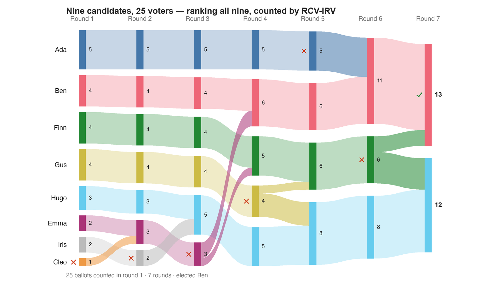

---
search:
  exclude: true
---

# Nine candidates, 25 voters — ranking all nine, counted by RCV-IRV

*Generated from [`bv2280_37yf8x_irv_full.yaml`](../bv2280_37yf8x_irv_full.yaml) — do not edit by hand. Regenerate: `python STARVote_LH_tabulation_engine/tools_adam/scripts/build_yaml_pages.py`.*

**Method:** [rcv-irv](../../../../07_Concepts/README.md) · **1 seat** · **Expected winner:** Ben

**▶ Live on BetterVoting:** [vote](https://bettervoting.com/37yf8x) · **[results ↗](https://bettervoting.com/37yf8x/results)** (election `37yf8x` · test `BV2280`).

**Official tie-break (lot) order:** Ada > Ben > Cleo > Dev > Emma > Finn > Gus > Hugo > Iris — consulted only if every deterministic tiebreaker stays tied ([how the ladder works](../../../../01_STAR/01_Learn/Tie_Breaking_STAR/tie_breaking.md)).

## Scenario

THE EXPRESSIVE BALLOT DOES NOT RESCUE THE COUNT. These are the same complete,
full-resolution rankings as bv2280_37yf8x_rr_full.yaml — every voter's
opinion of all nine candidates, nothing rounded and nothing truncated. Instant runoff
still elects Ben, not the Condorcet winner Finn.

That is the point this file exists to make, and it is the cleanest comparison in the
folder because only ONE thing differs from the Ranked Robin control: the count. Same
voters, same paper, same ink — Ranked Robin returns Finn and RCV-IRV returns Ben. So
the paper cannot be what decided it.

The mechanism is center squeeze, sharpened by the crowd: Finn stands in the middle of
nine candidates on one spectrum,
so the first-choice votes that elimination reads are split among the neighbours, and
Finn is eliminated before the head-to-heads Finn wins are ever consulted.

It also explains a measured oddity on the topic page: IRV's Condorcet efficiency barely
moves when you hand it a coarse ballot instead of a fine one, because it only ever
reads each ballot's top surviving choice. Resolution it never looks at costs it
nothing — and buys it nothing either.

Construction: build_cases.py in this folder. 25 voters and 9 candidates at frozen
positions on one spectrum — Ada −0.73 · Ben −0.37 · Cleo −0.18 · Dev −0.17 ·
Emma −0.11 · Finn +0.24 · Gus +0.41 · Hugo +0.80 · Iris +0.84; utility = minus the
distance; scores = each voter's own min-max scaling onto 0–5; rankings = those same
utilities in order. Nothing is tuned to the result, and **no count in this folder is
settled by a tie-break** — that was a search constraint, so every winner here survives
any lot rule.

## Ballots

Each row is one voter's ranking, most-preferred first (`N:` prefix = N identical ballots).

```text
Ben>Cleo>Dev>Ada>Emma>Finn>Gus>Hugo>Iris    # voter at -0.43
Gus>Hugo>Iris>Finn>Emma>Dev>Cleo>Ben>Ada    # voter at +0.60
Ada>Ben>Cleo>Dev>Emma>Finn>Gus>Hugo>Iris    # voter at -0.67
Iris>Hugo>Gus>Finn>Emma>Dev>Cleo>Ben>Ada    # voter at +0.89
Finn>Gus>Emma>Dev>Cleo>Ben>Hugo>Iris>Ada    # voter at +0.18
Emma>Dev>Cleo>Ben>Finn>Gus>Ada>Hugo>Iris    # voter at -0.13
Gus>Hugo>Iris>Finn>Emma>Dev>Cleo>Ben>Ada    # voter at +0.59
Hugo>Iris>Gus>Finn>Emma>Dev>Cleo>Ben>Ada    # voter at +0.72
Gus>Finn>Emma>Hugo>Iris>Dev>Cleo>Ben>Ada    # voter at +0.34
Hugo>Iris>Gus>Finn>Emma>Dev>Cleo>Ben>Ada    # voter at +0.69
Finn>Gus>Emma>Dev>Cleo>Hugo>Iris>Ben>Ada    # voter at +0.23
Ben>Cleo>Dev>Emma>Ada>Finn>Gus>Hugo>Iris    # voter at -0.30
Ben>Ada>Cleo>Dev>Emma>Finn>Gus>Hugo>Iris    # voter at -0.51
Iris>Hugo>Gus>Finn>Emma>Dev>Cleo>Ben>Ada    # voter at +0.89
Emma>Dev>Cleo>Finn>Ben>Gus>Ada>Hugo>Iris    # voter at -0.05
Gus>Hugo>Iris>Finn>Emma>Dev>Cleo>Ben>Ada    # voter at +0.60
Finn>Gus>Emma>Dev>Cleo>Hugo>Iris>Ben>Ada    # voter at +0.28
Ben>Cleo>Dev>Emma>Ada>Finn>Gus>Hugo>Iris    # voter at -0.40
Hugo>Gus>Iris>Finn>Emma>Dev>Cleo>Ben>Ada    # voter at +0.62
Ada>Ben>Cleo>Dev>Emma>Finn>Gus>Hugo>Iris    # voter at -0.63
Finn>Gus>Emma>Dev>Cleo>Hugo>Iris>Ben>Ada    # voter at +0.27
Ada>Ben>Cleo>Dev>Emma>Finn>Gus>Hugo>Iris    # voter at -0.61
Ada>Ben>Cleo>Dev>Emma>Finn>Gus>Hugo>Iris    # voter at -1.33
Cleo>Dev>Emma>Ben>Finn>Ada>Gus>Hugo>Iris    # voter at -0.23
Ada>Ben>Cleo>Dev>Emma>Finn>Gus>Hugo>Iris    # voter at -1.82
```

## What the engine says



*Where the votes went. Band thickness is votes; a band leaving an eliminated candidate lands on whoever that ballot ranked next, or on **inactive** if it ranked nobody who was left.*

The count, step by step — the rounds and how the winner is reached:

<!-- --8<-- [start:report] -->
```text
--- RCV / Instant-Runoff Voting (single winner) ---
  Nine candidates, 25 voters — ranking all nine, counted by RCV-IRV
 Tabulating 25 ballots (ranked ballots).

ROUND 1
Candidate      Votes  Status
-----------  -------  --------
Ada                5  Hopeful
Gus                4  Hopeful
Ben                4  Hopeful
Finn               4  Hopeful
Hugo               3  Hopeful
Iris               2  Hopeful
Emma               2  Hopeful
Cleo               1  Rejected
Dev                0  Rejected

ROUND 2
Candidate      Votes  Status
-----------  -------  --------
Ada                5  Hopeful
Ben                4  Hopeful
Gus                4  Hopeful
Finn               4  Hopeful
Hugo               3  Hopeful
Emma               3  Hopeful
Iris               2  Rejected
Cleo               0  Rejected
Dev                0  Rejected

ROUND 3
Candidate      Votes  Status
-----------  -------  --------
Hugo               5  Hopeful
Ada                5  Hopeful
Gus                4  Hopeful
Ben                4  Hopeful
Finn               4  Hopeful
Emma               3  Rejected
Iris               0  Rejected
Cleo               0  Rejected
Dev                0  Rejected

ROUND 4
Candidate      Votes  Status
-----------  -------  --------
Ben                6  Hopeful
Ada                5  Hopeful
Finn               5  Hopeful
Hugo               5  Hopeful
Gus                4  Rejected
Emma               0  Rejected
Iris               0  Rejected
Cleo               0  Rejected
Dev                0  Rejected

ROUND 5
Candidate      Votes  Status
-----------  -------  --------
Hugo               8  Hopeful
Finn               6  Hopeful
Ben                6  Hopeful
Ada                5  Rejected
Gus                0  Rejected
Emma               0  Rejected
Iris               0  Rejected
Cleo               0  Rejected
Dev                0  Rejected

ROUND 6
Candidate      Votes  Status
-----------  -------  --------
Ben               11  Hopeful
Hugo               8  Hopeful
Finn               6  Rejected
Ada                0  Rejected
Gus                0  Rejected
Emma               0  Rejected
Iris               0  Rejected
Cleo               0  Rejected
Dev                0  Rejected

FINAL RESULT
Candidate      Votes  Status
-----------  -------  --------
Ben               13  Elected
Hugo              12  Rejected
Finn               0  Rejected
Ada                0  Rejected
Gus                0  Rejected
Emma               0  Rejected
Iris               0  Rejected
Cleo               0  Rejected
Dev                0  Rejected


Winner(s) — RCV / Instant-Runoff Voting (single winner)
  Ben
```
<!-- --8<-- [end:report] -->

### Full audit — preference matrix, Condorcet, and score distribution

```text
--- Smith Set (the generalized Condorcet winner) ---
The smallest group whose every member beats every candidate outside it —
the honest answer to "who is even in contention?".
   Smith set (1 of 9): Finn
   Outside (8):        Ben, Cleo, Dev, Ada, Emma, Gus, Hugo, Iris
   One member ⇒ Finn is the Condorcet winner, beating every rival head-to-head.
   RCV-IRV winner Ben is OUTSIDE the Smith set. ✗
      Every member of the set (Finn) beats Ben head-to-head, yet
      RCV-IRV elected Ben anyway. RCV-IRV is not Smith-efficient (nor
      Condorcet-efficient) — this is the shape a center squeeze leaves behind.
   More: 07_Concepts/topics/smith_set.md
```

Everything in one file: the [`_tabulated` mirror](../cases_tabulated/bv2280_37yf8x_irv_full_tabulated.txt) (regenerated on every run; every analysis forced on).

Run it yourself:

```bash
python STARVote_LH_tabulation_engine/starvote_larry_hastings.py method_comparisons/ballot_expressiveness/cases/bv2280_37yf8x_irv_full.yaml
```

## See also

- [Center squeeze (topic hub)](../../../../07_Concepts/topics/center_squeeze/README.md)
- [Condorcet efficiency (topic hub)](../../../../07_Concepts/topics/condorcet/README.md)
- [Ties & tie-breaking (topic hub)](../../../../07_Concepts/topics/ties/README.md)
- [The tie-breaking ladder (full chain)](../../../../01_STAR/01_Learn/Tie_Breaking_STAR/tie_breaking.md)
- [Vote splitting (worked set)](../../../split_voting/README.md)
- [Runoff reversal (worked set)](../../../../01_STAR/02_Examples/runoff_overturns_leader/README.md)
- [Glossary](../../../../07_Concepts/GLOSSARY.md) · [all cases by method](../../../../07_Concepts/YAML_test_case_index/README.md)

More cases in this set: [ballot_expressiveness_c9_irv_top5](ballot_expressiveness_c9_irv_top5.md) · [bv2280_37yf8x_rr_full](bv2280_37yf8x_rr_full.md) · [bv2280_37yf8x_rr_top5](bv2280_37yf8x_rr_top5.md) · [bv2280_37yf8x_star](bv2280_37yf8x_star.md)
