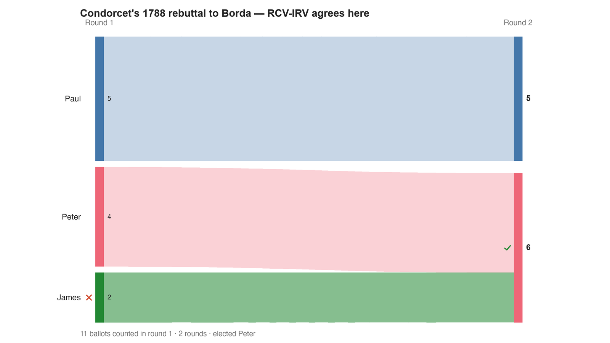

---
search:
  exclude: true
---

# Condorcet's 1788 rebuttal to Borda — RCV-IRV agrees here

*Generated from [`condorcet_1788_irv.yaml`](../condorcet_1788_irv.yaml) — do not edit by hand. Regenerate: `python STARVote_LH_tabulation_engine/tools_adam/scripts/build_yaml_pages.py`.*

**Method:** [RCV-IRV (Instant Runoff)](../../../../06_Other/RCV_IRV/concepts/README.md) · **1 seat** · **Expected winner:** Peter

**▶ Live on BetterVoting:** [vote](https://bettervoting.com/khcwm4) · **[results ↗](https://bettervoting.com/khcwm4/results)** (election `khcwm4` · test `BV2250`).

## Scenario

The third race of BV2250: the same 11 ranked ballots, counted by instant runoff.

    4 : Peter > Paul  > James
    3 : Paul  > James > Peter
    2 : Paul  > Peter > James
    2 : James > Peter > Paul

This case exists to keep the comparison honest. Condorcet's 1788 example is a
counterexample to BORDA (and to plurality) — not to IRV. James has the fewest
first choices (2) and is eliminated; both of his ballots rank Peter next, so
they transfer and Peter wins 6-5. RCV-IRV lands on the Condorcet winner here,
exactly as Ranked Robin and STAR do.

IRV's own Condorcet failures require a center squeeze — a strong middle
candidate with few first choices, eliminated before the head-to-head that
would have shown their strength. This profile does not contain one: Peter is
not squeezed, he leads the first-choice count among the two finalists' bloc
and simply starts second. Citing this election as an IRV failure would be
wrong, and the repo says so on the folder page.

## Ballots

Each row is one voter's ranking, most-preferred first (`N:` prefix = N identical ballots).

```text
4:Peter>Paul>James
3:Paul>James>Peter
2:Paul>Peter>James
2:James>Peter>Paul
```

## What the engine says



*Where the votes went. Band thickness is votes; a band leaving an eliminated candidate lands on whoever that ballot ranked next, or on **inactive** if it ranked nobody who was left.*

The count, step by step — the rounds and how the winner is reached:

<!-- --8<-- [start:report] -->
```text
--- RCV / Instant-Runoff Voting (single winner) ---
  Condorcet's 1788 rebuttal to Borda — RCV-IRV agrees here
 Tabulating 11 ballots (ranked ballots).

ROUND 1
Candidate      Votes  Status
-----------  -------  --------
Paul               5  Hopeful
Peter              4  Hopeful
James              2  Rejected

FINAL RESULT
Candidate      Votes  Status
-----------  -------  --------
Peter              6  Elected
Paul               5  Rejected
James              0  Rejected


Winner(s) — RCV / Instant-Runoff Voting (single winner)
  Peter

--- Transfers and inactive ballots (what the round tables leave out) ---
The tables above give each candidate's round total but not where a
transferred vote came FROM, nor how many ballots stopped counting.
Both are recomputed from the ballots, using the eliminations the
count above actually made.

ROUND 1 — 11 of 11 ballots still active; majority = 6
   James eliminated with 2:
      → Peter                     2

FINAL ROUND — 11 of 11 ballots still active; majority = 6
   Peter                     6  (54.5% of the still-active)  ← elected
   Paul                      5  (45.5% of the still-active)
   Never exhausted, never transferred:
      5 ballots held by Paul carried a lower ranking that was never read
      (the count stopped here, so those preferences did nothing).

Inactive ballots at the final round: 0 of 11 (0.0%).
   Peter's 6 is a majority of the 11 still active AND of all 11 cast (54.5%).
```
<!-- --8<-- [end:report] -->

### Full audit — preference matrix, Condorcet, and score distribution

```text
--- Smith Set (the generalized Condorcet winner) ---
The smallest group whose every member beats every candidate outside it —
the honest answer to "who is even in contention?".
   Smith set (1 of 3): Peter
   Outside (2):        Paul, James
   One member ⇒ Peter is the Condorcet winner, beating every rival head-to-head.
   RCV-IRV winner Peter is INSIDE the Smith set. ✓
      Not guaranteed — RCV-IRV is not Smith-efficient — but it holds here.
   More: 07_Concepts/topics/smith_set.md
```

Everything in one file: the [`_tabulated` mirror](../cases_tabulated/condorcet_1788_irv_tabulated.txt) (regenerated on every run; every analysis forced on).

Run it yourself:

```bash
python STARVote_LH_tabulation_engine/starvote_larry_hastings.py method_comparisons/borda_condorcet_1788/cases/condorcet_1788_irv.yaml
```

## See also

- [Center squeeze (topic hub)](../../../../07_Concepts/topics/center_squeeze/README.md)
- [Condorcet efficiency (topic hub)](../../../../07_Concepts/topics/condorcet/README.md)
- [Runoff reversal (worked set)](../../../../01_STAR/02_Examples/runoff_overturns_leader/README.md)
- [Glossary](../../../../07_Concepts/GLOSSARY.md) · [all cases by method](../../../../07_Concepts/YAML_test_case_index/README.md)

More cases in this set: [condorcet_1788_ranked_robin](condorcet_1788_ranked_robin.md) · [condorcet_1788_star](condorcet_1788_star.md)
