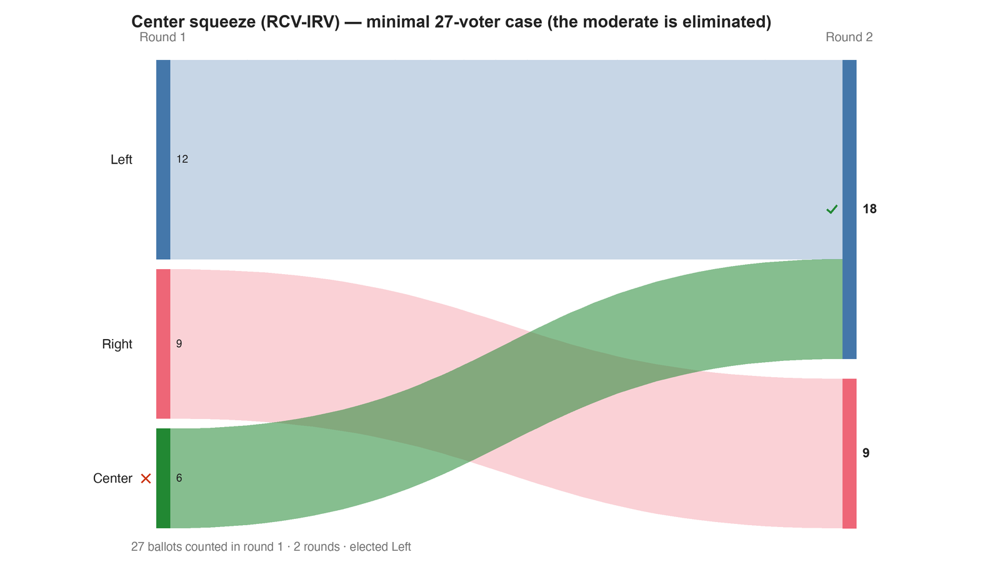

---
search:
  exclude: true
---

# Center squeeze (RCV-IRV) — minimal 27-voter case (the moderate is eliminated)

*Generated from [`center_squeeze_irv.yaml`](../center_squeeze_irv.yaml) — do not edit by hand. Regenerate: `python STARVote_LH_tabulation_engine/tools_adam/scripts/build_yaml_pages.py`.*

**Method:** [RCV-IRV (Instant Runoff)](../../../../06_Other/RCV_IRV/concepts/README.md) · **1 seat** · **Expected winner:** Left

## Scenario

The minimal center-squeeze electorate, counted by RCV-IRV: 27 voters on a
1-D spectrum. Center is every faction's acceptable second choice and beats
either pole head-to-head — but holds the FEWEST first choices (6), is
eliminated in round one, and polar Left wins. The matched file
center_squeeze_star.yaml scores the same profile 0-5 and elects Center.
See center_squeeze_voteline_1d.yaml for the spectrum picture and the
center-squeeze topic hub for the cross-method view.

## Ballots

Each row is one voter's ranking, most-preferred first (`N:` prefix = N identical ballots).

```text
12:Left>Center>Right
9:Right>Center>Left
6:Center>Left>Right
```

## What the engine says



*Where the votes went. Band thickness is votes; a band leaving an eliminated candidate lands on whoever that ballot ranked next, or on **inactive** if it ranked nobody who was left.*

The count, step by step — the rounds and how the winner is reached:

<!-- --8<-- [start:report] -->
```text
--- RCV / Instant-Runoff Voting (single winner) ---
  Center squeeze (RCV-IRV) — minimal 27-voter case (the moderate is eliminated)
 Tabulating 27 ballots (ranked ballots).

ROUND 1
Candidate      Votes  Status
-----------  -------  --------
Left              12  Hopeful
Right              9  Hopeful
Center             6  Rejected

FINAL RESULT
Candidate      Votes  Status
-----------  -------  --------
Left              18  Elected
Right              9  Rejected
Center             0  Rejected


Winner(s) — RCV / Instant-Runoff Voting (single winner)
  Left

--- Transfers and inactive ballots (what the round tables leave out) ---
The tables above give each candidate's round total but not where a
transferred vote came FROM, nor how many ballots stopped counting.
Both are recomputed from the ballots, using the eliminations the
count above actually made.

ROUND 1 — 27 of 27 ballots still active; majority = 14
   Center eliminated with 6:
      → Left                      6

FINAL ROUND — 27 of 27 ballots still active; majority = 14
   Left                     18  (66.7% of the still-active)  ← elected
   Right                     9  (33.3% of the still-active)
   Never exhausted, never transferred:
      9 ballots held by Right carried a lower ranking that was never read
      (the count stopped here, so those preferences did nothing).

Inactive ballots at the final round: 0 of 27 (0.0%).
   Left's 18 is a majority of the 27 still active AND of all 27 cast (66.7%).
```
<!-- --8<-- [end:report] -->

### Full audit — preference matrix, Condorcet, and score distribution

```text
--- Smith Set (the generalized Condorcet winner) ---
The smallest group whose every member beats every candidate outside it —
the honest answer to "who is even in contention?".
   Smith set (1 of 3): Center
   Outside (2):        Left, Right
   One member ⇒ Center is the Condorcet winner, beating every rival head-to-head.
   RCV-IRV winner Left is OUTSIDE the Smith set. ✗
      Every member of the set (Center) beats Left head-to-head, yet
      RCV-IRV elected Left anyway. RCV-IRV is not Smith-efficient (nor
      Condorcet-efficient) — this is the shape a center squeeze leaves behind.
   More: 07_Concepts/topics/smith_set.md
```

Everything in one file: the [`_tabulated` mirror](../cases_tabulated/center_squeeze_irv_tabulated.txt) (regenerated on every run; every analysis forced on).

Run it yourself:

```bash
python STARVote_LH_tabulation_engine/starvote_larry_hastings.py method_comparisons/center_squeeze/cases/center_squeeze_irv.yaml
```

## See also

- [Center squeeze (topic hub)](../../../../07_Concepts/topics/center_squeeze/README.md)
- [Glossary](../../../../07_Concepts/GLOSSARY.md) · [all cases by method](../../../../07_Concepts/YAML_test_case_index/README.md)

More cases in this set: [center_squeeze_star](center_squeeze_star.md) · [center_squeeze_voteline_1d](center_squeeze_voteline_1d.md)
