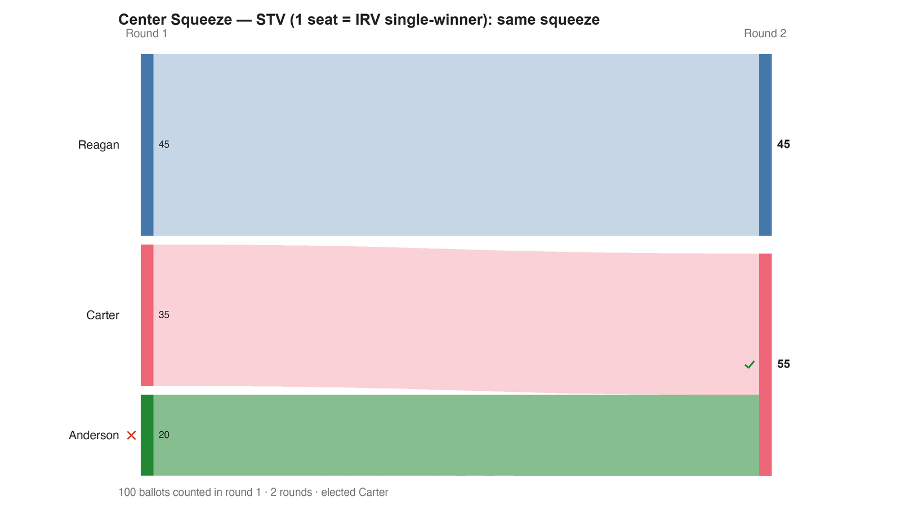

---
search:
  exclude: true
---

# Center Squeeze — STV (1 seat = IRV single-winner): same squeeze

*Generated from [`bv2137_ywckmg_stv.yaml`](../bv2137_ywckmg_stv.yaml) — do not edit by hand. Regenerate: `python STARVote_LH_tabulation_engine/tools_adam/scripts/build_yaml_pages.py`.*

**Method:** [STV (proportional, ranked ballots)](../../../../03_STAR_PR/01_Learn/README.md) · **1 seat** · **Expected winner:** Carter

**▶ Live on BetterVoting:** [vote](https://bettervoting.com/ywckmg) · **[results ↗](https://bettervoting.com/ywckmg/results)** (election `ywckmg` · test `BV2137`).

## Scenario

One of four races in the Center Squeeze election (BV2137, bvid ywckmg; BV-confirmed). 100 voters, three candidates, ONE ranked electorate tabulated four ways. Anderson is the Condorcet winner (beats Reagan 55–45, Carter 65–35) but holds the fewest first-choices (20). Single-seat STV is IRV: Anderson eliminated first, Carter wins. STV → Carter.

## Ballots

Each row is one voter's ranking, most-preferred first (`N:` prefix = N identical ballots).

```text
45:Reagan>Anderson>Carter
20:Anderson>Carter>Reagan
35:Carter>Anderson>Reagan
```

## What the engine says



*Where the votes went. Band thickness is votes; a band leaving an eliminated candidate lands on whoever that ballot ranked next, or on **inactive** if it ranked nobody who was left.*

The count, step by step — the rounds and how the winner is reached:

<!-- --8<-- [start:report] -->
```text
--- RCV / Instant-Runoff Voting (single winner) ---
  Center Squeeze — STV (1 seat = IRV single-winner): same squeeze
 Tabulating 100 ballots (ranked ballots).

ROUND 1
Candidate      Votes  Status
-----------  -------  --------
Reagan            45  Hopeful
Carter            35  Hopeful
Anderson          20  Rejected

FINAL RESULT
Candidate      Votes  Status
-----------  -------  --------
Carter            55  Elected
Reagan            45  Rejected
Anderson           0  Rejected


Winner(s) — RCV / Instant-Runoff Voting (single winner)
  Carter

--- Transfers and inactive ballots (what the round tables leave out) ---
The tables above give each candidate's round total but not where a
transferred vote came FROM, nor how many ballots stopped counting.
Both are recomputed from the ballots, using the eliminations the
count above actually made.

ROUND 1 — 100 of 100 ballots still active; majority = 51
   Anderson eliminated with 20:
      → Carter                   20

FINAL ROUND — 100 of 100 ballots still active; majority = 51
   Carter                   55  (55.0% of the still-active)  ← elected
   Reagan                   45  (45.0% of the still-active)
   Never exhausted, never transferred:
      45 ballots held by Reagan carried a lower ranking that was never read
      (the count stopped here, so those preferences did nothing).

Inactive ballots at the final round: 0 of 100 (0.0%).
   Carter's 55 is a majority of the 100 still active AND of all 100 cast (55.0%).
```
<!-- --8<-- [end:report] -->

### Full audit — preference matrix, Condorcet, and score distribution

```text
--- Smith Set (the generalized Condorcet winner) ---
The smallest group whose every member beats every candidate outside it —
the honest answer to "who is even in contention?".
   Smith set (1 of 3): Anderson
   Outside (2):        Reagan, Carter
   One member ⇒ Anderson is the Condorcet winner, beating every rival head-to-head.
   RCV-IRV winner Carter is OUTSIDE the Smith set. ✗
      Every member of the set (Anderson) beats Carter head-to-head, yet
      RCV-IRV elected Carter anyway. RCV-IRV is not Smith-efficient (nor
      Condorcet-efficient) — this is the shape a center squeeze leaves behind.
   More: 07_Concepts/topics/smith_set.md
```

Everything in one file: the [`_tabulated` mirror](../cases_tabulated/bv2137_ywckmg_stv_tabulated.txt) (regenerated on every run; every analysis forced on).

Run it yourself:

```bash
python STARVote_LH_tabulation_engine/starvote_larry_hastings.py method_comparisons/center_squeeze_bv2137/cases/bv2137_ywckmg_stv.yaml
```

## See also

- [Center squeeze (topic hub)](../../../../07_Concepts/topics/center_squeeze/README.md)
- [Condorcet efficiency (topic hub)](../../../../07_Concepts/topics/condorcet/README.md)
- [Glossary](../../../../07_Concepts/GLOSSARY.md) · [all cases by method](../../../../07_Concepts/YAML_test_case_index/README.md)

More cases in this set: [bv2137_ywckmg_irv](bv2137_ywckmg_irv.md) · [bv2137_ywckmg_ranked_robin](bv2137_ywckmg_ranked_robin.md) · [bv2137_ywckmg_star](bv2137_ywckmg_star.md)
