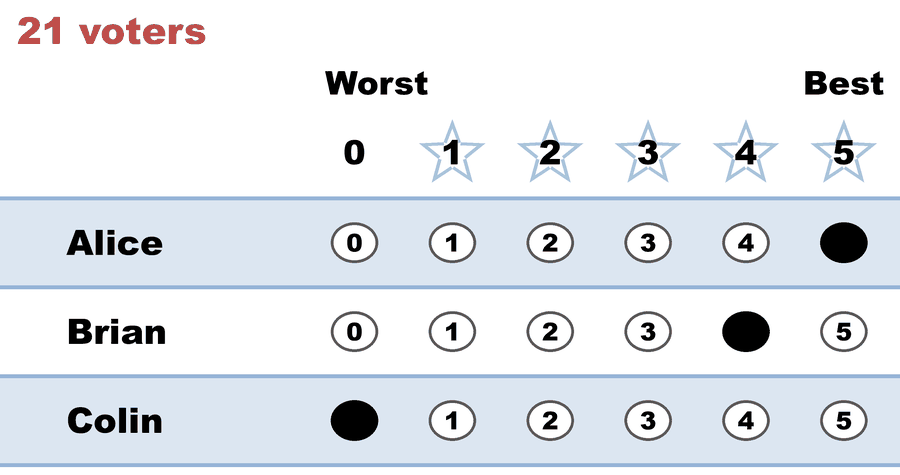
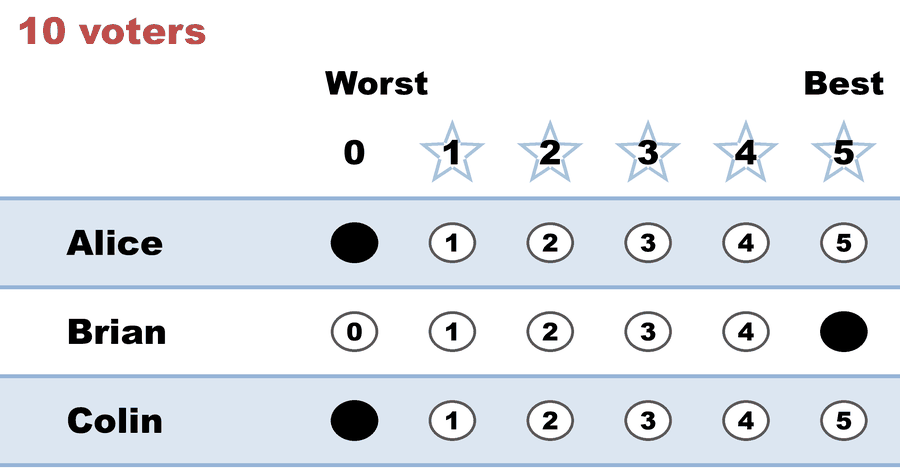
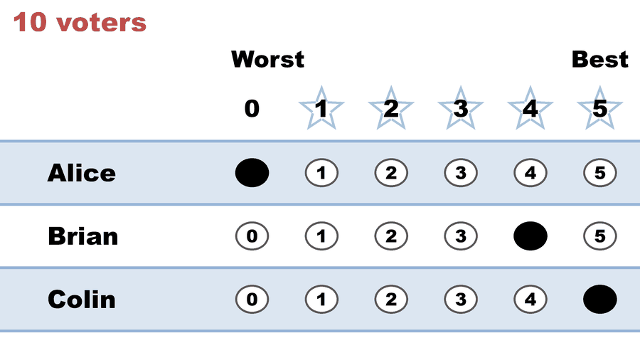

# The majority illusion, counted — CES's own example, run

**Level: 201 → 301 · for debaters**

**One line:** the Center for Election Science prints a three-candidate profile to argue that the Condorcet winner isn't always the best winner — and when you count it, the candidate it's arguing against turns out to hold an outright **absolute majority**, and **STAR elects her** while Score and Approval do not.

The article: [*The Majority Illusion: What Voting Methods Can and Cannot Do*](https://electionscience.org/research-hub/the-majority-illusion-what-voting-methods-can-and-cannot-do), Aaron Hamlin, Center for Election Science. Section-by-section claim-check: [The majority illusion, claim-checked](../../07_Concepts/topics/majority_criterion/the_majority_illusion_claim_checked.md). Companions: [the Majority Criterion](../../07_Concepts/topics/majority_criterion/README.md) · ["majority candidate" — five senses](../../07_Concepts/topics/majority_criterion/majority_and_minority_candidates.md) · [What makes a good winner?](../../07_Concepts/topics/what_makes_a_good_winner.md).

---

## The profile

The article gives it as 41,000 voters on a 0–10 utility scale. Scaled to 41 countable ballots on the repo's 0–5 STAR ballot, nothing about the structure moves:

| voters | article's utilities | on a 0–5 ballot | who they are |
|--:|---|---|---|
| 21 | Alice 10 > Brian 9 > Colin 0 | `5, 4, 0` | love Alice, warmly accept Brian |
| 10 | Brian 10 > Colin 0 > Alice 0 | `0, 5, 0` | Brian only |
| 10 | Colin 10 > Brian 9 > Alice 0 | `0, 4, 5` | love Colin, warmly accept Brian |

Everyone likes **Brian**. Nobody's second choice is anyone else. And 20 of the 41 score **Alice** at rock bottom.

<!-- ballots:majority_illusion_c3_b41_score_vs_star -->
The ballots as marked — the filled bubble is the score given, and the score is the number in its column:

| Ballot as marked | Voters | Alice | Brian | Colin |
|:--|:--:|:--:|:--:|:--:|
|  | 21 | 5 | 4 | 0 |
|  | 10 | 0 | 5 | 0 |
|  | 10 | 0 | 4 | 5 |
<!-- /ballots -->

## What each method does with it

| | Winner | Why |
|---|---|---|
| **Score / Range** | **Brian** | 174 to Alice's 105 — average 4.2 vs 2.6. The article's point |
| **Approval** (any threshold above 0) | **Brian** | 41 approvals to Alice's 21 |
| **Choose-One (plurality)** | **Alice** | 21 first choices of 41 |
| **RCV-IRV** | **Alice** | she has a first-round majority; there is no second round |
| **Ranked Robin / any Condorcet method** | **Alice** | beats Brian 21–20 and Colin 21–10 |
| **STAR** | **Alice** | Brian leads the scoring round; Alice wins the runoff **21–20** |

<!-- report:majority_illusion_c3_b41_score_vs_star -->
```text
[Divergence from STAR]
  STAR     = Alice
  Approval = Brian   (differs from STAR)

[Runoff Reversal]
 - Score Round Winner(s) = (Brian)
 - Runoff Round Winner   = (Alice)
  Candidate Brian earned the highest total score, but
  Candidate Alice won the automatic runoff — not a malfunction,
  STAR working as designed: the runoff elects the finalist preferred
  by the majority (of voters with a preference).

--- STAR Voting Method (single winner) ---

[STAR Voting]
 Tabulating 41 ballots.
Count × Alice,Brian,Colin
   21 ×     5,    4,    0
   10 ×     0,    5,    0
   10 ×     0,    4,    5

[STAR Voting: Scoring Round]
 The two highest-scoring candidates advance to the next round.
   Brian         -- 174 -- First place
   Alice         -- 105 -- Second place
   Colin         --  50
 Brian and Alice advance.

[STAR Voting: Automatic Runoff Round]
 The candidate preferred in the most head-to-head matchups wins.
   Alice         -- 21 -- First place
   Brian         -- 20
   Equal Support --  0
 Alice wins.
   Runoff math:
     41  ballots cast
   −  0  Equal Support (no preference between the two finalists)
     ──
     41  voters with a preference  (majority = 21)
           Alice 21 (51%)  ·  Brian 20 (49%)

[STAR Voting: Winner — STAR Voting Method (single winner)]
 Alice
```
<!-- /report -->

## The two things the article doesn't say about its own example

**1. Alice isn't just the Condorcet winner — she has an absolute majority.** Twenty-one of 41 voters, **51.2%**, score her strictly highest. The article introduces three senses of majority (plurality, absolute majority, Condorcet winner), correctly notes that the absolute-majority winner is the strongest of them, and then presents this profile under the heading "Condorcet Winner" without mentioning that it also contains one. That matters for what the example proves: it is not a demonstration that the *Condorcet criterion* can misfire, it is a demonstration that the ***majority criterion*** can — the strongest claim, and a considerably bolder one.

To be fair to the argument, this makes it *stronger*, not weaker. The article's thesis is that no sense of majority guarantees the best winner, and an absolute-majority example makes that case better than a Condorcet one. It's the labelling that's off, not the point.

**2. STAR doesn't follow Score here.** The article's conclusion is that "cardinal methods… target a different metric altogether." True of Score and Approval. Not true of STAR: the [automatic runoff](../../01_STAR/01_Learn/the_count/STAR_Automatic_Runoff.md) is a majority check, and on this profile it re-elects the majority's favorite by a single vote. A page arguing that cardinal methods trade majority for utility has, in its own example, a cardinal method that doesn't.

## The one-rival / two-rivals hinge, on this profile

Alice's majority gives exactly one rival a high-but-not-top score — Brian a 4, one below the max. That is precisely the situation Equal Vote's [Relaxed Majority Criterion](../../07_Concepts/topics/majority_criterion/README.md#the-relaxed-majority-criterion-equal-votes-answer) says a method must survive, and STAR does.

Change one number — the same 21 voters now give Colin a 3 as well, nothing about Alice moved — and it breaks ([the counterfactual case](cases/cases_pages/majority_illusion_c3_b41_two_rivals.md)):

| | Alice | Brian | Colin | finalists | winner |
|---|--:|--:|--:|---|---|
| **as published** (`5,4,0`) | 105 | 174 | 50 | Brian & **Alice** | **Alice** ✅ |
| **one score changed** (`5,4,3`) | 105 | 174 | **113** | Brian & Colin | **Brian** ❌ |

Alice's own total never changes. Her majority's generosity to a *second* rival lifts Colin past her, she never reaches the runoff, and the absolute-majority winner loses. That is STAR's [majority-criterion failure](../../07_Concepts/topics/majority_criterion/README.md) and its [Later-No-Harm](../../01_STAR/01_Learn/properties_and_limits/STAR_honest_limits.md) failure in one move — the same hinge as the [BV95a](../../01_STAR/03_Criteria/majority_criterion/bv95a_9m6rxr_favorite_survives_one_rival.md) / [BV95b](../../01_STAR/03_Criteria/majority_criterion/bv95b_7pdq3r_favorite_loses_two_rivals.md) pair, here on a profile the other camp chose.

**And STAR is genuinely the outlier in that second election.** Plurality, RCV-IRV and Ranked Robin all still elect Alice; only STAR doesn't. The engine says so itself in the divergence block, and this page isn't going to bury it — that is what the criterion failure *is*, and it is the honest price of the scoring round.

## The cases

| Case | The job | Winner | Source |
|---|---|---|---|
| [As published](cases/cases_pages/majority_illusion_c3_b41_score_vs_star.md) | the article's profile, faithfully | Alice (STAR) · Brian (Score/Approval) | [`yaml`](cases/majority_illusion_c3_b41_score_vs_star.yaml) |
| [One score changed](cases/cases_pages/majority_illusion_c3_b41_two_rivals.md) | the two-rivals counterfactual | Brian | [`yaml`](cases/majority_illusion_c3_b41_two_rivals.yaml) |

Both are **LH-only** — the second is a counterfactual nobody cast, and the pair is only meaningful together, so neither is reproduced on BetterVoting.

**Lean disclosure:** the Center for Election Science is Approval voting's advocacy organisation, and this article is arguing for cardinal methods. Per the repo's [sourcing tiers](../../CLAUDE.md) that makes it a fine source for *definitions* and a weak one for *verdicts* — which is exactly how it reads: the taxonomy in its first section is clean and genuinely useful, and the example under it is doing more work than its heading claims. The same recipe applied to the same organisation's academic paper: [Hamlin & Hua (2023), claim-checked](../../04_Approval/01_Learn/hamlin_hua_2023.md). Applied to the other camp: [FairVote's STAR white paper](../fairvote_star_whitepaper/README.md).
