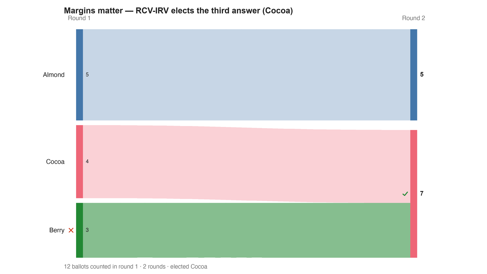

---
search:
  exclude: true
---

# Margins matter — RCV-IRV elects the third answer (Cocoa)

*Generated from [`margins_irv.yaml`](../margins_irv.yaml) — do not edit by hand. Regenerate: `python STARVote_LH_tabulation_engine/tools_adam/scripts/build_yaml_pages.py`.*

**Method:** [RCV-IRV (Instant Runoff)](../../../../06_Other/RCV_IRV/concepts/README.md) · **1 seat** · **Expected winner:** Cocoa

**▶ Live on BetterVoting:** [vote](https://bettervoting.com/kdjjkq) · **[results ↗](https://bettervoting.com/kdjjkq/results)** (election `kdjjkq` · test `BV2251`).

## Scenario

The same twelve gelato ballots, counted by instant runoff. First choices are Almond 5, Cocoa 4, Berry 3, so Berry — the BORDA winner and the margin-weighted Copeland winner — is eliminated FIRST. All three of Berry's ballots rank Cocoa next, so they transfer intact and Cocoa wins 7-5. This is the fourth distinct answer the same electorate produces: Plurality says Almond, RCV-IRV says Cocoa, Borda says Berry, and Copeland says nobody (a three-way tie). Not a center-squeeze case — there is no Condorcet winner for IRV to miss, because the pairwise contests form a cycle.

## Ballots

Each row is one voter's ranking, most-preferred first (`N:` prefix = N identical ballots).

```text
Almond>Berry>Cocoa
Almond>Berry>Cocoa
Almond>Berry>Cocoa
Almond>Berry>Cocoa
Almond>Berry>Cocoa
Berry>Cocoa>Almond
Berry>Cocoa>Almond
Berry>Cocoa>Almond
Cocoa>Almond>Berry
Cocoa>Almond>Berry
Cocoa>Berry>Almond
Cocoa>Berry>Almond
```

## What the engine says



*Where the votes went. Band thickness is votes; a band leaving an eliminated candidate lands on whoever that ballot ranked next, or on **inactive** if it ranked nobody who was left.*

The count, step by step — the rounds and how the winner is reached:

<!-- --8<-- [start:report] -->
```text
--- RCV / Instant-Runoff Voting (single winner) ---
  Margins matter — RCV-IRV elects the third answer (Cocoa)
 Tabulating 12 ballots (ranked ballots).

ROUND 1
Candidate      Votes  Status
-----------  -------  --------
Almond             5  Hopeful
Cocoa              4  Hopeful
Berry              3  Rejected

FINAL RESULT
Candidate      Votes  Status
-----------  -------  --------
Cocoa              7  Elected
Almond             5  Rejected
Berry              0  Rejected


Winner(s) — RCV / Instant-Runoff Voting (single winner)
  Cocoa

--- Transfers and inactive ballots (what the round tables leave out) ---
The tables above give each candidate's round total but not where a
transferred vote came FROM, nor how many ballots stopped counting.
Both are recomputed from the ballots, using the eliminations the
count above actually made.

ROUND 1 — 12 of 12 ballots still active; majority = 7
   Berry eliminated with 3:
      → Cocoa                     3

FINAL ROUND — 12 of 12 ballots still active; majority = 7
   Cocoa                     7  (58.3% of the still-active)  ← elected
   Almond                    5  (41.7% of the still-active)
   Never exhausted, never transferred:
      5 ballots held by Almond carried a lower ranking that was never read
      (the count stopped here, so those preferences did nothing).

Inactive ballots at the final round: 0 of 12 (0.0%).
   Cocoa's 7 is a majority of the 12 still active AND of all 12 cast (58.3%).
```
<!-- --8<-- [end:report] -->

### Full audit — preference matrix, Condorcet, and score distribution

```text
--- Smith Set (the generalized Condorcet winner) ---
The smallest group whose every member beats every candidate outside it —
the honest answer to "who is even in contention?".
   Smith set (3 of 3): Almond, Berry, Cocoa
   Outside (0):        —
   More than one member ⇒ NO Condorcet winner: the top of the tournament is a
   cycle, so the strongest "candidate" is a set, not a person. Which member of
   the set should win is exactly what Minimax / Ranked Pairs / Schulze disagree
   about — see 05_Ranked_Robin/01_Learn/cycle_resolution.md.
   RCV-IRV winner Cocoa is INSIDE the Smith set. ✓
      Not guaranteed — RCV-IRV is not Smith-efficient — but it holds here.
   More: 07_Concepts/topics/smith_set.md
```

Everything in one file: the [`_tabulated` mirror](../cases_tabulated/margins_irv_tabulated.txt) (regenerated on every run; every analysis forced on).

Run it yourself:

```bash
python STARVote_LH_tabulation_engine/starvote_larry_hastings.py method_comparisons/copeland_vs_borda_margins/cases/margins_irv.yaml
```

## See also

- [Center squeeze (topic hub)](../../../../07_Concepts/topics/center_squeeze/README.md)
- [Condorcet efficiency (topic hub)](../../../../07_Concepts/topics/condorcet/README.md)
- [Ties & tie-breaking (topic hub)](../../../../07_Concepts/topics/ties/README.md)
- [Runoff reversal (worked set)](../../../../01_STAR/02_Examples/runoff_overturns_leader/README.md)
- [Glossary](../../../../07_Concepts/GLOSSARY.md) · [all cases by method](../../../../07_Concepts/YAML_test_case_index/README.md)

More cases in this set: [margins_paper_exact_304](margins_paper_exact_304.md) · [margins_ranked_robin](margins_ranked_robin.md) · [margins_star](margins_star.md)
