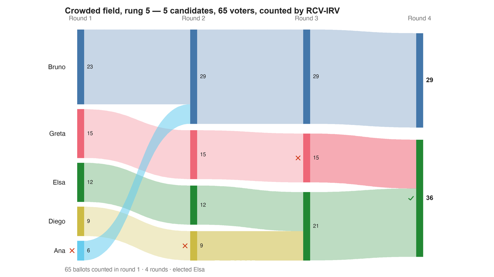

---
search:
  exclude: true
---

# Crowded field, rung 5 — 5 candidates, 65 voters, counted by RCV-IRV

*Generated from [`crowded_field_c5_irv.yaml`](../crowded_field_c5_irv.yaml) — do not edit by hand. Regenerate: `python STARVote_LH_tabulation_engine/tools_adam/scripts/build_yaml_pages.py`.*

**Method:** [RCV-IRV (Instant Runoff)](../../../../06_Other/RCV_IRV/concepts/README.md) · **1 seat** · **Expected winner:** Elsa

**Official tie-break (lot) order:** Ana > Bruno > Diego > Elsa > Greta — consulted only if every deterministic tiebreaker stays tied ([how the ladder works](../../../../01_STAR/01_Learn/Tie_Breaking_STAR/tie_breaking.md)).

## Scenario

RUNG 2 — the same voters, two more candidates, and both choose-one methods lose the
Condorcet winner.

Diego still beats all four rivals head-to-head (crowded_field_c5_ranked_robin.yaml
proves it). But first choices are what these methods count, and Bruno at 6 and Elsa at
14 now stand between Diego and the voters who previously had nobody closer. Diego drops
from 34 first choices to 9, is eliminated early, and the seat goes to Elsa.

Round 1 is also the Choose-One count, and it elects Bruno on 23 of 65 — a candidate
Diego beats head-to-head. Note what caused all of this: not one voter changing their
mind, only two more names on the ballot.

Same 65 voters and the same fixed candidate positions as crowded_field_c5_star.yaml,
on a ranked ballot — the same ballots as crowded_field_c5_ranked_robin.yaml, counted by
elimination instead of head-to-head.

Construction: build_ladder.py in this folder. 65 voters in seven blocs at 0, 4, 8, 12,
16, 20, 24 (sizes 6, 10, 13, 9, 12, 8, 7); candidates fixed at Ana 1 · Bruno 6 ·
Clara 9 · Diego 11 · Elsa 14 · Felix 16 · Greta 22; utility = minus distance; scores =
each bloc's own min-max scaling onto 0–5. Nothing is tuned, and no count at any rung is
settled by a tie-break.

## Ballots

Each row is one voter's ranking, most-preferred first (`N:` prefix = N identical ballots).

```text
6:Ana>Bruno>Diego>Elsa>Greta    # bloc at 0
10:Bruno>Ana>Diego>Elsa>Greta    # bloc at 4
13:Bruno>Diego>Elsa>Ana>Greta    # bloc at 8
9:Diego>Elsa>Bruno>Greta>Ana    # bloc at 12
12:Elsa>Diego>Greta>Bruno>Ana    # bloc at 16
8:Greta>Elsa>Diego>Bruno>Ana    # bloc at 20
7:Greta>Elsa>Diego>Bruno>Ana    # bloc at 24
```

## What the engine says



*Where the votes went. Band thickness is votes; a band leaving an eliminated candidate lands on whoever that ballot ranked next, or on **inactive** if it ranked nobody who was left.*

The count, step by step — the rounds and how the winner is reached:

<!-- --8<-- [start:report] -->
```text
--- RCV / Instant-Runoff Voting (single winner) ---
  Crowded field, rung 5 — 5 candidates, 65 voters, counted by RCV-IRV
 Tabulating 65 ballots (ranked ballots).

ROUND 1
Candidate      Votes  Status
-----------  -------  --------
Bruno             23  Hopeful
Greta             15  Hopeful
Elsa              12  Hopeful
Diego              9  Hopeful
Ana                6  Rejected

ROUND 2
Candidate      Votes  Status
-----------  -------  --------
Bruno             29  Hopeful
Greta             15  Hopeful
Elsa              12  Hopeful
Diego              9  Rejected
Ana                0  Rejected

ROUND 3
Candidate      Votes  Status
-----------  -------  --------
Bruno             29  Hopeful
Elsa              21  Hopeful
Greta             15  Rejected
Diego              0  Rejected
Ana                0  Rejected

FINAL RESULT
Candidate      Votes  Status
-----------  -------  --------
Elsa              36  Elected
Bruno             29  Rejected
Greta              0  Rejected
Diego              0  Rejected
Ana                0  Rejected


Winner(s) — RCV / Instant-Runoff Voting (single winner)
  Elsa

--- Transfers and inactive ballots (what the round tables leave out) ---
The tables above give each candidate's round total but not where a
transferred vote came FROM, nor how many ballots stopped counting.
Both are recomputed from the ballots, using the eliminations the
count above actually made.

ROUND 1 — 65 of 65 ballots still active; majority = 33
   Ana eliminated with 6:
      → Bruno                     6

ROUND 2 — 65 of 65 ballots still active; majority = 33
   Diego eliminated with 9:
      → Elsa                      9

ROUND 3 — 65 of 65 ballots still active; majority = 33
   Greta eliminated with 15:
      → Elsa                     15

FINAL ROUND — 65 of 65 ballots still active; majority = 33
   Elsa                     36  (55.4% of the still-active)  ← elected
   Bruno                    29  (44.6% of the still-active)
   Never exhausted, never transferred:
      29 ballots held by Bruno carried a lower ranking that was never read
      (the count stopped here, so those preferences did nothing).

Inactive ballots at the final round: 0 of 65 (0.0%).
   Elsa's 36 is a majority of the 65 still active AND of all 65 cast (55.4%).
```
<!-- --8<-- [end:report] -->

### Full audit — preference matrix, Condorcet, and score distribution

```text
--- Smith Set (the generalized Condorcet winner) ---
The smallest group whose every member beats every candidate outside it —
the honest answer to "who is even in contention?".
   Smith set (1 of 5): Diego
   Outside (4):        Ana, Bruno, Elsa, Greta
   One member ⇒ Diego is the Condorcet winner, beating every rival head-to-head.
   RCV-IRV winner Elsa is OUTSIDE the Smith set. ✗
      Every member of the set (Diego) beats Elsa head-to-head, yet
      RCV-IRV elected Elsa anyway. RCV-IRV is not Smith-efficient (nor
      Condorcet-efficient) — this is the shape a center squeeze leaves behind.
   More: 07_Concepts/topics/smith_set.md
```

Everything in one file: the [`_tabulated` mirror](../cases_tabulated/crowded_field_c5_irv_tabulated.txt) (regenerated on every run; every analysis forced on).

Run it yourself:

```bash
python STARVote_LH_tabulation_engine/starvote_larry_hastings.py method_comparisons/crowded_field/cases/crowded_field_c5_irv.yaml
```

## See also

- [Condorcet efficiency (topic hub)](../../../../07_Concepts/topics/condorcet/README.md)
- [Ties & tie-breaking (topic hub)](../../../../07_Concepts/topics/ties/README.md)
- [The tie-breaking ladder (full chain)](../../../../01_STAR/01_Learn/Tie_Breaking_STAR/tie_breaking.md)
- [Glossary](../../../../07_Concepts/GLOSSARY.md) · [all cases by method](../../../../07_Concepts/YAML_test_case_index/README.md)

More cases in this set: [crowded_field_c3_approval](crowded_field_c3_approval.md) · [crowded_field_c3_irv](crowded_field_c3_irv.md) · [crowded_field_c3_ranked_robin](crowded_field_c3_ranked_robin.md) · [crowded_field_c3_star](crowded_field_c3_star.md) · [crowded_field_c5_approval](crowded_field_c5_approval.md) · [crowded_field_c5_ranked_robin](crowded_field_c5_ranked_robin.md) · [crowded_field_c5_star](crowded_field_c5_star.md) · [crowded_field_c7_approval](crowded_field_c7_approval.md) · [crowded_field_c7_irv](crowded_field_c7_irv.md) · [crowded_field_c7_ranked_robin](crowded_field_c7_ranked_robin.md) · [crowded_field_c7_star](crowded_field_c7_star.md)
