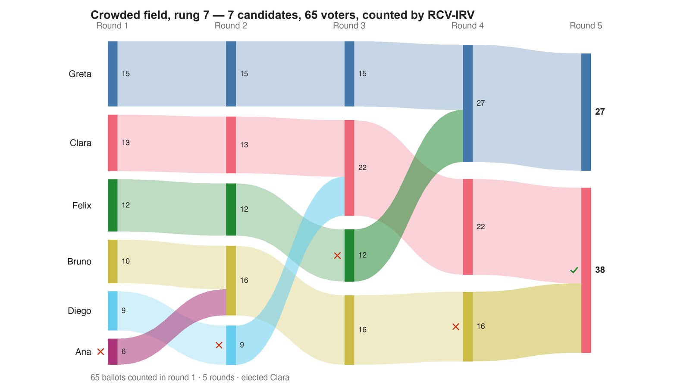

---
search:
  exclude: true
---

# Crowded field, rung 7 — 7 candidates, 65 voters, counted by RCV-IRV

*Generated from [`crowded_field_c7_irv.yaml`](../crowded_field_c7_irv.yaml) — do not edit by hand. Regenerate: `python STARVote_LH_tabulation_engine/tools_adam/scripts/build_yaml_pages.py`.*

**Method:** [RCV-IRV (Instant Runoff)](../../../../06_Other/RCV_IRV/concepts/README.md) · **1 seat** · **Expected winner:** Clara

**Official tie-break (lot) order:** Ana > Bruno > Clara > Diego > Elsa > Felix > Greta — consulted only if every deterministic tiebreaker stays tied ([how the ladder works](../../../../01_STAR/01_Learn/Tie_Breaking_STAR/tie_breaking.md)).

## Scenario

RUNG 3 — seven candidates, and Diego is down to 9 first choices out of 65 while
still beating all six rivals head-to-head.

He is eliminated; RCV-IRV elects Clara. Round 1 doubles as the Choose-One count, which
elects Greta on 15 — the candidate standing furthest from the middle of the electorate,
and one Diego beats 50–15 one-on-one.

Counted here on the ranked ballots, deliberately. At seven candidates the 0–5 ballot in
crowded_field_c7_star.yaml carries ties on most rows, so reading IRV or Choose-One off
it — as that file's divergence block is forced to — measures the score-to-rank
tie-break rather than the method. These are the numbers to quote.

Same 65 voters and the same fixed candidate positions as crowded_field_c7_star.yaml,
on a ranked ballot — the same ballots as crowded_field_c7_ranked_robin.yaml, counted by
elimination instead of head-to-head.

Construction: build_ladder.py in this folder. 65 voters in seven blocs at 0, 4, 8, 12,
16, 20, 24 (sizes 6, 10, 13, 9, 12, 8, 7); candidates fixed at Ana 1 · Bruno 6 ·
Clara 9 · Diego 11 · Elsa 14 · Felix 16 · Greta 22; utility = minus distance; scores =
each bloc's own min-max scaling onto 0–5. Nothing is tuned, and no count at any rung is
settled by a tie-break.

## Ballots

Each row is one voter's ranking, most-preferred first (`N:` prefix = N identical ballots).

```text
6:Ana>Bruno>Clara>Diego>Elsa>Felix>Greta    # bloc at 0
10:Bruno>Ana>Clara>Diego>Elsa>Felix>Greta    # bloc at 4
13:Clara>Bruno>Diego>Elsa>Ana>Felix>Greta    # bloc at 8
9:Diego>Elsa>Clara>Felix>Bruno>Greta>Ana    # bloc at 12
12:Felix>Elsa>Diego>Greta>Clara>Bruno>Ana    # bloc at 16
8:Greta>Felix>Elsa>Diego>Clara>Bruno>Ana    # bloc at 20
7:Greta>Felix>Elsa>Diego>Clara>Bruno>Ana    # bloc at 24
```

## What the engine says



*Where the votes went. Band thickness is votes; a band leaving an eliminated candidate lands on whoever that ballot ranked next, or on **inactive** if it ranked nobody who was left.*

The count, step by step — the rounds and how the winner is reached:

<!-- --8<-- [start:report] -->
```text
--- RCV / Instant-Runoff Voting (single winner) ---
  Crowded field, rung 7 — 7 candidates, 65 voters, counted by RCV-IRV
 Tabulating 65 ballots (ranked ballots).

ROUND 1
Candidate      Votes  Status
-----------  -------  --------
Greta             15  Hopeful
Clara             13  Hopeful
Felix             12  Hopeful
Bruno             10  Hopeful
Diego              9  Hopeful
Ana                6  Rejected
Elsa               0  Rejected

ROUND 2
Candidate      Votes  Status
-----------  -------  --------
Bruno             16  Hopeful
Greta             15  Hopeful
Clara             13  Hopeful
Felix             12  Hopeful
Diego              9  Rejected
Ana                0  Rejected
Elsa               0  Rejected

ROUND 3
Candidate      Votes  Status
-----------  -------  --------
Clara             22  Hopeful
Bruno             16  Hopeful
Greta             15  Hopeful
Felix             12  Rejected
Diego              0  Rejected
Ana                0  Rejected
Elsa               0  Rejected

ROUND 4
Candidate      Votes  Status
-----------  -------  --------
Greta             27  Hopeful
Clara             22  Hopeful
Bruno             16  Rejected
Felix              0  Rejected
Diego              0  Rejected
Ana                0  Rejected
Elsa               0  Rejected

FINAL RESULT
Candidate      Votes  Status
-----------  -------  --------
Clara             38  Elected
Greta             27  Rejected
Bruno              0  Rejected
Felix              0  Rejected
Diego              0  Rejected
Ana                0  Rejected
Elsa               0  Rejected


Winner(s) — RCV / Instant-Runoff Voting (single winner)
  Clara

--- Transfers and inactive ballots (what the round tables leave out) ---
The tables above give each candidate's round total but not where a
transferred vote came FROM, nor how many ballots stopped counting.
Both are recomputed from the ballots, using the eliminations the
count above actually made.

ROUND 1 — 65 of 65 ballots still active; majority = 33
   Elsa eliminated with 0:
      → (held no ballots)
   Ana eliminated with 6:
      → Bruno                     6

ROUND 2 — 65 of 65 ballots still active; majority = 33
   Diego eliminated with 9:
      → Clara                     9

ROUND 3 — 65 of 65 ballots still active; majority = 33
   Felix eliminated with 12:
      → Greta                    12

ROUND 4 — 65 of 65 ballots still active; majority = 33
   Bruno eliminated with 16:
      → Clara                    16

FINAL ROUND — 65 of 65 ballots still active; majority = 33
   Clara                    38  (58.5% of the still-active)  ← elected
   Greta                    27  (41.5% of the still-active)
   Never exhausted, never transferred:
      27 ballots held by Greta carried a lower ranking that was never read
      (the count stopped here, so those preferences did nothing).

Inactive ballots at the final round: 0 of 65 (0.0%).
   Clara's 38 is a majority of the 65 still active AND of all 65 cast (58.5%).
```
<!-- --8<-- [end:report] -->

### Full audit — preference matrix, Condorcet, and score distribution

```text
--- Smith Set (the generalized Condorcet winner) ---
The smallest group whose every member beats every candidate outside it —
the honest answer to "who is even in contention?".
   Smith set (1 of 7): Diego
   Outside (6):        Ana, Bruno, Clara, Elsa, Felix, Greta
   One member ⇒ Diego is the Condorcet winner, beating every rival head-to-head.
   RCV-IRV winner Clara is OUTSIDE the Smith set. ✗
      Every member of the set (Diego) beats Clara head-to-head, yet
      RCV-IRV elected Clara anyway. RCV-IRV is not Smith-efficient (nor
      Condorcet-efficient) — this is the shape a center squeeze leaves behind.
   More: 07_Concepts/topics/smith_set.md
```

Everything in one file: the [`_tabulated` mirror](../cases_tabulated/crowded_field_c7_irv_tabulated.txt) (regenerated on every run; every analysis forced on).

Run it yourself:

```bash
python STARVote_LH_tabulation_engine/starvote_larry_hastings.py method_comparisons/crowded_field/cases/crowded_field_c7_irv.yaml
```

## See also

- [Ties & tie-breaking (topic hub)](../../../../07_Concepts/topics/ties/README.md)
- [The tie-breaking ladder (full chain)](../../../../01_STAR/01_Learn/Tie_Breaking_STAR/tie_breaking.md)
- [Glossary](../../../../07_Concepts/GLOSSARY.md) · [all cases by method](../../../../07_Concepts/YAML_test_case_index/README.md)

More cases in this set: [crowded_field_c3_approval](crowded_field_c3_approval.md) · [crowded_field_c3_irv](crowded_field_c3_irv.md) · [crowded_field_c3_ranked_robin](crowded_field_c3_ranked_robin.md) · [crowded_field_c3_star](crowded_field_c3_star.md) · [crowded_field_c5_approval](crowded_field_c5_approval.md) · [crowded_field_c5_irv](crowded_field_c5_irv.md) · [crowded_field_c5_ranked_robin](crowded_field_c5_ranked_robin.md) · [crowded_field_c5_star](crowded_field_c5_star.md) · [crowded_field_c7_approval](crowded_field_c7_approval.md) · [crowded_field_c7_ranked_robin](crowded_field_c7_ranked_robin.md) · [crowded_field_c7_star](crowded_field_c7_star.md)
