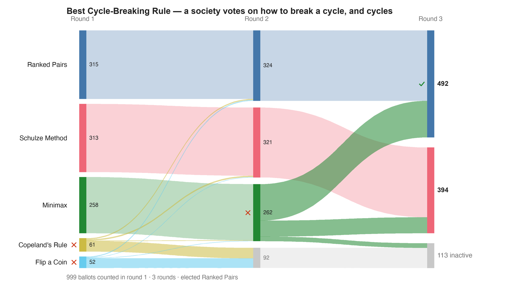

---
search:
  exclude: true
---

# Best Cycle-Breaking Rule — a society votes on how to break a cycle, and cycles

*Generated from [`cycle_vote_on_the_rule_irv_c5_b999.yaml`](../cycle_vote_on_the_rule_irv_c5_b999.yaml) — do not edit by hand. Regenerate: `python STARVote_LH_tabulation_engine/tools_adam/scripts/build_yaml_pages.py`.*

**Method:** [RCV-IRV (Instant Runoff)](../../../../06_Other/RCV_IRV/concepts/README.md) · **1 seat** · **Expected winner:** Ranked Pairs

## Scenario

Reproduced from the "Best Cycle-Breaking Rule" sample election published by
RCV Lab (rcv-lab.org), converted from its downloadable cast vote record so
this library counts it independently rather than quoting it. 999 ballots,
five candidates — and the candidates ARE the rules for resolving a Condorcet
cycle: Ranked Pairs, the Schulze Method, Minimax, Copeland's Rule, and Flip a
Coin.

It is synthetic, and says so: the source config is stamped "RCV Lab
synthetic", dated 2026-07-30, from "The Condorcet Paradox Society". It is a
built demonstration, not an election anyone held. The ballots are real data
in the sense that matters here — a fixed CVR anyone can download and re-count
— but nobody's actual preferences are in them.

The joke is that the ballots cycle. The society convened to choose a
completion rule and produced exactly the situation a completion rule exists
to resolve. Companion file cycle_vote_on_the_rule_rr_c5_b999.yaml counts the
same ballots as Ranked Robin and shows the cycle head-on; this file is the
RCV-IRV count, and exists to prove the reproduction is faithful.

WHY IT EARNS 999 BALLOTS. This library keeps examples small on purpose, and a
hand-built cycle needs 21 voters, not a thousand. This one is not hand-built:
it is an outside engine's published sample, and the whole point is that our
count and theirs agree ballot-for-ballot. Shrinking it would forfeit that.

THREE THINGS IT TEACHES:

1. A MAJORITY OF THE SURVIVORS IS NOT A MAJORITY OF THE VOTERS. Ranked Pairs
   wins the final round 492 to 394. That is a comfortable majority of the 886
   ballots still live — and 49.2% of the 999 people who voted. 113 ballots
   ranked nobody still standing and stopped counting.

2. THE CYCLE IS INVISIBLE IN THE ROUNDS. Nothing in the elimination report
   hints that majority preference is knotted. You have to run the pairwise
   table (the companion RR file) to find out there is no Condorcet winner at
   all. An IRV report is not silent about the cycle because anything is being
   hidden — it simply never asks the question.

3. ROUND COUNT IS A REPORTING CHOICE, NOT A RESULT. RCV Lab reports FOUR
   rounds, eliminating Flip a Coin and then Copeland's Rule one at a time.
   This engine reports THREE, because 52 + 61 = 113 is less than Minimax's
   258 and neither candidate can catch up — so it clears both in one step.
   Every tally that appears in both reports is identical. Two engines, two
   round numberings, one election.

Verified against the source's own published report: first choices 315 / 313 /
258 / 61 / 52, the three-way round at 324 / 321 / 262 with 92 exhausted, and
the final 492 / 394 with 113 exhausted, all match. Our independently computed
pairwise matrix also reproduces theirs cell for cell.

## Ballots

Each row is one voter's ranking, most-preferred first (`N:` prefix = N identical ballots).

```text
82:Ranked Pairs>Schulze Method
70:Schulze Method>Minimax
65:Minimax>Ranked Pairs
56:Ranked Pairs>Schulze Method>Minimax>Copeland's Rule
49:Schulze Method>Minimax>Ranked Pairs>Copeland's Rule
45:Schulze Method>Minimax>Ranked Pairs
44:Copeland's Rule>Flip a Coin
44:Minimax>Ranked Pairs>Schulze Method>Copeland's Rule
42:Ranked Pairs>Schulze Method>Minimax
41:Flip a Coin>Copeland's Rule
39:Schulze Method>Ranked Pairs
34:Ranked Pairs>Minimax
30:Minimax>Schulze Method>Ranked Pairs>Copeland's Rule
27:Minimax>Ranked Pairs>Schulze Method
23:Schulze Method>Ranked Pairs>Minimax>Copeland's Rule
21:Minimax>Schulze Method
20:Ranked Pairs>Minimax>Schulze Method
19:Schulze Method
18:Ranked Pairs>Minimax>Schulze Method>Copeland's Rule
18:Schulze Method>Ranked Pairs>Minimax
16:Minimax>Schulze Method>Ranked Pairs
16:Ranked Pairs
14:Minimax
12:Ranked Pairs>Schulze Method>Copeland's Rule>Minimax
12:Schulze Method>Minimax>Copeland's Rule>Ranked Pairs
11:Minimax>Ranked Pairs>Copeland's Rule>Schulze Method
11:Ranked Pairs>Schulze Method>Minimax>Copeland's Rule>Flip a Coin
9:Minimax>Ranked Pairs>Schulze Method>Copeland's Rule>Flip a Coin
9:Schulze Method>Minimax>Copeland's Rule
9:Schulze Method>Minimax>Ranked Pairs>Copeland's Rule>Flip a Coin
8:Ranked Pairs>Schulze Method>Copeland's Rule
7:Minimax>Ranked Pairs>Copeland's Rule
6:Schulze Method>Ranked Pairs>Minimax>Copeland's Rule>Flip a Coin
5:Minimax>Schulze Method>Ranked Pairs>Copeland's Rule>Flip a Coin
5:Ranked Pairs>Minimax>Schulze Method>Copeland's Rule>Flip a Coin
4:Copeland's Rule
4:Flip a Coin>Copeland's Rule>Ranked Pairs
4:Ranked Pairs>Copeland's Rule>Schulze Method
4:Schulze Method>Copeland's Rule>Minimax>Ranked Pairs
3:Copeland's Rule>Flip a Coin>Ranked Pairs
3:Copeland's Rule>Flip a Coin>Schulze Method
3:Flip a Coin
3:Minimax>Copeland's Rule
3:Schulze Method>Copeland's Rule
2:Copeland's Rule>Schulze Method>Minimax>Ranked Pairs
2:Flip a Coin>Copeland's Rule>Minimax
2:Flip a Coin>Copeland's Rule>Schulze Method
2:Minimax>Copeland's Rule>Ranked Pairs>Schulze Method
2:Minimax>Ranked Pairs>Copeland's Rule>Schulze Method>Flip a Coin
2:Ranked Pairs>Copeland's Rule>Schulze Method>Minimax
2:Ranked Pairs>Schulze Method>Copeland's Rule>Minimax>Flip a Coin
2:Schulze Method>Copeland's Rule>Minimax
2:Schulze Method>Minimax>Copeland's Rule>Ranked Pairs>Flip a Coin
2:Schulze Method>Ranked Pairs>Copeland's Rule
1:Copeland's Rule>Flip a Coin>Minimax
1:Copeland's Rule>Minimax
1:Copeland's Rule>Ranked Pairs>Schulze Method
1:Copeland's Rule>Ranked Pairs>Schulze Method>Minimax
1:Copeland's Rule>Schulze Method
1:Minimax>Copeland's Rule>Ranked Pairs>Schulze Method>Flip a Coin
1:Minimax>Schulze Method>Copeland's Rule
1:Ranked Pairs>Copeland's Rule
1:Ranked Pairs>Minimax>Copeland's Rule
1:Ranked Pairs>Minimax>Copeland's Rule>Schulze Method>Flip a Coin
1:Schulze Method>Ranked Pairs>Copeland's Rule>Minimax
```

## What the engine says



*Where the votes went. Band thickness is votes; a band leaving an eliminated candidate lands on whoever that ballot ranked next, or on **inactive** if it ranked nobody who was left.*

The count, step by step — the rounds and how the winner is reached:

<!-- --8<-- [start:report] -->
```text
--- RCV / Instant-Runoff Voting (single winner) ---
  Best Cycle-Breaking Rule — a society votes on how to break a cycle, and cycles
 Tabulating 999 ballots (ranked ballots).

ROUND 1
Candidate          Votes  Status
---------------  -------  --------
Ranked Pairs         315  Hopeful
Schulze Method       313  Hopeful
Minimax              258  Hopeful
Copeland's Rule       61  Rejected
Flip a Coin           52  Rejected

ROUND 2
Candidate          Votes  Status
---------------  -------  --------
Ranked Pairs         324  Hopeful
Schulze Method       321  Hopeful
Minimax              262  Rejected
Copeland's Rule        0  Rejected
Flip a Coin            0  Rejected
Blank Votes           92  Rejected

FINAL RESULT
Candidate          Votes  Status
---------------  -------  --------
Ranked Pairs         492  Elected
Schulze Method       394  Rejected
Minimax                0  Rejected
Copeland's Rule        0  Rejected
Flip a Coin            0  Rejected
Blank Votes          113  Rejected


Winner(s) — RCV / Instant-Runoff Voting (single winner)
  Ranked Pairs
```
<!-- --8<-- [end:report] -->

### Full audit — preference matrix, Condorcet, and score distribution

```text
--- Smith Set (the generalized Condorcet winner) ---
The smallest group whose every member beats every candidate outside it —
the honest answer to "who is even in contention?".
   Smith set (3 of 5): Ranked Pairs, Schulze Method, Minimax
   Outside (2):        Copeland's Rule, Flip a Coin
   More than one member ⇒ NO Condorcet winner: the top of the tournament is a
   cycle, so the strongest "candidate" is a set, not a person. Which member of
   the set should win is exactly what Minimax / Ranked Pairs / Schulze disagree
   about — see 05_Ranked_Robin/01_Learn/cycle_resolution.md.
   RCV-IRV winner Ranked Pairs is INSIDE the Smith set. ✓
      Not guaranteed — RCV-IRV is not Smith-efficient — but it holds here.
   More: 07_Concepts/topics/smith_set.md
```

Everything in one file: the [`_tabulated` mirror](../cases_tabulated/cycle_vote_on_the_rule_irv_c5_b999_tabulated.txt) (regenerated on every run; every analysis forced on).

Run it yourself:

```bash
python STARVote_LH_tabulation_engine/starvote_larry_hastings.py method_comparisons/cycle_resolution/cases/cycle_vote_on_the_rule_irv_c5_b999.yaml
```

## See also

- [Condorcet efficiency (topic hub)](../../../../07_Concepts/topics/condorcet/README.md)
- [Exhausted ballots (conversation)](../../../../06_Other/RCV_IRV/concepts/exhausted_ballots_301.md)
- [Glossary](../../../../07_Concepts/GLOSSARY.md) · [all cases by method](../../../../07_Concepts/YAML_test_case_index/README.md)

More cases in this set: [cycle_copeland_ties_c4_b21](cycle_copeland_ties_c4_b21.md) · [cycle_family_splits_c5_b77](cycle_family_splits_c5_b77.md) · [cycle_schulze_vs_ranked_pairs_c4_b40](cycle_schulze_vs_ranked_pairs_c4_b40.md) · [cycle_vote_on_the_rule_rr_c5_b999](cycle_vote_on_the_rule_rr_c5_b999.md)
