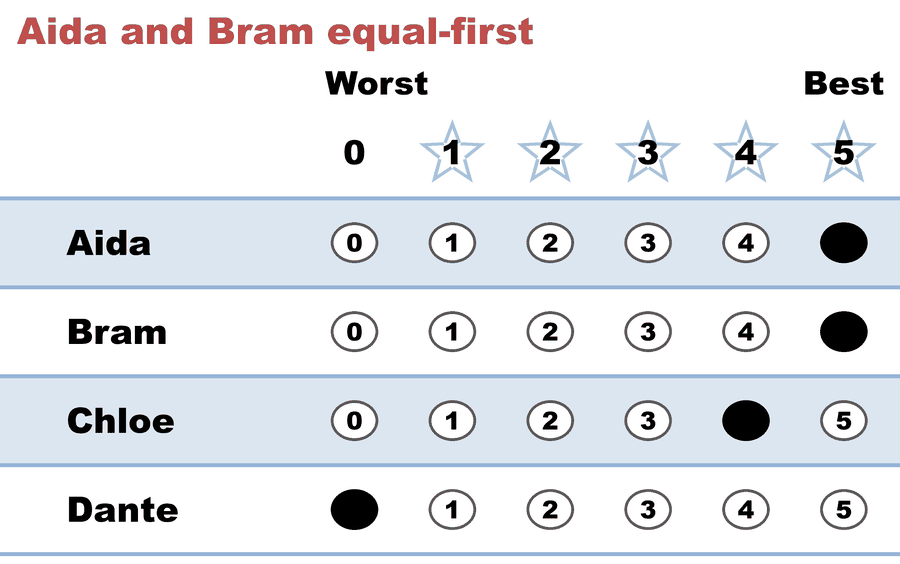
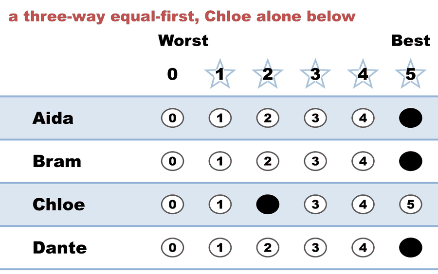
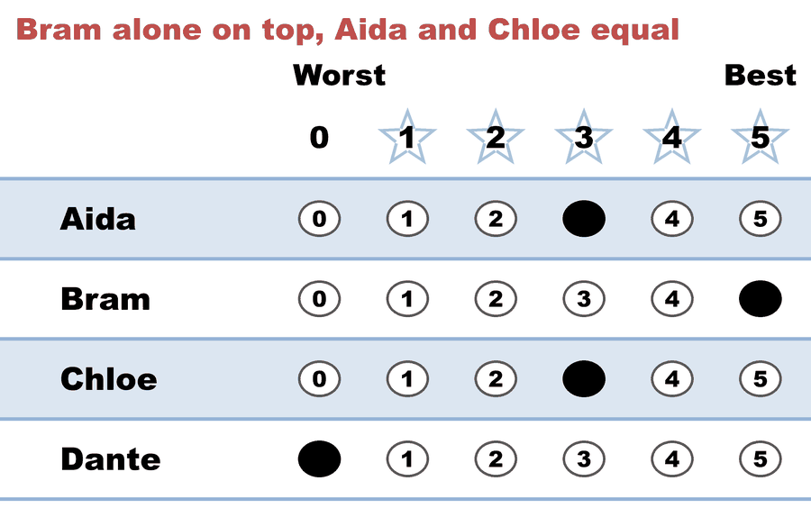
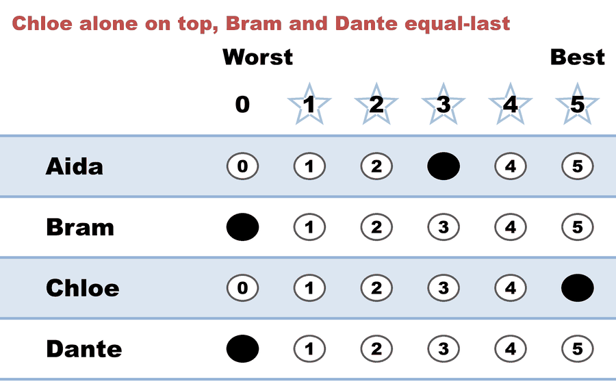
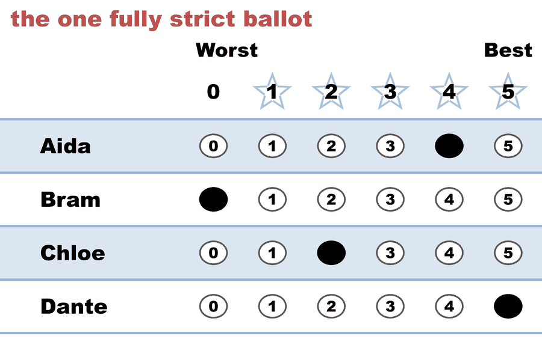

---
search:
  exclude: true
---

# Equal ranks — five voters, and the two generalizations of IRV disagree

*Generated from [`equal_rank_five_voters.yaml`](../equal_rank_five_voters.yaml) — do not edit by hand. Regenerate: `python STARVote_LH_tabulation_engine/tools_adam/scripts/build_yaml_pages.py`.*

**Method:** [STAR (single winner)](../../../../01_STAR/01_Learn/README.md) · **1 seat** · **Expected winner:** Aida

## Scenario

Figure 3 of Théo Delemazure & Dominik Peters, "Generalizing Instant Runoff Voting to Allow Indifferences" (EC'24, arXiv:2404.11407) — the paper's opening worked example, and the smallest election in this repo on which the two ways of extending instant runoff to equal ranks pick different winners.
Five voters, four candidates, individual ballots. Read as a weak order the profile is: Aida=Bram > Chloe > Dante; Aida=Bram=Dante > Chloe; Bram > Aida=Chloe > Dante; Chloe > Aida > Bram=Dante; Dante > Aida > Chloe > Bram.
Approval-IRV gives one full point to EACH candidate in a ballot's top surviving class: Chloe is top on one ballot only, so she goes first; then Dante; then Aida beats Bram head-to-head. Aida wins. Split-IRV splits one point among a ballot's top choices instead, which costs Aida the two ballots she shares — she scores 1/2 + 1/3 and is eliminated FIRST — and Bram wins. Same five ballots, opposite answers, and the only difference is what a tie is worth.
STAR elects Aida, agreeing with Approval-IRV and with the pairwise count (Aida is the Condorcet winner). That agreement is not an accident of the scores chosen: across 20,000 random strictly-decreasing 0-5 encodings of this weak order, STAR elects Aida in 92.9% and never elects Bram outright.
The scores below are one reading of the paper's ordinal profile; the induced weak order is exactly the paper's Figure 3. For the Approval-IRV and Split-IRV counts run tools_adam/pref_voting_tabulation_engine/approval_irv_report.py.

## Ballots

The ballots as marked — the filled bubble is the score given, and the score is the number in its column:

| # | Ballot as marked | Aida | Bram | Chloe | Dante |
|:--:|:--|:--:|:--:|:--:|:--:|
| 1 |  | 5 | 5 | 4 | 0 |
| 2 |  | 5 | 5 | 2 | 5 |
| 3 |  | 3 | 5 | 3 | 0 |
| 4 |  | 3 | 0 | 5 | 0 |
| 5 |  | 4 | 0 | 2 | 5 |

The same ballots as the file records them:

Row 1 = candidate names; each later row is one voter's 0–5 scores (a `N ×` prefix = N identical ballots).

```text
Aida,Bram,Chloe,Dante
5,5,4,0    # Aida and Bram equal-first
5,5,2,5    # a three-way equal-first, Chloe alone below
3,5,3,0    # Bram alone on top, Aida and Chloe equal
3,0,5,0    # Chloe alone on top, Bram and Dante equal-last
4,0,2,5    # the one fully strict ballot
```

## What the engine says

The count, step by step — the rounds and how the winner is reached:

<!-- --8<-- [start:report] -->
```text
--- STAR Voting Method (single winner) ---

[STAR Voting]
 Tabulating 5 ballots.
Aida,Bram,Chloe,Dante
   5,   5,    4,    0
   5,   5,    2,    5
   3,   5,    3,    0
   3,   0,    5,    0
   4,   0,    2,    5

[STAR Voting: Scoring Round]
 The two highest-scoring candidates advance to the next round.
   Aida          -- 20 -- First place
   Chloe         -- 16 -- Second place
   Bram          -- 15
   Dante         -- 10
 Aida and Chloe advance.

[STAR Voting: Automatic Runoff Round]
 The candidate preferred in the most head-to-head matchups wins.
   Aida          -- 3 -- First place
   Chloe         -- 1
   Equal Support -- 1
 Aida wins.
   Runoff math:
     5  ballots cast
   − 1  Equal Support (no preference between the two finalists)
     ─
     4  voters with a preference  (majority = 3)
           Aida 3 (75%)  ·  Chloe 1 (25%)

[STAR Voting: Winner — STAR Voting Method (single winner)]
 Aida
```
<!-- --8<-- [end:report] -->

### Full audit — preference matrix, Condorcet, and score distribution

```text
--- Runoff (Preference) Matrix ---
Head-to-head / pairwise comparison
Legend: For - Equal Support - Against
        * indicates Top 2 Finalist
               |   * Aida   |    Bram   | * Chloe   |   Dante   |
-----------------------------------------------------------------
      * Aida > |    ---     |2 - 2 - 1  |3 - 1 - 1  |3 - 1 - 1  |
        Bram > | 1 - 2 - 2  |   ---     |3 - 0 - 2  |2 - 2 - 1  |
     * Chloe > | 1 - 1 - 3  |2 - 0 - 3  |   ---     |3 - 0 - 2  |
       Dante > | 1 - 1 - 3  |1 - 2 - 2  |2 - 0 - 3  |   ---     |

[Condorcet Winner]
  Condorcet Winner: Aida — matches the STAR winner

[Condorcet Loser]
  Condorcet Loser: Dante — loses every head-to-head matchup

[Score Distribution] (how many ballots gave each star rating)
                Score
Candidate  5  4  3  2  1  0  | Total   Avg
Aida       2  1  2  0  0  0  |    20   4.0
Bram       3  0  0  0  0  2  |    15   3.0
Chloe      1  1  1  2  0  0  |    16   3.2
Dante      2  0  0  0  0  3  |    10   2.0
```

Everything in one file: the [`_tabulated` mirror](../cases_tabulated/equal_rank_five_voters_tabulated.txt) (regenerated on every run; every analysis forced on).

Run it yourself:

```bash
python STARVote_LH_tabulation_engine/starvote_larry_hastings.py method_comparisons/equal_rank_irv/cases/equal_rank_five_voters.yaml
```

## See also

- [Condorcet efficiency (topic hub)](../../../../07_Concepts/topics/condorcet/README.md)
- [Ties & tie-breaking (topic hub)](../../../../07_Concepts/topics/ties/README.md)
- [Vote splitting (worked set)](../../../split_voting/README.md)
- [Runoff reversal (worked set)](../../../../01_STAR/02_Examples/runoff_overturns_leader/README.md)
- [Glossary](../../../../07_Concepts/GLOSSARY.md) · [all cases by method](../../../../07_Concepts/YAML_test_case_index/README.md)

More cases in this set: [equal_rank_clone_with](equal_rank_clone_with.md) · [equal_rank_clone_without](equal_rank_clone_without.md) · [equal_rank_cohesive_consecutive](equal_rank_cohesive_consecutive.md) · [equal_rank_cohesive_wide_gaps](equal_rank_cohesive_wide_gaps.md) · [equal_rank_majority_alternative](equal_rank_majority_alternative.md)
