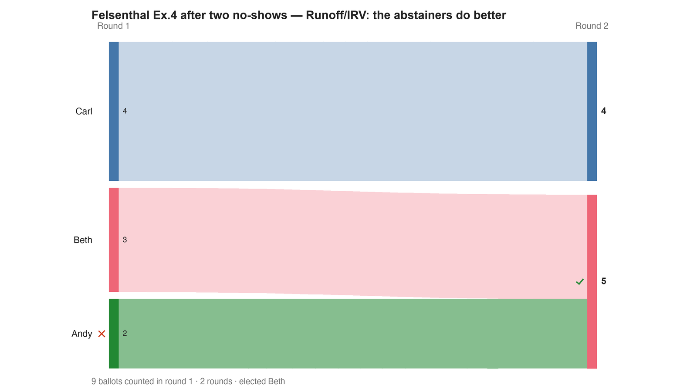

---
search:
  exclude: true
---

# Felsenthal Ex.4 after two no-shows — Runoff/IRV: the abstainers do better

*Generated from [`bv2151_97hbpw_irv.yaml`](../bv2151_97hbpw_irv.yaml) — do not edit by hand. Regenerate: `python STARVote_LH_tabulation_engine/tools_adam/scripts/build_yaml_pages.py`.*

**Method:** [RCV-IRV (Instant Runoff)](../../../../06_Other/RCV_IRV/concepts/README.md) · **1 seat** · **Expected winner:** Beth

**▶ Live on BetterVoting:** [vote](https://bettervoting.com/97hbpw) · **[results ↗](https://bettervoting.com/97hbpw/results)** (election `97hbpw` · test `BV2151`).

## Scenario

Race 1 of 3 in the No-Show-paradox pair, part 2 of 2 (BV2151, bvid 97hbpw; BV-confirmed; the pair is BV2150/51). Source: Dan S. Felsenthal, "Review of Paradoxes Afflicting Various Voting Procedures Where One Out of m Candidates (m ≥ 2) Must Be Elected", University of Haifa / LSE, revised 26 May 2010; Appendix A2, Example 4 (the No-Show and Twin paradoxes).
Ceteris paribus, TWO of the four Andy>Beth>Carl voters stay home: 9 voters — 2×(Andy>Beth>Carl), 3×(Beth>Carl>Andy), 1×(Carl>Andy>Beth), 3×(Carl>Beth>Andy). First choices are now Andy 2, Beth 3, Carl 4, so the runoff procedure (IRV; identical for three candidates) deletes ANDY — and Beth beats Carl 5–4. The two abstainers get Beth (their second choice) instead of Carl (their last, BV2150): staying home served them better than voting — the No-Show paradox. Read in reverse it is the weak TWIN paradox: add two voters identical to the Andy pair, and the twins' arrival elects their common worst choice.
Live results: https://bettervoting.com/97hbpw/results

## Ballots

Each row is one voter's ranking, most-preferred first (`N:` prefix = N identical ballots).

```text
2:Andy>Beth>Carl
3:Beth>Carl>Andy
1:Carl>Andy>Beth
3:Carl>Beth>Andy
```

## What the engine says



*Where the votes went. Band thickness is votes; a band leaving an eliminated candidate lands on whoever that ballot ranked next, or on **inactive** if it ranked nobody who was left.*

The count, step by step — the rounds and how the winner is reached:

<!-- --8<-- [start:report] -->
```text
--- RCV / Instant-Runoff Voting (single winner) ---
  Felsenthal Ex.4 after two no-shows — Runoff/IRV: the abstainers do better
 Tabulating 9 ballots (ranked ballots).

ROUND 1
Candidate      Votes  Status
-----------  -------  --------
Carl               4  Hopeful
Beth               3  Hopeful
Andy               2  Rejected

FINAL RESULT
Candidate      Votes  Status
-----------  -------  --------
Beth               5  Elected
Carl               4  Rejected
Andy               0  Rejected


Winner(s) — RCV / Instant-Runoff Voting (single winner)
  Beth

--- Transfers and inactive ballots (what the round tables leave out) ---
The tables above give each candidate's round total but not where a
transferred vote came FROM, nor how many ballots stopped counting.
Both are recomputed from the ballots, using the eliminations the
count above actually made.

ROUND 1 — 9 of 9 ballots still active; majority = 5
   Andy eliminated with 2:
      → Beth                      2

FINAL ROUND — 9 of 9 ballots still active; majority = 5
   Beth                      5  (55.6% of the still-active)  ← elected
   Carl                      4  (44.4% of the still-active)
   Never exhausted, never transferred:
      4 ballots held by Carl carried a lower ranking that was never read
      (the count stopped here, so those preferences did nothing).

Inactive ballots at the final round: 0 of 9 (0.0%).
   Beth's 5 is a majority of the 9 still active AND of all 9 cast (55.6%).
```
<!-- --8<-- [end:report] -->

### Full audit — preference matrix, Condorcet, and score distribution

```text
--- Smith Set (the generalized Condorcet winner) ---
The smallest group whose every member beats every candidate outside it —
the honest answer to "who is even in contention?".
   Smith set (1 of 3): Beth
   Outside (2):        Andy, Carl
   One member ⇒ Beth is the Condorcet winner, beating every rival head-to-head.
   RCV-IRV winner Beth is INSIDE the Smith set. ✓
      Not guaranteed — RCV-IRV is not Smith-efficient — but it holds here.
   More: 07_Concepts/topics/smith_set.md
```

Everything in one file: the [`_tabulated` mirror](../cases_tabulated/bv2151_97hbpw_irv_tabulated.txt) (regenerated on every run; every analysis forced on).

Run it yourself:

```bash
python STARVote_LH_tabulation_engine/starvote_larry_hastings.py method_comparisons/felsenthal_paradoxes/cases/bv2151_97hbpw_irv.yaml
```

## See also

- [Runoff reversal (worked set)](../../../../01_STAR/02_Examples/runoff_overturns_leader/README.md)
- [Glossary](../../../../07_Concepts/GLOSSARY.md) · [all cases by method](../../../../07_Concepts/YAML_test_case_index/README.md)

More cases in this set: [bv2144_mxfmhm_plurality](bv2144_mxfmhm_plurality.md) · [bv2144_mxfmhm_star](bv2144_mxfmhm_star.md) · [bv2145_6fj2kg_irv](bv2145_6fj2kg_irv.md) · [bv2145_6fj2kg_ranked_robin](bv2145_6fj2kg_ranked_robin.md) · [bv2145_6fj2kg_star](bv2145_6fj2kg_star.md) · [bv2146_krk2px_irv](bv2146_krk2px_irv.md) · [bv2146_krk2px_ranked_robin](bv2146_krk2px_ranked_robin.md) · [bv2146_krk2px_star](bv2146_krk2px_star.md) · [bv2147_9gdrqg_irv](bv2147_9gdrqg_irv.md) · [bv2147_9gdrqg_star](bv2147_9gdrqg_star.md) · [bv2148_h87k6v_irv](bv2148_h87k6v_irv.md) · [bv2148_h87k6v_star](bv2148_h87k6v_star.md) · [bv2149_byk9v2_irv](bv2149_byk9v2_irv.md) · [bv2149_byk9v2_star](bv2149_byk9v2_star.md) · [bv2150_dxg8pb_irv](bv2150_dxg8pb_irv.md) · [bv2150_dxg8pb_ranked_robin](bv2150_dxg8pb_ranked_robin.md) · [bv2150_dxg8pb_star](bv2150_dxg8pb_star.md) · [bv2151_97hbpw_ranked_robin](bv2151_97hbpw_ranked_robin.md) · [bv2151_97hbpw_star](bv2151_97hbpw_star.md) · [bv2152_r6ctvy_approval](bv2152_r6ctvy_approval.md) · [bv2152_r6ctvy_ranked_robin](bv2152_r6ctvy_ranked_robin.md) · [bv2153_pcttmr_approval](bv2153_pcttmr_approval.md) · [bv2153_pcttmr_irv](bv2153_pcttmr_irv.md) · [bv2153_pcttmr_ranked_robin](bv2153_pcttmr_ranked_robin.md) · [bv2154_wq6yv7_approval](bv2154_wq6yv7_approval.md) · [bv2154_wq6yv7_irv](bv2154_wq6yv7_irv.md) · [bv2154_wq6yv7_ranked_robin](bv2154_wq6yv7_ranked_robin.md) · [bv2160_r6qc8h_plurality](bv2160_r6qc8h_plurality.md) · [bv2160_r6qc8h_star](bv2160_r6qc8h_star.md) · [bv2161_q3h4fk_plurality](bv2161_q3h4fk_plurality.md) · [bv2161_q3h4fk_star](bv2161_q3h4fk_star.md) · [bv2162_4htk44_irv](bv2162_4htk44_irv.md) · [bv2162_4htk44_ranked_robin](bv2162_4htk44_ranked_robin.md) · [bv2162_4htk44_star](bv2162_4htk44_star.md) · [bv2163_74j6vv_irv](bv2163_74j6vv_irv.md) · [bv2163_74j6vv_ranked_robin](bv2163_74j6vv_ranked_robin.md) · [bv2163_74j6vv_star](bv2163_74j6vv_star.md) · [bv2164_xbqq8t_plurality](bv2164_xbqq8t_plurality.md) · [bv2164_xbqq8t_ranked_robin](bv2164_xbqq8t_ranked_robin.md) · [bv2164_xbqq8t_star](bv2164_xbqq8t_star.md) · [bv2165_9vxcj7_plurality](bv2165_9vxcj7_plurality.md) · [bv2165_9vxcj7_star](bv2165_9vxcj7_star.md) · [bv2166_b7b8dv_plurality](bv2166_b7b8dv_plurality.md) · [bv2166_b7b8dv_star](bv2166_b7b8dv_star.md) · [bv2167_f3dxq9_plurality](bv2167_f3dxq9_plurality.md) · [bv2167_f3dxq9_star](bv2167_f3dxq9_star.md) · [coombs_ex18_monotonicity](coombs_ex18_monotonicity.md) · [coombs_ex20_amalgamated](coombs_ex20_amalgamated.md) · [coombs_ex20_district1](coombs_ex20_district1.md) · [coombs_ex20_district2](coombs_ex20_district2.md) · [coombs_ex21_twin_after](coombs_ex21_twin_after.md) · [coombs_ex21_twin_before](coombs_ex21_twin_before.md) · [coombs_ex22_scc](coombs_ex22_scc.md) · [felsenthal_ex6_pareto_approval](felsenthal_ex6_pareto_approval.md) · [felsenthal_ex6_ranked_robin](felsenthal_ex6_ranked_robin.md) · [minimax_ex30_noshow_after](minimax_ex30_noshow_after.md) · [minimax_ex30_noshow_before](minimax_ex30_noshow_before.md) · [minimax_ex31_truncation](minimax_ex31_truncation.md) · [minimax_ex32_amalgamated](minimax_ex32_amalgamated.md) · [minimax_ex32_district2](minimax_ex32_district2.md) · [minimax_ex33_scc](minimax_ex33_scc.md) · [succ_elim_ex10_amalgamated](succ_elim_ex10_amalgamated.md) · [succ_elim_ex10_district1](succ_elim_ex10_district1.md) · [succ_elim_ex10_district2](succ_elim_ex10_district2.md) · [succ_elim_ex11_twin_after](succ_elim_ex11_twin_after.md) · [succ_elim_ex11_twin_before](succ_elim_ex11_twin_before.md) · [succ_elim_ex12_sincere](succ_elim_ex12_sincere.md) · [succ_elim_ex12_truncated](succ_elim_ex12_truncated.md) · [succ_elim_ex9_noshow](succ_elim_ex9_noshow.md) · [succ_elim_ex9_pareto](succ_elim_ex9_pareto.md)
