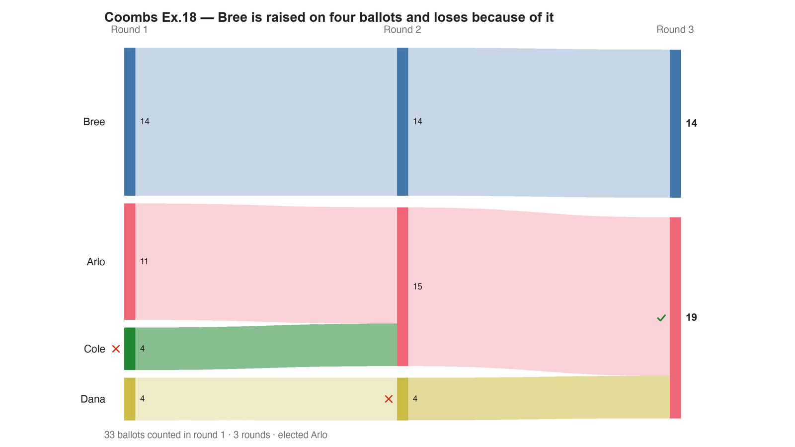

---
search:
  exclude: true
---

# Coombs Ex.18 — Bree is raised on four ballots and loses because of it

*Generated from [`coombs_ex18_monotonicity.yaml`](../coombs_ex18_monotonicity.yaml) — do not edit by hand. Regenerate: `python STARVote_LH_tabulation_engine/tools_adam/scripts/build_yaml_pages.py`.*

**Method:** [RCV-IRV (Instant Runoff)](../../../../06_Other/RCV_IRV/concepts/README.md) · **1 seat** · **Expected winner:** Arlo

## Scenario

Felsenthal's Coombs non-monotonicity example. Source: Dan S. Felsenthal, "Review of Paradoxes Afflicting Various Voting Procedures Where One Out of m Candidates (m ≥ 2) Must Be Elected", University of Haifa / LSE, revised 26 May 2010; Appendix A7, Example 18.
The same 33 voters and the same cast as Example 17 (bv2164_xbqq8t_star.yaml, live as BV2164) with exactly one change: the four Cole>Arlo>Dana>Bree voters RAISE Bree over Dana, to Cole>Arlo>Bree>Dana. Nothing else moves. Same cast because it is the same election with one thing changed.
In Example 17 Coombs elects Bree: Arlo collects the most last-place votes (12), is deleted first, and Bree inherits a majority. Here the raise shifts the last-place counts — Dana now has 15 — so Dana is deleted instead, then Cole, and ARLO wins. Bree won before she was raised and loses after. That is non-monotonicity: additional support cost her the election.
Arlo is the Condorcet winner both before and after, which is what makes the pair readable — the pairwise picture is stable and only the elimination ORDER moved.
Coombs has no tabulator in the LH engine or on BetterVoting, so this file is tabulated as RCV-IRV, the mirror-image count: IRV eliminates whoever has the fewest FIRST places, Coombs whoever has the most LAST places. IRV elects Arlo on these ballots and is unmoved by the raise, so the failure belongs to Coombs alone. For the Coombs count run tools_adam/pref_voting_tabulation_engine/coombs_report.py, which is cross-checked against pref_voting.

## Ballots

Each row is one voter's ranking, most-preferred first (`N:` prefix = N identical ballots).

```text
11:Arlo>Bree>Cole>Dana
12:Bree>Cole>Dana>Arlo
2:Bree>Arlo>Dana>Cole
4:Cole>Arlo>Bree>Dana
4:Dana>Arlo>Bree>Cole
```

## What the engine says



*Where the votes went. Band thickness is votes; a band leaving an eliminated candidate lands on whoever that ballot ranked next, or on **inactive** if it ranked nobody who was left.*

The count, step by step — the rounds and how the winner is reached:

<!-- --8<-- [start:report] -->
```text
--- RCV / Instant-Runoff Voting (single winner) ---
  Coombs Ex.18 — Bree is raised on four ballots and loses because of it
 Tabulating 33 ballots (ranked ballots).

ROUND 1
Candidate      Votes  Status
-----------  -------  --------
Bree              14  Hopeful
Arlo              11  Hopeful
Cole               4  Rejected
Dana               4  Rejected

FINAL RESULT
Candidate      Votes  Status
-----------  -------  --------
Arlo              19  Elected
Bree              14  Rejected
Cole               0  Rejected
Dana               0  Rejected


Winner(s) — RCV / Instant-Runoff Voting (single winner)
  Arlo
```
<!-- --8<-- [end:report] -->

### Full audit — preference matrix, Condorcet, and score distribution

```text
--- Smith Set (the generalized Condorcet winner) ---
The smallest group whose every member beats every candidate outside it —
the honest answer to "who is even in contention?".
   Smith set (1 of 4): Arlo
   Outside (3):        Bree, Cole, Dana
   One member ⇒ Arlo is the Condorcet winner, beating every rival head-to-head.
   RCV-IRV winner Arlo is INSIDE the Smith set. ✓
      Not guaranteed — RCV-IRV is not Smith-efficient — but it holds here.
   More: 07_Concepts/topics/smith_set.md
```

Everything in one file: the [`_tabulated` mirror](../cases_tabulated/coombs_ex18_monotonicity_tabulated.txt) (regenerated on every run; every analysis forced on).

Run it yourself:

```bash
python STARVote_LH_tabulation_engine/starvote_larry_hastings.py method_comparisons/felsenthal_paradoxes/cases/coombs_ex18_monotonicity.yaml
```

## See also

- [Monotonicity (topic hub)](../../../../07_Concepts/topics/monotonicity/README.md)
- [Condorcet efficiency (topic hub)](../../../../07_Concepts/topics/condorcet/README.md)
- [Glossary](../../../../07_Concepts/GLOSSARY.md) · [all cases by method](../../../../07_Concepts/YAML_test_case_index/README.md)

More cases in this set: [bv2144_mxfmhm_plurality](bv2144_mxfmhm_plurality.md) · [bv2144_mxfmhm_star](bv2144_mxfmhm_star.md) · [bv2145_6fj2kg_irv](bv2145_6fj2kg_irv.md) · [bv2145_6fj2kg_ranked_robin](bv2145_6fj2kg_ranked_robin.md) · [bv2145_6fj2kg_star](bv2145_6fj2kg_star.md) · [bv2146_krk2px_irv](bv2146_krk2px_irv.md) · [bv2146_krk2px_ranked_robin](bv2146_krk2px_ranked_robin.md) · [bv2146_krk2px_star](bv2146_krk2px_star.md) · [bv2147_9gdrqg_irv](bv2147_9gdrqg_irv.md) · [bv2147_9gdrqg_star](bv2147_9gdrqg_star.md) · [bv2148_h87k6v_irv](bv2148_h87k6v_irv.md) · [bv2148_h87k6v_star](bv2148_h87k6v_star.md) · [bv2149_byk9v2_irv](bv2149_byk9v2_irv.md) · [bv2149_byk9v2_star](bv2149_byk9v2_star.md) · [bv2150_dxg8pb_irv](bv2150_dxg8pb_irv.md) · [bv2150_dxg8pb_ranked_robin](bv2150_dxg8pb_ranked_robin.md) · [bv2150_dxg8pb_star](bv2150_dxg8pb_star.md) · [bv2151_97hbpw_irv](bv2151_97hbpw_irv.md) · [bv2151_97hbpw_ranked_robin](bv2151_97hbpw_ranked_robin.md) · [bv2151_97hbpw_star](bv2151_97hbpw_star.md) · [bv2152_r6ctvy_approval](bv2152_r6ctvy_approval.md) · [bv2152_r6ctvy_ranked_robin](bv2152_r6ctvy_ranked_robin.md) · [bv2153_pcttmr_approval](bv2153_pcttmr_approval.md) · [bv2153_pcttmr_irv](bv2153_pcttmr_irv.md) · [bv2153_pcttmr_ranked_robin](bv2153_pcttmr_ranked_robin.md) · [bv2154_wq6yv7_approval](bv2154_wq6yv7_approval.md) · [bv2154_wq6yv7_irv](bv2154_wq6yv7_irv.md) · [bv2154_wq6yv7_ranked_robin](bv2154_wq6yv7_ranked_robin.md) · [bv2160_r6qc8h_plurality](bv2160_r6qc8h_plurality.md) · [bv2160_r6qc8h_star](bv2160_r6qc8h_star.md) · [bv2161_q3h4fk_plurality](bv2161_q3h4fk_plurality.md) · [bv2161_q3h4fk_star](bv2161_q3h4fk_star.md) · [bv2162_4htk44_irv](bv2162_4htk44_irv.md) · [bv2162_4htk44_ranked_robin](bv2162_4htk44_ranked_robin.md) · [bv2162_4htk44_star](bv2162_4htk44_star.md) · [bv2163_74j6vv_irv](bv2163_74j6vv_irv.md) · [bv2163_74j6vv_ranked_robin](bv2163_74j6vv_ranked_robin.md) · [bv2163_74j6vv_star](bv2163_74j6vv_star.md) · [bv2164_xbqq8t_plurality](bv2164_xbqq8t_plurality.md) · [bv2164_xbqq8t_ranked_robin](bv2164_xbqq8t_ranked_robin.md) · [bv2164_xbqq8t_star](bv2164_xbqq8t_star.md) · [bv2165_9vxcj7_plurality](bv2165_9vxcj7_plurality.md) · [bv2165_9vxcj7_star](bv2165_9vxcj7_star.md) · [bv2166_b7b8dv_plurality](bv2166_b7b8dv_plurality.md) · [bv2166_b7b8dv_star](bv2166_b7b8dv_star.md) · [bv2167_f3dxq9_plurality](bv2167_f3dxq9_plurality.md) · [bv2167_f3dxq9_star](bv2167_f3dxq9_star.md) · [coombs_ex20_amalgamated](coombs_ex20_amalgamated.md) · [coombs_ex20_district1](coombs_ex20_district1.md) · [coombs_ex20_district2](coombs_ex20_district2.md) · [coombs_ex21_twin_after](coombs_ex21_twin_after.md) · [coombs_ex21_twin_before](coombs_ex21_twin_before.md) · [coombs_ex22_scc](coombs_ex22_scc.md) · [felsenthal_ex6_pareto_approval](felsenthal_ex6_pareto_approval.md) · [felsenthal_ex6_ranked_robin](felsenthal_ex6_ranked_robin.md) · [minimax_ex30_noshow_after](minimax_ex30_noshow_after.md) · [minimax_ex30_noshow_before](minimax_ex30_noshow_before.md) · [minimax_ex31_truncation](minimax_ex31_truncation.md) · [minimax_ex32_amalgamated](minimax_ex32_amalgamated.md) · [minimax_ex32_district2](minimax_ex32_district2.md) · [minimax_ex33_scc](minimax_ex33_scc.md) · [succ_elim_ex10_amalgamated](succ_elim_ex10_amalgamated.md) · [succ_elim_ex10_district1](succ_elim_ex10_district1.md) · [succ_elim_ex10_district2](succ_elim_ex10_district2.md) · [succ_elim_ex11_twin_after](succ_elim_ex11_twin_after.md) · [succ_elim_ex11_twin_before](succ_elim_ex11_twin_before.md) · [succ_elim_ex12_sincere](succ_elim_ex12_sincere.md) · [succ_elim_ex12_truncated](succ_elim_ex12_truncated.md) · [succ_elim_ex9_noshow](succ_elim_ex9_noshow.md) · [succ_elim_ex9_pareto](succ_elim_ex9_pareto.md)
