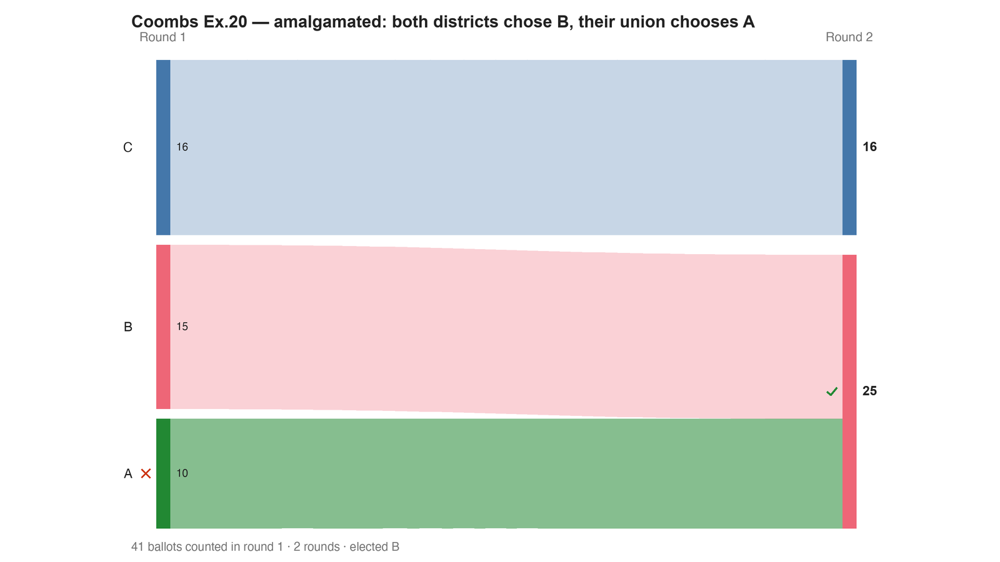

---
search:
  exclude: true
---

# Coombs Ex.20 — amalgamated: both districts chose B, their union chooses A

*Generated from [`coombs_ex20_amalgamated.yaml`](../coombs_ex20_amalgamated.yaml) — do not edit by hand. Regenerate: `python STARVote_LH_tabulation_engine/tools_adam/scripts/build_yaml_pages.py`.*

**Method:** [RCV-IRV (Instant Runoff)](../../../../06_Other/RCV_IRV/concepts/README.md) · **1 seat** · **Expected winner:** B

## Scenario

The amalgamation half of Felsenthal's Coombs reinforcement example. Source: Dan S. Felsenthal (2010), Appendix A7, Example 20.
All 41 ballots from both districts in one election: District I's 34 (9×A>B>C, 9×B>C>A, 11×C>A>B, 5×C>B>A) plus District II's 7 (1×A>B>C, 6×B>A>C). Each district elected B on its own.
Counted together the last-place tally changes hands: C is now last on 16 ballots — more than A's 14 or B's 11 — so Coombs deletes C instead of A, and the ballots C was holding lift A to a majority. A wins. Neither district wanted A; their union does. That is the reinforcement paradox, also called the inconsistency paradox, and it is the formal reason a method that cannot be summed district by district cannot be canvassed that way either.
Labels are Felsenthal's own A/B/C so the case can be read side by side with the paper's table.
Tabulated as RCV-IRV, the mirror-image count. IRV elects B here and in District II. In District I it does not have a determinate answer at all: A and B tie on nine first places each of 34, and that arbitrary first elimination decides the winner (this engine breaks it toward B, RCTab toward C in three of six declared candidate orders). So IRV is a clean control in two of the three files, not all three — a weaker contrast than it first looked, and worth stating rather than glossing. The Coombs reinforcement failure does not lean on it either way: Coombs' own eliminations are untied in all three files, which is why the paradox is still Coombs' alone. That contrast is why the three files are worth having separately.

## Ballots

Each row is one voter's ranking, most-preferred first (`N:` prefix = N identical ballots).

```text
9:A>B>C
9:B>C>A
11:C>A>B
5:C>B>A
1:A>B>C
6:B>A>C
```

## What the engine says



*Where the votes went. Band thickness is votes; a band leaving an eliminated candidate lands on whoever that ballot ranked next, or on **inactive** if it ranked nobody who was left.*

The count, step by step — the rounds and how the winner is reached:

<!-- --8<-- [start:report] -->
```text
--- RCV / Instant-Runoff Voting (single winner) ---
  Coombs Ex.20 — amalgamated: both districts chose B, their union chooses A
 Tabulating 41 ballots (ranked ballots).

ROUND 1
Candidate      Votes  Status
-----------  -------  --------
C                 16  Hopeful
B                 15  Hopeful
A                 10  Rejected

FINAL RESULT
Candidate      Votes  Status
-----------  -------  --------
B                 25  Elected
C                 16  Rejected
A                  0  Rejected


Winner(s) — RCV / Instant-Runoff Voting (single winner)
  B

--- Transfers and inactive ballots (what the round tables leave out) ---
The tables above give each candidate's round total but not where a
transferred vote came FROM, nor how many ballots stopped counting.
Both are recomputed from the ballots, using the eliminations the
count above actually made.

ROUND 1 — 41 of 41 ballots still active; majority = 21
   A eliminated with 10:
      → B                        10

FINAL ROUND — 41 of 41 ballots still active; majority = 21
   B                        25  (61.0% of the still-active)  ← elected
   C                        16  (39.0% of the still-active)
   Never exhausted, never transferred:
      16 ballots held by C carried a lower ranking that was never read
      (the count stopped here, so those preferences did nothing).

Inactive ballots at the final round: 0 of 41 (0.0%).
   B's 25 is a majority of the 41 still active AND of all 41 cast (61.0%).
```
<!-- --8<-- [end:report] -->

### Full audit — preference matrix, Condorcet, and score distribution

```text
--- Smith Set (the generalized Condorcet winner) ---
The smallest group whose every member beats every candidate outside it —
the honest answer to "who is even in contention?".
   Smith set (3 of 3): A, B, C
   Outside (0):        —
   More than one member ⇒ NO Condorcet winner: the top of the tournament is a
   cycle, so the strongest "candidate" is a set, not a person. Which member of
   the set should win is exactly what Minimax / Ranked Pairs / Schulze disagree
   about — see 05_Ranked_Robin/01_Learn/cycle_resolution.md.
   RCV-IRV winner B is INSIDE the Smith set. ✓
      Not guaranteed — RCV-IRV is not Smith-efficient — but it holds here.
   More: 07_Concepts/topics/smith_set.md
```

Everything in one file: the [`_tabulated` mirror](../cases_tabulated/coombs_ex20_amalgamated_tabulated.txt) (regenerated on every run; every analysis forced on).

Run it yourself:

```bash
python STARVote_LH_tabulation_engine/starvote_larry_hastings.py method_comparisons/felsenthal_paradoxes/cases/coombs_ex20_amalgamated.yaml
```

## See also

- [Ties & tie-breaking (topic hub)](../../../../07_Concepts/topics/ties/README.md)
- [Glossary](../../../../07_Concepts/GLOSSARY.md) · [all cases by method](../../../../07_Concepts/YAML_test_case_index/README.md)

More cases in this set: [bv2144_mxfmhm_plurality](bv2144_mxfmhm_plurality.md) · [bv2144_mxfmhm_star](bv2144_mxfmhm_star.md) · [bv2145_6fj2kg_irv](bv2145_6fj2kg_irv.md) · [bv2145_6fj2kg_ranked_robin](bv2145_6fj2kg_ranked_robin.md) · [bv2145_6fj2kg_star](bv2145_6fj2kg_star.md) · [bv2146_krk2px_irv](bv2146_krk2px_irv.md) · [bv2146_krk2px_ranked_robin](bv2146_krk2px_ranked_robin.md) · [bv2146_krk2px_star](bv2146_krk2px_star.md) · [bv2147_9gdrqg_irv](bv2147_9gdrqg_irv.md) · [bv2147_9gdrqg_star](bv2147_9gdrqg_star.md) · [bv2148_h87k6v_irv](bv2148_h87k6v_irv.md) · [bv2148_h87k6v_star](bv2148_h87k6v_star.md) · [bv2149_byk9v2_irv](bv2149_byk9v2_irv.md) · [bv2149_byk9v2_star](bv2149_byk9v2_star.md) · [bv2150_dxg8pb_irv](bv2150_dxg8pb_irv.md) · [bv2150_dxg8pb_ranked_robin](bv2150_dxg8pb_ranked_robin.md) · [bv2150_dxg8pb_star](bv2150_dxg8pb_star.md) · [bv2151_97hbpw_irv](bv2151_97hbpw_irv.md) · [bv2151_97hbpw_ranked_robin](bv2151_97hbpw_ranked_robin.md) · [bv2151_97hbpw_star](bv2151_97hbpw_star.md) · [bv2152_r6ctvy_approval](bv2152_r6ctvy_approval.md) · [bv2152_r6ctvy_ranked_robin](bv2152_r6ctvy_ranked_robin.md) · [bv2153_pcttmr_approval](bv2153_pcttmr_approval.md) · [bv2153_pcttmr_irv](bv2153_pcttmr_irv.md) · [bv2153_pcttmr_ranked_robin](bv2153_pcttmr_ranked_robin.md) · [bv2154_wq6yv7_approval](bv2154_wq6yv7_approval.md) · [bv2154_wq6yv7_irv](bv2154_wq6yv7_irv.md) · [bv2154_wq6yv7_ranked_robin](bv2154_wq6yv7_ranked_robin.md) · [bv2160_r6qc8h_plurality](bv2160_r6qc8h_plurality.md) · [bv2160_r6qc8h_star](bv2160_r6qc8h_star.md) · [bv2161_q3h4fk_plurality](bv2161_q3h4fk_plurality.md) · [bv2161_q3h4fk_star](bv2161_q3h4fk_star.md) · [bv2162_4htk44_irv](bv2162_4htk44_irv.md) · [bv2162_4htk44_ranked_robin](bv2162_4htk44_ranked_robin.md) · [bv2162_4htk44_star](bv2162_4htk44_star.md) · [bv2163_74j6vv_irv](bv2163_74j6vv_irv.md) · [bv2163_74j6vv_ranked_robin](bv2163_74j6vv_ranked_robin.md) · [bv2163_74j6vv_star](bv2163_74j6vv_star.md) · [bv2164_xbqq8t_plurality](bv2164_xbqq8t_plurality.md) · [bv2164_xbqq8t_ranked_robin](bv2164_xbqq8t_ranked_robin.md) · [bv2164_xbqq8t_star](bv2164_xbqq8t_star.md) · [bv2165_9vxcj7_plurality](bv2165_9vxcj7_plurality.md) · [bv2165_9vxcj7_star](bv2165_9vxcj7_star.md) · [bv2166_b7b8dv_plurality](bv2166_b7b8dv_plurality.md) · [bv2166_b7b8dv_star](bv2166_b7b8dv_star.md) · [bv2167_f3dxq9_plurality](bv2167_f3dxq9_plurality.md) · [bv2167_f3dxq9_star](bv2167_f3dxq9_star.md) · [coombs_ex18_monotonicity](coombs_ex18_monotonicity.md) · [coombs_ex20_district1](coombs_ex20_district1.md) · [coombs_ex20_district2](coombs_ex20_district2.md) · [coombs_ex21_twin_after](coombs_ex21_twin_after.md) · [coombs_ex21_twin_before](coombs_ex21_twin_before.md) · [coombs_ex22_scc](coombs_ex22_scc.md) · [felsenthal_ex6_pareto_approval](felsenthal_ex6_pareto_approval.md) · [felsenthal_ex6_ranked_robin](felsenthal_ex6_ranked_robin.md) · [minimax_ex30_noshow_after](minimax_ex30_noshow_after.md) · [minimax_ex30_noshow_before](minimax_ex30_noshow_before.md) · [minimax_ex31_truncation](minimax_ex31_truncation.md) · [minimax_ex32_amalgamated](minimax_ex32_amalgamated.md) · [minimax_ex32_district2](minimax_ex32_district2.md) · [minimax_ex33_scc](minimax_ex33_scc.md) · [succ_elim_ex10_amalgamated](succ_elim_ex10_amalgamated.md) · [succ_elim_ex10_district1](succ_elim_ex10_district1.md) · [succ_elim_ex10_district2](succ_elim_ex10_district2.md) · [succ_elim_ex11_twin_after](succ_elim_ex11_twin_after.md) · [succ_elim_ex11_twin_before](succ_elim_ex11_twin_before.md) · [succ_elim_ex12_sincere](succ_elim_ex12_sincere.md) · [succ_elim_ex12_truncated](succ_elim_ex12_truncated.md) · [succ_elim_ex9_noshow](succ_elim_ex9_noshow.md) · [succ_elim_ex9_pareto](succ_elim_ex9_pareto.md)
