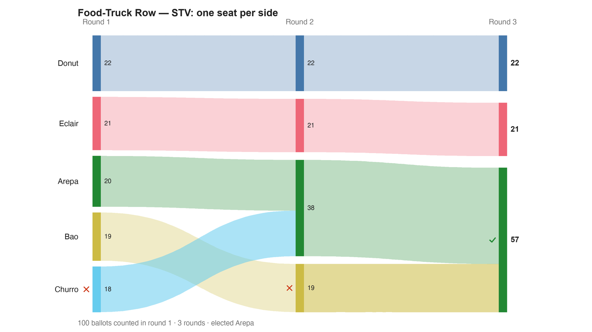

---
search:
  exclude: true
---

# Food-Truck Row — STV: one seat per side

*Generated from [`bv2210_fvg8y8_stv_share.yaml`](../bv2210_fvg8y8_stv_share.yaml) — do not edit by hand. Regenerate: `python STARVote_LH_tabulation_engine/tools_adam/scripts/build_yaml_pages.py`.*

**Method:** [STV (proportional, ranked ballots)](../../../../03_STAR_PR/01_Learn/README.md) · **2 seats** · **Expected winners:** Arepa, Donut

**▶ Live on BetterVoting:** [vote](https://bettervoting.com/fvg8y8) · **[results ↗](https://bettervoting.com/fvg8y8/results)** (election `fvg8y8` · test `BV2210`).

## Scenario

One 100-voter electorate, two food-truck spots, five counts — this file is the STV count (ranked ballots, Droop quota + transfers). The savory side is a 57-voter OUTRIGHT MAJORITY split across three trucks (Arepa 20 first choices, Bao 19, Churro 18); the sweet side is a disciplined 43-voter minority on two (Donut 22, Eclair 21). Same opinions on every ballot; only the counting rule changes: SNTV hands the majority ZERO seats (Donut+Eclair), Bloc STAR and Bloc Ranked Robin hand it BOTH (Arepa+Bao), STAR-PR and STV share them one per side (Arepa+Donut). THE HEADLINE HERE: the ranked route to the same share. Churro's elimination pools the savory vote, Arepa is elected; Eclair's elimination pools the sweet vote, Donut is elected. One seat per ~quota of voters. (This race deliberately ends with a hopeful still standing — clear of the BV sole-survivor STV crash documented in 06_Other/STV/bv_stv_sole_survivor_crash/.) Full lesson: README.md in this folder. Live on BetterVoting (Test ID BV2210): https://bettervoting.com/fvg8y8 — all five races agree with the LH engine, no genuine tie anywhere. Live results: https://bettervoting.com/fvg8y8/results

## Ballots

Each row is one voter's ranking, most-preferred first (`N:` prefix = N identical ballots).

```text
20:Arepa>Bao>Churro
19:Bao>Arepa>Churro
18:Churro>Arepa>Bao
22:Donut>Eclair
21:Eclair>Donut
```

## What the engine says



*Where the votes went. Band thickness is votes; a band leaving an eliminated candidate lands on whoever that ballot ranked next, or on **inactive** if it ranked nobody who was left.*

The count, step by step — the rounds and how the winner is reached:

<!-- --8<-- [start:report] -->
```text
--- STV / Single Transferable Vote (multi-winner — 2 seats) ---
  Food-Truck Row — STV: one seat per side
 Tabulating 100 ballots (ranked ballots).
 2 seats; quota = 33.33 (exact Droop, votes/(seats+1)) — 33.3% of 100.
 Elected at >= quota, and every surplus is measured from it.
 (Hand-count Droop, floor(100/3)+1 = 34, is a different but equally standard rule.)

ROUND 1
Candidate      Votes  Status
-----------  -------  --------
Donut             22  Hopeful
Eclair            21  Hopeful
Arepa             20  Hopeful
Bao               19  Hopeful
Churro            18  Rejected

ROUND 2
Candidate      Votes  Status
-----------  -------  --------
Arepa             38  Elected
Donut             22  Hopeful
Eclair            21  Hopeful
Bao               19  Hopeful
Churro             0  Rejected

ROUND 3
Candidate      Votes  Status
-----------  -------  --------
Arepa          33.33  Elected
Bao            23.67  Hopeful
Donut          22.00  Hopeful
Eclair         21.00  Rejected
Churro          0.00  Rejected

FINAL RESULT
Candidate      Votes  Status
-----------  -------  --------
Arepa          33.33  Elected
Donut          43.00  Elected
Bao            23.67  Rejected
Eclair          0.00  Rejected
Churro          0.00  Rejected


Winner(s) — STV / Single Transferable Vote (multi-winner — 2 seats)
  Arepa
  Donut
```
<!-- --8<-- [end:report] -->

### Full audit — preference matrix, Condorcet, and score distribution

```text
--- Smith Set (the generalized Condorcet winner) ---
The smallest group whose every member beats every candidate outside it —
the honest answer to "who is even in contention?".
   Smith set (1 of 5): Arepa
   Outside (4):        Bao, Churro, Donut, Eclair
   One member ⇒ Arepa is the Condorcet winner, beating every rival head-to-head.
   More: 07_Concepts/topics/smith_set.md
```

Everything in one file: the [`_tabulated` mirror](../cases_tabulated/bv2210_fvg8y8_stv_share_tabulated.txt) (regenerated on every run; every analysis forced on).

Run it yourself:

```bash
python STARVote_LH_tabulation_engine/starvote_larry_hastings.py method_comparisons/food_truck_row/cases/bv2210_fvg8y8_stv_share.yaml
```

## See also

- [Ties & tie-breaking (topic hub)](../../../../07_Concepts/topics/ties/README.md)
- [Vote splitting (worked set)](../../../split_voting/README.md)
- [Glossary](../../../../07_Concepts/GLOSSARY.md) · [all cases by method](../../../../07_Concepts/YAML_test_case_index/README.md)

More cases in this set: [bv2210_fvg8y8_bloc_rr_sweep](bv2210_fvg8y8_bloc_rr_sweep.md) · [bv2210_fvg8y8_bloc_star_sweep](bv2210_fvg8y8_bloc_star_sweep.md) · [bv2210_fvg8y8_sntv_split](bv2210_fvg8y8_sntv_split.md) · [bv2210_fvg8y8_star_pr_share](bv2210_fvg8y8_star_pr_share.md)
