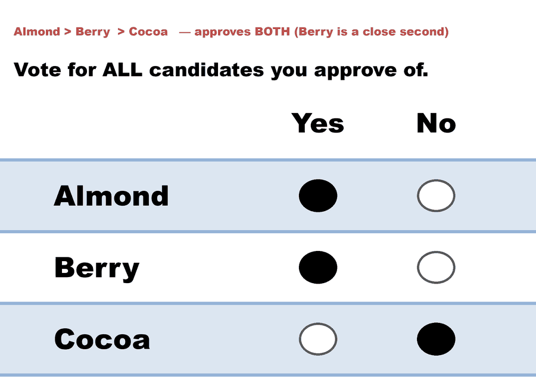
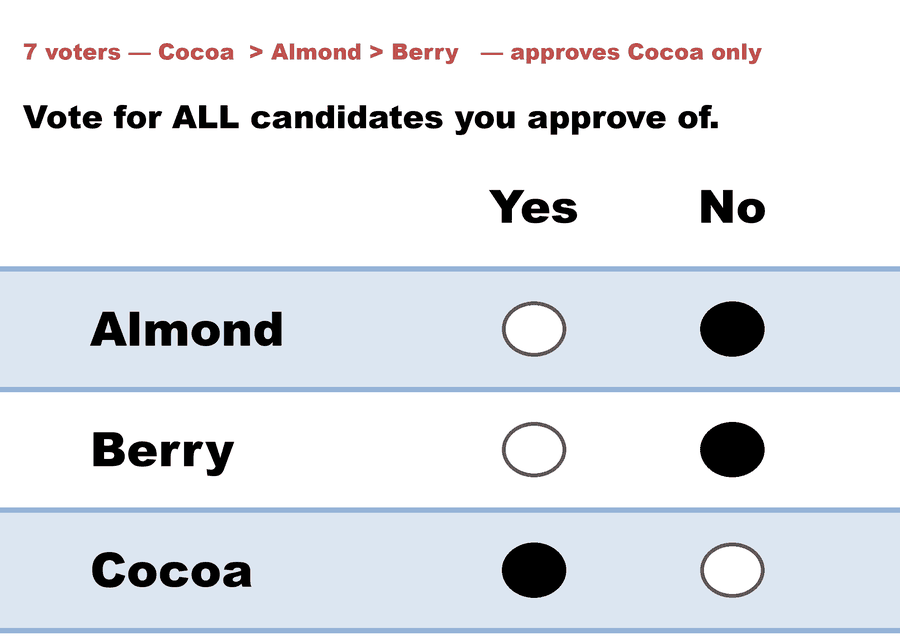
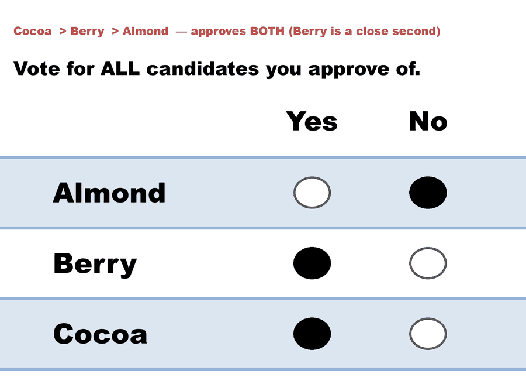

---
search:
  exclude: true
---

# Kim (A,B)-scoring, A=0/B=1 — Approval, when second choices are intense

*Generated from [`bv2275_6mcgkq_approval_intense.yaml`](../bv2275_6mcgkq_approval_intense.yaml) — do not edit by hand. Regenerate: `python STARVote_LH_tabulation_engine/tools_adam/scripts/build_yaml_pages.py`.*

**Method:** [Approval Voting](../../../../04_Approval/01_Learn/README.md) · **1 seat** · **Expected winner:** Berry

**▶ Live on BetterVoting:** [vote](https://bettervoting.com/6mcgkq) · **[results ↗](https://bettervoting.com/6mcgkq/results)** (election `6mcgkq` · test `BV2275`).

## Scenario

THE SAME 36 VOTERS AND THE SAME RANKINGS as every other file in this folder.
This is file 2 of the approval pair, and the one that makes the point.

  12 voters   Almond > Berry  > Cocoa
   8 voters   Berry  > Almond > Cocoa
   7 voters   Cocoa  > Almond > Berry
   9 voters   Cocoa  > Berry  > Almond

In bv2275_6mcgkq_approval_lukewarm.yaml only the 7-voter bloc felt strongly
enough about its second choice to approve two candidates, and Almond won 19
to 16 to 8.

Here the intensity sits somewhere else. The 12 Almond-first voters and the 9
Cocoa-first voters who rank Berry second are the ones with a close second
choice, so they approve two; the other blocs bullet-vote.

  Berry   8 + 12 + 9 = 29
  Cocoa        7 +  9 = 16
  Almond              12

Berry wins — and Berry finished LAST in the plurality file (8 first choices).

So across this folder, one fixed set of 36 rankings elects:

  Cocoa   under plurality        (A = 0)
  Almond  under Borda            (A = 1/2)
  Berry   under negative voting  (A = 1)
  Almond  under approval, lukewarm second choices
  Berry   under approval, intense second choices

The first three winners were chosen by the DESIGNER's setting of one dial.
The last two were chosen by the VOTERS, using information that no ranked
ballot records. That is the substance of Kim's Theorem 2 — that an incentive
compatible CARDINAL rule can beat every ordinal rule — and of his Proposition
2, which locates that rule inside this same (A,B) family.

What this pair does NOT show: that approval is Kim's optimum. It is not.
(0, 1) is the extreme corner of the family; his rule pulls both vectors in
toward the middle, to a pair chosen so that a voter on the threshold is
exactly indifferent between the two — which is what makes honest reporting a
best response. Approval as run here is the shape of the answer, not the
answer.

Live on BetterVoting: race 5 of BV2275 (six races, one
electorate) -> https://bettervoting.com/6mcgkq/results

Concept page: 07_Concepts/topics/ordinal_vs_cardinal_mechanism_design.md

## Ballots

The ballots as marked — a filled **Yes** is a `1` in that candidate's column, a filled **No** a `0`:

| Ballot as marked | Almond | Berry | Cocoa |
|:--|:--:|:--:|:--:|
|  | 1 | 1 | 0 |
|  | 0 | 1 | 0 |
|  | 0 | 0 | 1 |
|  | 0 | 1 | 1 |

The same ballots as the file records them:

Row 1 = candidate names; each later row is one voter's approvals (`1` = approve, `0`/blank = not approved).

```text
Count:Almond,Berry,Cocoa
12:1,1,0   # Almond > Berry  > Cocoa   — approves BOTH (Berry is a close second)
8:0,1,0    # Berry  > Almond > Cocoa   — approves Berry only
7:0,0,1    # Cocoa  > Almond > Berry   — approves Cocoa only
9:0,1,1    # Cocoa  > Berry  > Almond  — approves BOTH (Berry is a close second)
```

## What the engine says

Full report from the [`_tabulated` mirror](../cases_tabulated/bv2275_6mcgkq_approval_intense_tabulated.txt) (regenerated on every run; every analysis forced on):

<!-- --8<-- [start:report] -->
```text
--- Approval Voting (single winner) ---
 Tabulating 36 ballots (any non-zero score = approval).

Ballots:
   columns = Almond, Berry, Cocoa      (1 = approve; 0 = not approved)
    12 × 1,1,0
     8 × 0,1,0
     7 × 0,0,1
     9 × 0,1,1

   Berry  -- 29 (81%) -- Elected
   Cocoa  -- 16 (44%)
   Almond -- 12 (33%)

[Approval Distribution] (how many candidates each ballot approved)
   57 approvals across 36 ballots — average 1.6 of 3 (range 1–2).
     approved 1: 15 ballots
     approved 2: 21 ballots

[Co-Approval Matrix]
 Of the voters who approved the ROW candidate, the % who ALSO approved the COLUMN candidate.
           | Berry  | Cocoa  | Almond |
   ------------------------------------
   Berry   |   --   |  31%   |  41%   |
   Cocoa   |  56%   |   --   |   0%   |
   Almond  |  100%  |   0%   |   --   |

Winner — Approval Voting (single winner)
  Berry
```
<!-- --8<-- [end:report] -->

Run it yourself:

```bash
python STARVote_LH_tabulation_engine/starvote_larry_hastings.py method_comparisons/kim_ordinal_vs_cardinal/cases/bv2275_6mcgkq_approval_intense.yaml
```

## See also

- [Glossary](../../../../07_Concepts/GLOSSARY.md) · [all cases by method](../../../../07_Concepts/YAML_test_case_index/README.md)

More cases in this set: [bv2275_6mcgkq_a0_plurality](bv2275_6mcgkq_a0_plurality.md) · [bv2275_6mcgkq_a1_negative](bv2275_6mcgkq_a1_negative.md) · [bv2275_6mcgkq_ahalf_borda](bv2275_6mcgkq_ahalf_borda.md) · [bv2275_6mcgkq_approval_lukewarm](bv2275_6mcgkq_approval_lukewarm.md) · [bv2275_6mcgkq_ranked_robin](bv2275_6mcgkq_ranked_robin.md)
