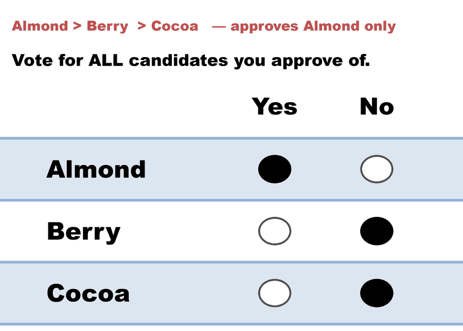
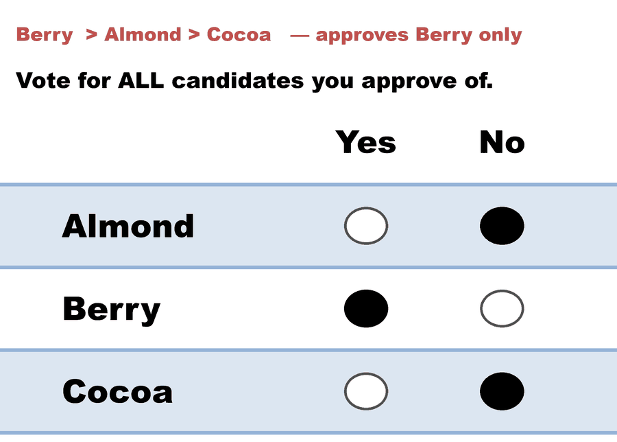
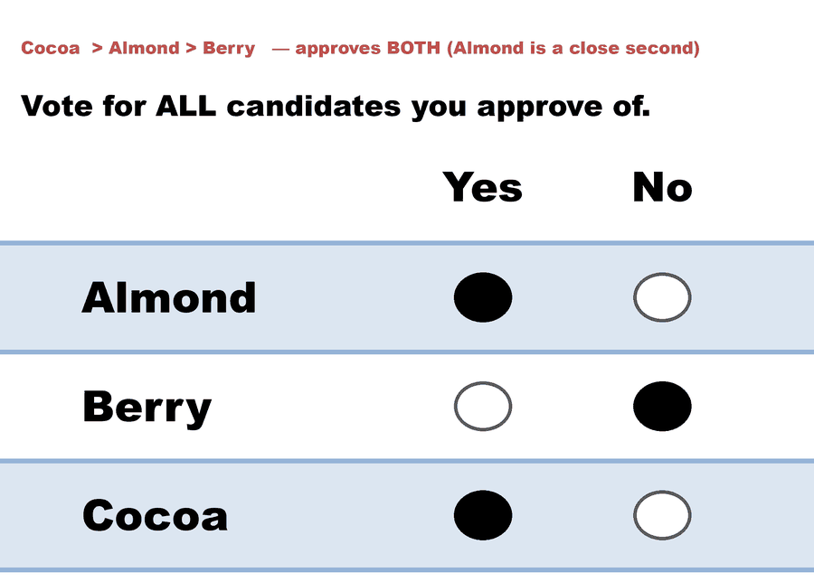
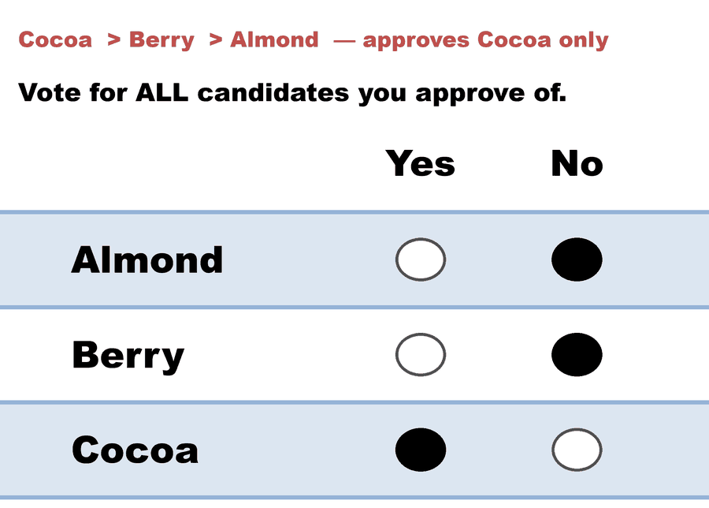

---
search:
  exclude: true
---

# Kim (A,B)-scoring, A=0/B=1 — Approval, when second choices are lukewarm

*Generated from [`kim_approval_lukewarm_seconds.yaml`](../kim_approval_lukewarm_seconds.yaml) — do not edit by hand. Regenerate: `python STARVote_LH_tabulation_engine/tools_adam/scripts/build_yaml_pages.py`.*

**Method:** [Approval Voting](../../../../04_Approval/01_Learn/README.md) · **1 seat** · **Expected winner:** Almond

## Scenario

THE SAME 36 VOTERS AND THE SAME RANKINGS as the three (A,B)-scoring files in
this folder — and a winner that neither the rankings nor any ordinal rule can
predict. This is file 1 of the approval pair.

  12 voters   Almond > Berry  > Cocoa
   8 voters   Berry  > Almond > Cocoa
   7 voters   Cocoa  > Almond > Berry
   9 voters   Cocoa  > Berry  > Almond

Approval voting is the (A,B)-scoring rule with A = 0 and B = 1: the two
permitted score vectors are (1, 0, 0) and (1, 1, 0), and — this is the whole
point — each VOTER chooses which one to hand in, rather than a designer
choosing for everybody. Semin Kim (Games and Economic Behavior 104, 2017)
singles this out: plurality, Borda and negative voting "are classified as
ordinal rules because information about ordinal preference is sufficient to
implement" them, while approval "requires more than information about ordinal
preferences."

This file makes that concrete. Second choices here are LUKEWARM: only the 7
Cocoa-first voters who put Almond second feel strongly enough to approve two.
Everyone else approves their favorite alone.

  Almond  12 + 7 = 19
  Cocoa    7 + 9 = 16
  Berry            8

Almond wins. Now read kim_approval_intense_seconds.yaml, which is the same
36 rankings with a different intensity pattern and a different winner.

This is the cardinal information a ranking cannot hold. It is not "who do you
prefer" — every ranking in this file is unchanged from the others in the
folder — it is "is your second choice close to your first, or close to your
last?" Kim's Theorem 2 rule is exactly a softened version of this question,
with the two score vectors pulled in from (1, 0, 0) and (1, 1, 0) to a pair
chosen so that answering honestly is a best response.

Concept page: 07_Concepts/topics/ordinal_vs_cardinal_mechanism_design.md

## Ballots

The ballots as marked — a filled **Yes** is a `1` in that candidate's column, a filled **No** a `0`:

| Ballot as marked | Voters | Almond | Berry | Cocoa |
|:--|:--:|:--:|:--:|:--:|
|  Berry  > Cocoa   — approves Almond only: Almond Yes, Berry No, Cocoa No."> | 12 | 1 | 0 | 0 |
|  Almond > Cocoa   — approves Berry only: Almond No, Berry Yes, Cocoa No."> | 8 | 0 | 1 | 0 |
|  Almond > Berry   — approves BOTH (Almond is a close second): Almond Yes, Berry No, Cocoa Yes."> | 7 | 1 | 0 | 1 |
|  Berry  > Almond  — approves Cocoa only: Almond No, Berry No, Cocoa Yes."> | 9 | 0 | 0 | 1 |

The same ballots as the file records them:

Row 1 = candidate names; each later row is one voter's approvals (`1` = approve, `0`/blank = not approved).

```text
Count:Almond,Berry,Cocoa
12:1,0,0   # Almond > Berry  > Cocoa   — approves Almond only
8:0,1,0    # Berry  > Almond > Cocoa   — approves Berry only
7:1,0,1    # Cocoa  > Almond > Berry   — approves BOTH (Almond is a close second)
9:0,0,1    # Cocoa  > Berry  > Almond  — approves Cocoa only
```

## What the engine says

Full report from the [`_tabulated` mirror](../cases_tabulated/kim_approval_lukewarm_seconds_tabulated.txt) (regenerated on every run; every analysis forced on):

<!-- --8<-- [start:report] -->
```text
--- Approval Voting (single winner) ---
 Tabulating 36 ballots (any non-zero score = approval).

Ballots:
   columns = Almond, Berry, Cocoa      (1 = approve; 0 / blank / marker = not approved)
    12 × 1,0,0
     8 × 0,1,0
     7 × 1,0,1
     9 × 0,0,1

   Almond -- 19 (53%) -- Elected
   Cocoa  -- 16 (44%)
   Berry  -- 8 (22%)

[Approval Distribution] (how many candidates each ballot approved)
   43 approvals across 36 ballots — average 1.2 of 3 (range 1–2).
     approved 1: 29 ballots
     approved 2: 7 ballots

[Co-Approval Matrix]
 Of the voters who approved the ROW candidate, the % who ALSO approved the COLUMN candidate.
           | Almond | Cocoa  | Berry  |
   ------------------------------------
   Almond  |   --   |  37%   |   0%   |
   Cocoa   |  44%   |   --   |   0%   |
   Berry   |   0%   |   0%   |   --   |

Winner — Approval Voting (single winner)
  Almond
```
<!-- --8<-- [end:report] -->

Run it yourself:

```bash
python STARVote_LH_tabulation_engine/starvote_larry_hastings.py method_comparisons/kim_ordinal_vs_cardinal/cases/kim_approval_lukewarm_seconds.yaml
```

## See also

- [Glossary](../../../../07_Concepts/GLOSSARY.md) · [all cases by method](../../../../07_Concepts/YAML_test_case_index/README.md)

More cases in this set: [kim_approval_intense_seconds](kim_approval_intense_seconds.md) · [kim_scoring_a0_plurality](kim_scoring_a0_plurality.md) · [kim_scoring_a1_negative](kim_scoring_a1_negative.md) · [kim_scoring_ahalf_borda](kim_scoring_ahalf_borda.md)
