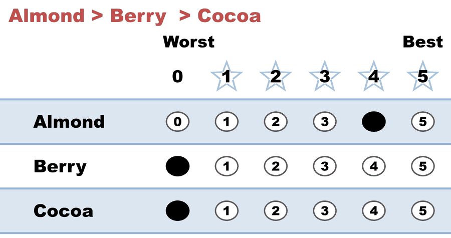
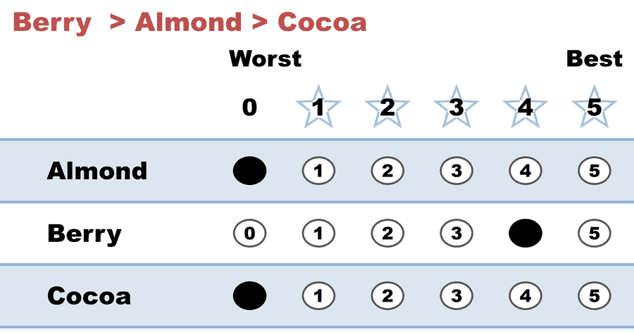
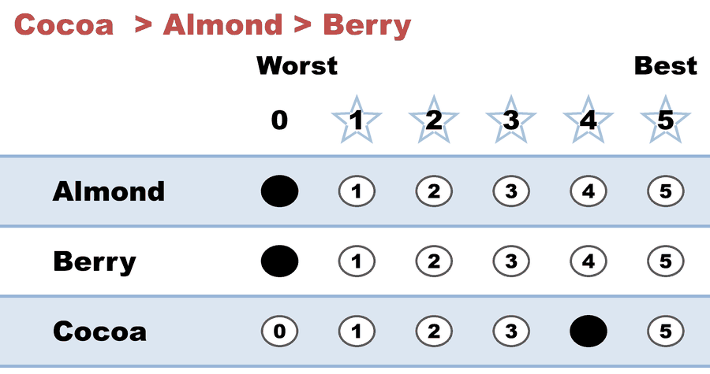
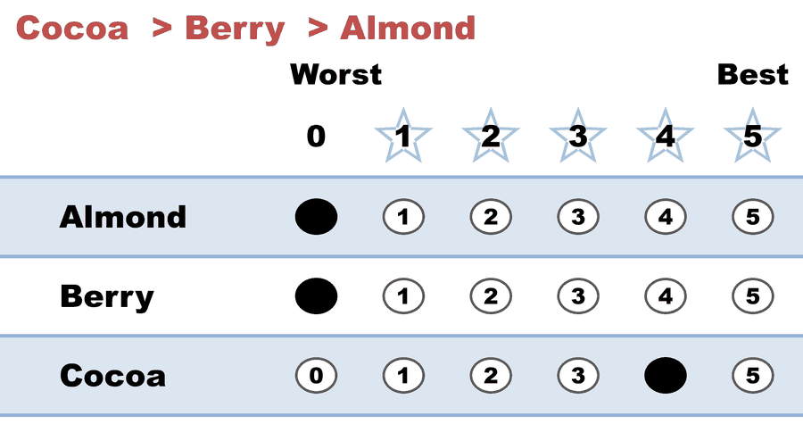

---
search:
  exclude: true
---

# Kim (A,B)-scoring, A=0 — the middle choice is worth nothing (Plurality)

*Generated from [`kim_scoring_a0_plurality.yaml`](../kim_scoring_a0_plurality.yaml) — do not edit by hand. Regenerate: `python STARVote_LH_tabulation_engine/tools_adam/scripts/build_yaml_pages.py`.*

**Method:** [STAR (single winner)](../../../../01_STAR/01_Learn/README.md) · **1 seat** · **Expected winner:** Cocoa

## Scenario

ONE electorate, marked three ways. This is file 1 of 3.

Semin Kim's "Ordinal versus cardinal voting rules" (Games and Economic
Behavior 104, 2017) works in the family Myerson (2002) calls the
(A,B)-SCORING RULES: with three candidates, every voter hands in a score
vector that is a permutation of (1, A, 0) or (1, B, 0), where 0 <= A <= B <= 1.
One dial — how much a voter's SECOND choice is worth — and the whole family
of familiar rules falls out of where you set it:

  (A,B) = (0,   0)    Plurality        — second choice worth nothing
  (A,B) = (1/2, 1/2)  Borda            — second choice worth half
  (A,B) = (1,   1)    Negative voting  — second choice worth as much as first
  (A,B) = (0,   1)    Approval         — the VOTER picks, 0 or 1

These three files run the SAME 36 voters with the SAME opinions, changing only
the middle mark. On this repo's 0-5 ballot the vector (1, A, 0) is written x4,
so A = 0 is (4, 0, 0), A = 1/2 is (4, 2, 0), A = 1 is (4, 4, 0).

The underlying electorate (the rankings never change across the three files):

  12 voters   Almond > Berry  > Cocoa
   8 voters   Berry  > Almond > Cocoa
   7 voters   Cocoa  > Almond > Berry
   9 voters   Cocoa  > Berry  > Almond

THIS FILE sets A = 0. A ballot that scores one candidate and zeroes the rest
is a Choose-One ballot, so the tally is the plurality count: Cocoa 64, Almond
48, Berry 32 (i.e. 16, 12, 8 first choices x4). Cocoa wins.

Two things worth noticing on the ballot block itself. First, the two Cocoa
blocs — 7 voters who rank Almond second and 9 who rank Berry second — hand in
IDENTICAL papers, so they collapse into one row of 16. A plurality ballot
cannot tell them apart, and that missing information is exactly what the next
two files spend. Second, STAR's automatic runoff cannot rescue anything here:
8 voters marked BOTH finalists 0, so they register as Equal Support and the
runoff just re-runs the first-choice count.

Companion files: kim_scoring_ahalf_borda.yaml (A = 1/2, Borda) and
kim_scoring_a1_negative.yaml (A = 1, negative voting).

Concept page: 07_Concepts/topics/ordinal_vs_cardinal_mechanism_design.md

## Ballots

The ballots as marked — the filled bubble is the score given, and the score is the number in its column:

| Ballot as marked | Voters | Almond | Berry | Cocoa |
|:--|:--:|:--:|:--:|:--:|
|  | 12 | 4 | 0 | 0 |
|  | 8 | 0 | 4 | 0 |
|  | 7 | 0 | 0 | 4 |
|  | 9 | 0 | 0 | 4 |

The same ballots as the file records them:

Row 1 = candidate names; each later row is one voter's 0–5 scores (a `N ×` prefix = N identical ballots).

```text
Count:Almond,Berry,Cocoa
12:4,0,0   # Almond > Berry  > Cocoa
8:0,4,0    # Berry  > Almond > Cocoa
7:0,0,4    # Cocoa  > Almond > Berry
9:0,0,4    # Cocoa  > Berry  > Almond
```

## What the engine says

The count, step by step — the rounds and how the winner is reached:

<!-- --8<-- [start:report] -->
```text
--- STAR Voting Method (single winner) ---

[STAR Voting]
 Tabulating 36 ballots.
Count × Almond,Berry,Cocoa
   16 ×      0,    0,    4
   12 ×      4,    0,    0
    8 ×      0,    4,    0

[STAR Voting: Scoring Round]
 The two highest-scoring candidates advance to the next round.
   Cocoa         -- 64 -- First place
   Almond        -- 48 -- Second place
   Berry         -- 32
 Cocoa and Almond advance.

[STAR Voting: Automatic Runoff Round]
 The candidate preferred in the most head-to-head matchups wins.
   Cocoa         -- 16 -- First place
   Almond        -- 12
   Equal Support --  8
 Cocoa wins.
   Runoff math:
     36  ballots cast
   −  8  Equal Support (no preference between the two finalists)
     ──
     28  voters with a preference  (majority = 15)
           Cocoa 16 (57%)  ·  Almond 12 (43%)

[STAR Voting: Winner — STAR Voting Method (single winner)]
 Cocoa
```
<!-- --8<-- [end:report] -->

### Full audit — preference matrix, Condorcet, and score distribution

```text
--- Runoff (Preference) Matrix ---
Head-to-head / pairwise comparison
Legend: For - Equal Support - Against
        * indicates Top 2 Finalist
                 |   * Almond   |    Berry    |  * Cocoa    |
-------------------------------------------------------------
      * Almond > |     ---      |12 - 16 -  8 |12 -  8 - 16 |
         Berry > |  8 - 16 - 12 |    ---      | 8 - 12 - 16 |
       * Cocoa > | 16 -  8 - 12 |16 - 12 -  8 |    ---      |

[Condorcet Winner]
  Condorcet Winner: Cocoa — matches the STAR winner

[Condorcet Loser]
  Condorcet Loser: Berry — loses every head-to-head matchup

[Score Distribution] (how many ballots gave each star rating)
                   Score
Candidate   5   4   3   2   1   0  | Total   Avg
Almond      0  12   0   0   0  24  |    48   1.3
Berry       0   8   0   0   0  28  |    32   0.9
Cocoa       0  16   0   0   0  20  |    64   1.8
```

Everything in one file: the [`_tabulated` mirror](../cases_tabulated/kim_scoring_a0_plurality_tabulated.txt) (regenerated on every run; every analysis forced on).

Run it yourself:

```bash
python STARVote_LH_tabulation_engine/starvote_larry_hastings.py method_comparisons/kim_ordinal_vs_cardinal/cases/kim_scoring_a0_plurality.yaml
```

## See also

- [Runoff reversal (worked set)](../../../../01_STAR/02_Examples/runoff_overturns_leader/README.md)
- [Glossary](../../../../07_Concepts/GLOSSARY.md) · [all cases by method](../../../../07_Concepts/YAML_test_case_index/README.md)

More cases in this set: [kim_approval_intense_seconds](kim_approval_intense_seconds.md) · [kim_approval_lukewarm_seconds](kim_approval_lukewarm_seconds.md) · [kim_scoring_a1_negative](kim_scoring_a1_negative.md) · [kim_scoring_ahalf_borda](kim_scoring_ahalf_borda.md)
