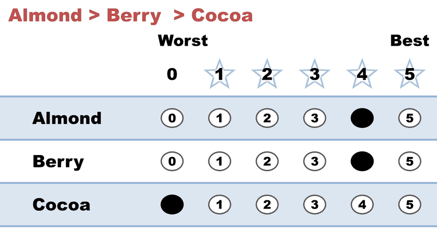
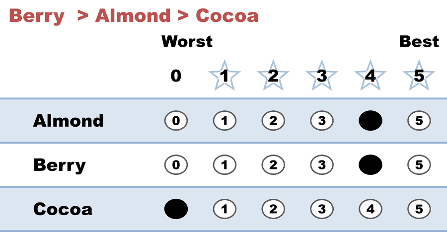
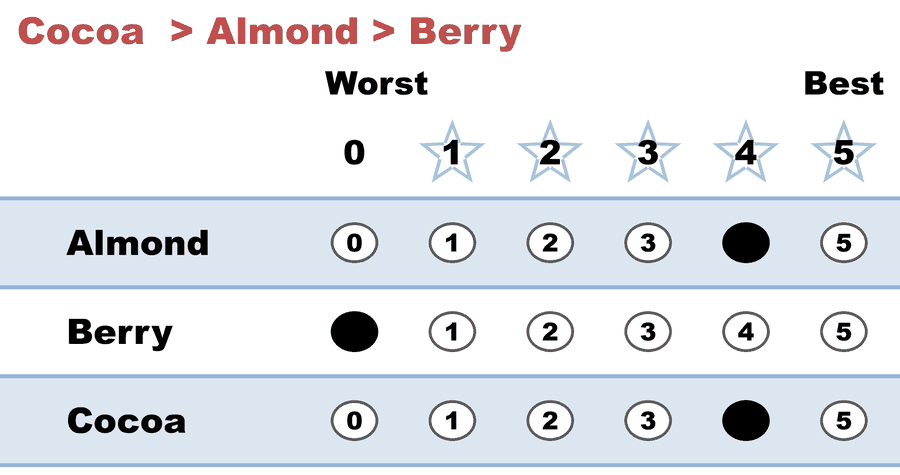
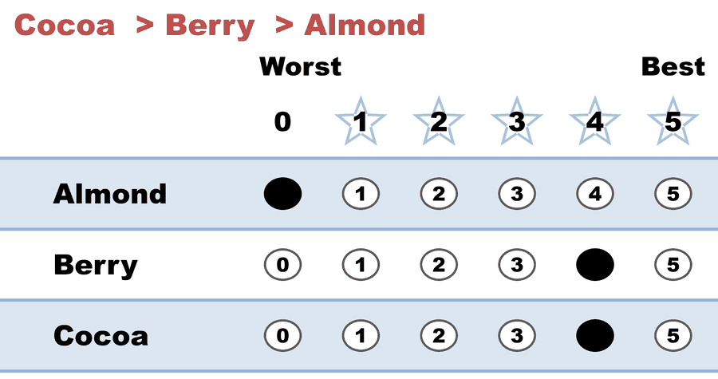

---
search:
  exclude: true
---

# Kim (A,B)-scoring, A=1 — the middle choice is worth everything (Negative voting)

*Generated from [`kim_scoring_a1_negative.yaml`](../kim_scoring_a1_negative.yaml) — do not edit by hand. Regenerate: `python STARVote_LH_tabulation_engine/tools_adam/scripts/build_yaml_pages.py`.*

**Method:** [STAR (single winner)](../../../../01_STAR/01_Learn/README.md) · **1 seat** · **Expected winner:** Berry

## Scenario

ONE electorate, marked three ways. This is file 3 of 3.

Same 36 voters, same opinions, same rankings as kim_scoring_a0_plurality.yaml
and kim_scoring_ahalf_borda.yaml. Only the middle mark moves.

  12 voters   Almond > Berry  > Cocoa
   8 voters   Berry  > Almond > Cocoa
   7 voters   Cocoa  > Almond > Berry
   9 voters   Cocoa  > Berry  > Almond

THIS FILE sets A = 1, written x4 as (4, 4, 0). When a voter's second choice
scores exactly as much as their first, the only thing a ballot still says is
which candidate the voter left OUT — so this is NEGATIVE VOTING (also called
anti-plurality), the rule where each voter effectively casts one vote against
somebody. The winner is whoever is ranked last least often.

The tally: Berry 116, Almond 108, Cocoa 64. Berry wins. Berry led NO file
before this one — 32 points and last place under A = 0, second under A = 1/2 —
and wins here on the strength of being almost nobody's last choice (7 of 36).

Note the mirror of file 1. There, the two Cocoa blocs handed in identical
papers. Here it is the Almond and Berry blocs that become indistinguishable —
12 voters ranking Almond > Berry and 8 ranking Berry > Almond both mark
(4, 4, 0), collapsing into one row of 20 — and those same 20 register as
Equal Support in the runoff, because their two marks are equal. Each end of
the dial destroys information; only the middle setting keeps all of it.

THE POINT OF THE THREE FILES: one electorate, three winners — Cocoa, Almond,
Berry — chosen entirely by a designer's decision about how much a second
choice is worth. No voter changed their mind, and no ranking moved. Kim's
answer is that the dial should not be the designer's to set at all: his
incentive-compatible optimum hands it to the VOTER, which is what the two
approval files in this folder show.

Concept page: 07_Concepts/topics/ordinal_vs_cardinal_mechanism_design.md

## Ballots

The ballots as marked — the filled bubble is the score given, and the score is the number in its column:

| Ballot as marked | Voters | Almond | Berry | Cocoa |
|:--|:--:|:--:|:--:|:--:|
|  Berry  > Cocoa: Almond 4, Berry 4, Cocoa 0."> | 12 | 4 | 4 | 0 |
|  Almond > Cocoa: Almond 4, Berry 4, Cocoa 0."> | 8 | 4 | 4 | 0 |
|  Almond > Berry: Almond 4, Berry 0, Cocoa 4."> | 7 | 4 | 0 | 4 |
|  Berry  > Almond: Almond 0, Berry 4, Cocoa 4."> | 9 | 0 | 4 | 4 |

The same ballots as the file records them:

Row 1 = candidate names; each later row is one voter's 0–5 scores (a `N ×` prefix = N identical ballots).

```text
Count:Almond,Berry,Cocoa
12:4,4,0   # Almond > Berry  > Cocoa
8:4,4,0    # Berry  > Almond > Cocoa
7:4,0,4    # Cocoa  > Almond > Berry
9:0,4,4    # Cocoa  > Berry  > Almond
```

## What the engine says

The count, step by step — the rounds and how the winner is reached:

<!-- --8<-- [start:report] -->
```text
[Divergence from STAR]
  STAR                   = Berry
  Choose-One (Plurality) = Almond   (differs from STAR)
  RCV-IRV                = Almond   (differs from STAR)
  Note: 36 of 36 ballots (100%) had equal non-zero scores, so their ranks
        were decided by candidate priority order. The RCV-IRV result may be
        an artifact of score-to-rank tie-breaking rather than a deep
        difference.
  Note: Ranked Robin (RCV-RR) agrees with STAR, so RCV-IRV is the lone
        outlier — the classic center-squeeze signature.
  Full round-by-round reports (generated for review):
  RCV-IRV rounds: cases_tabulated/kim_scoring_a1_negative_RCV-IRV_tabulated.txt

--- STAR Voting Method (single winner) ---

[STAR Voting]
 Tabulating 36 ballots.
Count × Almond,Berry,Cocoa
   20 ×      4,    4,    0
    9 ×      0,    4,    4
    7 ×      4,    0,    4

[STAR Voting: Scoring Round]
 The two highest-scoring candidates advance to the next round.
   Berry         -- 116 -- First place
   Almond        -- 108 -- Second place
   Cocoa         --  64
 Berry and Almond advance.

[STAR Voting: Automatic Runoff Round]
 The candidate preferred in the most head-to-head matchups wins.
   Berry         -- 9 -- First place
   Almond        -- 7
   Equal Support -- 20
 Berry wins.
   Runoff math:
     36  ballots cast
   − 20  Equal Support (no preference between the two finalists)
     ──
     16  voters with a preference  (majority = 9)
           Berry 9 (56%)  ·  Almond 7 (44%)

[STAR Voting: Winner — STAR Voting Method (single winner)]
 Berry
```
<!-- --8<-- [end:report] -->

### Full audit — preference matrix, Condorcet, and score distribution

```text
--- Runoff (Preference) Matrix ---
Head-to-head / pairwise comparison
Legend: For - Equal Support - Against
        * indicates Top 2 Finalist
                 |   * Almond   |  * Berry    |    Cocoa    |
-------------------------------------------------------------
      * Almond > |     ---      | 7 - 20 -  9 |20 -  7 -  9 |
       * Berry > |  9 - 20 -  7 |    ---      |20 -  9 -  7 |
         Cocoa > |  9 -  7 - 20 | 7 -  9 - 20 |    ---      |

[Condorcet Winner]
  Condorcet Winner: Berry — matches the STAR winner

[Condorcet Loser]
  Condorcet Loser: Cocoa — loses every head-to-head matchup

[Score Distribution] (how many ballots gave each star rating)
                   Score
Candidate   5   4   3   2   1   0  | Total   Avg
Almond      0  27   0   0   0   9  |   108   3.0
Berry       0  29   0   0   0   7  |   116   3.2
Cocoa       0  16   0   0   0  20  |    64   1.8
```

Everything in one file: the [`_tabulated` mirror](../cases_tabulated/kim_scoring_a1_negative_tabulated.txt) (regenerated on every run; every analysis forced on).

Run it yourself:

```bash
python STARVote_LH_tabulation_engine/starvote_larry_hastings.py method_comparisons/kim_ordinal_vs_cardinal/cases/kim_scoring_a1_negative.yaml
```

## See also

- [Methods disagree on this election](../../../divergence_review/cases/IRV_DIFFERS_ARTIFACT/kim_scoring_a1_negative.md) — its entry in the divergence review ledger
- [Runoff reversal (worked set)](../../../../01_STAR/02_Examples/runoff_overturns_leader/README.md)
- [Glossary](../../../../07_Concepts/GLOSSARY.md) · [all cases by method](../../../../07_Concepts/YAML_test_case_index/README.md)

More cases in this set: [kim_approval_intense_seconds](kim_approval_intense_seconds.md) · [kim_approval_lukewarm_seconds](kim_approval_lukewarm_seconds.md) · [kim_scoring_a0_plurality](kim_scoring_a0_plurality.md) · [kim_scoring_ahalf_borda](kim_scoring_ahalf_borda.md)
