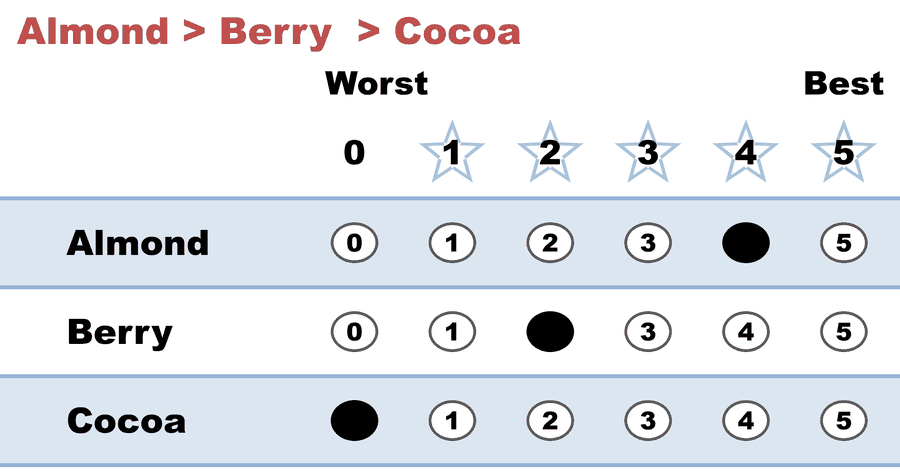
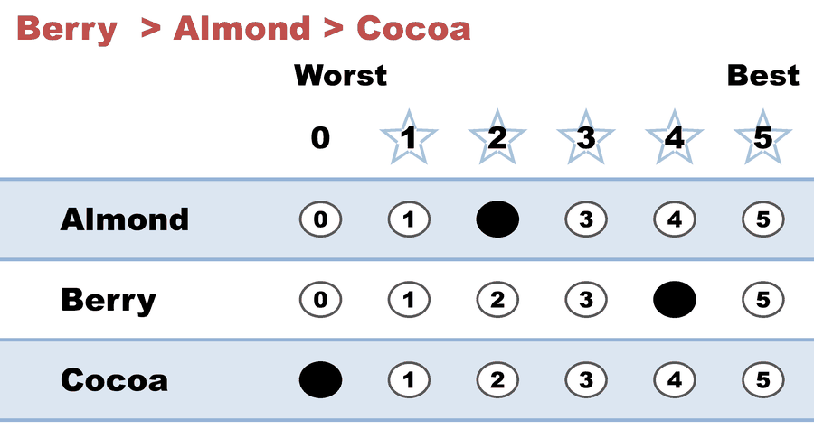
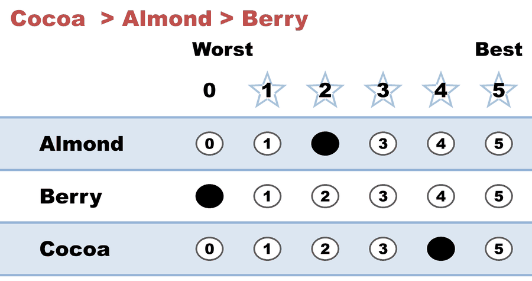
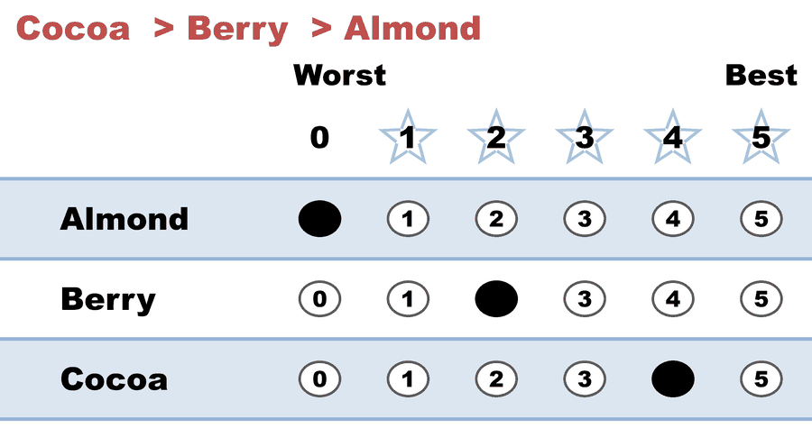

---
search:
  exclude: true
---

# Kim (A,B)-scoring, A=1/2 — the middle choice is worth half (Borda)

*Generated from [`kim_scoring_ahalf_borda.yaml`](../kim_scoring_ahalf_borda.yaml) — do not edit by hand. Regenerate: `python STARVote_LH_tabulation_engine/tools_adam/scripts/build_yaml_pages.py`.*

**Method:** [STAR (single winner)](../../../../01_STAR/01_Learn/README.md) · **1 seat** · **Expected winner:** Almond

## Scenario

ONE electorate, marked three ways. This is file 2 of 3.

Same 36 voters, same opinions, same rankings as kim_scoring_a0_plurality.yaml
and kim_scoring_a1_negative.yaml. The only thing that changes is what a
voter's SECOND choice is worth — the dial Myerson (2002) calls A, and the one
Semin Kim's mechanism-design paper (Games and Economic Behavior 104, 2017) is
really about.

  12 voters   Almond > Berry  > Cocoa
   8 voters   Berry  > Almond > Cocoa
   7 voters   Cocoa  > Almond > Berry
   9 voters   Cocoa  > Berry  > Almond

THIS FILE sets A = 1/2, written x4 as (4, 2, 0). That is the BORDA COUNT, and
Borda is not an arbitrary pick here: Kim's Proposition 1 and Corollary 1 show
that the utilitarian-best ORDINAL rule is the scoring rule whose scores are
the expected values of the ranked positions given the voter's ranking. When a
voter's middle value is uniform on (0, 1) that expectation is 1/2, and the
optimal ordinal rule IS (1, 1/2, 0). So this file is not "one more scoring
rule" — within the ordinal world, in Kim's environment, it is the best one.

The tally: Almond 78, Berry 74, Cocoa 64. Almond wins, and this is the only
one of the three files where the ballot carries three distinct marks, so the
automatic runoff has real information to work with (no Equal Support at all).

Cocoa led file 1 by 64 to 48 and finishes last here. Nobody changed their
mind; the second-choice dial moved from 0 to 1/2.

Concept page: 07_Concepts/topics/ordinal_vs_cardinal_mechanism_design.md

## Ballots

The ballots as marked — the filled bubble is the score given, and the score is the number in its column:

| Ballot as marked | Voters | Almond | Berry | Cocoa |
|:--|:--:|:--:|:--:|:--:|
|  Berry  > Cocoa: Almond 4, Berry 2, Cocoa 0."> | 12 | 4 | 2 | 0 |
|  Almond > Cocoa: Almond 2, Berry 4, Cocoa 0."> | 8 | 2 | 4 | 0 |
|  Almond > Berry: Almond 2, Berry 0, Cocoa 4."> | 7 | 2 | 0 | 4 |
|  Berry  > Almond: Almond 0, Berry 2, Cocoa 4."> | 9 | 0 | 2 | 4 |

The same ballots as the file records them:

Row 1 = candidate names; each later row is one voter's 0–5 scores (a `N ×` prefix = N identical ballots).

```text
Count:Almond,Berry,Cocoa
12:4,2,0   # Almond > Berry  > Cocoa
8:2,4,0    # Berry  > Almond > Cocoa
7:2,0,4    # Cocoa  > Almond > Berry
9:0,2,4    # Cocoa  > Berry  > Almond
```

## What the engine says

The count, step by step — the rounds and how the winner is reached:

<!-- --8<-- [start:report] -->
```text
[Divergence from STAR]
  STAR                   = Almond
  Choose-One (Plurality) = Cocoa   (differs from STAR)
  Approval               = Cocoa   (differs from STAR)

--- STAR Voting Method (single winner) ---

[STAR Voting]
 Tabulating 36 ballots.
Count × Almond,Berry,Cocoa
   12 ×      4,    2,    0
    9 ×      0,    2,    4
    8 ×      2,    4,    0
    7 ×      2,    0,    4

[STAR Voting: Scoring Round]
 The two highest-scoring candidates advance to the next round.
   Almond        -- 78 -- First place
   Berry         -- 74 -- Second place
   Cocoa         -- 64
 Almond and Berry advance.

[STAR Voting: Automatic Runoff Round]
 The candidate preferred in the most head-to-head matchups wins.
   Almond        -- 19 -- First place
   Berry         -- 17
   Equal Support --  0
 Almond wins.
   Runoff math:
     36  ballots cast
   −  0  Equal Support (no preference between the two finalists)
     ──
     36  voters with a preference  (majority = 19)
           Almond 19 (53%)  ·  Berry 17 (47%)

[STAR Voting: Winner — STAR Voting Method (single winner)]
 Almond
```
<!-- --8<-- [end:report] -->

### Full audit — preference matrix, Condorcet, and score distribution

```text
--- Runoff (Preference) Matrix ---
Head-to-head / pairwise comparison
Legend: For - Equal Support - Against
        * indicates Top 2 Finalist
                 |   * Almond   |  * Berry    |    Cocoa    |
-------------------------------------------------------------
      * Almond > |     ---      |19 -  0 - 17 |20 -  0 - 16 |
       * Berry > | 17 -  0 - 19 |    ---      |20 -  0 - 16 |
         Cocoa > | 16 -  0 - 20 |16 -  0 - 20 |    ---      |

[Condorcet Winner]
  Condorcet Winner: Almond — matches the STAR winner

[Condorcet Loser]
  Condorcet Loser: Cocoa — loses every head-to-head matchup — elected by Choose-One (Plurality), Approval!

[Score Distribution] (how many ballots gave each star rating)
                   Score
Candidate   5   4   3   2   1   0  | Total   Avg
Almond      0  12   0  15   0   9  |    78   2.2
Berry       0   8   0  21   0   7  |    74   2.1
Cocoa       0  16   0   0   0  20  |    64   1.8
```

Everything in one file: the [`_tabulated` mirror](../cases_tabulated/kim_scoring_ahalf_borda_tabulated.txt) (regenerated on every run; every analysis forced on).

Run it yourself:

```bash
python STARVote_LH_tabulation_engine/starvote_larry_hastings.py method_comparisons/kim_ordinal_vs_cardinal/cases/kim_scoring_ahalf_borda.yaml
```

## See also

- [Methods disagree on this election](../../../divergence_review/cases/APPROVAL_OR_MINOR/kim_scoring_ahalf_borda.md) — its entry in the divergence review ledger
- [Runoff reversal (worked set)](../../../../01_STAR/02_Examples/runoff_overturns_leader/README.md)
- [Glossary](../../../../07_Concepts/GLOSSARY.md) · [all cases by method](../../../../07_Concepts/YAML_test_case_index/README.md)

More cases in this set: [kim_approval_intense_seconds](kim_approval_intense_seconds.md) · [kim_approval_lukewarm_seconds](kim_approval_lukewarm_seconds.md) · [kim_scoring_a0_plurality](kim_scoring_a0_plurality.md) · [kim_scoring_a1_negative](kim_scoring_a1_negative.md)
