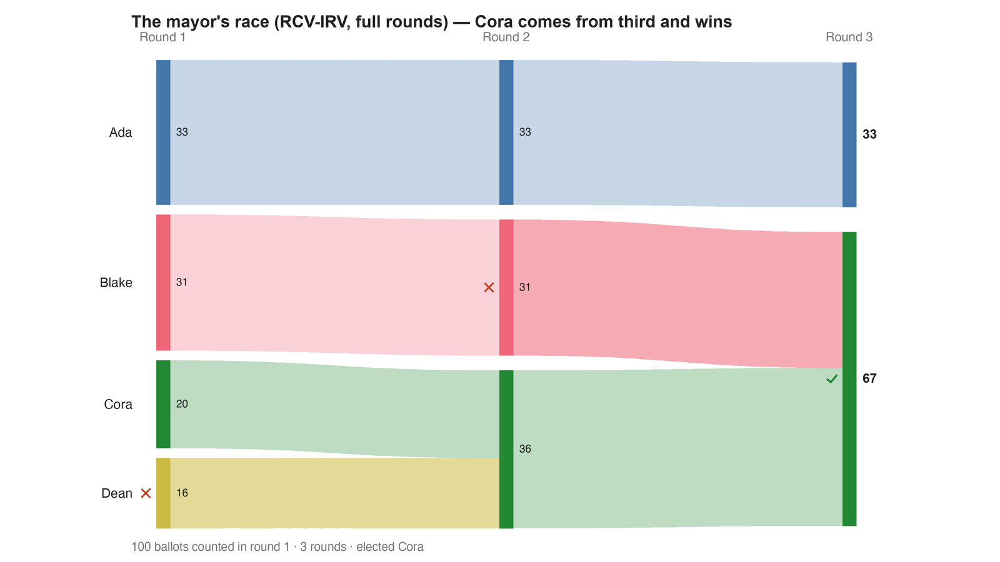

---
search:
  exclude: true
---

# The mayor's race (RCV-IRV, full rounds) — Cora comes from third and wins

*Generated from [`bv2277_tqfdbg_mayor_irv.yaml`](../bv2277_tqfdbg_mayor_irv.yaml) — do not edit by hand. Regenerate: `python STARVote_LH_tabulation_engine/tools_adam/scripts/build_yaml_pages.py`.*

**Method:** [RCV-IRV (Instant Runoff)](../../../../06_Other/RCV_IRV/concepts/README.md) · **1 seat** · **Expected winner:** Cora

**▶ Live on BetterVoting:** [vote](https://bettervoting.com/tqfdbg) · **[results ↗](https://bettervoting.com/tqfdbg/results)** (election `tqfdbg` · test `BV2277`).

## Scenario

100 ballots, four candidates, one ordinary-looking mayoral race. Counted by FULL RCV-IRV: Dean is eliminated first and his ballots lift Cora from 20 to 36, past Blake; Blake is eliminated next and his ballots lift Cora to 67. Cora wins — and Cora is also the Condorcet winner (beats Ada 67-33, Blake 69-31, Dean 84-16). The paper's "single-elimination RCV" never holds those rounds: it keeps only the top two (Ada and Blake) and elects Blake. This is the case Kissel calls "quite rare" — the streamlined model eliminating a candidate who would win the fuller count — and it costs the Condorcet winner. Companion: …_rr.yaml, …_star.yaml, and the contingent / supplementary counts run by contingent_vote_report.py.

## Ballots

Each row is one voter's ranking, most-preferred first (`N:` prefix = N identical ballots).

```text
33:Ada>Cora>Blake>Dean     # Ada's voters — Cora is their second choice
31:Blake>Cora>Ada>Dean     # Blake's voters — Cora is their second choice too
20:Cora>Blake>Ada>Dean     # the moderates, leaning Blake
16:Dean>Cora>Blake>Ada     # Dean's voters — Cora again
```

## What the engine says



*Where the votes went. Band thickness is votes; a band leaving an eliminated candidate lands on whoever that ballot ranked next, or on **inactive** if it ranked nobody who was left.*

The count, step by step — the rounds and how the winner is reached:

<!-- --8<-- [start:report] -->
```text
--- RCV / Instant-Runoff Voting (single winner) ---
  The mayor's race (RCV-IRV, full rounds) — Cora comes from third and wins
 Tabulating 100 ballots (ranked ballots).

ROUND 1
Candidate      Votes  Status
-----------  -------  --------
Ada               33  Hopeful
Blake             31  Hopeful
Cora              20  Hopeful
Dean              16  Rejected

ROUND 2
Candidate      Votes  Status
-----------  -------  --------
Cora              36  Hopeful
Ada               33  Hopeful
Blake             31  Rejected
Dean               0  Rejected

FINAL RESULT
Candidate      Votes  Status
-----------  -------  --------
Cora              67  Elected
Ada               33  Rejected
Blake              0  Rejected
Dean               0  Rejected


Winner(s) — RCV / Instant-Runoff Voting (single winner)
  Cora

--- Transfers and inactive ballots (what the round tables leave out) ---
The tables above give each candidate's round total but not where a
transferred vote came FROM, nor how many ballots stopped counting.
Both are recomputed from the ballots, using the eliminations the
count above actually made.

ROUND 1 — 100 of 100 ballots still active; majority = 51
   Dean eliminated with 16:
      → Cora                     16

ROUND 2 — 100 of 100 ballots still active; majority = 51
   Blake eliminated with 31:
      → Cora                     31

FINAL ROUND — 100 of 100 ballots still active; majority = 51
   Cora                     67  (67.0% of the still-active)  ← elected
   Ada                      33  (33.0% of the still-active)
   Never exhausted, never transferred:
      33 ballots held by Ada carried a lower ranking that was never read
      (the count stopped here, so those preferences did nothing).

Inactive ballots at the final round: 0 of 100 (0.0%).
   Cora's 67 is a majority of the 100 still active AND of all 100 cast (67.0%).
```
<!-- --8<-- [end:report] -->

### Full audit — preference matrix, Condorcet, and score distribution

```text
--- Smith Set (the generalized Condorcet winner) ---
The smallest group whose every member beats every candidate outside it —
the honest answer to "who is even in contention?".
   Smith set (1 of 4): Cora
   Outside (3):        Ada, Blake, Dean
   One member ⇒ Cora is the Condorcet winner, beating every rival head-to-head.
   RCV-IRV winner Cora is INSIDE the Smith set. ✓
      Not guaranteed — RCV-IRV is not Smith-efficient — but it holds here.
   More: 07_Concepts/topics/smith_set.md
```

Everything in one file: the [`_tabulated` mirror](../cases_tabulated/bv2277_tqfdbg_mayor_irv_tabulated.txt) (regenerated on every run; every analysis forced on).

Run it yourself:

```bash
python STARVote_LH_tabulation_engine/starvote_larry_hastings.py method_comparisons/kissel_single_elimination_rcv/cases/bv2277_tqfdbg_mayor_irv.yaml
```

## See also

- [Condorcet efficiency (topic hub)](../../../../07_Concepts/topics/condorcet/README.md)
- [Glossary](../../../../07_Concepts/GLOSSARY.md) · [all cases by method](../../../../07_Concepts/YAML_test_case_index/README.md)

More cases in this set: [bv2277_tqfdbg_mayor_plurality](bv2277_tqfdbg_mayor_plurality.md) · [bv2277_tqfdbg_mayor_rr](bv2277_tqfdbg_mayor_rr.md) · [bv2277_tqfdbg_mayor_star](bv2277_tqfdbg_mayor_star.md) · [bv2278_8cdkkc_five_way_irv](bv2278_8cdkkc_five_way_irv.md) · [bv2278_8cdkkc_five_way_plurality](bv2278_8cdkkc_five_way_plurality.md) · [bv2278_8cdkkc_five_way_rr](bv2278_8cdkkc_five_way_rr.md) · [bv2278_8cdkkc_five_way_star](bv2278_8cdkkc_five_way_star.md)
