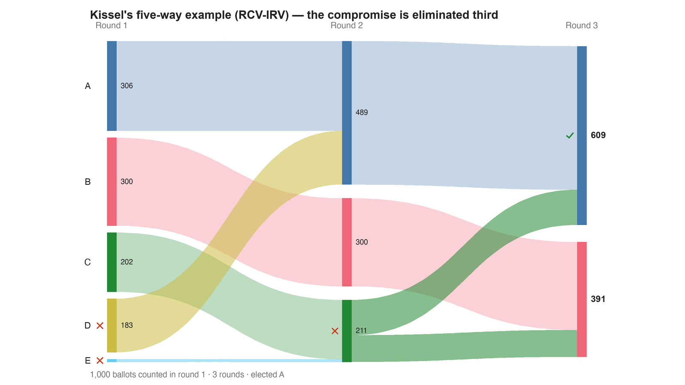

---
search:
  exclude: true
---

# Kissel's five-way example (RCV-IRV) — the compromise is eliminated third

*Generated from [`bv2278_8cdkkc_five_way_irv.yaml`](../bv2278_8cdkkc_five_way_irv.yaml) — do not edit by hand. Regenerate: `python STARVote_LH_tabulation_engine/tools_adam/scripts/build_yaml_pages.py`.*

**Method:** [RCV-IRV (Instant Runoff)](../../../../06_Other/RCV_IRV/concepts/README.md) · **1 seat** · **Expected winner:** A

**▶ Live on BetterVoting:** [vote](https://bettervoting.com/8cdkkc) · **[results ↗](https://bettervoting.com/8cdkkc/results)** (election `8cdkkc` · test `BV2278`).

## Scenario

The five-candidate field printed on p.5 of Adam Kissel's "Can Ranked-Choice Voting Work? A Conservative Approach" (Cardinal Institute for West Virginia Policy), given ballots. The paper's shape: A >30%, B 30%, C 20%, D <19%, E <1%. Here A 306, B 300, C 202, D 183, E 9 of 1000. C is the moderate — the SECOND choice of both A's and B's voters — and beats every rival head-to-head (the Condorcet winner: 511-489 over A, 700-300 over B). RCV-IRV never finds that out. Round 1 eliminates E, round 2 D, round 3 C, and A wins 609-391. The paper says C could only win "if a large majority of the D voters choose C"; that is the wrong diagnosis. C's problem is not D's transfers, it is that the A and B voters' second choices are never counted at all. Same ballots under Ranked Robin (…_rr.yaml) and STAR (…_star.yaml) elect C.

## Ballots

Each row is one voter's ranking, most-preferred first (`N:` prefix = N identical ballots).

Markers on these ballots: `-` blank · `~` race abstention · `&` candidate abstention · `?` spoiled · `%` spoiled+reissued — all tabulate as 0 (reported honestly).

```text
306:A>C>D>B>E     # A-partisans — moderate C is their second choice
300:B>C>D>A>E     # B-partisans — moderate C is their second choice too
111:C>A>B>D>E     # moderates leaning A
 91:C>B>A>D>E     # moderates leaning B
183:D>A>C>B>E     # D's voters lean A
  9:E>D>C>A>B     # the <1% candidate the paper says is eliminated first
```

## What the engine says



*Where the votes went. Band thickness is votes; a band leaving an eliminated candidate lands on whoever that ballot ranked next, or on **inactive** if it ranked nobody who was left.*

The count, step by step — the rounds and how the winner is reached:

<!-- --8<-- [start:report] -->
```text
--- RCV / Instant-Runoff Voting (single winner) ---
  Kissel's five-way example (RCV-IRV) — the compromise is eliminated third
 Tabulating 1000 ballots (ranked ballots).

ROUND 1
Candidate      Votes  Status
-----------  -------  --------
A                306  Hopeful
B                300  Hopeful
C                202  Hopeful
D                183  Rejected
E                  9  Rejected

ROUND 2
Candidate      Votes  Status
-----------  -------  --------
A                489  Hopeful
B                300  Hopeful
C                211  Rejected
D                  0  Rejected
E                  0  Rejected

FINAL RESULT
Candidate      Votes  Status
-----------  -------  --------
A                609  Elected
B                391  Rejected
C                  0  Rejected
D                  0  Rejected
E                  0  Rejected


Winner(s) — RCV / Instant-Runoff Voting (single winner)
  A

--- Transfers and inactive ballots (what the round tables leave out) ---
The tables above give each candidate's round total but not where a
transferred vote came FROM, nor how many ballots stopped counting.
Both are recomputed from the ballots, using the eliminations the
count above actually made.

ROUND 1 — 1000 of 1000 ballots still active; majority = 501
   E eliminated with 9:
      → C                         9
   D eliminated with 183:
      → A                       183

ROUND 2 — 1000 of 1000 ballots still active; majority = 501
   C eliminated with 211:
      → A                       120
      → B                        91

FINAL ROUND — 1000 of 1000 ballots still active; majority = 501
   A                       609  (60.9% of the still-active)  ← elected
   B                       391  (39.1% of the still-active)
   Never exhausted, never transferred:
      391 ballots held by B carried a lower ranking that was never read
      (the count stopped here, so those preferences did nothing).

Inactive ballots at the final round: 0 of 1000 (0.0%).
   A's 609 is a majority of the 1000 still active AND of all 1000 cast (60.9%).
```
<!-- --8<-- [end:report] -->

### Full audit — preference matrix, Condorcet, and score distribution

```text
--- Smith Set (the generalized Condorcet winner) ---
The smallest group whose every member beats every candidate outside it —
the honest answer to "who is even in contention?".
   Smith set (1 of 5): C
   Outside (4):        A, D, B, E
   One member ⇒ C is the Condorcet winner, beating every rival head-to-head.
   RCV-IRV winner A is OUTSIDE the Smith set. ✗
      Every member of the set (C) beats A head-to-head, yet
      RCV-IRV elected A anyway. RCV-IRV is not Smith-efficient (nor
      Condorcet-efficient) — this is the shape a center squeeze leaves behind.
   More: 07_Concepts/topics/smith_set.md
```

Everything in one file: the [`_tabulated` mirror](../cases_tabulated/bv2278_8cdkkc_five_way_irv_tabulated.txt) (regenerated on every run; every analysis forced on).

Run it yourself:

```bash
python STARVote_LH_tabulation_engine/starvote_larry_hastings.py method_comparisons/kissel_single_elimination_rcv/cases/bv2278_8cdkkc_five_way_irv.yaml
```

## See also

- [Condorcet efficiency (topic hub)](../../../../07_Concepts/topics/condorcet/README.md)
- [Glossary](../../../../07_Concepts/GLOSSARY.md) · [all cases by method](../../../../07_Concepts/YAML_test_case_index/README.md)

More cases in this set: [bv2277_tqfdbg_mayor_irv](bv2277_tqfdbg_mayor_irv.md) · [bv2277_tqfdbg_mayor_plurality](bv2277_tqfdbg_mayor_plurality.md) · [bv2277_tqfdbg_mayor_rr](bv2277_tqfdbg_mayor_rr.md) · [bv2277_tqfdbg_mayor_star](bv2277_tqfdbg_mayor_star.md) · [bv2278_8cdkkc_five_way_plurality](bv2278_8cdkkc_five_way_plurality.md) · [bv2278_8cdkkc_five_way_rr](bv2278_8cdkkc_five_way_rr.md) · [bv2278_8cdkkc_five_way_star](bv2278_8cdkkc_five_way_star.md)
