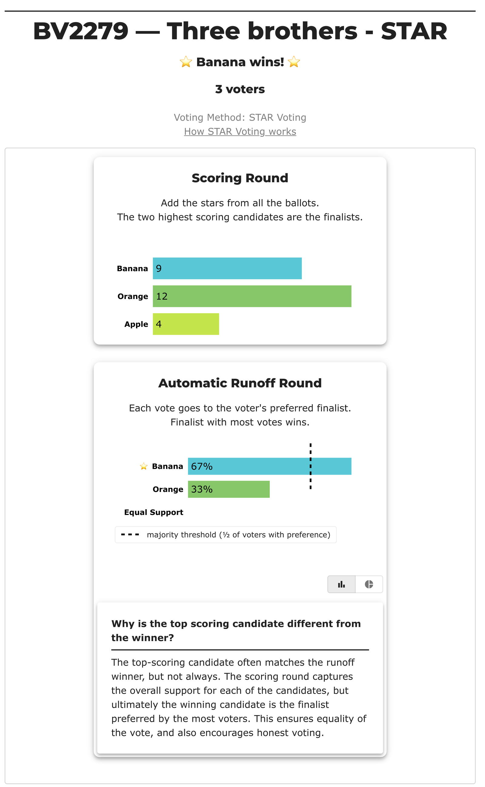
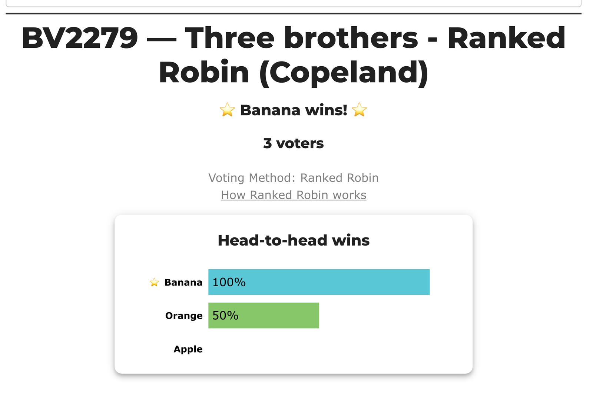
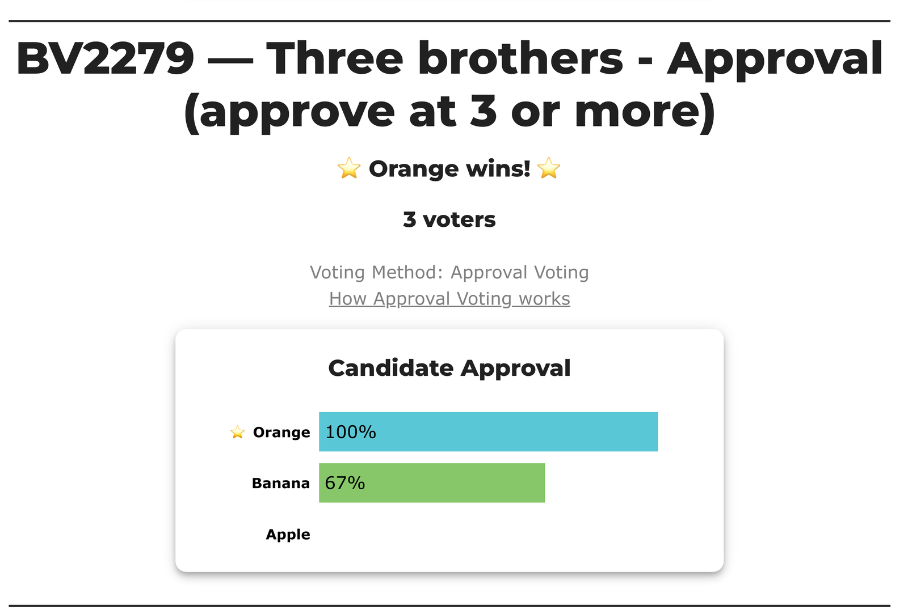
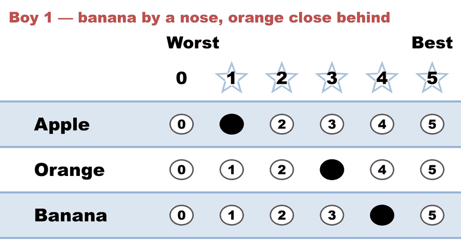
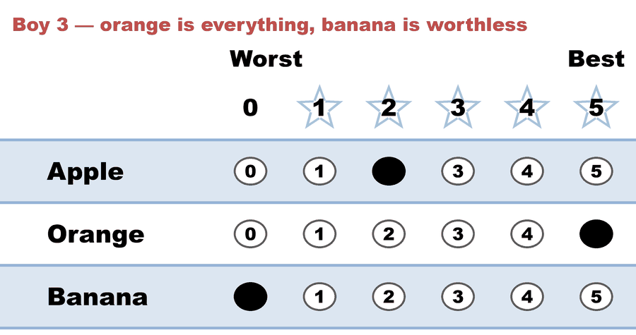

# Majoritarian vs. utilitarian — the deepest split between two "good winners"

**Level: 201 · deep dive**

**▶ Live on BetterVoting:** [vote](https://bettervoting.com/qywq7d) · **[results ↗](https://bettervoting.com/qywq7d/results)** (election `qywq7d`, BV2279 — three races, same three voters).

**One line:** the smallest election where *whom a majority prefers* and *who makes the electorate happiest* are different candidates — and where you can watch STAR's two rounds chase one ideal each.

Two of the [four ideals of a good winner](../../07_Concepts/topics/what_makes_a_good_winner.md) pull apart more often than any other pair:

- the **majoritarian** winner — whom a majority prefers head-to-head (the [Condorcet winner](../../07_Concepts/topics/condorcet/README.md), when one exists);
- the **utilitarian** winner — who maximizes total voter satisfaction ([electowiki](https://electowiki.org/wiki/Utilitarian_winner)), i.e. the highest score sum.

They usually agree. This election is built so they don't.

## The three races — one electorate, three pieces of paper

| Race | Method | Reads… | Winner | Which ideal |
|---|---|---|---|---|
| [1 — STAR](cases/cases_pages/bv2279_qywq7d_star.md) | STAR | scores **+** a runoff | **Banana** | scores the utilitarian, elects the majoritarian — [`.yaml`](cases/bv2279_qywq7d_star.yaml) |
| [2 — Ranked Robin](cases/cases_pages/bv2279_qywq7d_ranked_robin.md) | RankedRobin | order only | **Banana** | majoritarian — [`.yaml`](cases/bv2279_qywq7d_ranked_robin.yaml) |
| [3 — Approval](cases/cases_pages/bv2279_qywq7d_approval.md) | Approval | a yes/no cut | **Orange** | utilitarian — [`.yaml`](cases/bv2279_qywq7d_approval.yaml) |

Three voters, three candidates. Banana is two brothers' favorite and worth **zero** to the third; Orange is nobody's favorite and everybody's good-enough. Orange wins the score round 12–9; Banana wins the runoff 2–1 and the STAR election.

### Race 1 — STAR: both ideals on one screen

Orange leads the scoring round, Banana takes the runoff, and BetterVoting's own explainer says why:

### Race 2 — Ranked Robin: the majoritarian answer, independently

Same three people, ranks instead of scores. Banana wins every head-to-head it plays; Apple wins none:

### Race 3 — Approval: the winner changes

Same three people again, a yes/no cut at 3. Orange takes it, and Banana — the winner of the other two races — comes second:

Three screens, one electorate, two different winners. That is the split, without a word of argument attached.

<!-- ballots:bv2279_qywq7d_star -->
The ballots as marked — the filled bubble is the score given, and the score is the number in its column:

| # | Ballot as marked | Apple | Orange | Banana |
|:--:|:--|:--:|:--:|:--:|
| 1 |  | 1 | 3 | 4 |
| 2 |  | 1 | 4 | 5 |
| 3 |  | 2 | 5 | 0 |
<!-- /ballots -->

Boy 3's **0 for Banana** is the entire disagreement. A ranked ballot would have recorded him as `Orange > Apple > Banana` — true, and silent about the fact that the gap between his first and last choice is the whole width of the scale. That is exactly what race 2 does.

## The pattern the three races expose

The split is **not** cardinal-versus-ordinal, which is the tempting reading. Approval is a cardinal-ish ballot and Ranked Robin is purely ordinal, yet they land on opposite sides. The line that actually divides them is simpler:

> **Every method here that finishes with a head-to-head elects Banana. The two that never take a majority vote elect Orange.**

STAR's automatic runoff and Ranked Robin's pairwise table are both majority votes, so both land majoritarian. The scoring round and Approval both count levels of support and stop, so both land utilitarian. STAR is the interesting one precisely because it does *both*, in that order — and prints the first before overruling it with the second.

## Why this one is worth running rather than asserting

The example is Warren Smith's "three brothers split one fruit" (rangevoting.org), and it circulates — including in this repo, until now — as a **table of happiness numbers on an arbitrary 0–11 scale**. A table can't be counted, so it can only be believed. Rescaled ×5/11 onto a real 0–5 ballot, every relation the example turns on survives (the ordering of the totals, and all three head-to-heads), and the engine prints the two ideals disagreeing without anyone having to claim it:

- **Scoring Round** — Orange 12, Banana 9, Apple 4. *That is the utilitarian count.*
- **Automatic Runoff** — Banana 2, Orange 1. *That is the majoritarian check, and it reverses the result.*
- **[Condorcet Winner]** — Banana, confirming the runoff against the full pairwise matrix rather than just the top two.
- **[Divergence from STAR]** — Approval = Orange.

That last line is the part the prose version never had. The story is usually told as Score-against-everyone-else; running it turned up a **second** method on the utilitarian side, which is what race 3 exists to show. See [Eight lines of CSV, eight questions](../../YAML_library/csv_ambiguity.md) for the general form of that argument.

**Verified three ways.** LH's own tally, [BetterVoting's live count](https://bettervoting.com/qywq7d/results) (all three races, `tieBreakType: none` throughout), and — for the Ranked Robin race — `pref_voting`'s independent Copeland implementation, which returns Banana as the unique leader. Nothing here rests on a tiebreak.

## The honest reading

**STAR does not elect the utilitarian winner here**, and that is not a bug to be explained away — the automatic runoff exists to make the score leader survive a majority vote, and on this ballot set it doesn't. What STAR offers is not the "right" answer but a **legible** one: both ideals are on screen, and the report says which one it acted on. A ranked ballot could never have shown you boy 3's zero at all.

One disclosure the Approval race carries in full: the **3-or-higher approval threshold is this repo's editorial choice**, not the source's. It matches the cut the LH engine uses for its own Approval comparison, which is why the two agree — but a 4-or-higher cut ties Orange and Banana at 2 apiece and the lesson evaporates. Always say which threshold a number came from.

## See also

- [What makes a "good" winner?](../../07_Concepts/topics/what_makes_a_good_winner.md) — the four ideals, and the page this case backs
- [Cardinal utility](../../07_Concepts/topics/cardinal_utility.md) — what the "happiness scale" in the original example is claiming to be
- [Preference vs. support](../../07_Concepts/scores_and_ranks/preference_vs_support.md) — the ballot-level version of the same split
- [Same ranks, different utilities](../same_ranks_different_utilities/README.md) — two elections a ranked ballot cannot tell apart
- [The valuable Condorcet loser](../valuable_condorcet_loser/README.md) — the split pushed to its limit
