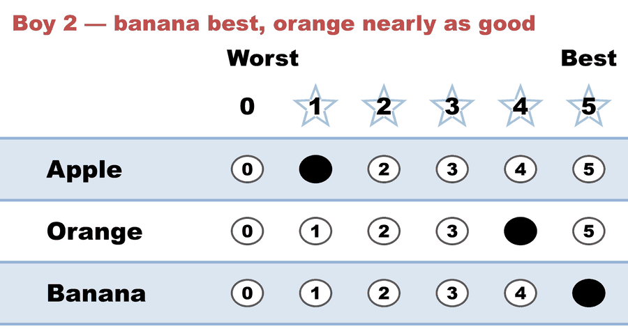

# Majoritarian vs. utilitarian — the deepest split between two "good winners"

**Level: 201 · deep dive**

**One line:** the smallest election where *whom a majority prefers* and *who makes the electorate happiest* are different candidates — and where you can watch STAR's two rounds chase one ideal each.

Two of the [four ideals of a good winner](../../07_Concepts/topics/what_makes_a_good_winner.md) pull apart more often than any other pair:

- the **majoritarian** winner — whom a majority prefers head-to-head (the [Condorcet winner](../../07_Concepts/topics/condorcet/README.md), when one exists);
- the **utilitarian** winner — who maximizes total voter satisfaction ([electowiki](https://electowiki.org/wiki/Utilitarian_winner)), i.e. the highest score sum.

They usually agree. This case is built so they don't.

## The case

| Case | What it shows | Winner |
|---|---|---|
| [Three brothers, one fruit](cases/cases_pages/three_brothers_one_fruit_c3_b3.md) | score leader ≠ Condorcet winner; STAR's runoff overturns its own scoring round | **Banana** (Orange leads the score) — [`.yaml`](cases/three_brothers_one_fruit_c3_b3.yaml) |

Three voters, three candidates. Banana is two brothers' favorite and worth **zero** to the third; Orange is nobody's favorite and everybody's good-enough. Orange wins the score round 12–9; Banana wins the runoff 2–1 and the election.

<!-- ballots:three_brothers_one_fruit_c3_b3 -->
The ballots as marked — the filled bubble is the score given, and the score is the number in its column:

| Ballot as marked | Apple | Orange | Banana |
|:--|:--:|:--:|:--:|
|  | 1 | 3 | 4 |
|  | 1 | 4 | 5 |
|  | 2 | 5 | 0 |
<!-- /ballots -->

Boy 3's **0 for Banana** is the entire disagreement. A ranked ballot would have recorded him as `Orange > Apple > Banana` — true, and silent about the fact that the gap between his first and last choice is the whole width of the scale.

## Why this one is worth running rather than asserting

The example is Warren Smith's "three brothers split one fruit" (rangevoting.org), and it circulates — including in this repo, until now — as a **table of happiness numbers on an arbitrary 0–11 scale**. A table can't be counted, so it can only be believed. Rescaled ×5/11 onto a real 0–5 ballot, every relation the example turns on survives (the ordering of the totals, and all three head-to-heads), and the engine prints the two ideals disagreeing without anyone having to claim it:

- **Scoring Round** — Orange 12, Banana 9, Apple 4. *That is the utilitarian count.*
- **Automatic Runoff** — Banana 2, Orange 1. *That is the majoritarian check, and it reverses the result.*
- **[Condorcet Winner]** — Banana, confirming the runoff against the full pairwise matrix rather than just the top two.
- **[Divergence from STAR]** — Approval = Orange, so the split is visible across methods too.

See [Eight lines of CSV, eight questions](../../YAML_library/csv_ambiguity.md) for the general form of that argument.

## The honest reading

**STAR does not elect the utilitarian winner here**, and that is not a bug to be explained away — the automatic runoff exists to make the score leader survive a majority vote, and on this ballot set it doesn't. Score voting and Approval elect Orange; STAR, [Ranked Robin](../../05_Ranked_Robin/01_Learn/ranked_robin.md), RCV-IRV and Plurality all elect Banana. What STAR offers is not the "right" answer but a **legible** one: both ideals are on screen, and the report says which one it acted on. A ranked ballot could never have shown you boy 3's zero at all.

## See also

- [What makes a "good" winner?](../../07_Concepts/topics/what_makes_a_good_winner.md) — the four ideals, and the page this case backs
- [Cardinal utility](../../07_Concepts/topics/cardinal_utility.md) — what the "happiness scale" in the original example is claiming to be
- [Preference vs. support](../../07_Concepts/scores_and_ranks/preference_vs_support.md) — the ballot-level version of the same split
- [Same ranks, different utilities](../same_ranks_different_utilities/README.md) — two elections a ranked ballot cannot tell apart
- [The valuable Condorcet loser](../valuable_condorcet_loser/README.md) — the split pushed to its limit
