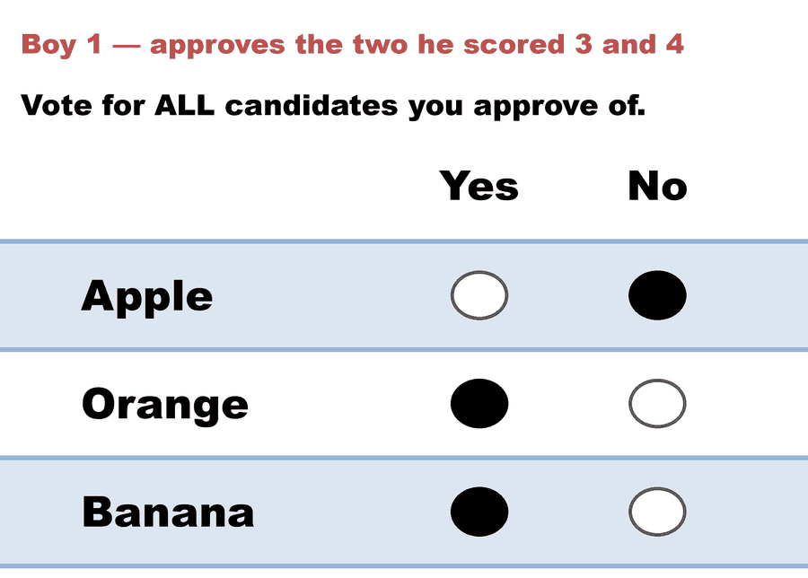
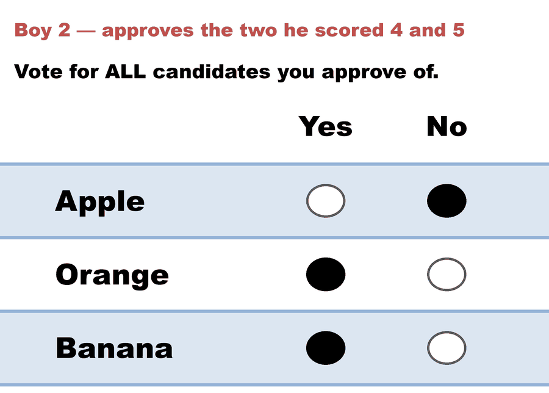
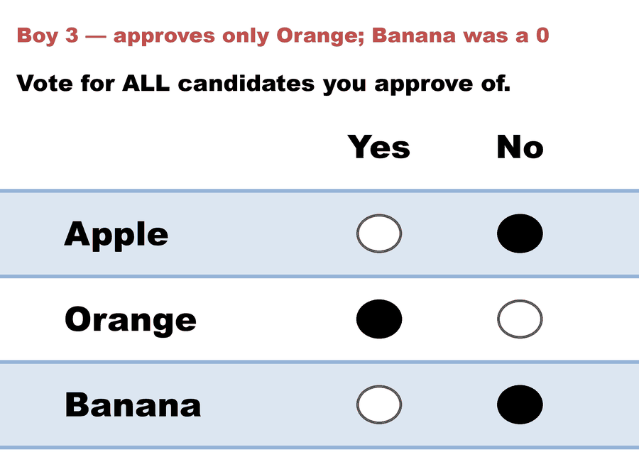

---
search:
  exclude: true
---

# Three brothers, one fruit — Approval lands on the utilitarian winner

*Generated from [`bv2279_qywq7d_approval.yaml`](../bv2279_qywq7d_approval.yaml) — do not edit by hand. Regenerate: `python STARVote_LH_tabulation_engine/tools_adam/scripts/build_yaml_pages.py`.*

**Method:** [Approval Voting](../../../../04_Approval/01_Learn/README.md) · **1 seat** · **Expected winner:** Orange

**▶ Live on BetterVoting:** [vote](https://bettervoting.com/qywq7d) · **[results ↗](https://bettervoting.com/qywq7d/results)** (election `qywq7d` · test `BV2279`).

## Scenario

Race 3 of 3 in the three-brothers election (BV2279, bvid qywq7d; BV-confirmed).
The setup, the source and the x5/11 rescale are documented in the STAR race,
bv2279_qywq7d_star.yaml.

The same three opinions as approvals: each brother approves every fruit he
scored 3 or higher.

  boy 1  (1, 3, 4)  ->  Orange, Banana
  boy 2  (1, 4, 5)  ->  Orange, Banana
  boy 3  (2, 5, 0)  ->  Orange

Orange 3, Banana 2, Apple 0. Approval elects ORANGE — the utilitarian winner,
the same answer the STAR scoring round gives before the runoff overturns it.

This race is the one that was missing from the prose version of this example.
The story is usually told as Score-versus-everyone-else; running it turned up
a second method on the utilitarian side, and the LH engine reports it directly
as [Divergence from STAR] Approval = Orange.

The reason is structural rather than a coincidence of this ballot set:
Approval, like the scoring round, never takes a majority vote. It counts
levels of support and stops. Every method here that finishes with a
head-to-head — STAR's runoff, Ranked Robin's pairwise table — elects Banana.
The two that don't elect Orange.

DISCLOSURE, because it is an editorial choice and not arithmetic: the 3-or-
higher threshold is this file's, not the source's. It is the same cut the LH
engine uses to derive its Approval comparison, which is why the two agree.
A 4-or-higher cut gives Orange 2, Banana 2 — a tie, decided by lot, and the
lesson evaporates. Say which threshold a number came from.

## Ballots

The ballots as marked — a filled **Yes** is a `1` in that candidate's column, a filled **No** a `0`:

| Ballot as marked | Apple | Orange | Banana |
|:--|:--:|:--:|:--:|
|  | 0 | 1 | 1 |
|  | 0 | 1 | 1 |
|  | 0 | 1 | 0 |

The same ballots as the file records them:

Row 1 = candidate names; each later row is one voter's approvals (`1` = approve, `0`/blank = not approved).

```text
Apple,Orange,Banana
0,1,1   # Boy 1 — approves the two he scored 3 and 4
0,1,1   # Boy 2 — approves the two he scored 4 and 5
0,1,0   # Boy 3 — approves only Orange; Banana was a 0
```

## What the engine says

Full report from the [`_tabulated` mirror](../cases_tabulated/bv2279_qywq7d_approval_tabulated.txt) (regenerated on every run; every analysis forced on):

<!-- --8<-- [start:report] -->
```text
--- Approval Voting (single winner) ---
 Tabulating 3 ballots (any non-zero score = approval).

Ballots:
   columns = Apple, Orange, Banana      (1 = approve; 0 = not approved)
     2 × 0,1,1
     1 × 0,1,0

   Orange -- 3 (100%) -- Elected
   Banana -- 2 (67%)
   Apple  -- 0 (0%)

[Approval Distribution] (how many candidates each ballot approved)
   5 approvals across 3 ballots — average 1.7 of 3 (range 1–2).
     approved 1: 1 ballot
     approved 2: 2 ballots

[Co-Approval Matrix]
 Of the voters who approved the ROW candidate, the % who ALSO approved the COLUMN candidate.
           | Orange | Banana | Apple  |
   ------------------------------------
   Orange  |   --   |  67%   |   0%   |
   Banana  |  100%  |   --   |   0%   |
   Apple   |   ·    |   ·    |   --   |

Winner — Approval Voting (single winner)
  Orange
```
<!-- --8<-- [end:report] -->

Run it yourself:

```bash
python STARVote_LH_tabulation_engine/starvote_larry_hastings.py method_comparisons/majoritarian_vs_utilitarian/cases/bv2279_qywq7d_approval.yaml
```

## See also

- [Ties & tie-breaking (topic hub)](../../../../07_Concepts/topics/ties/README.md)
- [Runoff reversal (worked set)](../../../../01_STAR/02_Examples/runoff_overturns_leader/README.md)
- [Glossary](../../../../07_Concepts/GLOSSARY.md) · [all cases by method](../../../../07_Concepts/YAML_test_case_index/README.md)

More cases in this set: [bv2279_qywq7d_ranked_robin](bv2279_qywq7d_ranked_robin.md) · [bv2279_qywq7d_star](bv2279_qywq7d_star.md)
