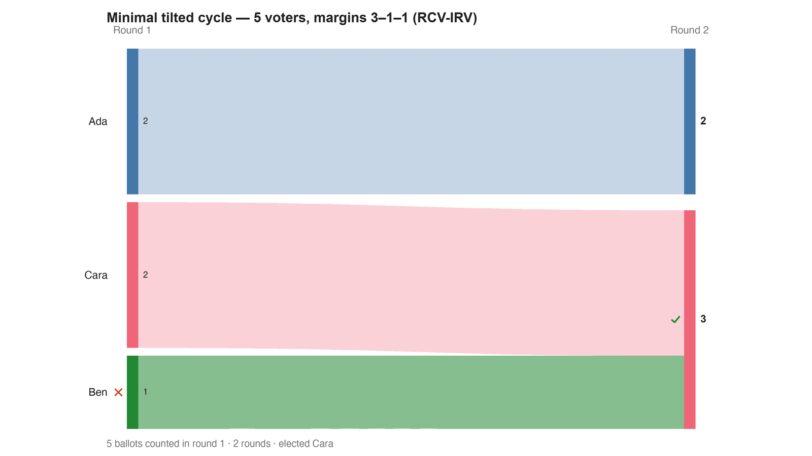

---
search:
  exclude: true
---

# Minimal tilted cycle — 5 voters, margins 3–1–1 (RCV-IRV)

*Generated from [`tilted_cycle_c3_b5_irv.yaml`](../tilted_cycle_c3_b5_irv.yaml) — do not edit by hand. Regenerate: `python STARVote_LH_tabulation_engine/tools_adam/scripts/build_yaml_pages.py`.*

**Method:** [rcv-irv](../../../../07_Concepts/README.md) · **1 seat** · **Expected winner:** Cara

## Scenario

The same five ballots as tilted_cycle_c3_b5_rr.yaml — the minimal tilted
Condorcet cycle from Brandt, Dong & Peters (arXiv:2411.19857), Fig. 1 —
counted by instant runoff instead.

Ben holds just one first choice, so IRV eliminates him first; his ballot
(Ben > Cara > Ada) transfers to Cara, who wins 3–2 over Ada.

Worth noting what IRV does NOT see: Ada's 4–1 crushing of Ben is the largest
majority anywhere on these ballots, and it never enters the count. IRV reads
first preferences; the cycle lives in the pairwise margins.

In a cycle there is no Condorcet winner, so IRV cannot be accused of missing
one — this is a legitimate answer, not a failure. It simply lands on a
different candidate than Copeland's margins tiebreak (Ada) and than leximin
(Ada), and agrees with Nanson (Cara). Five voters, four defensible answers:
that is what a cycle costs. See the folder README.

## Ballots

Each row is one voter's ranking, most-preferred first (`N:` prefix = N identical ballots).

```text
2:Ada>Ben>Cara
1:Ben>Cara>Ada
2:Cara>Ada>Ben
```

## What the engine says



*Where the votes went. Band thickness is votes; a band leaving an eliminated candidate lands on whoever that ballot ranked next, or on **inactive** if it ranked nobody who was left.*

The count, step by step — the rounds and how the winner is reached:

<!-- --8<-- [start:report] -->
```text
--- RCV / Instant-Runoff Voting (single winner) ---
  Minimal tilted cycle — 5 voters, margins 3–1–1 (RCV-IRV)
 Tabulating 5 ballots (ranked ballots).

ROUND 1
Candidate      Votes  Status
-----------  -------  --------
Ada                2  Hopeful
Cara               2  Hopeful
Ben                1  Rejected

FINAL RESULT
Candidate      Votes  Status
-----------  -------  --------
Cara               3  Elected
Ada                2  Rejected
Ben                0  Rejected


Winner(s) — RCV / Instant-Runoff Voting (single winner)
  Cara

--- Transfers and inactive ballots (what the round tables leave out) ---
The tables above give each candidate's round total but not where a
transferred vote came FROM, nor how many ballots stopped counting.
Both are recomputed from the ballots, using the eliminations the
count above actually made.

ROUND 1 — 5 of 5 ballots still active; majority = 3
   Ben eliminated with 1:
      → Cara                      1

FINAL ROUND — 5 of 5 ballots still active; majority = 3
   Cara                      3  (60.0% of the still-active)  ← elected
   Ada                       2  (40.0% of the still-active)
   Never exhausted, never transferred:
      2 ballots held by Ada carried a lower ranking that was never read
      (the count stopped here, so those preferences did nothing).

Inactive ballots at the final round: 0 of 5 (0.0%).
   Cara's 3 is a majority of the 5 still active AND of all 5 cast (60.0%).
```
<!-- --8<-- [end:report] -->

### Full audit — preference matrix, Condorcet, and score distribution

```text
--- Smith Set (the generalized Condorcet winner) ---
The smallest group whose every member beats every candidate outside it —
the honest answer to "who is even in contention?".
   Smith set (3 of 3): Ada, Ben, Cara
   Outside (0):        —
   More than one member ⇒ NO Condorcet winner: the top of the tournament is a
   cycle, so the strongest "candidate" is a set, not a person. Which member of
   the set should win is exactly what Minimax / Ranked Pairs / Schulze disagree
   about — see 05_Ranked_Robin/01_Learn/cycle_resolution.md.
   RCV-IRV winner Cara is INSIDE the Smith set. ✓
      Not guaranteed — RCV-IRV is not Smith-efficient — but it holds here.
   More: 07_Concepts/topics/smith_set.md
```

Everything in one file: the [`_tabulated` mirror](../cases_tabulated/tilted_cycle_c3_b5_irv_tabulated.txt) (regenerated on every run; every analysis forced on).

Run it yourself:

```bash
python STARVote_LH_tabulation_engine/starvote_larry_hastings.py method_comparisons/minimal_tilted_cycle/cases/tilted_cycle_c3_b5_irv.yaml
```

## See also

- [Condorcet efficiency (topic hub)](../../../../07_Concepts/topics/condorcet/README.md)
- [Ties & tie-breaking (topic hub)](../../../../07_Concepts/topics/ties/README.md)
- [The tie-breaking ladder (full chain)](../../../../01_STAR/01_Learn/Tie_Breaking_STAR/tie_breaking.md)
- [Runoff reversal (worked set)](../../../../01_STAR/02_Examples/runoff_overturns_leader/README.md)
- [Glossary](../../../../07_Concepts/GLOSSARY.md) · [all cases by method](../../../../07_Concepts/YAML_test_case_index/README.md)

More cases in this set: [tilted_cycle_c3_b5_rr](tilted_cycle_c3_b5_rr.md)
