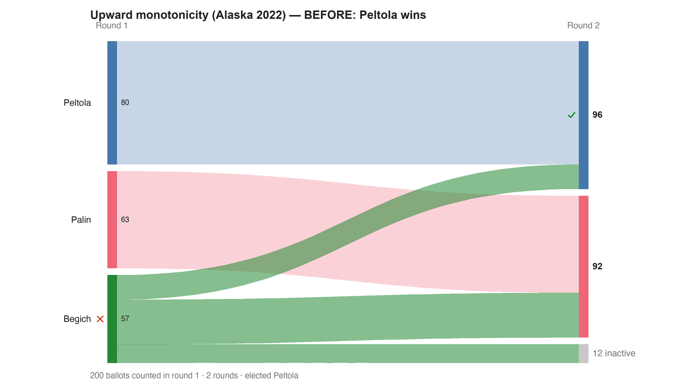

---
search:
  exclude: true
---

# Upward monotonicity (Alaska 2022) — BEFORE: Peltola wins

*Generated from [`alaska_upward_before.yaml`](../alaska_upward_before.yaml) — do not edit by hand. Regenerate: `python STARVote_LH_tabulation_engine/tools_adam/scripts/build_yaml_pages.py`.*

**Method:** [RCV-IRV (Instant Runoff)](../../../../06_Other/RCV_IRV/concepts/README.md) · **1 seat** · **Expected winner:** Peltola

## Scenario

The real Alaska 2022 US House special, reduced ~960:1 to a faithful 200-voter
model (the same profile as method_comparisons/alaska_2022 and the burial case).
Counted by RCV-IRV: Begich has the fewest first-choices and is eliminated first,
his ballots split, and Peltola wins the final round 96-92. This is the BEFORE
half of an upward-monotonicity pair — the winner is Peltola. In the AFTER file
(alaska_upward_after), 7 Palin-only ballots are changed to Peltola>Palin, GIVING
THE WINNER MORE FIRST-PLACE SUPPORT — and Peltola then LOSES. Ranking the winner
higher turns her into a loser: the upward monotonicity paradox (Graham-Squire &
McCune, arXiv:2301.12075). Companion page: upward_monotonicity_alaska.md.

## Ballots

Each row is one voter's ranking, most-preferred first (`N:` prefix = N identical ballots).

```text
50:Peltola>Begich>Palin
36:Palin>Begich>Peltola
29:Begich>Palin>Peltola
25:Peltola
23:Palin
16:Begich>Peltola>Palin
12:Begich
5:Peltola>Palin>Begich
4:Palin>Peltola>Begich
```

## What the engine says



*Where the votes went. Band thickness is votes; a band leaving an eliminated candidate lands on whoever that ballot ranked next, or on **inactive** if it ranked nobody who was left.*

The count, step by step — the rounds and how the winner is reached:

<!-- --8<-- [start:report] -->
```text
--- RCV / Instant-Runoff Voting (single winner) ---
  Upward monotonicity (Alaska 2022) — BEFORE: Peltola wins
 Tabulating 200 ballots (ranked ballots).

ROUND 1
Candidate      Votes  Status
-----------  -------  --------
Peltola           80  Hopeful
Palin             63  Hopeful
Begich            57  Rejected

FINAL RESULT
Candidate      Votes  Status
-----------  -------  --------
Peltola           96  Elected
Palin             92  Rejected
Begich             0  Rejected
Blank Votes       12  Rejected


Winner(s) — RCV / Instant-Runoff Voting (single winner)
  Peltola

--- Transfers and inactive ballots (what the round tables leave out) ---
The tables above give each candidate's round total but not where a
transferred vote came FROM, nor how many ballots stopped counting.
Both are recomputed from the ballots, using the eliminations the
count above actually made.

ROUND 1 — 200 of 200 ballots still active; majority = 101
   Begich eliminated with 57:
      → Palin                    29
      → Peltola                  16
      → (no continuing ranking)     12  ← these ballots go inactive

FINAL ROUND — 188 of 200 ballots still active (12 inactive); majority = 95
   Peltola                  96  (51.1% of the still-active)  ← elected
   Palin                    92  (48.9% of the still-active)
   Never exhausted, never transferred:
      69 ballots held by Palin carried a lower ranking that was never read
      (the count stopped here, so those preferences did nothing).

Inactive ballots at the final round: 12 of 200 (6.0%).
   Peltola's 96 is a majority of the 188 still active but only 48.0% of all 200 cast —
   the 'majority' here is of a shrunken denominator. See
   06_Other/RCV_IRV/concepts/RCV_IRV_exhausted_ballots.md
```
<!-- --8<-- [end:report] -->

### Full audit — preference matrix, Condorcet, and score distribution

```text
--- Smith Set (the generalized Condorcet winner) ---
The smallest group whose every member beats every candidate outside it —
the honest answer to "who is even in contention?".
   Smith set (1 of 3): Begich
   Outside (2):        Peltola, Palin
   One member ⇒ Begich is the Condorcet winner, beating every rival head-to-head.
   RCV-IRV winner Peltola is OUTSIDE the Smith set. ✗
      Every member of the set (Begich) beats Peltola head-to-head, yet
      RCV-IRV elected Peltola anyway. RCV-IRV is not Smith-efficient (nor
      Condorcet-efficient) — this is the shape a center squeeze leaves behind.
   More: 07_Concepts/topics/smith_set.md
```

Everything in one file: the [`_tabulated` mirror](../cases_tabulated/alaska_upward_before_tabulated.txt) (regenerated on every run; every analysis forced on).

Run it yourself:

```bash
python STARVote_LH_tabulation_engine/starvote_larry_hastings.py method_comparisons/monotonicity/cases/alaska_upward_before.yaml
```

## See also

- [Monotonicity (topic hub)](../../../../07_Concepts/topics/monotonicity/README.md)
- [Vote splitting (worked set)](../../../split_voting/README.md)
- [Glossary](../../../../07_Concepts/GLOSSARY.md) · [all cases by method](../../../../07_Concepts/YAML_test_case_index/README.md)

More cases in this set: [alaska_upward_after](alaska_upward_after.md) · [mono_raise_delete_after](mono_raise_delete_after.md) · [mono_raise_delete_before](mono_raise_delete_before.md) · [monotonicity_irv_after](monotonicity_irv_after.md) · [monotonicity_irv_before](monotonicity_irv_before.md) · [monotonicity_star_after](monotonicity_star_after.md) · [monotonicity_star_before](monotonicity_star_before.md) · [sf_d7_downward_after](sf_d7_downward_after.md) · [sf_d7_downward_before](sf_d7_downward_before.md)
