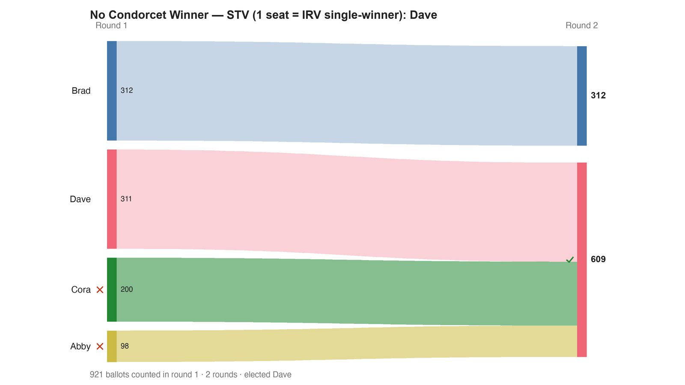

---
search:
  exclude: true
---

# No Condorcet Winner — STV (1 seat = IRV single-winner): Dave

*Generated from [`bv2138_cxrf8v_stv.yaml`](../bv2138_cxrf8v_stv.yaml) — do not edit by hand. Regenerate: `python STARVote_LH_tabulation_engine/tools_adam/scripts/build_yaml_pages.py`.*

**Method:** [STV (proportional, ranked ballots)](../../../../03_STAR_PR/01_Learn/README.md) · **1 seat** · **Expected winner:** Dave

**▶ Live on BetterVoting:** [vote](https://bettervoting.com/cxrf8v) · **[results ↗](https://bettervoting.com/cxrf8v/results)** (election `cxrf8v` · test `BV2138`).

## Scenario

One of four races in the 'One Ranked Electorate, Many Tabulations' election (BV2138, bvid cxrf8v; BV-confirmed). 921 voters, five candidates, NO Condorcet winner (Smith set = Abby, Brad, Dave, Erin). Robert LeGrand's flagship 'the method decides' example: across ~15 methods the win splits five ways. Single-seat STV = IRV → Dave.

## Ballots

Each row is one voter's ranking, most-preferred first (`N:` prefix = N identical ballots).

```text
98:Abby>Cora>Erin>Dave>Brad
64:Brad>Abby>Erin>Cora>Dave
12:Brad>Abby>Erin>Dave>Cora
98:Brad>Erin>Abby>Cora>Dave
13:Brad>Erin>Abby>Dave>Cora
125:Brad>Erin>Dave>Abby>Cora
124:Cora>Abby>Erin>Dave>Brad
76:Cora>Erin>Abby>Dave>Brad
21:Dave>Abby>Brad>Erin>Cora
30:Dave>Brad>Abby>Erin>Cora
98:Dave>Brad>Erin>Cora>Abby
139:Dave>Cora>Abby>Brad>Erin
23:Dave>Cora>Brad>Abby>Erin
```

## What the engine says



*Where the votes went. Band thickness is votes; a band leaving an eliminated candidate lands on whoever that ballot ranked next, or on **inactive** if it ranked nobody who was left.*

The count, step by step — the rounds and how the winner is reached:

<!-- --8<-- [start:report] -->
```text
--- RCV / Instant-Runoff Voting (single winner) ---
  No Condorcet Winner — STV (1 seat = IRV single-winner): Dave
 Tabulating 921 ballots (ranked ballots).

ROUND 1
Candidate      Votes  Status
-----------  -------  --------
Brad             312  Hopeful
Dave             311  Hopeful
Cora             200  Rejected
Abby              98  Rejected
Erin               0  Rejected

FINAL RESULT
Candidate      Votes  Status
-----------  -------  --------
Dave             609  Elected
Brad             312  Rejected
Cora               0  Rejected
Abby               0  Rejected
Erin               0  Rejected


Winner(s) — RCV / Instant-Runoff Voting (single winner)
  Dave

--- Transfers and inactive ballots (what the round tables leave out) ---
The tables above give each candidate's round total but not where a
transferred vote came FROM, nor how many ballots stopped counting.
Both are recomputed from the ballots, using the eliminations the
count above actually made.

ROUND 1 — 921 of 921 ballots still active; majority = 461
   Erin eliminated with 0:
      → (held no ballots)
   Abby eliminated with 98:
      → Dave                     98
   Cora eliminated with 200:
      → Dave                    200

FINAL ROUND — 921 of 921 ballots still active; majority = 461
   Dave                    609  (66.1% of the still-active)  ← elected
   Brad                    312  (33.9% of the still-active)
   Never exhausted, never transferred:
      312 ballots held by Brad carried a lower ranking that was never read
      (the count stopped here, so those preferences did nothing).

Inactive ballots at the final round: 0 of 921 (0.0%).
   Dave's 609 is a majority of the 921 still active AND of all 921 cast (66.1%).
```
<!-- --8<-- [end:report] -->

### Full audit — preference matrix, Condorcet, and score distribution

```text
--- Smith Set (the generalized Condorcet winner) ---
The smallest group whose every member beats every candidate outside it —
the honest answer to "who is even in contention?".
   Smith set (4 of 5): Abby, Brad, Erin, Dave
   Outside (1):        Cora
   More than one member ⇒ NO Condorcet winner: the top of the tournament is a
   cycle, so the strongest "candidate" is a set, not a person. Which member of
   the set should win is exactly what Minimax / Ranked Pairs / Schulze disagree
   about — see 05_Ranked_Robin/01_Learn/cycle_resolution.md.
   Note: the Copeland leaders (Abby, Brad) are only part of the set — the
   win–loss table's top block understates how wide the contention is.
   RCV-IRV winner Dave is INSIDE the Smith set. ✓
      Not guaranteed — RCV-IRV is not Smith-efficient — but it holds here.
   More: 07_Concepts/topics/smith_set.md
```

Everything in one file: the [`_tabulated` mirror](../cases_tabulated/bv2138_cxrf8v_stv_tabulated.txt) (regenerated on every run; every analysis forced on).

Run it yourself:

```bash
python STARVote_LH_tabulation_engine/starvote_larry_hastings.py method_comparisons/no_condorcet_bv2138/cases/bv2138_cxrf8v_stv.yaml
```

## See also

- [Condorcet efficiency (topic hub)](../../../../07_Concepts/topics/condorcet/README.md)
- [Vote splitting (worked set)](../../../split_voting/README.md)
- [Glossary](../../../../07_Concepts/GLOSSARY.md) · [all cases by method](../../../../07_Concepts/YAML_test_case_index/README.md)

More cases in this set: [bv2138_cxrf8v_irv](bv2138_cxrf8v_irv.md) · [bv2138_cxrf8v_ranked_robin](bv2138_cxrf8v_ranked_robin.md) · [bv2138_cxrf8v_star](bv2138_cxrf8v_star.md)
