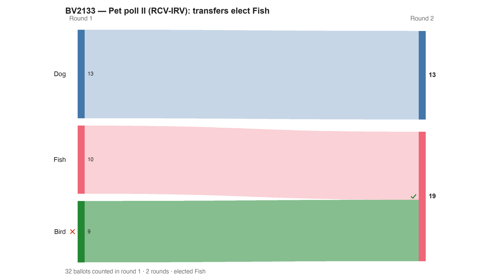

---
search:
  exclude: true
---

# BV2133 — Pet poll II (RCV-IRV): transfers elect Fish

*Generated from [`bv2133_dyxrbr_pet2_irv.yaml`](../bv2133_dyxrbr_pet2_irv.yaml) — do not edit by hand. Regenerate: `python STARVote_LH_tabulation_engine/tools_adam/scripts/build_yaml_pages.py`.*

**Method:** [RCV-IRV (Instant Runoff)](../../../../06_Other/RCV_IRV/concepts/README.md) · **1 seat** · **Expected winner:** Fish

**▶ Live on BetterVoting:** [vote](https://bettervoting.com/dyxrbr) · **[results ↗](https://bettervoting.com/dyxrbr/results)** (election `dyxrbr` · test `BV2133`).

## Scenario

One of four races in the BV2133 "Pet poll II" (BetterVoting election dyxrbr). RCV-IRV (ranked, instant runoff). Round 1: Dog 13, Fish 10, Bird 9 — eliminate Bird; Bird > Cat, so Cat rises. Then Cat (fewest) is eliminated and its ballots flow to Fish, which beats Dog 19-13. So IRV elects Fish. Same electorate as the Plurality race (Dog), Approval race (Bird) and STAR race (Cat): four methods, four winners. BV also elects Fish. Live results: https://bettervoting.com/dyxrbr/results

## Ballots

Each row is one voter's ranking, most-preferred first (`N:` prefix = N identical ballots).

```text
9:Bird>Cat>Fish>Dog
10:Fish>Cat>Bird>Dog
13:Dog>Cat>Fish>Bird
```

## What the engine says



*Where the votes went. Band thickness is votes; a band leaving an eliminated candidate lands on whoever that ballot ranked next, or on **inactive** if it ranked nobody who was left.*

The count, step by step — the rounds and how the winner is reached:

<!-- --8<-- [start:report] -->
```text
--- RCV / Instant-Runoff Voting (single winner) ---
  BV2133 — Pet poll II (RCV-IRV): transfers elect Fish
 Tabulating 32 ballots (ranked ballots).

ROUND 1
Candidate      Votes  Status
-----------  -------  --------
Dog               13  Hopeful
Fish              10  Hopeful
Bird               9  Rejected
Cat                0  Rejected

FINAL RESULT
Candidate      Votes  Status
-----------  -------  --------
Fish              19  Elected
Dog               13  Rejected
Bird               0  Rejected
Cat                0  Rejected


Winner(s) — RCV / Instant-Runoff Voting (single winner)
  Fish
```
<!-- --8<-- [end:report] -->

### Full audit — preference matrix, Condorcet, and score distribution

```text
--- Smith Set (the generalized Condorcet winner) ---
The smallest group whose every member beats every candidate outside it —
the honest answer to "who is even in contention?".
   Smith set (1 of 4): Cat
   Outside (3):        Bird, Fish, Dog
   One member ⇒ Cat is the Condorcet winner, beating every rival head-to-head.
   RCV-IRV winner Fish is OUTSIDE the Smith set. ✗
      Every member of the set (Cat) beats Fish head-to-head, yet
      RCV-IRV elected Fish anyway. RCV-IRV is not Smith-efficient (nor
      Condorcet-efficient) — this is the shape a center squeeze leaves behind.
   More: 07_Concepts/topics/smith_set.md
```

Everything in one file: the [`_tabulated` mirror](../cases_tabulated/bv2133_dyxrbr_pet2_irv_tabulated.txt) (regenerated on every run; every analysis forced on).

Run it yourself:

```bash
python STARVote_LH_tabulation_engine/starvote_larry_hastings.py method_comparisons/pet_poll_four_winners/cases/bv2133_dyxrbr_pet2_irv.yaml
```

## See also

- [Runoff reversal (worked set)](../../../../01_STAR/02_Examples/runoff_overturns_leader/README.md)
- [Glossary](../../../../07_Concepts/GLOSSARY.md) · [all cases by method](../../../../07_Concepts/YAML_test_case_index/README.md)

More cases in this set: [bv2133_dyxrbr_pet2_approval](bv2133_dyxrbr_pet2_approval.md) · [bv2133_dyxrbr_pet2_plurality](bv2133_dyxrbr_pet2_plurality.md) · [bv2133_dyxrbr_pet2_star](bv2133_dyxrbr_pet2_star.md)
