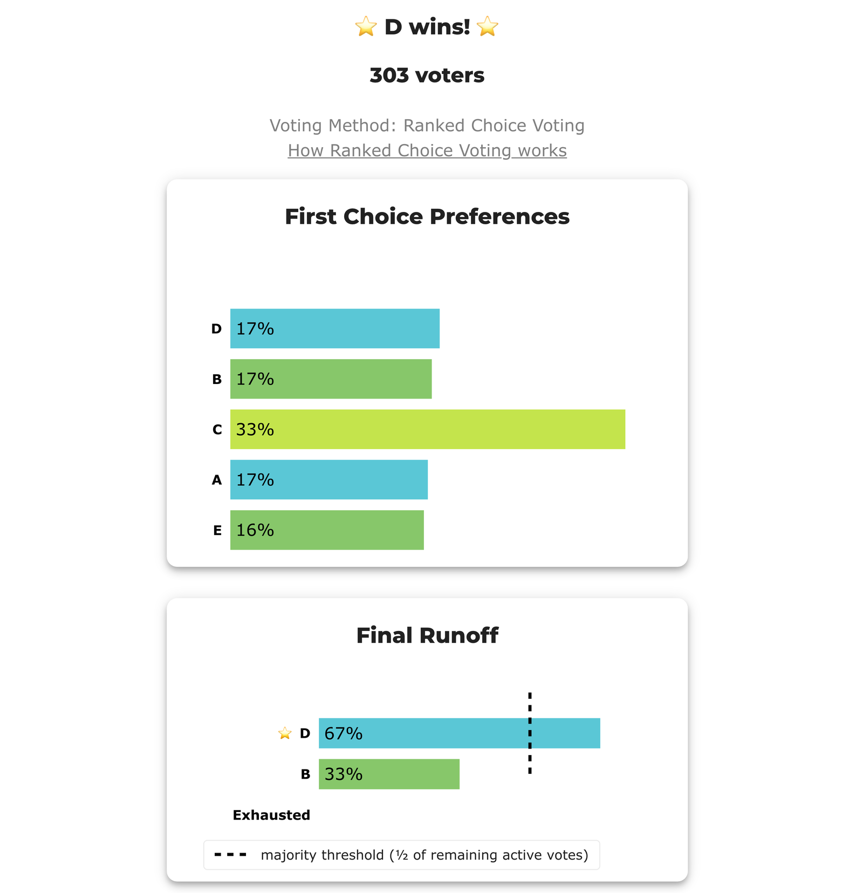
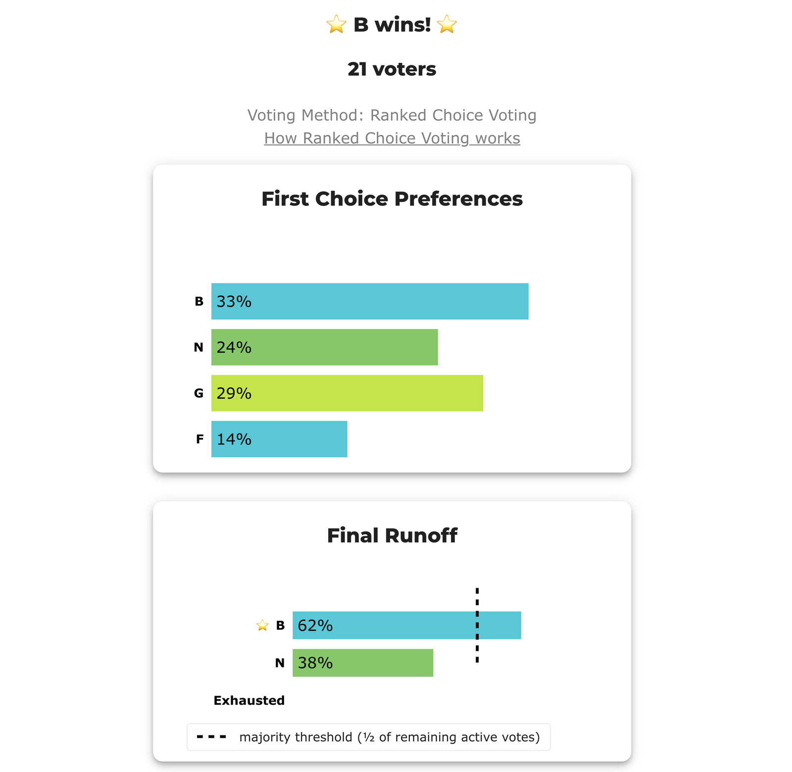
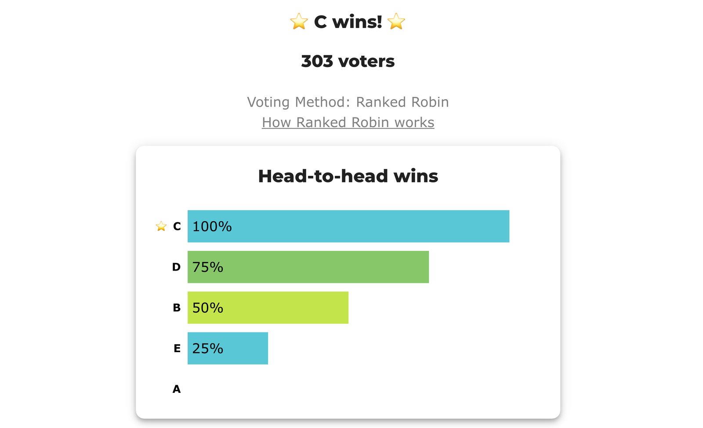
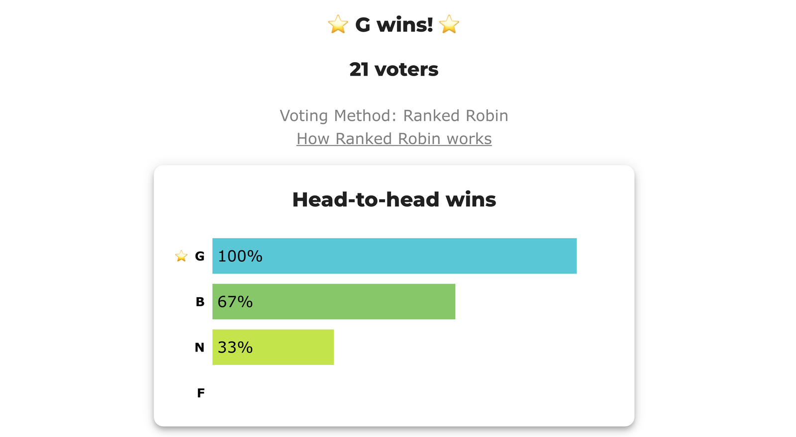

# rangevoting.org's anti-IRV examples, counted

**One line:** two constructed profiles that [rangevoting.org](https://rangevoting.org/rangeVirv.html) uses against RCV-IRV, lifted out of a polemical page, reproduced exactly on this repo's engine, and counted a second way on the identical ballots — because **the arithmetic checks out and the rhetoric around it does not.**

**Level: 301 · for debaters**

**▶ Both are LIVE BetterVoting elections**, each carrying two races on the same ballots — an RCV-IRV race and a Ranked Robin race — so the disagreement is clickable rather than merely claimed:

- **BV2281 — Ossipoff's 303** · [vote](https://bettervoting.com/qycpbx) · **[results ↗](https://bettervoting.com/qycpbx/results)** (election `qycpbx`)
- **BV2282 — Brams's 21** · [vote](https://bettervoting.com/hf3ckp) · **[results ↗](https://bettervoting.com/hf3ckp/results)** (election `hf3ckp`)

**BetterVoting agrees with this repo's engine on all four races** — IRV → D and Ranked Robin → C on the 303; IRV → B and Ranked Robin → G on the 21 — with `tieBreakType: none` throughout, so nothing here rests on a lot. Frozen exports sit beside the case files (`bv2281_qycpbx_bv_export.json`, `bv2282_hf3ckp_bv_export.json`).

---

## Why this folder exists

[rangevoting.org](https://rangevoting.org/rangeVirv.html) is Warren D. Smith's site, and it argues for score voting — **the same side of the argument this library is on**, which makes it more dangerous to quote carelessly, not less. Its page on IRV calls the method an *"idiot voting system"* and a *"complete nightmare."* We cannot cite that voice without inheriting it, and this repo's standing rule is to [make the case for STAR and Ranked Robin rather than prosecute IRV](../../06_Other/RCV_IRV/README.md).

But the numbered examples on that page are a different thing from the prose around them. Two of them are constructed profiles, fully specified, and one carries an academic citation. Those are checkable — so we checked them, and **both reproduce exactly.** They are collected here with the caveats attached, so the evidence is usable without the polemic.

This is the [claim-check](../fairvote_condorcet_claims/README.md) pattern the library uses on any advocacy source, whichever camp it comes from.

## Example 1 — Ossipoff's 303: the first-round *leader* is eliminated

Five candidates on a left-to-right line, 303 voters, C in the middle.

<!-- report:bv2281_qycpbx_ossipoff_irv -->
```text
--- RCV / Instant-Runoff Voting (single winner) ---
  Ossipoff's 303 — the first-round LEADER is eliminated
 Tabulating 303 ballots (ranked ballots).

ROUND 1
Candidate      Votes  Status
-----------  -------  --------
C                100  Hopeful
D                 53  Hopeful
B                 51  Hopeful
A                 50  Hopeful
E                 49  Rejected

ROUND 2
Candidate      Votes  Status
-----------  -------  --------
D                102  Hopeful
C                100  Hopeful
B                 51  Hopeful
A                 50  Rejected
E                  0  Rejected

ROUND 3
Candidate      Votes  Status
-----------  -------  --------
D                102  Hopeful
B                101  Hopeful
C                100  Rejected
A                  0  Rejected
E                  0  Rejected

FINAL RESULT
Candidate      Votes  Status
-----------  -------  --------
D                202  Elected
B                101  Rejected
C                  0  Rejected
A                  0  Rejected
E                  0  Rejected


Winner(s) — RCV / Instant-Runoff Voting (single winner)
  D

--- Transfers and inactive ballots (what the round tables leave out) ---
The tables above give each candidate's round total but not where a
transferred vote came FROM, nor how many ballots stopped counting.
Both are recomputed from the ballots, using the eliminations the
count above actually made.

ROUND 1 — 303 of 303 ballots still active; majority = 152
   E eliminated with 49:
      → D                        49

ROUND 2 — 303 of 303 ballots still active; majority = 152
   A eliminated with 50:
      → B                        50

ROUND 3 — 303 of 303 ballots still active; majority = 152
   C eliminated with 100:
      → D                       100

FINAL ROUND — 303 of 303 ballots still active; majority = 152
   D                       202  (66.7% of the still-active)  ← elected
   B                       101  (33.3% of the still-active)
   Never exhausted, never transferred:
      101 ballots held by B carried a lower ranking that was never read
      (the count stopped here, so those preferences did nothing).

Inactive ballots at the final round: 0 of 303 (0.0%).
   D's 202 is a majority of the 303 still active AND of all 303 cast (66.7%).
```
<!-- /report -->

**This is a sharper example than the file it usually gets put in.** The textbook [center squeeze](../../06_Other/RCV_IRV/concepts/RCV_IRV_center_squeeze.md) eliminates a [Condorcet winner](../../07_Concepts/topics/condorcet/README.md) holding *few* first choices — which leaves a defender the reply *"well, hardly anyone actually wanted them first."* Here that reply is unavailable:

- **C holds 100 of 303 first choices — the largest bloc in the field**, ahead of D (53), B (51), A (50) and E (49).
- C beats **every** rival head-to-head, by roughly two to one: A 202–101, B 202–101, D 201–102, E 201–102.
- C leads rounds 1 and 2 outright — and is **cut in round 3 by a single vote**, on 100 against D's 102 and B's 101.
- C's 100 ballots then read `C>D`, and hand D the election 202–101.

The mechanism is worth tracing, because it is not mysterious. E is eliminated first and every one of those 49 ballots reads `E>D`, lifting D to 102. A goes next and those 50 read `A>B`, lifting B to 101. Both eliminations feed C's *rivals* and neither feeds C — so the candidate a two-thirds majority prefers to everyone finishes last of three and is cut.

**BetterVoting's own results page makes the point without any help from us:**



Read the two charts against each other. **C owns the longest bar in "First Choice Preferences" — and C is not in the "Final Runoff" at all.** That is the entire argument in one screenshot, drawn by the tabulator rather than by us.


## Example 2 — Brams 1982: twenty-one ballots, checkable on paper

<!-- report:bv2282_hf3ckp_brams_irv -->
```text
--- RCV / Instant-Runoff Voting (single winner) ---
  Brams 1982 — twenty-one voters, and the Condorcet winner goes out second
 Tabulating 21 ballots (ranked ballots).

ROUND 1
Candidate      Votes  Status
-----------  -------  --------
B                  7  Hopeful
G                  6  Hopeful
N                  5  Hopeful
F                  3  Rejected

ROUND 2
Candidate      Votes  Status
-----------  -------  --------
N                  8  Hopeful
B                  7  Hopeful
G                  6  Rejected
F                  0  Rejected

FINAL RESULT
Candidate      Votes  Status
-----------  -------  --------
B                 13  Elected
N                  8  Rejected
G                  0  Rejected
F                  0  Rejected


Winner(s) — RCV / Instant-Runoff Voting (single winner)
  B

--- Transfers and inactive ballots (what the round tables leave out) ---
The tables above give each candidate's round total but not where a
transferred vote came FROM, nor how many ballots stopped counting.
Both are recomputed from the ballots, using the eliminations the
count above actually made.

ROUND 1 — 21 of 21 ballots still active; majority = 11
   F eliminated with 3:
      → N                         3

ROUND 2 — 21 of 21 ballots still active; majority = 11
   G eliminated with 6:
      → B                         6

FINAL ROUND — 21 of 21 ballots still active; majority = 11
   B                        13  (61.9% of the still-active)  ← elected
   N                         8  (38.1% of the still-active)
   Never exhausted, never transferred:
      8 ballots held by N carried a lower ranking that was never read
      (the count stopped here, so those preferences did nothing).

Inactive ballots at the final round: 0 of 21 (0.0%).
   B's 13 is a majority of the 21 still active AND of all 21 cast (61.9%).
```
<!-- /report -->

B wins 13 of 21. But **G beats B head-to-head 14–7**, beats N 13–8 and beats F 18–3 — G is the Condorcet winner, eliminated one round before the finish on 6 first choices.



Same shape as the 303: G is second on first choices and **missing from the final runoff**, which is contested by B and N — the two candidates G beats head-to-head.

Twenty-one ballots is the point. Someone who will not take a 303-voter profile on trust can check this one by hand in about a minute.

**Provenance, stated carefully — this matters.** The profile is Stephen J. Brams's, from *"The AMS Nomination Procedure Is Vulnerable to 'Truncation of Preferences'"* (*Notices of the American Mathematical Society* 29:2, February 1982, 136–138). **The RCV-IRV reading is rangevoting.org's, not Brams's.** Brams's paper is about vulnerability to *preference truncation* — voters ranking only some candidates — which is a different argument from the Condorcet failure shown above, and we could not confirm from the abstract whether the AMS procedure of the day was Hare specifically. So cite **Brams for the ballots** and **this file for what Hare does with them**. Do not write *"Brams showed that IRV…"* — in this paper, he did not.

The candidate labels `B, G, N, F` are Brams's own and are kept for traceability, which is why they are neither alphabetical nor in reading order.

## The same ballots, counted a second way

Neither profile needs a new ballot to fix. [Ranked Robin](../../05_Ranked_Robin/README.md) reads the **identical ranked paper** — not one mark changed, no scores, nothing for a voter to relearn — and compares every pair head-to-head instead of eliminating from the bottom:

| Profile | RCV-IRV (Hare) elects | Ranked Robin elects | Margin the pairwise count sees |
|---|:--:|:--:|---|
| Ossipoff's 303 | **D** | **C** | C beats D 201–102, and everyone else ~2:1 |
| Brams's 21 | **B** | **G** | G beats B 14–7 |

That is the version of this argument worth making to someone who likes ranked ballots, because **it asks nothing of them.** The ballot they already support is fine. The disagreement is entirely in the tabulation.

And it is the *same election* saying both things. Each BetterVoting election above carries the two races on one ballot set, so these are race 2 of the very pages that just said "D wins" and "B wins":

| Ossipoff's 303 — race 2 | Brams's 21 — race 2 |
|---|---|
|  |  |
| **C wins** — 100% of head-to-head matchups | **G wins** — 100% of head-to-head matchups |

Same voters, same marks, same website, one page apart: *"D wins!"* and *"C wins!"*

<!-- report:bv2281_qycpbx_ossipoff_ranked_robin -->
```text
--- Ranked Robin (RCV-RR / Copeland) Method (single winner) ---
 Tabulating 303 ballots (ranked ballots).

Ballots:
    50 × A > B > C > D > E
    51 × B > A > C > D > E
   100 × C > D > B > E > A
    53 × D > E > C > B > A
    49 × E > D > C > B > A

Round-Robin — every pair, head-to-head (For – Against):
   B  beats A   253 –  50
   C  beats A   202 – 101
   D  beats A   202 – 101
   E  beats A   202 – 101
   C  beats B   202 – 101
   D  beats B   202 – 101
   B  beats E   201 – 102
   C  beats D   201 – 102
   C  beats E   201 – 102
   D  beats E   254 –  49

--- Pairwise (Round-Robin) Matrix ---
Head-to-head / pairwise comparison — the Ranked Robin tally
Legend: For - Equal Support - Against   (row vs column)
      |        A        |       B        |       C        |       D        |       E        |
---------------------------------------------------------------------------------------------
  A > |       ---       | 50 -   0 - 253 |101 -   0 - 202 |101 -   0 - 202 |101 -   0 - 202 |
  B > | 253 -   0 -  50 |      ---       |101 -   0 - 202 |101 -   0 - 202 |201 -   0 - 102 |
  C > | 202 -   0 - 101 |202 -   0 - 101 |      ---       |201 -   0 - 102 |201 -   0 - 102 |
  D > | 202 -   0 - 101 |202 -   0 - 101 |102 -   0 - 201 |      ---       |254 -   0 -  49 |
  E > | 202 -   0 - 101 |102 -   0 - 201 |102 -   0 - 201 | 49 -   0 - 254 |      ---       |

Win–loss record — Copeland score = wins + ½·ties (highest score wins; ties broken by total margin, then lot order):
    #  Candidate  W–L–T  Copeland  Margin  Beats
    1  C          4–0–0         4    +400  D, B, E, A
    2  D          3–1–0         3    +308  B, E, A
    3  B          2–2–0         2    +100  E, A
    4  E          1–3–0         1    -302  A
    5  A          0–4–0         0    -506  —

Winner — Ranked Robin (RCV-RR): C
   beats every opponent head-to-head — the Condorcet winner.
```
<!-- /report -->

**Verification — all three legs, and they agree.** Every Ranked Robin result here is confirmed by three independent tabulators: this repo's native tally, **BetterVoting's own `RankedRobin.ts`** (race 2 of each live election above, frozen in the exports), and **`pref_voting`'s Copeland** — a third-party library nobody here wrote, which returns the same unique leader in both cases (`AGREE ✓`). The RCV-IRV results are confirmed twice over, by this engine and by BetterVoting's own IRV tabulator. That matters more than usual for a page arguing from someone else's examples: **the profiles came from an advocacy site, so the counts had better not come from anywhere we control alone.** The [Smith set](../../07_Concepts/topics/smith_set.md) is a single candidate in both profiles, so there is no cycle, and `tieBreakType` is `none` in all four races — nothing rests on a lot.

## Reading this fairly — including against ourselves

**These are constructed, not real.** They prove RCV-IRV *can* do this. They say nothing about how often it does. The honest frequency number this library uses is that Condorcet failures showed up in **2 of 182** US RCV elections studied — so "predictable in close three-way races" is defensible and "usually elects the wrong winner" is not. Anyone quoting these two profiles as evidence of *typical* behavior has overreached, and we would say the same about a constructed example that favored STAR.

**The one-dimensional layout is a model, not a transcript.** Ossipoff's profile puts A–E on a line with C in the middle and gives every bloc a perfectly consistent ordering. Real electorates are messier, and messier electorates produce cycles, where *no* method has a clearly right answer.

**IRV gets something real in exchange for this.** Both examples are consequences of the same mechanism: Hare reads only each ballot's top surviving choice. That blindness is exactly what buys IRV **[later-no-harm](../../07_Concepts/GLOSSARY.md)** — ranking a lower choice can never hurt your favorite — a property **STAR fails**. Presenting the blindness as pure defect, with no mention of what it purchases, is the move this folder is meant to avoid. The mechanism explained without the scorekeeping: [what your 2nd choice actually does](../../06_Other/RCV_IRV/concepts/RCV-IRV-Hare.md).

## What we do *not* take from that page

One claim in particular is worth refusing even though it is aimed at our opponent. rangevoting.org's item 13 says IRV *"ignores asymptotically 100% of the information available in the ballots,"* and that *"Approval, RV, Condorcet, and Borda all take into account all information in all votes, ignoring none."*

- **The mechanism is right** — IRV really does read only the top surviving choice, which is the whole subject of the two examples above.
- **The theorem is about candidates → ∞.** Real elections have three to ten. An asymptotic result says very little about a six-candidate race.
- **"Approval… ignoring none" is the tell.** Approval is the *least* expressive ballot in that list — one bit per candidate, no order, no strength. It "ignores nothing" only because the ballot discarded the information before the count ever saw it. **By that accounting, Choose-One plurality also ignores nothing** — it faithfully counts every mark on every ballot. A measure that certifies plurality as maximally information-efficient is measuring the wrong thing.
- **And using all the information is not the same as using it well.** Borda reads every rank and is notoriously easy to manipulate with [clones and burial](../../06_Other/other_ranked_methods/borda.md). The goal is good winners, not high throughput.

The Condorcet half of the claim stands. The rest does not, and this library does not need it.

## The files

Each election's two races are one file apiece, sharing the bvid prefix — so `rg qycpbx` returns the whole set, and the suffix carries the reading order.

| Case | Method | What it shows | Live | Page | YAML |
|---|:--:|---|:--:|---|---|
| **Ossipoff's 303** (BV2281) | RCV-IRV | the first-round leader and Condorcet winner is cut in round 3 by one vote | [results ↗](https://bettervoting.com/qycpbx/results) | [page](cases/cases_pages/bv2281_qycpbx_ossipoff_irv.md) | [`.yaml`](cases/bv2281_qycpbx_ossipoff_irv.yaml) |
| …identical ballots | Ranked Robin | elects C, 4–0 on the pairwise record | [results ↗](https://bettervoting.com/qycpbx/results) | [page](cases/cases_pages/bv2281_qycpbx_ossipoff_ranked_robin.md) | [`.yaml`](cases/bv2281_qycpbx_ossipoff_ranked_robin.yaml) |
| **Brams 1982** (BV2282) | RCV-IRV | 21 ballots, hand-checkable; G eliminated one round from the finish | [results ↗](https://bettervoting.com/hf3ckp/results) | [page](cases/cases_pages/bv2282_hf3ckp_brams_irv.md) | [`.yaml`](cases/bv2282_hf3ckp_brams_irv.yaml) |
| …identical ballots | Ranked Robin | elects G, 3–0 on the pairwise record | [results ↗](https://bettervoting.com/hf3ckp/results) | [page](cases/cases_pages/bv2282_hf3ckp_brams_ranked_robin.md) | [`.yaml`](cases/bv2282_hf3ckp_brams_ranked_robin.yaml) |

**Sources.** Profiles from [rangevoting.org — "Range voting vs. IRV"](https://rangevoting.org/rangeVirv.html) §12 (Warren D. Smith; **score-voting advocacy**, credited there to Mike Ossipoff), and Brams (1982) as cited above. Where the two disagree with each other, or with us, the engine output on this page is what we stand behind. Related claim-checks: [FairVote's Condorcet article](../fairvote_condorcet_claims/README.md) · [advocacy organizations and their leans](../../07_Concepts/topics/advocacy_organizations.md) · [misconceptions in both directions](../../06_Other/RCV_IRV/concepts/rcv_irv_false_claims.md) · up: [method comparisons](../README.md)

# file: README.md
