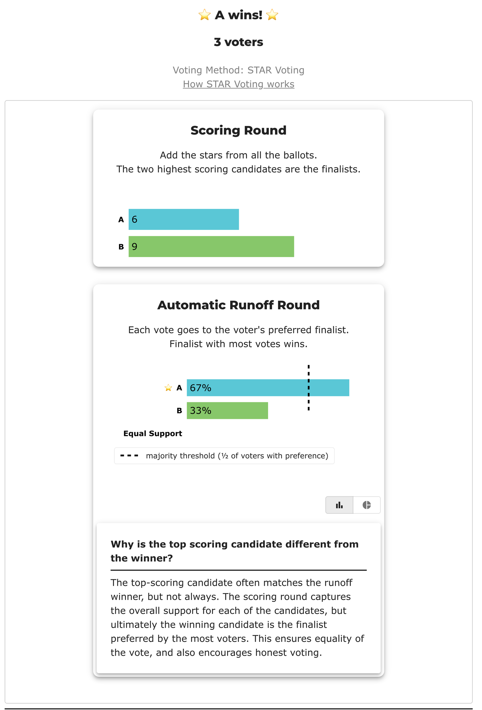

# Same ranks, different utilities — the founding impossibility, on three ballots

*A runnable companion to **Proposition 1** of Procaccia & Rosenschein, ["The Distortion of Cardinal Preferences in Voting"](https://www.cs.huji.ac.il/~jeff/papers/cia06procaccia.pdf) (CIA 2006) — the paper that named [distortion](../../07_Concepts/topics/distortion.md) and started fifteen-plus years of work on it. The proposition is one of the smallest impossibility results in social choice: **no voting rule that reads only rankings is ever perfect**, and it takes **3 voters and 2 candidates** to prove. The proof is a matched pair of elections with identical rankings and opposite right answers — reproduced here as two YAML files whose ballots differ only in intensity. It cuts for scored ballots and against them in the same breath, which is why it's worth counting rather than quoting.*

**▶ Live on BetterVoting:** [vote](https://bettervoting.com/9kffcv) · **[results ↗](https://bettervoting.com/9kffcv/results)** (election `9kffcv`, Test ID BV2273) — one election, **three races**: the two score profiles, plus the single ranked race they share. That asymmetry is the proposition: there is only one ranked contest to run, because a ranked ballot cannot tell the two profiles apart.

**Level: 301 · deep dive** Companions: [Distortion](../../07_Concepts/topics/distortion.md) — the umbrella · [Misrepresentation](../../07_Concepts/topics/misrepresentation.md) — the same paper's second half · [May's theorem](../../07_Concepts/topics/mays_theorem.md) — the result this collides with · [Preference vs. support](../../07_Concepts/scores_and_ranks/preference_vs_support.md) · [The valuable Condorcet loser](../valuable_condorcet_loser/README.md) — the other runnable distortion companion.

---

## The proposition

> **Proposition 1.** For every social choice function *F*, the distortion of *F* with 3 voters and 2 candidates is greater than 1.

"Greater than 1" means *never perfect*: there is no ranked rule — none, not a cleverer one, not one nobody has invented yet — that always elects the candidate maximizing total voter utility. And the counterexample is not some exotic 40-candidate construction. It is three voters choosing between two people.

The proof is a **fork**. Build one electorate; if the rule gets it wrong, done. If the rule gets it right, hand it a *second* electorate with the same rankings and the opposite answer — the rule cannot see the difference, so it repeats itself, and now it is wrong.

Both electorates obey the paper's **unit-sum** normalization: every voter's utilities add to the same total. On a 0–5 ballot that constraint is unusually easy to picture — *everyone gets the same amount of ink.* Here every voter spends exactly 5 points.

## The two electorates

Both files use bare `A` / `B` rather than names, matching the paper's "candidate 1, candidate 2" so it can be read beside the tabulation — the same choice the [tournament solutions](../tournament_solutions/README.md) cases make for the same reason.

| | [Profile 1 — lukewarm majority](cases/cases_pages/same_ranks_lukewarm_c2_b3_procaccia_rosenschein.md) ([yaml](cases/same_ranks_lukewarm_c2_b3_procaccia_rosenschein.yaml)) | [Profile 2 — polarized](cases/cases_pages/same_ranks_polarized_c2_b3_procaccia_rosenschein.md) ([yaml](cases/same_ranks_polarized_c2_b3_procaccia_rosenschein.yaml)) |
|---|---|---|
| Voter 1 | `A 3, B 2` | `A 5, B 0` |
| Voter 2 | `A 0, B 5` | `A 0, B 5` |
| Voter 3 | `A 3, B 2` | `A 5, B 0` |
| **Rankings seen** | **A>B, B>A, A>B** | **A>B, B>A, A>B** — identical |
| Score totals | **B 9**, A 6 | **A 10**, B 5 |
| Utility-optimal winner | **B** | **A** |
| STAR / any ranked method | **A** | **A** |
| Distortion of that answer | 9 / 6 = **1.5** | 5 / 5 = **1.0** ✓ |

The middle row is the whole argument. Two genuinely different electorates — one where a mild majority faces a devoted minority, one where everybody is absolute — produce **the same three ranked ballots**. A ranked method is a function of those ballots, so it returns the same winner twice. The two elections do not have the same right answer. Somebody's rule is wrong, and it doesn't matter whose.

Here is profile 1's ballot art beside the numbers the file records — mild support is a mark at 3, not a mark at 5, and that is the entire difference a ranking throws away:

<!-- ballots:same_ranks_lukewarm_c2_b3_procaccia_rosenschein -->
The ballots as marked — the filled bubble is the score given, and the score is the number in its column:

| # | Ballot as marked | A | B |
|:--:|:--|:--:|:--:|
| 1 |  | 3 | 2 |
| 2 |  | 0 | 5 |
| 3 |  | 3 | 2 |
<!-- /ballots -->

And profile 2, where the same three voters go all-in:

<!-- ballots:same_ranks_polarized_c2_b3_procaccia_rosenschein -->
The ballots as marked — the filled bubble is the score given, and the score is the number in its column:

| # | Ballot as marked | A | B |
|:--:|:--|:--:|:--:|
| 1 |  | 5 | 0 |
| 2 |  | 0 | 5 |
| 3 |  | 5 | 0 |
<!-- /ballots -->

## Counted

Profile 1 — note that the engine flags a **Runoff Reversal** on three ballots, and that the Score Distribution block is where the information lives that the runoff then declines to act on:

<!-- report:same_ranks_lukewarm_c2_b3_procaccia_rosenschein -->
```text
[Runoff Reversal]
 - Score Round Winner(s) = (B)
 - Runoff Round Winner   = (A)
  Candidate B earned the highest total score, but
  Candidate A won the automatic runoff — not a malfunction,
  STAR working as designed: the runoff elects the finalist preferred
  by the majority (of voters with a preference).

--- STAR Voting Method (single winner) ---

[STAR Voting]
 Tabulating 3 ballots.
Count × A,B
    2 × 3,2
    1 × 0,5

[STAR Voting: Scoring Round]
 The two highest-scoring candidates advance to the next round.
   B             -- 9 -- First place
   A             -- 6 -- Second place
 B and A advance.

[STAR Voting: Automatic Runoff Round]
 The candidate preferred in the most head-to-head matchups wins.
   A             -- 2 -- First place
   B             -- 1
   Equal Support -- 0
 A wins.
   Runoff math:
     3  ballots cast
   − 0  Equal Support (no preference between the two finalists)
     ─
     3  voters with a preference  (majority = 2)
           A 2 (67%)  ·  B 1 (33%)

[STAR Voting: Winner — STAR Voting Method (single winner)]
 A
```
<!-- /report -->

Profile 2 — same rankings, same winner, and now the scoring round agrees with the runoff:

<!-- report:same_ranks_polarized_c2_b3_procaccia_rosenschein -->
```text
--- STAR Voting Method (single winner) ---

[STAR Voting]
 Tabulating 3 ballots.
Count × A,B
    2 × 5,0
    1 × 0,5

[STAR Voting: Scoring Round]
 The two highest-scoring candidates advance to the next round.
   A             -- 10 -- First place
   B             --  5 -- Second place
 A and B advance.

[STAR Voting: Automatic Runoff Round]
 The candidate preferred in the most head-to-head matchups wins.
   A             -- 2 -- First place
   B             -- 1
   Equal Support -- 0
 A wins.
   Runoff math:
     3  ballots cast
   − 0  Equal Support (no preference between the two finalists)
     ─
     3  voters with a preference  (majority = 2)
           A 2 (67%)  ·  B 1 (33%)

[STAR Voting: Winner — STAR Voting Method (single winner)]
 A
```
<!-- /report -->

Want the whole count? The full LH reports are one click away: [profile 1](cases/cases_pages/same_ranks_lukewarm_c2_b3_procaccia_rosenschein.md) · [profile 2](cases/cases_pages/same_ranks_polarized_c2_b3_procaccia_rosenschein.md).

## Counted again, by an engine nobody here wrote

The pair is live on BetterVoting as **BV2273** (`9kffcv`) — and BV's own tabulator, on its own ballots, reaches the same result as the LH engine on all three races, with `tieBreakType: none` everywhere (nothing rests on a coin flip). Here is BV's rendering of **profile 1**, which makes the lesson visible without any commentary from us:



The scoring round says **B 9, A 6**. The runoff says **A**. BetterVoting even volunteers the explainer — *"Why is the top scoring candidate different from the winner?"* — which is the honest answer and also, in distortion terms, the exact moment the welfare-maximizing candidate is set aside. Run the same page on **race 2** and the scoring round reads **A 10, B 5**: a different electorate, plainly visible. Then open **race 3**, the ranked one, and there is nothing to compare — it exists once, because both profiles hand it identical ballots.

Frozen export (all three races): [`same_ranks_different_utilities_bv_export.json`](cases/same_ranks_different_utilities_bv_export.json).

## Reading it fairly, both directions

**For scored ballots — the strongest small version of the argument.** These two elections are *different*, and only one of the two ballot formats wrote the difference down. That's not a preference for scores; it's an information-theoretic fact you can verify on three rows. Pure [Score voting](../../07_Concepts/topics/scoring-methods-vs-ranked-voting.md) elects B in profile 1 and A in profile 2 — distortion exactly 1, because when the ballot *is* the utility vector there is nothing left to lose. Any ranked method is stuck at 1.5 on one of the two files.

**Against — the same example prices STAR's runoff, and the bill is real.** With two candidates, STAR's [automatic runoff](../../01_STAR/01_Learn/the_count/STAR_Automatic_Runoff.md) is plain majority rule, so STAR answers **A** in both files, exactly like every ranked method. It is not that STAR failed to notice: the scoring round *prints* B 9, A 6 and the engine *announces* the reversal — and then the majority check overrules it. That is the [hybrid bargain](../../01_STAR/01_Learn/the_count/STAR_hybrid_nature.md) at its starkest: STAR measured the intensity and declined to elect on it. Whether that is a bug or the point is the [majoritarian-vs-utilitarian](../../07_Concepts/topics/what_makes_a_good_winner.md#the-deepest-split-majoritarian-vs-utilitarian) values question, not arithmetic — and the [valuable Condorcet loser](../valuable_condorcet_loser/README.md) is the same trade in a four-candidate field.

**And a genuine collision worth sitting with.** [May's theorem](../../07_Concepts/topics/mays_theorem.md) says that with two candidates, simple majority rule is the *unique* method satisfying anonymity, neutrality, and positive responsiveness. Proposition 1 says that with two candidates, every method — majority rule included — has distortion above 1. Both are proved. They collide because May's axioms are stated over **ordinal** input: given rankings, majority rule is unimprovable, and that is precisely why the loss here cannot be fixed by choosing a better rule. It is not in the tabulation. It is in the ballot. Anyone who tells you the answer is a smarter count has misread which of the two theorems they are standing on.

## Two more results from the same paper, worth knowing

**Why normalize at all?** Drop the equal-totals assumption and distortion is unbounded immediately — at 3 voters and 2 candidates, one voter claiming utility *c* for their favorite drags the ratio to *c*/2 (the paper's Remark 1). So the constraint isn't a technicality; without it, a voter's influence is whatever they say it is.

**And normalizing is exactly one-person-one-vote.** Proposition 3 proves the unit-sum model equivalent, for distortion purposes, to a model where utilities are unconstrained **but each voter's weight is their own utility total**. Read that backwards and it is the sharpest formal statement of why score ballots are capped: *refusing to normalize is identical to weighting voters by how strongly they claim to feel.* The repo's [equally weighted vote](../../01_STAR/01_Learn/properties_and_limits/equally_weighted_vote.md) and [one person, one vote](../../07_Concepts/topics/one_person_one_vote.md) pages argue this from principle; this is the theorem underneath.

**Distortion is also hard to compute.** The paper's Proposition 4 shows a decision problem at the core of measuring a scoring rule's distortion (MIN-SCORE-MAX-UTIL) is **NP-complete**, by reduction from Knapsack. A bound you cannot compute is a bound you must prove by hand — which is why this literature is theorem-shaped rather than simulation-shaped, and why [VSE](../../07_Concepts/topics/what_makes_a_good_winner.md) exists as the average-case instrument.

## Source, and its lean

- Procaccia & Rosenschein, [*The Distortion of Cardinal Preferences in Voting*](https://www.cs.huji.ac.il/~jeff/papers/cia06procaccia.pdf) (CIA 2006, LNAI 4149, pp. 317–331; [Springer](https://link.springer.com/chapter/10.1007/11888874_31)) — Proposition 1 (p. 321) and Remark 1 are counted above; the paper's second half is on the [misrepresentation](../../07_Concepts/topics/misrepresentation.md) page.

**Lean disclosure:** peer-reviewed AI/multiagent-systems research with no stake in the US reform fight — the neutral tier. But note the setting, because it cuts against the easy pro-score reading: the paper is about **software agents**, which really do compute exact utilities. Its own motivation grants that a human "would probably find it impossible to evaluate each candidate precisely" in utility terms. Distortion assumes the utilities exist and are known; whether a *human* voter can render one onto six bubbles is the [cardinal utility](../../07_Concepts/topics/cardinal_utility.md) question, and this paper does not answer it. The later **metric** distortion literature is what carries the framework over to human elections, by assuming geometry instead of introspection.
