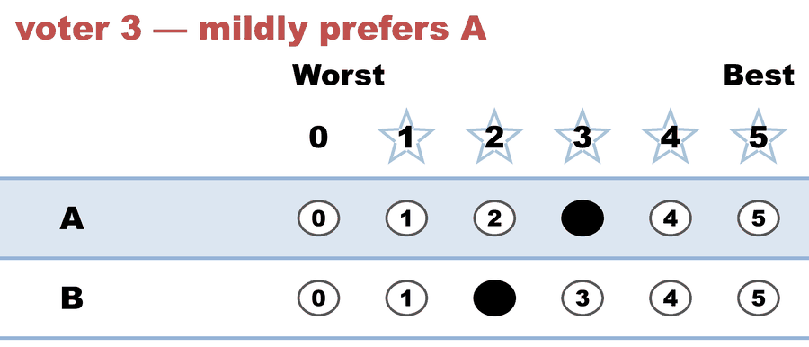

---
search:
  exclude: true
---

# Same ranks, lukewarm majority — the ranked ballot's blind spot (profile 1 of 2)

*Generated from [`same_ranks_lukewarm_c2_b3_procaccia_rosenschein.yaml`](../same_ranks_lukewarm_c2_b3_procaccia_rosenschein.yaml) — do not edit by hand. Regenerate: `python STARVote_LH_tabulation_engine/tools_adam/scripts/build_yaml_pages.py`.*

**Method:** [STAR (single winner)](../../../../01_STAR/01_Learn) · **1 seat** · **Expected winner:** A

**▶ Live on BetterVoting:** [vote](https://bettervoting.com/9kffcv) · **[results ↗](https://bettervoting.com/9kffcv/results)** (election `9kffcv` · test `BV2273`).

## Scenario

Half of the two-line proof of Proposition 1 in Procaccia & Rosenschein,
"The Distortion of Cardinal Preferences in Voting" (CIA 2006) — the
founding paper of the distortion literature. The proposition says that
NO social choice function reading only rankings can be perfect, and it
needs only 3 voters and 2 candidates to prove it.

The trick is a matched pair of elections. This file is the first: two
voters mildly prefer A (3 vs 2) and one voter is devoted to B (0 vs 5).
Every voter's scores sum to 5 — the paper's "unit-sum" normalization,
which on a 0-5 ballot is just "everyone gets the same amount of ink."

Ranked ballots see A>B, B>A, A>B. So does the companion file
same_ranks_polarized_c2_b3, whose scores are 5,0 / 0,5 / 5,0 — the
SAME rankings from a completely different electorate. Any method that
reads only order must answer both files identically. But the sums point
opposite ways: here B carries 9 points to A's 6, while in the companion
A carries 10 to B's 5. One answer, two elections, so one of them is
wrong. That gap IS distortion.

Watch what STAR does. The scoring round reports it honestly — B leads
9 to 6 — and then the automatic runoff overrides it, because with only
two candidates STAR IS majority rule (May's theorem territory), and the
majority is the two lukewarm A voters. STAR elects A in both files.
Pure Score voting would elect B here and A in the companion, tracking
the utility optimum exactly. This is the STAR runoff's price, priced on
three ballots: it buys the majority guarantee by declining to act on the
intensity its own first round just measured.

## Ballots

The ballots as marked — the filled bubble is the score given, and the score is the number in its column:

| Ballot as marked | A | B |
|:--|:--:|:--:|
|  | 3 | 2 |
|  | 0 | 5 |
|  | 3 | 2 |

The same ballots as the file records them:

Row 1 = candidate names; each later row is one voter's 0–5 scores (a `N ×` prefix = N identical ballots).

```text
A,B
3,2   # voter 1 — mildly prefers A
0,5   # voter 2 — devoted to B
3,2   # voter 3 — mildly prefers A
```

## What the engine says

The count, step by step — the rounds and how the winner is reached:

<!-- --8<-- [start:report] -->
```text
[Runoff Reversal]
 - Score Round Winner(s) = (B)
 - Runoff Round Winner   = (A)
  Candidate B earned the highest total score, but
  Candidate A won the automatic runoff — not a malfunction,
  STAR working as designed: the runoff elects the finalist preferred
  by the majority (of voters with a preference).

--- STAR Voting Method (single winner) ---

[STAR Voting]
 Tabulating 3 ballots.
Count × A,B
    2 × 3,2
    1 × 0,5

[STAR Voting: Scoring Round]
 The two highest-scoring candidates advance to the next round.
   B             -- 9 -- First place
   A             -- 6 -- Second place
 B and A advance.

[STAR Voting: Automatic Runoff Round]
 The candidate preferred in the most head-to-head matchups wins.
   A             -- 2 -- First place
   B             -- 1
   Equal Support -- 0
 A wins.
   Runoff math:
     3  ballots cast
   − 0  Equal Support (no preference between the two finalists)
     ─
     3  voters with a preference  (majority = 2)
           A 2 (67%)  ·  B 1 (33%)

[STAR Voting: Winner — STAR Voting Method (single winner)]
 A
```
<!-- --8<-- [end:report] -->

### Full audit — preference matrix, Condorcet, and score distribution

```text
--- Runoff (Preference) Matrix ---
Head-to-head / pairwise comparison
Legend: For - Equal Support - Against
        * indicates Top 2 Finalist
               |    * A     |   * B     |
-----------------------------------------
         * A > |    ---     |2 - 0 - 1  |
         * B > | 1 - 0 - 2  |   ---     |

[Condorcet Winner]
  Condorcet Winner: A — matches the STAR winner

[Condorcet Loser]
  Condorcet Loser: B — loses every head-to-head matchup

[Score Distribution] (how many ballots gave each star rating)
                Score
Candidate  5  4  3  2  1  0  | Total   Avg
A          0  0  2  0  0  1  |     6   2.0
B          1  0  0  2  0  0  |     9   3.0
```

Everything in one file: the [`_tabulated` mirror](../cases_tabulated/same_ranks_lukewarm_c2_b3_procaccia_rosenschein_tabulated.txt) (regenerated on every run; every analysis forced on).

Run it yourself:

```bash
python STARVote_LH_tabulation_engine/starvote_larry_hastings.py method_comparisons/same_ranks_different_utilities/cases/same_ranks_lukewarm_c2_b3_procaccia_rosenschein.yaml
```

## See also

- [Runoff reversal (worked set)](../../../../01_STAR/02_Examples/runoff_overturns_leader/README.md)
- [Glossary](../../../../07_Concepts/GLOSSARY.md) · [all cases by method](../../../../07_Concepts/YAML_test_case_index/README.md)

More cases in this set: [same_ranks_polarized_c2_b3_procaccia_rosenschein](same_ranks_polarized_c2_b3_procaccia_rosenschein.md)
