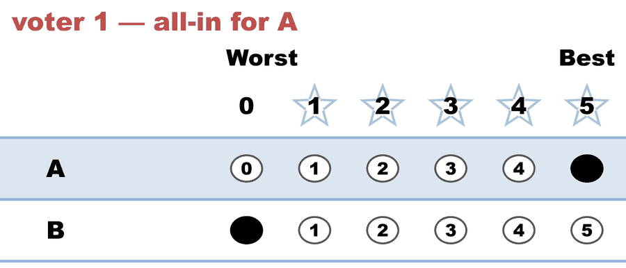
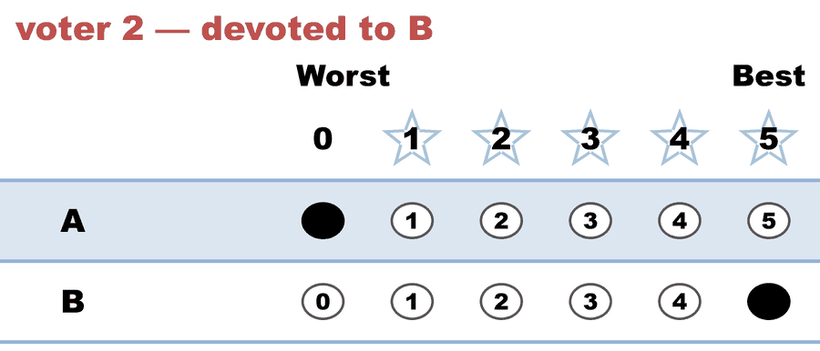

---
search:
  exclude: true
---

# Same ranks, polarized electorate — the ranked ballot's blind spot (profile 2 of 2)

*Generated from [`same_ranks_polarized_c2_b3_procaccia_rosenschein.yaml`](../same_ranks_polarized_c2_b3_procaccia_rosenschein.yaml) — do not edit by hand. Regenerate: `python STARVote_LH_tabulation_engine/tools_adam/scripts/build_yaml_pages.py`.*

**Method:** [STAR (single winner)](../../../../01_STAR/01_Learn/README.md) · **1 seat** · **Expected winner:** A

**▶ Live on BetterVoting:** [vote](https://bettervoting.com/9kffcv) · **[results ↗](https://bettervoting.com/9kffcv/results)** (election `9kffcv` · test `BV2273`).

## Scenario

The other half of Proposition 1 in Procaccia & Rosenschein, "The
Distortion of Cardinal Preferences in Voting" (CIA 2006). Same three
voters, same two candidates, same rankings as the companion file
same_ranks_lukewarm_c2_b3 — and a completely different electorate.

Here nobody is lukewarm: the two A voters score 5,0 and the B voter
scores 0,5. Every voter's scores still sum to 5 (the paper's unit-sum
normalization). The rankings are still A>B, B>A, A>B — identical, mark
for mark, to the companion file.

But the utility totals have flipped. There, B led 9 to 6 and was the
welfare-maximizing winner. Here A leads 10 to 5. A method that reads
only the order cannot tell these two elections apart, so it must return
the same winner in both — and no single answer is right in both. That
is the impossibility: distortion strictly greater than 1 for EVERY
social choice function, at three voters and two candidates.

STAR elects A in both files (with two candidates the automatic runoff
is plain majority rule). Here that happens to be the utility optimum
too, so this is the profile where the ranked answer is right — and the
only way to know which profile you are in is to read the scores, which
is exactly what the 0-5 ballot records and the ranking discards.

## Ballots

The ballots as marked — the filled bubble is the score given, and the score is the number in its column:

| # | Ballot as marked | A | B |
|:--:|:--|:--:|:--:|
| 1 |  | 5 | 0 |
| 2 |  | 0 | 5 |
| 3 |  | 5 | 0 |

The same ballots as the file records them:

Row 1 = candidate names; each later row is one voter's 0–5 scores (a `N ×` prefix = N identical ballots).

```text
A,B
5,0   # voter 1 — all-in for A
0,5   # voter 2 — devoted to B
5,0   # voter 3 — all-in for A
```

## What the engine says

The count, step by step — the rounds and how the winner is reached:

<!-- --8<-- [start:report] -->
```text
--- STAR Voting Method (single winner) ---

[STAR Voting]
 Tabulating 3 ballots.
Count × A,B
    2 × 5,0
    1 × 0,5

[STAR Voting: Scoring Round]
 The two highest-scoring candidates advance to the next round.
   A             -- 10 -- First place
   B             --  5 -- Second place
 A and B advance.

[STAR Voting: Automatic Runoff Round]
 The candidate preferred in the most head-to-head matchups wins.
   A             -- 2 -- First place
   B             -- 1
   Equal Support -- 0
 A wins.
   Runoff math:
     3  ballots cast
   − 0  Equal Support (no preference between the two finalists)
     ─
     3  voters with a preference  (majority = 2)
           A 2 (67%)  ·  B 1 (33%)

[STAR Voting: Winner — STAR Voting Method (single winner)]
 A
```
<!-- --8<-- [end:report] -->

### Full audit — preference matrix, Condorcet, and score distribution

```text
--- Runoff (Preference) Matrix ---
Head-to-head / pairwise comparison
Legend: For - Equal Support - Against
        * indicates Top 2 Finalist
               |    * A     |   * B     |
-----------------------------------------
         * A > |    ---     |2 - 0 - 1  |
         * B > | 1 - 0 - 2  |   ---     |

[Condorcet Winner]
  Condorcet Winner: A — matches the STAR winner

[Condorcet Loser]
  Condorcet Loser: B — loses every head-to-head matchup

[Score Distribution] (how many ballots gave each star rating)
                Score
Candidate  5  4  3  2  1  0  | Total   Avg
A          2  0  0  0  0  1  |    10   3.3
B          1  0  0  0  0  2  |     5   1.7
```

Everything in one file: the [`_tabulated` mirror](../cases_tabulated/same_ranks_polarized_c2_b3_procaccia_rosenschein_tabulated.txt) (regenerated on every run; every analysis forced on).

Run it yourself:

```bash
python STARVote_LH_tabulation_engine/starvote_larry_hastings.py method_comparisons/same_ranks_different_utilities/cases/same_ranks_polarized_c2_b3_procaccia_rosenschein.yaml
```

## See also

- [Runoff reversal (worked set)](../../../../01_STAR/02_Examples/runoff_overturns_leader/README.md)
- [Glossary](../../../../07_Concepts/GLOSSARY.md) · [all cases by method](../../../../07_Concepts/YAML_test_case_index/README.md)

More cases in this set: [same_ranks_lukewarm_c2_b3_procaccia_rosenschein](same_ranks_lukewarm_c2_b3_procaccia_rosenschein.md)
