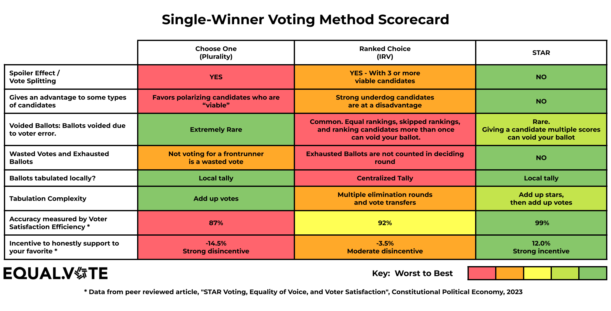

# The Equal Vote single-winner scorecard — reproduced, and checked for fairness

*A widely-shared comparison from the **Equal Vote Coalition** scores three single-winner methods — Choose-One (Plurality), RCV-IRV, and STAR — across eight dimensions, color-coded worst→best. It is a **STAR-advocacy artifact**, and this library's habit is to check even our own side's materials. This page reproduces it as a table (searchable, linkable) and then assesses it row by row: what's valid, what's fair, and where it overreaches. The point isn't to discredit it — most of it holds up — but to model reading a scorecard critically. (Source: Equal Vote Coalition, © Equal Vote Coalition, used by permission. The two starred rows are from a peer-reviewed paper — see the note at the bottom.)*

→ Related: [reading these fairly — the test for an honest comparison](../paradoxes_and_whoops/reading_these_fairly.md) · [same opinions, every method](../../00_start_here/topics/same_opinions_every_method.md) · real cases where these play out: [Alaska 2022](../alaska_2022/README.md), [Tennessee](../paradoxes_and_whoops/bv2155_cphxpt_tennessee_four_ways.md).

**Bottom line up front.** The scorecard is a good-faith, **directionally accurate** summary. Its *structural* rows — summability, exhausted ballots, tabulation, the spoiler ordering — are legitimate and match this library's own analysis. Its two weakest cells are the **absolute "NO"s for STAR** on spoilers and candidate-bias: STAR is far more *resistant*, but not *immune* — as [STAR's own honest limits](../../00_start_here/STAR_Voting/properties_and_limits/STAR_honest_limits.md) documents. And the two numeric rows come from a paper authored by STAR advocates: trust the **ordering** (robust across many studies), not the **decimals** (model-bound).

---

## The scorecard, reproduced

*The Equal Vote Coalition's **Single-Winner Voting Method Scorecard** (© Equal Vote Coalition, used by permission). It's reproduced as text below so every claim is searchable and checkable.*

Rating key (worst → best): 🟥 · 🟧 · 🟨 · 🟢 good · 🟩 best.

| Dimension | Choose-One (Plurality) | Ranked Choice (RCV-IRV) | STAR |
|---|---|---|---|
| **Spoiler effect / vote splitting** | 🟥 Yes | 🟧 Yes — with 3+ viable candidates | 🟩 No |
| **Advantages some candidate types** | 🟥 Favors polarizing "viable" candidates | 🟧 Strong underdog candidates disadvantaged | 🟩 No |
| **Voided ballots (voter error)** | 🟩 Extremely rare | 🟥 Common — equal/skipped rankings or ranking a candidate twice can void | 🟢 Rare — giving one candidate multiple scores can void |
| **Wasted / exhausted ballots** | 🟧 Not voting for a frontrunner is a wasted vote | 🟥 Exhausted ballots aren't counted in the deciding round | 🟩 No |
| **Ballots tabulated locally?** | 🟩 Local tally | 🟥 Centralized tally | 🟩 Local tally |
| **Tabulation complexity** | 🟩 Add up votes | 🟧 Multiple elimination rounds + vote transfers | 🟢 Add stars, then add up votes |
| **Accuracy — Voter Satisfaction Efficiency \*** | 🟥 87% | 🟨 92% | 🟩 99% |
| **Incentive to honestly support your favorite \*** | 🟥 −14.5% (strong disincentive) | 🟧 −3.5% (moderate disincentive) | 🟩 +12.0% (strong incentive) |

---

## The assessment, row by row

Verdict tags: ✅ **fair** · ⚠️ **fair but loaded** · ❗ **overclaim**.

1. **Spoiler / vote splitting — ❗ (STAR cell overclaims).** Plurality "Yes" is textbook-correct — it's the method *most* prone to [vote-splitting and spoilers](../../00_start_here/topics/spoiler_effect.md). "Yes, with 3+ viable" for RCV-IRV is fair: IRV *reduces* spoilers but the [center squeeze](../center_squeeze/) is a real one. But STAR "No" is too strong. STAR is not spoiler-*proof* — in a genuine Condorcet cycle its runoff is [IIA](../../00_start_here/topics/what_makes_a_voting_method_good.md)-sensitive, and a candidate who can't win can flip the result by changing which two reach the runoff — worked, BV-backed, on sincere ballots ([the cycle spoiler, BV2212](../../01_STAR/iia_cycle_spoiler/bv2212_g3f7r2_cycle_spoiler.md)). Honest wording: *"greatly reduced, not eliminated."*

2. **Advantages some candidate types — ❗ (STAR cell overclaims).** Plurality favoring polarizing front-runners, and IRV disadvantaging the broadly-liked center (again the squeeze), are both accurate. STAR "No" glosses over a real lean: STAR systematically favors **broadly-supported, consensus** candidates over ones with an intense but narrow base — that's the *point* of the scoring-round-plus-runoff design, and it's a bias, just a defensible one. Every method advantages *some* type; the honest claim is "favors consensus candidates," not "none."

3. **Voided ballots — ⚠️ (fair, one loaded word).** Directionally solid and, to its credit, **self-critical**: STAR gets the *good* band, not the *best*, because over-scoring a candidate can void a STAR ballot too. Ranked ballots really do spoil more often (roughly [0–2% rated vs. 4–9% ranked](../../00_start_here/scores_and_ranks/score_ballot.md)). "Common" for IRV is the loaded word — spoilage is *higher*, but whether an equal/skipped ranking voids the ballot is **implementation-dependent** (many jurisdictions interpret voter intent or simply exhaust the ballot rather than void it).

4. **Wasted / exhausted ballots — ✅ (fair).** [Exhausted ballots](../../00_start_here/RCV_IRV/RCV_IRV_exhausted_ballots.md) — ballots whose ranked candidates are all eliminated before the final round — are a genuine IRV phenomenon. STAR "No" is defensible: every ballot is read in *both* rounds, and a ballot that's neutral in the runoff is [Equal Support](../../00_start_here/GLOSSARY.md) *by the voter's own scoring*, not discarded by the method.

5. **Ballots tabulated locally? — ✅ (fair, and the strongest row).** This is [**summability**](../../00_start_here/RCV_IRV/RCV_IRV_lack_of_summability.md), and it's IRV's most legitimate structural weakness: precinct subtotals **add up** under Plurality and STAR, but IRV's eliminations need every ballot in one place, so it can't be verified precinct-by-precinct. [Worked, three methods, one example](../summability_demo/). Nothing loaded here — this is just true.

6. **Tabulation complexity — ✅ (fair).** Accurate, and again honestly self-scored: STAR gets *good*, not *best*, because it's two steps (add scores, then one runoff comparison) — genuinely simpler than IRV's rounds-and-transfers, but a hair more than Plurality's single sum.

7. **Accuracy (VSE) — ⚠️ (direction robust, precision oversold, disclose the lean).** [Voter Satisfaction Efficiency](../../00_start_here/topics/what_makes_a_good_winner.md#measuring-it-empirically-vse-bayesian-regret) is a real, respected simulation yardstick, and the **ordering Plurality < IRV < STAR is robust** across many independent studies. But the *exact* numbers (87/92/99) are specific to one model's assumptions about voters, candidates, and strategy — IRV's VSE in particular swings a lot between studies — so single-decimal precision claims more than simulation can deliver. Read them as "under this model," not as constants.

8. **Honesty incentive — ⚠️ (same caveats).** The −14.5 / −3.5 / +12.0 figures are the [favorite-betrayal](../../00_start_here/STAR_Voting/properties_and_limits/favorite_betrayal_voting_301.md) pressure from the same 2023 paper. The *ranking* is theory-consistent: Plurality punishes honesty hardest, IRV moderately, STAR least. But "STAR = a positive incentive" shouldn't be read as a guarantee — STAR is **not** favorite-betrayal-proof; it fails the criterion in rare constructions ([STAR's honest limits](../../00_start_here/STAR_Voting/properties_and_limits/STAR_honest_limits.md)). It's a modeled *average*, not a promise.

---

## So — valid? fair?

- **Valid:** yes, directionally. Every row points the right way, and the structural rows (5, 6, and the exhausted-ballot/summability facts) are simply correct and are among the *best-grounded* criticisms of IRV there are.
- **Fair:** mostly — with two exceptions and one disclosure. The **absolute "NO"** cells (rows 1–2) are the overclaims: they turn "much more resistant" into "immune," which our own [honest-limits](../../00_start_here/STAR_Voting/properties_and_limits/STAR_honest_limits.md) page won't support. And the **numeric rows** (7–8) come from [Wolk, Quinn & Ogren (2023)](../../00_start_here/topics/in_memoriam_jameson_quinn.md) — all Equal Vote / STAR-affiliated. That doesn't make the numbers wrong (Quinn's VSE holds up when you check it), but per this library's [sourcing rule](../../CLAUDE.md) the lean should be **disclosed, not hidden** — cite the ordering, not the decimals.
- **The RCV-IRV column** deserves a word in its defense: the coloring runs a touch harsher than a neutral referee might assign. IRV's real-world track record is mostly uneventful; its genuine failures (center squeeze, summability, exhaustion) are real but *rarer* than a wall of red/orange implies. This library's own rule is to [state the rarity and apply the test symmetrically](../paradoxes_and_whoops/reading_these_fairly.md) — a scorecard that scores a method only on its bad days isn't lying, but it isn't the whole story either.

**Net:** a useful, good-faith summary that a reader can trust for **direction**. A careful reader should mentally soften the two "NO"s to "greatly reduced," and read the percentages as "under this model." That's not a knock on STAR — STAR's honest case is strong enough that it doesn't need the absolutes.

## Beyond the three — where Ranked Robin and 3-2-1 would land

Equal Vote's card compares only Plurality, RCV-IRV, and STAR. For a fuller picture, here's where two other good rated/ranked methods sit on the **same qualitative dimensions** — [Ranked Robin](../../00_start_here/RCV_Ranked_Robin/README.md) (Condorcet) and [3-2-1](../../00_start_here/topics/three_two_one_voting.md) (Quinn's Good/OK/Bad method). *(Our extension, not EVC's — and we leave the numeric VSE / honesty-incentive rows blank rather than invent figures the original card didn't measure for these two.)*

| Dimension | Ranked Robin | 3-2-1 |
|---|---|---|
| **Spoiler / vote-splitting** | 🟩 No | 🟩 No |
| **Advantages some candidate types** | 🟩 No — elects the consensus/Condorcet winner | 🟩 No |
| **Voided ballots** | 🟢 Rare — equal ranks allowed (no overvote trap) | 🟢 Rare — only three levels to mark |
| **Wasted / exhausted ballots** | 🟩 No — reads every rank | 🟩 No |
| **Ballots tabulated locally?** | 🟩 Local — pairwise matrix is summable | 🟩 Local — Good/Bad tallies + pairwise matrix |
| **Tabulation complexity** | 🟧 Build the pairwise grid, count wins | 🟧 Three steps + the clone/dark-horse guards |
| **VSE / honesty incentive** | high (Condorcet-efficient); not on EVC's card | high (STAR-like); not on EVC's card |

Both clear the bar the scorecard is really drawing — **summable, center-squeeze-free, no wasted votes, honesty-friendly** — which is the company STAR keeps. Where they differ from STAR is the fine detail the [strategic-pathologies scorecard](../../00_start_here/topics/strategic_pathologies.md) lays out (RR's sincere dark-horse seam; 3-2-1's coarser 3-level ballot). The headline: the real divide isn't STAR-vs-these — it's **all four** (STAR, RR, 3-2-1, Approval) versus Plurality and IRV.

## The longer version — Equal Vote's prose pros/cons, and its sources

The scorecard is the graphic; Equal Vote's [**STAR vs RCV pros & cons**](https://www.equal.vote/star_rcv_pros_cons) is the prose expansion — same lean, more detail, and, to its credit, **actual citations**. That makes it checkable. Here is what's behind the headline numbers, and where the citation is stronger than the study it rests on:

| The EVC claim | The real source | The honest reading |
|---|---|---|
| "≈1 in 5" close 3-candidate contests go wrong | Ornstein & Norman, [*Public Choice* 2014](https://link.springer.com/article/10.1007/s11127-013-0118-2) | The paper measures **[monotonicity failure](../monotonicity/)**, *not* spoilers — ≥15% of **competitive** 3-way IRV races, rising toward 50% only in near-ties (Miller, "Closeness matters," 2017). Real, but a specific pathology concentrated in close elections — not "1 in 5 elections come out wrong." |
| RCV ballots "~10× more likely to be rejected" | Pettigrew & Radley, [*Political Behavior* 2025](https://link.springer.com/article/10.1007/s11109-025-10028-4) (3M+ ballots) | True as a **ratio** — but the **absolute** rate is 0.53% vs 0.04%, both under 1%. The load-bearing finding is the **demographic disparity** (more errors where there are more racial-minority, lower-income, lower-education voters). Peer-reviewed — and **contested** (a Mathematics & Democracy Institute rebuttal disputes the methodology). |
| Ballot exhaustion "9.6%–27.1%" | Burnett & Kogan, *Electoral Studies* 2015 | Solid; [exhaustion](../../00_start_here/RCV_IRV/RCV_IRV_exhausted_ballots.md) is real and varies widely by race. |
| San Francisco RCV spoilage + racial gaps | Neely & McDaniel (SF State) | Real; the equity angle is the substantive point, and it cuts against RCV's own fairness case. |
| "Most accurate" / VSE | Quinn's VSE simulations | Ordering robust; exact % model-bound — same caveat as scorecard row 7. |

Two more fairness notes on the prose page, beyond the graphic's:

- It states STAR **"does not incentivize strategic voting."** Too strong. STAR *reduces* the incentive (and scores well on it in simulation), but no deterministic method is strategy-proof ([Gibbard–Satterthwaite](../../00_start_here/topics/gibbard_satterthwaite_theorem.md)) and STAR has its own [strategic](../../00_start_here/topics/strategic_voting.md) edge cases. "The least strategically vulnerable of the three" is the defensible version.
- A **framing asymmetry** the page's own structure shows: STAR's *newness / no governmental use yet* is filed as a minor con, while RCV's *long track record* is turned against it (every real failure catalogued). A neutral reader should weight "untested at scale" as a genuine STAR unknown, symmetrically.

The pattern holds across Equal Vote's materials: the **facts are mostly right and well-sourced, the framing is advocacy**. Cite the sources — they're good and worth reading — keep the ordering, and discount the absolutes and the relative-risk drama.

---

*Source: **Single-Winner Voting Method Scorecard**, Equal Vote Coalition (© Equal Vote Coalition, used by permission — [`img/eqv_single_winner_scorecard.png`](img/eqv_single_winner_scorecard.png)). Starred rows (VSE; honesty incentive): Sara Wolk, Jameson Quinn & Marcus Ogren, "STAR Voting, Equality of Voice, and Voter Satisfaction," *Constitutional Political Economy* (2023). The graphic's content is reproduced as text above so the claims are searchable and checkable.*
