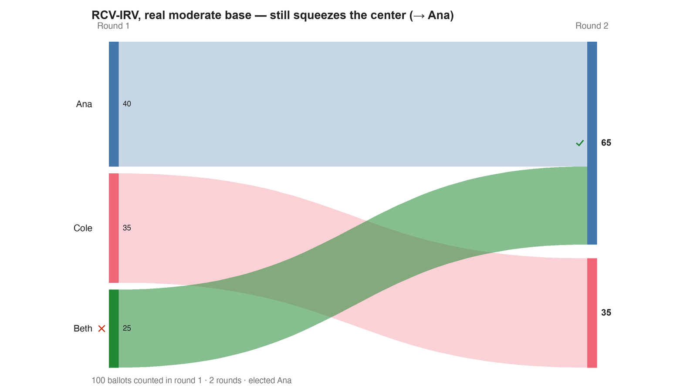

---
search:
  exclude: true
---

# RCV-IRV, real moderate base — still squeezes the center (→ Ana)

*Generated from [`bv2223_dyh93j_510_real_irv.yaml`](../bv2223_dyh93j_510_real_irv.yaml) — do not edit by hand. Regenerate: `python STARVote_LH_tabulation_engine/tools_adam/scripts/build_yaml_pages.py`.*

**Method:** [RCV-IRV (Instant Runoff)](../../../../06_Other/RCV_IRV/concepts/README.md) · **1 seat** · **Expected winner:** Ana

**▶ Live on BetterVoting:** [vote](https://bettervoting.com/dyh93j) · **[results ↗](https://bettervoting.com/dyh93j/results)** (election `dyh93j` · test `BV2223`).

## Scenario

The real-moderate electorate (40/35/25) as ranked ballots under RCV-IRV. Beth
still has the fewest first-choices (25) and is eliminated first, her ballots
flow to Ana, who wins 65–35. IRV fails the Condorcet winner regardless of
moderate base — because it only ever counts first choices. Contrast s4: the
SAME electorate under strategic-5-1-0 STAR elects Beth, the Condorcet winner.

## Ballots

Each row is one voter's ranking, most-preferred first (`N:` prefix = N identical ballots).

```text
40:Ana>Beth>Cole
35:Cole>Beth>Ana
25:Beth>Ana>Cole
```

## What the engine says



*Where the votes went. Band thickness is votes; a band leaving an eliminated candidate lands on whoever that ballot ranked next, or on **inactive** if it ranked nobody who was left.*

The count, step by step — the rounds and how the winner is reached:

<!-- --8<-- [start:report] -->
```text
--- RCV / Instant-Runoff Voting (single winner) ---
  RCV-IRV, real moderate base — still squeezes the center (→ Ana)
 Tabulating 100 ballots (ranked ballots).

ROUND 1
Candidate      Votes  Status
-----------  -------  --------
Ana               40  Hopeful
Cole              35  Hopeful
Beth              25  Rejected

FINAL RESULT
Candidate      Votes  Status
-----------  -------  --------
Ana               65  Elected
Cole              35  Rejected
Beth               0  Rejected


Winner(s) — RCV / Instant-Runoff Voting (single winner)
  Ana

--- Transfers and inactive ballots (what the round tables leave out) ---
The tables above give each candidate's round total but not where a
transferred vote came FROM, nor how many ballots stopped counting.
Both are recomputed from the ballots, using the eliminations the
count above actually made.

ROUND 1 — 100 of 100 ballots still active; majority = 51
   Beth eliminated with 25:
      → Ana                      25

FINAL ROUND — 100 of 100 ballots still active; majority = 51
   Ana                      65  (65.0% of the still-active)  ← elected
   Cole                     35  (35.0% of the still-active)
   Never exhausted, never transferred:
      35 ballots held by Cole carried a lower ranking that was never read
      (the count stopped here, so those preferences did nothing).

Inactive ballots at the final round: 0 of 100 (0.0%).
   Ana's 65 is a majority of the 100 still active AND of all 100 cast (65.0%).
```
<!-- --8<-- [end:report] -->

### Full audit — preference matrix, Condorcet, and score distribution

```text
--- Smith Set (the generalized Condorcet winner) ---
The smallest group whose every member beats every candidate outside it —
the honest answer to "who is even in contention?".
   Smith set (1 of 3): Beth
   Outside (2):        Ana, Cole
   One member ⇒ Beth is the Condorcet winner, beating every rival head-to-head.
   RCV-IRV winner Ana is OUTSIDE the Smith set. ✗
      Every member of the set (Beth) beats Ana head-to-head, yet
      RCV-IRV elected Ana anyway. RCV-IRV is not Smith-efficient (nor
      Condorcet-efficient) — this is the shape a center squeeze leaves behind.
   More: 07_Concepts/topics/smith_set.md
```

Everything in one file: the [`_tabulated` mirror](../cases_tabulated/bv2223_dyh93j_510_real_irv_tabulated.txt) (regenerated on every run; every analysis forced on).

Run it yourself:

```bash
python STARVote_LH_tabulation_engine/starvote_larry_hastings.py method_comparisons/star_5_1_0_challenge/cases/bv2223_dyh93j_510_real_irv.yaml
```

## See also

- [Condorcet efficiency (topic hub)](../../../../07_Concepts/topics/condorcet/README.md)
- [Glossary](../../../../07_Concepts/GLOSSARY.md) · [all cases by method](../../../../07_Concepts/YAML_test_case_index/README.md)

More cases in this set: [bv2221_2kcwbw_sincere](bv2221_2kcwbw_sincere.md) · [bv2222_rfyk46_510_thin_irv](bv2222_rfyk46_510_thin_irv.md) · [bv2222_rfyk46_510_thin_star](bv2222_rfyk46_510_thin_star.md) · [bv2223_dyh93j_510_real_star](bv2223_dyh93j_510_real_star.md)
