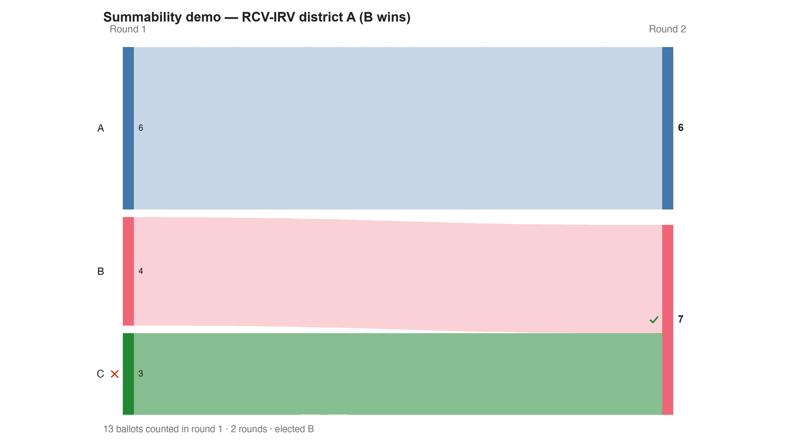

---
search:
  exclude: true
---

# Summability demo — RCV-IRV district A (B wins)

*Generated from [`irv_district_A.yaml`](../irv_district_A.yaml) — do not edit by hand. Regenerate: `python STARVote_LH_tabulation_engine/tools_adam/scripts/build_yaml_pages.py`.*

**Method:** [RCV-IRV (Instant Runoff)](../../../../06_Other/RCV_IRV/concepts/README.md) · **1 seat** · **Expected winner:** B

## Scenario

District A of the RCV-IRV summability trio: C is eliminated, C's ballots
transfer to B, B wins. Looks precinct-friendly — until you try to combine
districts. See irv_combined.yaml: no fixed set of district-level IRV
subtotals can be added into the combined answer, because who gets eliminated
depends on ALL ballots at once.

## Ballots

Each row is one voter's ranking, most-preferred first (`N:` prefix = N identical ballots).

```text
6:A
4:B
3:C>B>A
```

## What the engine says



*Where the votes went. Band thickness is votes; a band leaving an eliminated candidate lands on whoever that ballot ranked next, or on **inactive** if it ranked nobody who was left.*

The count, step by step — the rounds and how the winner is reached:

<!-- --8<-- [start:report] -->
```text
--- RCV / Instant-Runoff Voting (single winner) ---
  Summability demo — RCV-IRV district A (B wins)
 Tabulating 13 ballots (ranked ballots).

ROUND 1
Candidate      Votes  Status
-----------  -------  --------
A                  6  Hopeful
B                  4  Hopeful
C                  3  Rejected

FINAL RESULT
Candidate      Votes  Status
-----------  -------  --------
B                  7  Elected
A                  6  Rejected
C                  0  Rejected


Winner(s) — RCV / Instant-Runoff Voting (single winner)
  B

--- Transfers and inactive ballots (what the round tables leave out) ---
The tables above give each candidate's round total but not where a
transferred vote came FROM, nor how many ballots stopped counting.
Both are recomputed from the ballots, using the eliminations the
count above actually made.

ROUND 1 — 13 of 13 ballots still active; majority = 7
   C eliminated with 3:
      → B                         3

FINAL ROUND — 13 of 13 ballots still active; majority = 7
   B                         7  (53.8% of the still-active)  ← elected
   A                         6  (46.2% of the still-active)

Inactive ballots at the final round: 0 of 13 (0.0%).
   B's 7 is a majority of the 13 still active AND of all 13 cast (53.8%).
```
<!-- --8<-- [end:report] -->

### Full audit — preference matrix, Condorcet, and score distribution

```text
--- Smith Set (the generalized Condorcet winner) ---
The smallest group whose every member beats every candidate outside it —
the honest answer to "who is even in contention?".
   Smith set (1 of 3): B
   Outside (2):        A, C
   One member ⇒ B is the Condorcet winner, beating every rival head-to-head.
   RCV-IRV winner B is INSIDE the Smith set. ✓
      Not guaranteed — RCV-IRV is not Smith-efficient — but it holds here.
   More: 07_Concepts/topics/smith_set.md
```

Everything in one file: the [`_tabulated` mirror](../cases_tabulated/irv_district_A_tabulated.txt) (regenerated on every run; every analysis forced on).

Run it yourself:

```bash
python STARVote_LH_tabulation_engine/starvote_larry_hastings.py method_comparisons/summability_demo/cases/irv_district_A.yaml
```

## See also

- [Summability (topic hub)](../../../../07_Concepts/topics/summability/README.md)
- [Glossary](../../../../07_Concepts/GLOSSARY.md) · [all cases by method](../../../../07_Concepts/YAML_test_case_index/README.md)

More cases in this set: [irv_combined](irv_combined.md) · [irv_district_B](irv_district_B.md) · [rr_combined](rr_combined.md) · [rr_district_A](rr_district_A.md) · [rr_district_B](rr_district_B.md) · [star_combined](star_combined.md) · [star_district_A](star_district_A.md) · [star_district_B](star_district_B.md)
