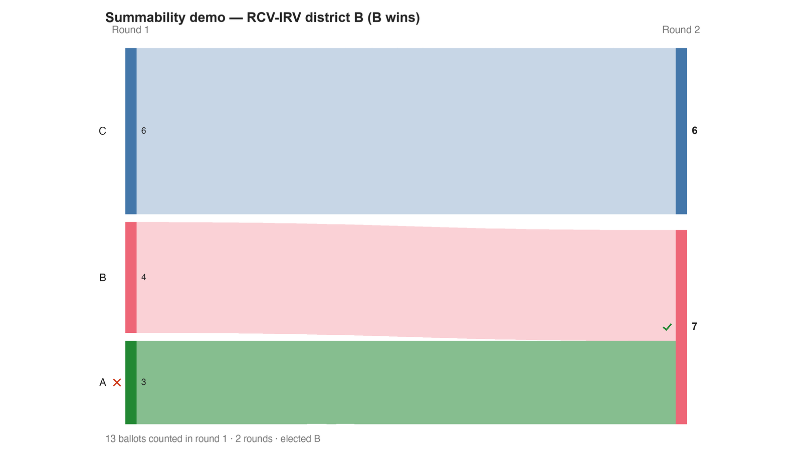

---
search:
  exclude: true
---

# Summability demo — RCV-IRV district B (B wins)

*Generated from [`irv_district_B.yaml`](../irv_district_B.yaml) — do not edit by hand. Regenerate: `python STARVote_LH_tabulation_engine/tools_adam/scripts/build_yaml_pages.py`.*

**Method:** [RCV-IRV (Instant Runoff)](../../../../06_Other/RCV_IRV/concepts/README.md) · **1 seat** · **Expected winner:** B

## Scenario

District B of the RCV-IRV summability trio: B wins here too — both districts
independently elect B. Yet the combined electorate does NOT elect B (see
irv_combined.yaml: B is eliminated first there). District winners, and even
full district round-by-round tallies, cannot be summed into the combined
result — the non-summability this trio demonstrates.

## Ballots

Each row is one voter's ranking, most-preferred first (`N:` prefix = N identical ballots).

```text
6:C
4:B
3:A>B>C
```

## What the engine says



*Where the votes went. Band thickness is votes; a band leaving an eliminated candidate lands on whoever that ballot ranked next, or on **inactive** if it ranked nobody who was left.*

The count, step by step — the rounds and how the winner is reached:

<!-- --8<-- [start:report] -->
```text
--- RCV / Instant-Runoff Voting (single winner) ---
  Summability demo — RCV-IRV district B (B wins)
 Tabulating 13 ballots (ranked ballots).

ROUND 1
Candidate      Votes  Status
-----------  -------  --------
C                  6  Hopeful
B                  4  Hopeful
A                  3  Rejected

FINAL RESULT
Candidate      Votes  Status
-----------  -------  --------
B                  7  Elected
C                  6  Rejected
A                  0  Rejected


Winner(s) — RCV / Instant-Runoff Voting (single winner)
  B
```
<!-- --8<-- [end:report] -->

### Full audit — preference matrix, Condorcet, and score distribution

```text
--- Smith Set (the generalized Condorcet winner) ---
The smallest group whose every member beats every candidate outside it —
the honest answer to "who is even in contention?".
   Smith set (1 of 3): B
   Outside (2):        C, A
   One member ⇒ B is the Condorcet winner, beating every rival head-to-head.
   RCV-IRV winner B is INSIDE the Smith set. ✓
      Not guaranteed — RCV-IRV is not Smith-efficient — but it holds here.
   More: 07_Concepts/topics/smith_set.md
```

Everything in one file: the [`_tabulated` mirror](../cases_tabulated/irv_district_B_tabulated.txt) (regenerated on every run; every analysis forced on).

Run it yourself:

```bash
python STARVote_LH_tabulation_engine/starvote_larry_hastings.py method_comparisons/summability_demo/cases/irv_district_B.yaml
```

## See also

- [Summability (topic hub)](../../../../07_Concepts/topics/summability/README.md)
- [Glossary](../../../../07_Concepts/GLOSSARY.md) · [all cases by method](../../../../07_Concepts/YAML_test_case_index/README.md)

More cases in this set: [irv_combined](irv_combined.md) · [irv_district_A](irv_district_A.md) · [rr_combined](rr_combined.md) · [rr_district_A](rr_district_A.md) · [rr_district_B](rr_district_B.md) · [star_combined](star_combined.md) · [star_district_A](star_district_A.md) · [star_district_B](star_district_B.md)
