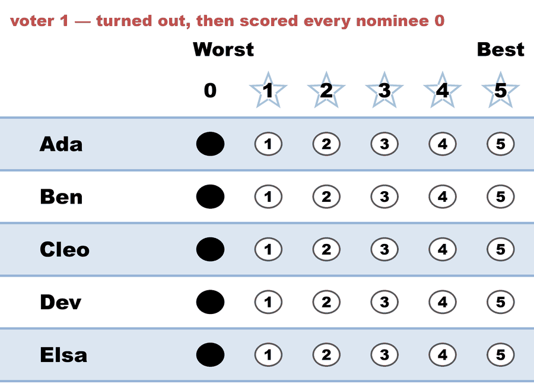
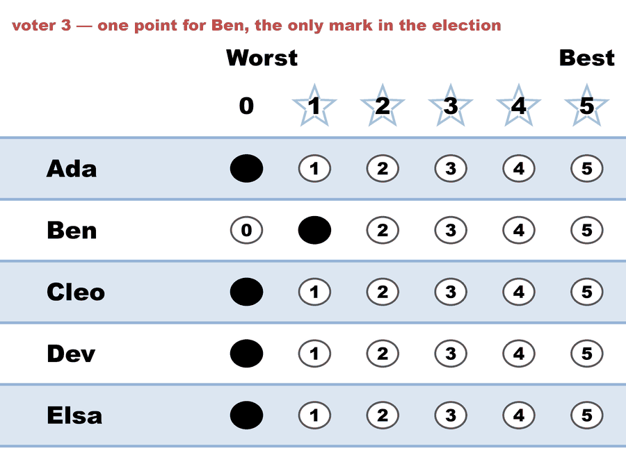

---
search:
  exclude: true
---

# One point — a single mark fills one seat and the lot fills the other (Bloc STAR)

*Generated from [`one_point_bloc_star.yaml`](../one_point_bloc_star.yaml) — do not edit by hand. Regenerate: `python STARVote_LH_tabulation_engine/tools_adam/scripts/build_yaml_pages.py`.*

**Method:** [Bloc STAR (multi-winner, majoritarian)](../../../../03_STAR_PR/01_Learn/README.md) · **2 seats** · **Expected winners:** Ben, Ada

**Official tie-break (lot) order:** Ada > Ben > Cleo > Dev > Elsa — consulted only if every deterministic tiebreaker stays tied ([how the ladder works](../../../../01_STAR/01_Learn/Tie_Breaking_STAR/tie_breaking.md)).

## Scenario

The zero-support ballots with one thing changed: voter 3 gives Ben a 1.

That single mark is the only support anybody expresses in the whole
election — one point out of a possible 75 (3 voters x 5 nominees x 5
points). It is enough to settle the first seat outright, and it changes
nothing at all about the second, which is still decided by lot.

The reason this file sits beside the all-zero six is that it is the HARDER
case to read, not the easier one. The all-zero reports look degenerate, so
nobody mistakes them for a mandate. This one looks decisive: the runoff
summary reads "Ben 1 (100%) vs Ada 0 (0%); majority = 1", because the
decided-voters denominator is the one voter who expressed a preference.
Every number on that line is correct and the impression it leaves is not.

It is also where a tempting rule fails. "Refuse to count an election with no
support" is easy to state while every score is 0 and impossible to state
here: seat 1 rests on a real, if tiny, preference that a returning officer
should report, and seat 2 rests on nothing at all. One election, both
answers, no threshold that separates them without being a policy number in
disguise. What the engine can do instead is what it does below — count it,
and say per seat which rung paid for it.

Same cast and same first two ballots as the zero-support set; see the README
for the six methods that count the unchanged version.

## Ballots

The ballots as marked — the filled bubble is the score given, and the score is the number in its column:

| # | Ballot as marked | Ada | Ben | Cleo | Dev | Elsa |
|:--:|:--|:--:|:--:|:--:|:--:|:--:|
| 1 |  | 0 | 0 | 0 | 0 | 0 |
| 2 |  | 0 | 0 | 0 | 0 | 0 |
| 3 |  | 0 | 1 | 0 | 0 | 0 |

The same ballots as the file records them:

Row 1 = candidate names; each later row is one voter's 0–5 scores (a `N ×` prefix = N identical ballots).

```text
Ada,Ben,Cleo,Dev,Elsa
0,0,0,0,0   # voter 1 — turned out, then scored every nominee 0
0,0,0,0,0   # voter 2 — a deliberate 0 is not a blank ballot
0,1,0,0,0   # voter 3 — one point for Ben, the only mark in the election
```

## What the engine says

The count, step by step — the rounds and how the winner is reached:

<!-- --8<-- [start:report] -->
```text
[Divergence from STAR]
  STAR     = Ben
  Approval = Ada   (differs from STAR)

--- Bloc STAR Voting Method (2 winners) ---

[Bloc STAR]
 Tabulating 3 ballots to fill 2 seats.
Count × Ada,Ben,Cleo,Dev,Elsa
    2 ×   0,  0,   0,  0,   0
    1 ×   0,  1,   0,  0,   0

[Bloc STAR: Round 1: Scoring Round]
 The two highest-scoring candidates advance to the next round.
   Ben           -- 1 -- First place
   Ada           -- 0 -- Tied for second place
   Cleo          -- 0 -- Tied for second place
   Dev           -- 0 -- Tied for second place
   Elsa          -- 0 -- Tied for second place
 Ben advances, but there's a four-way tie for second.

[Bloc STAR: Round 1: Scoring Round: First tiebreaker]
 The candidate preferred in the most head-to-head matchups advances.
   Ada           -- 0 -- Tied for second place
   Cleo          -- 0 -- Tied for second place
   Dev           -- 0 -- Tied for second place
   Elsa          -- 0 -- Tied for second place
   Equal Support -- 3
 There's still a four-way tie for second.
 Every head-to-head among the tied candidates is a draw, so none of them won a matchup.

[Bloc STAR: Round 1: Scoring Round: Second tiebreaker]
 The candidate with the most votes of score 5 advances.
   Ada           -- 0 -- Tied for second place
   Cleo          -- 0 -- Tied for second place
   Dev           -- 0 -- Tied for second place
   Elsa          -- 0 -- Tied for second place
 There's still a four-way tie for second.

*(Ties are resolved by choosing the tied candidate with the highest-priority official lot number.)*
    Lot-number priority order: ['Ada', 'Ben', 'Cleo', 'Dev', 'Elsa']

[Tiebreaker: Lot Number Priority]
  Tie among: ['Ada', 'Cleo', 'Dev', 'Elsa']
  Resolved: ['Ada'] (selected by lot-number priority).

[Lot-decided tie — rare]
  ⚠ The ballots did not break this tie, and had nothing to break
    it with: not one ballot scored ANY of these candidates above 0,
    so every rung was comparing zero with zero. The pre-published
    LOT order chose among them — the result here was set by lot,
    not by the votes. Nothing to verify in the rounds above; this
    is a tie for lack of support, not a close race.

[Bloc STAR: Round 1: Automatic Runoff Round]
 The candidate preferred in the most head-to-head matchups wins.
   Ben           -- 1 -- First place
   Ada           -- 0
   Equal Support -- 2
 Ben wins.
   Runoff math:
     3  ballots cast
   − 2  Equal Support (no preference between the two finalists)
     ─
     1  voters with a preference  (majority = 1)
           Ben 1 (100%)  ·  Ada 0 (0%)

──────────────────────────────────────────────────

[Bloc STAR: Round 2: Scoring Round]
 The two highest-scoring candidates advance to the next round.
   Ada           -- 0 -- Tied for first place
   Cleo          -- 0 -- Tied for first place
   Dev           -- 0 -- Tied for first place
   Elsa          -- 0 -- Tied for first place
 There's a four-way tie for first.

[Bloc STAR: Round 2: Scoring Round: First tiebreaker]
 The two candidates preferred in the most head-to-head matchups advance.
   Ada           -- 0 -- Tied for first place
   Cleo          -- 0 -- Tied for first place
   Dev           -- 0 -- Tied for first place
   Elsa          -- 0 -- Tied for first place
   Equal Support -- 3
 There's still a four-way tie for first.
 Every head-to-head among the tied candidates is a draw, so none of them won a matchup.

[Bloc STAR: Round 2: Scoring Round: Second tiebreaker]
 The two candidates with the most votes of score 5 advance.
   Ada           -- 0 -- Tied for first place
   Cleo          -- 0 -- Tied for first place
   Dev           -- 0 -- Tied for first place
   Elsa          -- 0 -- Tied for first place
 There's still a four-way tie for first.

[Tiebreaker: Lot Number Priority]
  Tie among: ['Ada', 'Cleo', 'Dev', 'Elsa']
  Resolved: ['Ada', 'Cleo'] (selected by lot-number priority).

[Lot-decided tie — rare]
  ⚠ The ballots did not break this tie, and had nothing to break
    it with: not one ballot scored ANY of these candidates above 0,
    so every rung was comparing zero with zero. The pre-published
    LOT order chose among them — the result here was set by lot,
    not by the votes. Nothing to verify in the rounds above; this
    is a tie for lack of support, not a close race.

[Bloc STAR: Round 2: Automatic Runoff Round]
 The candidate preferred in the most head-to-head matchups wins.
   Ada           -- 0 -- Tied for first place
   Cleo          -- 0 -- Tied for first place
   Equal Support -- 3
 There's a two-way tie for first.

[Bloc STAR: Round 2: Automatic Runoff Round: First tiebreaker]
 The highest-scoring candidate wins.
   Ada           -- 0 -- Tied for first place
   Cleo          -- 0 -- Tied for first place
 There's still a two-way tie for first.

[Bloc STAR: Round 2: Automatic Runoff Round: Second tiebreaker]
 The candidate with the most votes of score 5 wins.
   Ada           -- 0 -- Tied for first place
   Cleo          -- 0 -- Tied for first place
 There's still a two-way tie for first.

[Tiebreaker: Lot Number Priority]
  Tie among: ['Ada', 'Cleo']
  Resolved: ['Ada'] (selected by lot-number priority).

[Lot-decided tie — rare]
  ⚠ The ballots did not break this tie, and had nothing to break
    it with: not one ballot scored ANY of these candidates above 0,
    so every rung was comparing zero with zero. The pre-published
    LOT order chose among them — the result here was set by lot,
    not by the votes. Nothing to verify in the rounds above; this
    is a tie for lack of support, not a close race.

[Bloc STAR: Winners — Bloc STAR Voting Method (2 winners)]
 Ben
 Ada
```
<!-- --8<-- [end:report] -->

### Full audit — preference matrix, Condorcet, and score distribution

```text
--- Preference Matrix ---
Head-to-head / pairwise comparison
Legend: For - Equal Support - Against
        Informational only — not part of the 2-winner count below,
        so no Top-2 finalists are marked.
               |     Ada    |    Ben    |    Cleo   |    Dev    |    Elsa   |
-----------------------------------------------------------------------------
         Ada > |    ---     |0 - 2 - 1  |0 - 3 - 0  |0 - 3 - 0  |0 - 3 - 0  |
         Ben > | 1 - 2 - 0  |   ---     |1 - 2 - 0  |1 - 2 - 0  |1 - 2 - 0  |
        Cleo > | 0 - 3 - 0  |0 - 2 - 1  |   ---     |0 - 3 - 0  |0 - 3 - 0  |
         Dev > | 0 - 3 - 0  |0 - 2 - 1  |0 - 3 - 0  |   ---     |0 - 3 - 0  |
        Elsa > | 0 - 3 - 0  |0 - 2 - 1  |0 - 3 - 0  |0 - 3 - 0  |   ---     |

[Condorcet Winner]
  Condorcet Winner: Ben — matches the STAR winner

[Condorcet Loser]
  No strict Condorcet loser; jointly weak Condorcet losers: Ada, Cleo, Dev, Elsa (winless — pairwise ties) — Ada elected by Approval!

[Score Distribution] (how many ballots gave each star rating)
                Score
Candidate  5  4  3  2  1  0  | Total   Avg
Ada        0  0  0  0  0  3  |     0   0.0
Ben        0  0  0  0  1  2  |     1   0.3
Cleo       0  0  0  0  0  3  |     0   0.0
Dev        0  0  0  0  0  3  |     0   0.0
Elsa       0  0  0  0  0  3  |     0   0.0
```

Everything in one file: the [`_tabulated` mirror](../cases_tabulated/one_point_bloc_star_tabulated.txt) (regenerated on every run; every analysis forced on).

Run it yourself:

```bash
python STARVote_LH_tabulation_engine/starvote_larry_hastings.py method_comparisons/zero_support_election/cases/one_point_bloc_star.yaml
```

## See also

- [Runoff reversal (worked set)](../../../../01_STAR/02_Examples/runoff_overturns_leader/README.md)
- [Glossary](../../../../07_Concepts/GLOSSARY.md) · [all cases by method](../../../../07_Concepts/YAML_test_case_index/README.md)

More cases in this set: [zero_support_approval](zero_support_approval.md) · [zero_support_bloc_star](zero_support_bloc_star.md) · [zero_support_plurality](zero_support_plurality.md) · [zero_support_ranked_robin](zero_support_ranked_robin.md) · [zero_support_star](zero_support_star.md) · [zero_support_star_pr](zero_support_star_pr.md)
