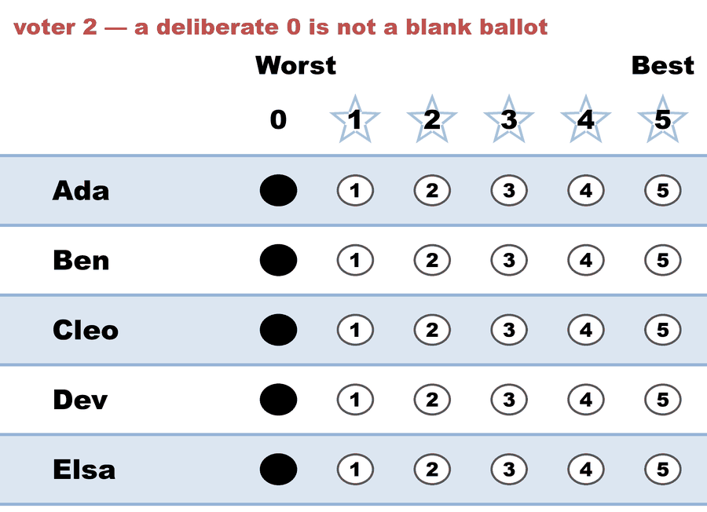
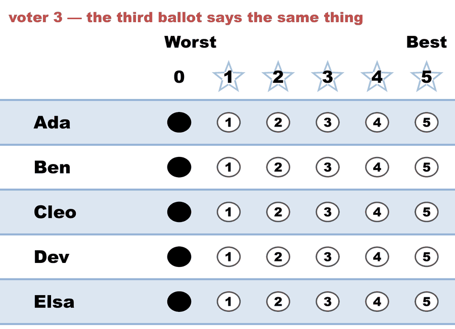

---
search:
  exclude: true
---

# Zero support — nobody scored anybody (STAR)

*Generated from [`zero_support_star.yaml`](../zero_support_star.yaml) — do not edit by hand. Regenerate: `python STARVote_LH_tabulation_engine/tools_adam/scripts/build_yaml_pages.py`.*

**Method:** [STAR (single winner)](../../../../01_STAR/01_Learn/README.md) · **1 seat** · **Expected winner:** Ada

**Official tie-break (lot) order:** Ada > Ben > Cleo > Dev > Elsa — consulted only if every deterministic tiebreaker stays tied ([how the ladder works](../../../../01_STAR/01_Learn/Tie_Breaking_STAR/tie_breaking.md)).

## Scenario

Five nominees, three voters, and every single score is 0.

This is the degenerate limit of a tie: not "the ballots point two ways" but
"the ballots point nowhere at all". Every candidate has the same total (0),
every head-to-head is Equal Support 0-0, and every rung above the lot has
nothing to count — so whichever method is asked, the answer comes from the
published lot order and not from a vote.

It is a real shape, not only a thought experiment. A committee ballot that
goes out with five names nobody has heard of comes back like this; so does a
race where the electorate deliberately withholds support. What the file is
for is checking that the engine says so OUT LOUD rather than reporting a
winner as though somebody had chosen one.

Same three ballots are counted six ways in this folder — see the README for
what each method does with them, and which of the six admits the lot decided.

## Ballots

The ballots as marked — the filled bubble is the score given, and the score is the number in its column:

| # | Ballot as marked | Ada | Ben | Cleo | Dev | Elsa |
|:--:|:--|:--:|:--:|:--:|:--:|:--:|
| 1 |  | 0 | 0 | 0 | 0 | 0 |
| 2 |  | 0 | 0 | 0 | 0 | 0 |
| 3 |  | 0 | 0 | 0 | 0 | 0 |

The same ballots as the file records them:

Row 1 = candidate names; each later row is one voter's 0–5 scores (a `N ×` prefix = N identical ballots).

```text
Ada,Ben,Cleo,Dev,Elsa
0,0,0,0,0   # voter 1 — turned out, then scored every nominee 0
0,0,0,0,0   # voter 2 — a deliberate 0 is not a blank ballot
0,0,0,0,0   # voter 3 — the third ballot says the same thing
```

## What the engine says

The count, step by step — the rounds and how the winner is reached:

<!-- --8<-- [start:report] -->
```text
[Divergence from STAR]
  STAR    = Ada
  RCV-IRV = Dev   (differs from STAR)
  Note: no ballot scored anybody above 0, so not one ballot ranks anyone and
        RCV-IRV has nothing to count — its winner came from its own tiebreak
        among candidates all holding 0 votes. This divergence is noise, not
        a method difference.
  Full round-by-round reports (generated for review):
  RCV-IRV rounds: cases_tabulated/zero_support_star_RCV-IRV_tabulated.txt

--- STAR Voting Method (single winner) ---

[STAR Voting]
 Tabulating 3 ballots.
Count × Ada,Ben,Cleo,Dev,Elsa
    3 ×   0,  0,   0,  0,   0

[STAR Voting: Scoring Round]
 The two highest-scoring candidates advance to the next round.
   Ada           -- 0 -- Tied for first place
   Ben           -- 0 -- Tied for first place
   Cleo          -- 0 -- Tied for first place
   Dev           -- 0 -- Tied for first place
   Elsa          -- 0 -- Tied for first place
 There's a five-way tie for first.

[STAR Voting: Scoring Round: First tiebreaker]
 The two candidates preferred in the most head-to-head matchups advance.
   Ada           -- 0 -- Tied for first place
   Ben           -- 0 -- Tied for first place
   Cleo          -- 0 -- Tied for first place
   Dev           -- 0 -- Tied for first place
   Elsa          -- 0 -- Tied for first place
   Equal Support -- 3
 There's still a five-way tie for first.
 Every head-to-head among the tied candidates is a draw, so none of them won a matchup.

[STAR Voting: Scoring Round: Second tiebreaker]
 The two candidates with the most votes of score 5 advance.
   Ada           -- 0 -- Tied for first place
   Ben           -- 0 -- Tied for first place
   Cleo          -- 0 -- Tied for first place
   Dev           -- 0 -- Tied for first place
   Elsa          -- 0 -- Tied for first place
 There's still a five-way tie for first.

*(Ties are resolved by choosing the tied candidate with the highest-priority official lot number.)*
    Lot-number priority order: ['Ada', 'Ben', 'Cleo', 'Dev', 'Elsa']

[Tiebreaker: Lot Number Priority]
  Tie among: ['Ada', 'Ben', 'Cleo', 'Dev', 'Elsa']
  Resolved: ['Ada', 'Ben'] (selected by lot-number priority).

[Lot-decided tie — rare]
  ⚠ The ballots did not break this tie, and had nothing to break
    it with: not one ballot scored ANY of these candidates above 0,
    so every rung was comparing zero with zero. The pre-published
    LOT order chose among them — the result here was set by lot,
    not by the votes. Nothing to verify in the rounds above; this
    is a tie for lack of support, not a close race.

[STAR Voting: Automatic Runoff Round]
 The candidate preferred in the most head-to-head matchups wins.
   Ada           -- 0 -- Tied for first place
   Ben           -- 0 -- Tied for first place
   Equal Support -- 3
 There's a two-way tie for first.

[STAR Voting: Automatic Runoff Round: First tiebreaker]
 The highest-scoring candidate wins.
   Ada           -- 0 -- Tied for first place
   Ben           -- 0 -- Tied for first place
 There's still a two-way tie for first.

[STAR Voting: Automatic Runoff Round: Second tiebreaker]
 The candidate with the most votes of score 5 wins.
   Ada           -- 0 -- Tied for first place
   Ben           -- 0 -- Tied for first place
 There's still a two-way tie for first.

[Tiebreaker: Lot Number Priority]
  Tie among: ['Ada', 'Ben']
  Resolved: ['Ada'] (selected by lot-number priority).

[Lot-decided tie — rare]
  ⚠ The ballots did not break this tie, and had nothing to break
    it with: not one ballot scored ANY of these candidates above 0,
    so every rung was comparing zero with zero. The pre-published
    LOT order chose among them — the result here was set by lot,
    not by the votes. Nothing to verify in the rounds above; this
    is a tie for lack of support, not a close race.

[STAR Voting: Winner — STAR Voting Method (single winner)]
 Ada
```
<!-- --8<-- [end:report] -->

### Full audit — preference matrix, Condorcet, and score distribution

```text
--- Runoff (Preference) Matrix ---
Head-to-head / pairwise comparison
Legend: For - Equal Support - Against
        * indicates Top 2 Finalist
        Note: Ada, Ben, Cleo, Dev and Elsa tied at 0 in the Scoring Round, and
              the lot rung (the ballots could not separate them) advanced Ada
              and Ben. The * marks who advanced, not who scored highest.

               |   * Ada    |  * Ben    |    Cleo   |    Dev    |    Elsa   |
-----------------------------------------------------------------------------
       * Ada > |    ---     |0 - 3 - 0  |0 - 3 - 0  |0 - 3 - 0  |0 - 3 - 0  |
       * Ben > | 0 - 3 - 0  |   ---     |0 - 3 - 0  |0 - 3 - 0  |0 - 3 - 0  |
        Cleo > | 0 - 3 - 0  |0 - 3 - 0  |   ---     |0 - 3 - 0  |0 - 3 - 0  |
         Dev > | 0 - 3 - 0  |0 - 3 - 0  |0 - 3 - 0  |   ---     |0 - 3 - 0  |
        Elsa > | 0 - 3 - 0  |0 - 3 - 0  |0 - 3 - 0  |0 - 3 - 0  |   ---     |

[Condorcet Winner]
  No strict Condorcet winner; unbeaten candidates: Ada, Ben, Cleo, Dev, Elsa (pairwise ties)

[Score Distribution] (how many ballots gave each star rating)
                Score
Candidate  5  4  3  2  1  0  | Total   Avg
Ada        0  0  0  0  0  3  |     0   0.0
Ben        0  0  0  0  0  3  |     0   0.0
Cleo       0  0  0  0  0  3  |     0   0.0
Dev        0  0  0  0  0  3  |     0   0.0
Elsa       0  0  0  0  0  3  |     0   0.0
```

Everything in one file: the [`_tabulated` mirror](../cases_tabulated/zero_support_star_tabulated.txt) (regenerated on every run; every analysis forced on).

Run it yourself:

```bash
python STARVote_LH_tabulation_engine/starvote_larry_hastings.py method_comparisons/zero_support_election/cases/zero_support_star.yaml
```

## See also

- [Methods disagree on this election](../../../divergence_review/cases/CYCLE_OR_THREE_WAY/zero_support_star.md) — its entry in the divergence review ledger
- [Ties & tie-breaking (topic hub)](../../../../07_Concepts/topics/ties/README.md)
- [Glossary](../../../../07_Concepts/GLOSSARY.md) · [all cases by method](../../../../07_Concepts/YAML_test_case_index/README.md)

More cases in this set: [one_point_bloc_star](one_point_bloc_star.md) · [zero_support_approval](zero_support_approval.md) · [zero_support_bloc_star](zero_support_bloc_star.md) · [zero_support_plurality](zero_support_plurality.md) · [zero_support_ranked_robin](zero_support_ranked_robin.md) · [zero_support_star_pr](zero_support_star_pr.md)
